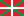

# Welcome to FlatPress!
FlatPress is a lightweight, easy-to-set-up blogging engine. Plain and simple, just PHP. No database needed!

## Features
- Independent, standard-compliant blog software
- Works on files, __no database__
- Easy to setup, easy to backup
- Powerful __plugin system__ with widget support
- Easy to customize with __themes__, powered by [Smarty](http://www.smarty.net/)
- __Comments__ function with spam protection
- __Free software__ under [GNU GPLv2](LICENSE.md)
- Supported languages:

 - (easy [to add](https://wiki.flatpress.org/doc:lang:packs:guidelines) yours!)

## Getting started
Installing and running FlatPress is really easy:
- [Download FlatPress](https://www.flatpress.org/download), unzip, upload
- Browse to your web server, run simple FlatPress installer
- Enjoy blogging with FlatPress!

## Demo
You can view live demo here:

https://softaculous.com/demos/flatpress

## Help and support
Visit our [wiki](https://wiki.flatpress.org) to learn everything about blogging with FlatPress, how to work with themes and plugins and where to find them. The wiki also has the [General FAQ](https://wiki.flatpress.org/doc:faq) and the [Tech FAQ](https://wiki.flatpress.org/doc:techfaq).

Ask your questions, show off your FlatPress blog and meet fellow FlatPressers at the [support forum](https://forum.flatpress.org).

## Requirements
FlatPress runs on any web server (e.g. Apache, NGINX or IIS) with PHP 7.1 to PHP 8.4 (more details [on the wiki](https://wiki.flatpress.org/doc:techfaq#what_is_required_to_run_flatpress)). Since all data is stored in files, no database is needed.

## Code quality and security
FlatPress uses automated checks to improve code quality and security:

- [PHPStan](https://phpstan.org/) is executed with every change to detect potential errors, unclean code and violations of best practices at an early stage.
- [CodeQL](https://github.com/github/codeql) analyzes the source code for known security risks and vulnerabilities through semantic code analysis.

These tools run automatically via **GitHub Actions**, both for pull requests and regularly in the background.

## Credits
There are many people who contributed to FlatPress over the years. [See them here.](./CONTRIBUTORS.md)
