# Mastodon Plugin Process Flows

This document describes the current FlatPress Mastodon plugin flow as implemented in `fp-plugins/mastodon/plugin.mastodon.php`, the related post-success hooks in the FlatPress core, and the companion plugin dependencies used to render imported content.

## Scope and important state files

The plugin keeps two different state layers:

- `fp-content/plugin_mastodon/scheduler-state.json` is the compact scheduler summary used on ordinary requests to decide whether a scheduled content or deletion synchronization is due.
- `fp-content/plugin_mastodon/state.json` is the full synchronization state. It contains entry/comment mappings, remote identifiers, dirty queues, tombstones, media metadata, cursors, and statistics. It is loaded only when a real sync, deletion sync, admin status view, or manual admin run needs the full state.

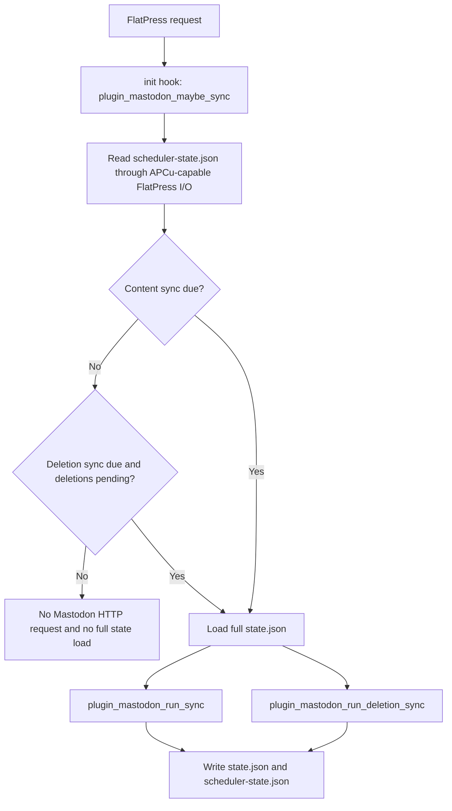

## 1. Bidirectional content synchronization

### 1.1 FlatPress entry to Mastodon status

A local FlatPress entry is exported as a Mastodon top-level status when it is inside the active synchronization window, or when it has been queued by post-success dirty tracking. A manual full sync keeps the repair behavior and scans all local entries.

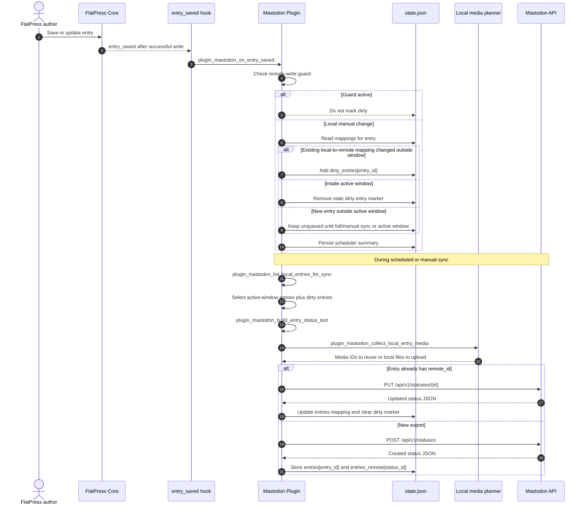

### 1.2 FlatPress comment to Mastodon reply

FlatPress comments are exported only after the parent entry has a remote status mapping. The plugin resolves the correct Mastodon `in_reply_to_id` from the entry mapping or from an existing parent-comment mapping.

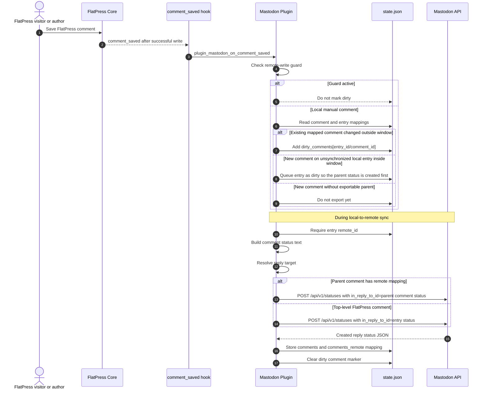

### 1.3 FlatPress replies to comments become Mastodon replies to replies

FlatPress comments can reply to other FlatPress comments. The plugin delays a child comment export until its parent comment has a remote Mastodon mapping. This avoids creating replies under the entry status when they should actually be replies under another Mastodon reply.

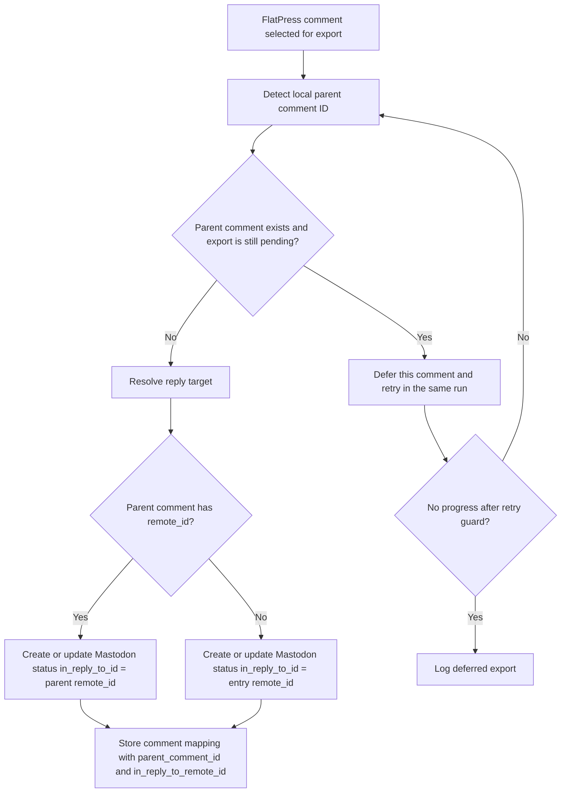

### 1.4 Mastodon top-level status to FlatPress entry

The plugin fetches account statuses from Mastodon, filters unsupported or out-of-window statuses, converts Mastodon HTML to FlatPress BBCode, imports remote media, and writes an entry under the remote-write guard.

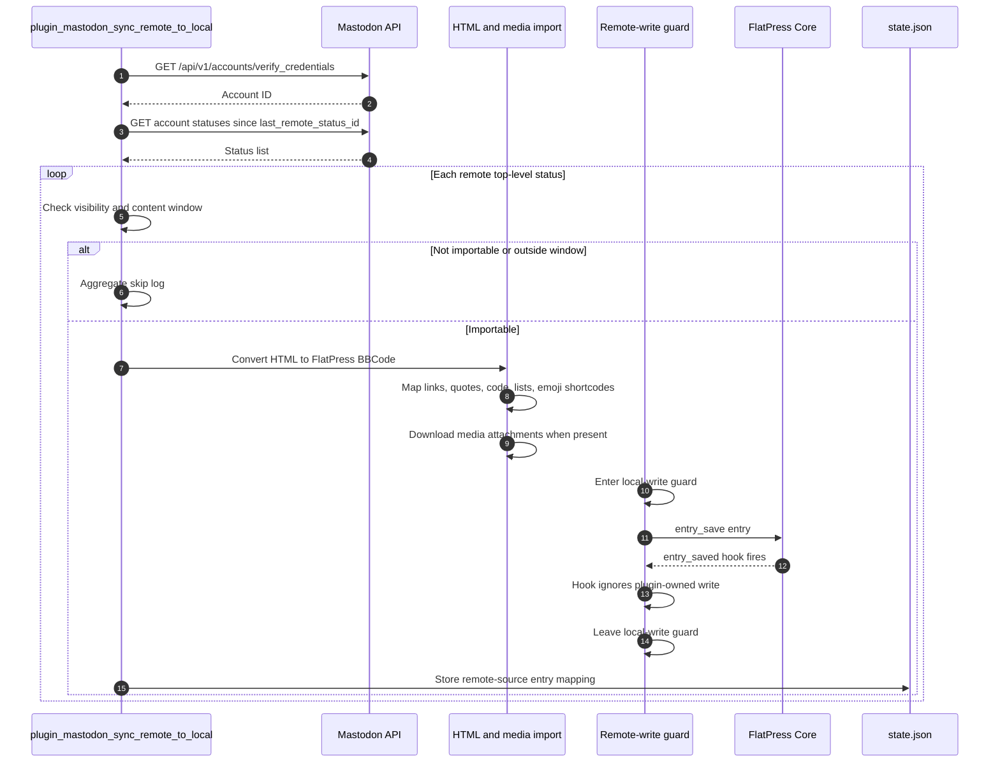

### 1.5 Mastodon replies in a known imported thread to FlatPress comments

After importing or refreshing a known entry status, the plugin fetches the Mastodon context and walks descendants. It imports only public/importable replies that are not blocked by local tombstones and whose parent relationship can be resolved.

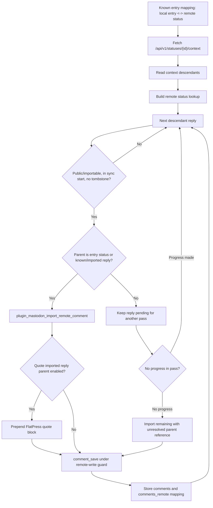

## 2. Media, attachments, tags, and hashtags

### 2.1 FlatPress entry media to Mastodon media attachments

The plugin scans entry content for image, gallery, audio, and video BBCode. It validates each local file, respects the Mastodon instance media limits, uploads changed attachments, or reuses existing remote media IDs when possible.

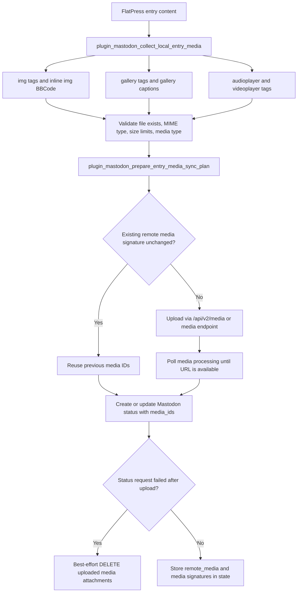

### 2.2 Mastodon media attachments to FlatPress media markup

Remote media is downloaded into FlatPress-managed directories. Images become PhotoSwipe-compatible `[img]` or `[gallery]` markup. Audio and video become AudioVideo plugin player tags.

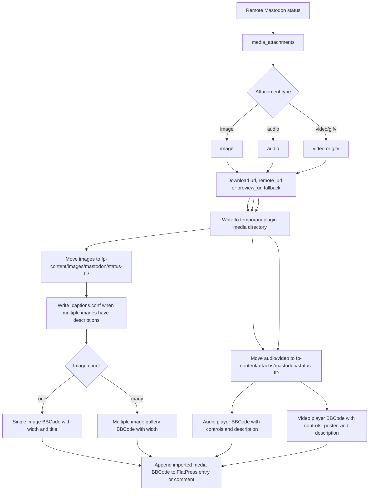

### 2.3 Tags and hashtags when the FlatPress Tag plugin is active

When the Tag plugin is active, local FlatPress `[tag]` metadata is exported as a Mastodon hashtag footer. Remote Mastodon tags are imported back as FlatPress tag BBCode. The plugin also strips its own hashtag footer during round-trip imports.

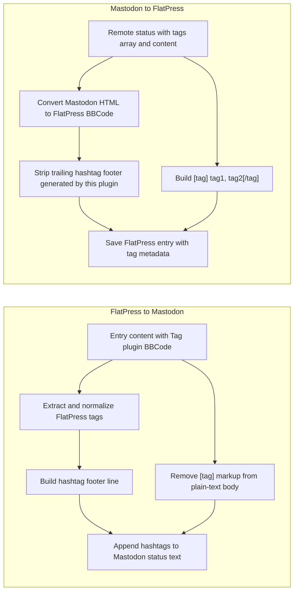

### 2.4 Companion plugin dependency overview

The Mastodon plugin can store imported content without all companion plugins, but these plugins determine whether imported markup renders correctly in the FlatPress frontend.

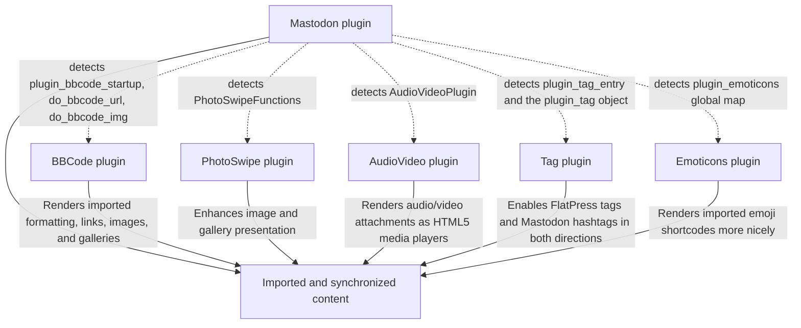

## 3. Scheduled and manual sync flows

### 3.1 Daily scheduled content synchronization

The scheduled content sync is started from the `init` hook. Ordinary requests read only the compact scheduler state first. If the scheduled time has already run on the same day, the request exits without loading the full state and without contacting Mastodon.

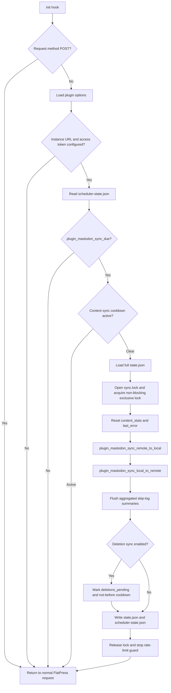

### 3.2 Local-to-remote candidate selection during scheduled sync

Scheduled syncs are optimized for large blogs. They do not parse every old entry every day. Manual full syncs still parse every entry.

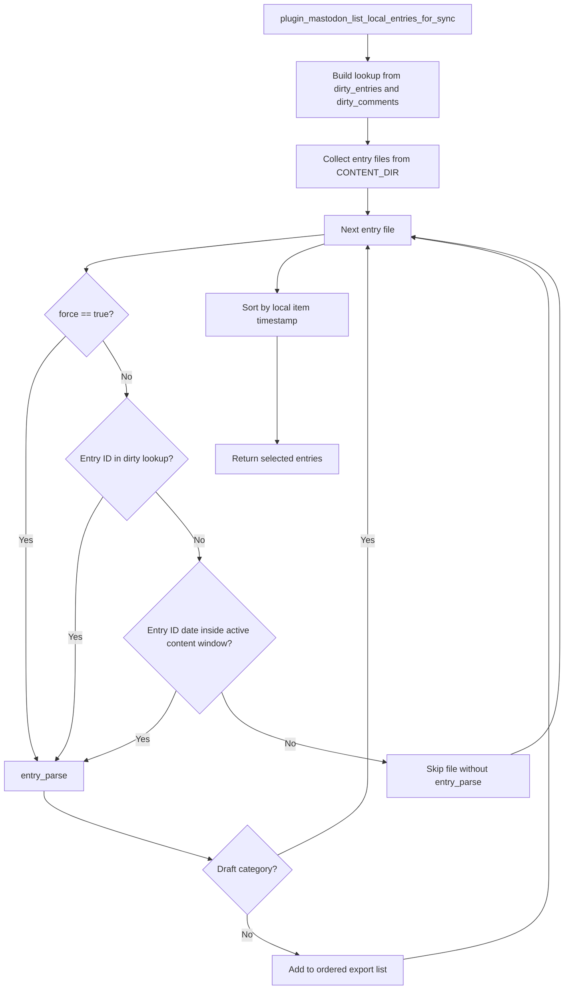

### 3.3 Follow-up deletion synchronization

The deletion sync is intentionally separate from the content sync. It compares stored mappings against local files and remote statuses. Local deletions are propagated to Mastodon; remote deletions are reflected back into FlatPress under the remote-write guard.

```mermaid
flowchart TD
    Start["plugin_mastodon_run_deletion_sync"]
    Options["Load options and full state"]
    Enabled{"Deletion sync enabled?"}
    Pending{"Force or deletions_pending?"}
    Due{"Deletion sync due?"}
    Lock["Acquire sync.lock"]
    RecheckOnly{"Pending comment descendant rechecks only?"}
    EntryLoop["Iterate entry mappings with cursor"]
    EntryLocal{"Local entry exists?"}
    DeleteRemoteEntry["DELETE remote entry status"]
    EntryLookupWindow{"Remote lookup window allows check?"}
    FetchRemoteEntry["Fetch remote entry status"]
    MissingRemoteEntry{"Remote entry missing?"}
    DeleteLocalEntry["entry_delete under remote-write guard"]
    CommentLoop["Iterate comment mappings with cursor"]
    CommentLocal{"Local comment exists?"}
    DeleteRemoteComment["DELETE remote comment status"]
    QueueDesc["Queue descendant remote rechecks"]
    CommentLookupWindow{"Remote lookup window allows check?"}
    FetchRemoteComment["Fetch remote comment status"]
    MissingRemoteComment{"Remote comment missing?"}
    DeleteLocalComment["comment_delete under remote-write guard"]
    ProcessRechecks["Process pending comment remote rechecks"]
    Complete{"Failures or rate limit?"}
    ClearPending["Clear pending flags and cursors"]
    Retry["Keep deletions_pending with cooldown"]
    Write["Write state and scheduler summary"]

    Start --> Options --> Enabled
    Enabled -- "No" --> ClearPending --> Write
    Enabled -- "Yes" --> Pending
    Pending -- "No" --> Write
    Pending -- "Yes" --> Due
    Due -- "No" --> Write
    Due -- "Yes" --> Lock --> RecheckOnly
    RecheckOnly -- "No" --> EntryLoop
    EntryLoop --> EntryLocal
    EntryLocal -- "No" --> DeleteRemoteEntry --> CommentLoop
    EntryLocal -- "Yes" --> EntryLookupWindow
    EntryLookupWindow -- "No" --> CommentLoop
    EntryLookupWindow -- "Yes" --> FetchRemoteEntry --> MissingRemoteEntry
    MissingRemoteEntry -- "Yes" --> DeleteLocalEntry --> CommentLoop
    MissingRemoteEntry -- "No" --> CommentLoop
    CommentLoop --> CommentLocal
    CommentLocal -- "No" --> DeleteRemoteComment --> QueueDesc --> ProcessRechecks
    CommentLocal -- "Yes" --> CommentLookupWindow
    CommentLookupWindow -- "No" --> ProcessRechecks
    CommentLookupWindow -- "Yes" --> FetchRemoteComment --> MissingRemoteComment
    MissingRemoteComment -- "Yes" --> DeleteLocalComment --> QueueDesc --> ProcessRechecks
    MissingRemoteComment -- "No" --> ProcessRechecks
    RecheckOnly -- "Yes" --> ProcessRechecks
    ProcessRechecks --> Complete
    Complete -- "No failures" --> ClearPending --> Write
    Complete -- "Failures or rate limit" --> Retry --> Write
```

### 3.4 Manual full synchronization in the admin area

Manual full synchronization is an explicit admin repair and initial-import/export path. It intentionally loads the full state and scans all entries. It is not optimized away by dirty tracking.

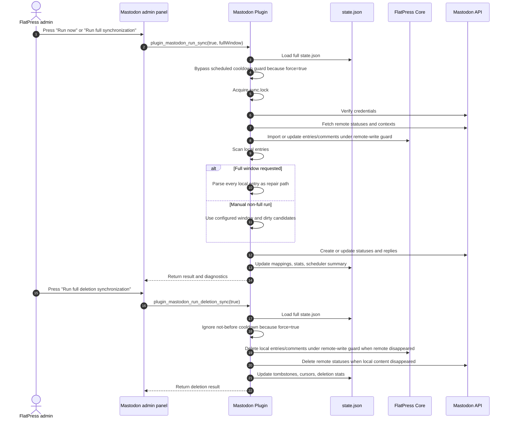

## 4. Core post-success hooks, dirty tracking, and remote-write guard

The current design depends on post-success hooks in the FlatPress core. These hooks fire after a write or delete operation has succeeded. The Mastodon plugin uses them to queue local manual changes instead of rediscovering every old change by scanning the whole archive daily.

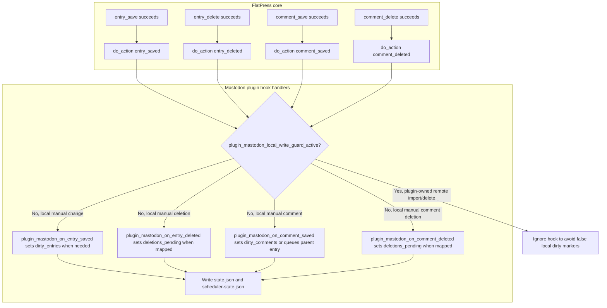

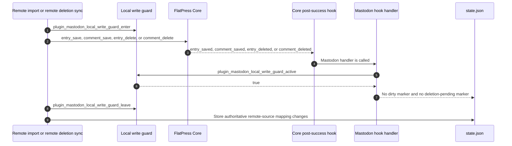

## 5. Operational guarantees and intentional behavior

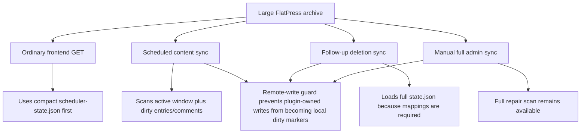

Key implications for developers:

- Scheduled content syncs are optimized for large blogs by using post-success dirty queues and date-window selection.
- Manual full syncs deliberately remain exhaustive and should not be replaced by dirty queues.
- Deletion syncs need the full mapping state because they compare local existence with remote status existence and maintain tombstones and descendant rechecks.
- Companion plugins improve rendering and feature completeness, but the Mastodon plugin still stores importable FlatPress markup even when a companion renderer is currently inactive.
