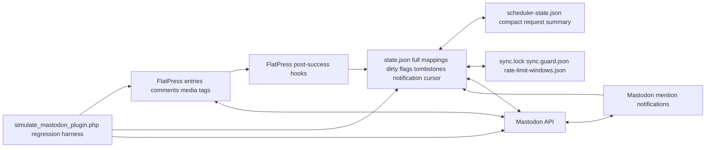

# 00 — Mental Model

## One-page model

The Mastodon plugin is a bidirectional synchronization adapter between a file-based FlatPress blog and one Mastodon account.

It maps FlatPress objects to Mastodon objects:

| FlatPress              | Mastodon                                   | Notes                                                                                                                   |
| ---------------------- | ------------------------------------------ | ----------------------------------------------------------------------------------------------------------------------- |
| Entry                  | Status                                     | Entries can be exported to Mastodon or imported from Mastodon as FlatPress entries.                                     |
| Comment                | Reply status                               | Mastodon has no separate comment object; replies are statuses in a thread.                                              |
| Nested comment/reply   | Reply-to-reply status                      | Parent resolution is critical because the remote reply target must already exist.                                       |
| Image/gallery BBCode   | Media attachments                          | Local media is uploaded through Mastodon media APIs; remote media is stored locally and rendered as FlatPress BBCode.   |
| AudioVideo BBCode      | Audio/video media attachments              | Requires the FlatPress AudioVideo companion plugin for rendering imported content.                                      |
| FlatPress tags         | Hashtag footer / imported `[tag]` BBCode   | Requires the FlatPress Tag companion plugin for tag storage/rendering.                                                  |
| Local delete           | Remote delete or tombstone/recheck         | Deletion sync reconciles missing local and remote objects later.                                                        |

Media export has one additional compatibility rule that developers must keep in mind: one Mastodon status may carry multiple images, or exactly one audio/video attachment, but not a mixed audio/video/image set. The plugin therefore collects all local media for change detection and diagnostics, then selects one exportable media family per status before upload: images first, otherwise one audio item, otherwise one video item with its poster sent only as an upload thumbnail.

## The main rule

Notification hints are intentionally a hint layer: they can import replies on old Mastodon threads quickly when `read:notifications` is authorized, while context rotation remains the bounded fallback.

Do not reason about a single function in isolation. The important question is usually:

> Which state field is written now, and which later sync path will read it?

Example: a locally deleted mapped comment does not merely remove a local file. It may mark `deletions_pending`, later enter deletion sync, create or respect a comment tombstone, queue descendant rechecks, and prevent a deleted remote reply from being imported again.

## Runtime layers

| Layer                     | Purpose                                                                   | Main files/functions                                                                                               |
| ------------------------- | ------------------------------------------------------------------------- | ------------------------------------------------------------------------------------------------------------------ |
| Configuration             | Instance URL, OAuth credentials, feature toggles, cached instance info.   | `plugin_mastodon_default_options()`, FlatPress config storage.                                                     |
| Full sync state           | Authoritative mapping and dirty/deletion state.                           | `state.json`, `plugin_mastodon_state_read()`, `plugin_mastodon_state_write()`.                                     |
| Compact scheduler state   | Fast request-time status without loading huge mapping arrays.             | `scheduler-state.json`, `plugin_mastodon_scheduler_state_read()`.                                                  |
| Locks and guards          | Prevent concurrent or too frequent sync runs on shared hosting.           | `sync.lock`, `sync.guard.json`, `plugin_mastodon_sync_guard_active()`, `plugin_mastodon_sync_guard_mark()`.        |
| Budgets                   | Avoid exhausting Mastodon or webhost limits.                              | `rate-limit-windows.json`, `plugin_mastodon_rate_limit_guard_start()`, `plugin_mastodon_rate_limit_acquire()`.     |
| API transport             | HTTP requests, OAuth, status/media endpoints.                             | `plugin_mastodon_mastodon_json()`, `plugin_mastodon_http_request()`, `plugin_mastodon_http_request_multipart()`.   |
| Regression harness        | Executes real plugin code with simulated FlatPress/Mastodon boundaries.   | `simulate_mastodon_plugin.php`.                                                                                    |

## Change workflow

1. Identify the affected process in `01-Process-Map.md`.
2. Check the state fields in `02-State-Model.md`.
3. Check implementing functions in `03-Function-Process-Matrix.md`.
4. Check Mastodon endpoint/version/fallback behavior in `04-API-Compatibility.md`.
5. Check the relevant regression tests in `05-Regression-Test-Matrix.md`.
6. Run `php -l` on changed PHP files and `php simulate_mastodon_plugin.php`.
7. For API changes, add or update at least one harness test that exercises the actual plugin path, not only a stub.

## What the simulation does and does not prove

The simulation executes the real Mastodon plugin code against a local FlatPress-like sandbox and mocked Mastodon HTTP responses. It is strong for deterministic regression coverage. It is not a full live Mastodon compatibility lab: real network latency, real server configuration, CDN behavior and instance-specific quirks still require integration testing on real instances.

## First-hour checklist

1. Read the one-page model above and keep `state.json` as the central mental anchor.
2. Locate the affected process ID in `01-Process-Map.md`.
3. Check whether the process is local-to-remote, remote-to-local, deletion-only, or admin-only.
4. Read the corresponding state fields in `02-State-Model.md`.
5. Find the implementation functions in `03-Function-Process-Matrix.md`.
6. If Mastodon is contacted, check endpoint version and fallback behavior in `04-API-Compatibility.md`.
7. Before changing code, identify at least one existing regression test or add one.
