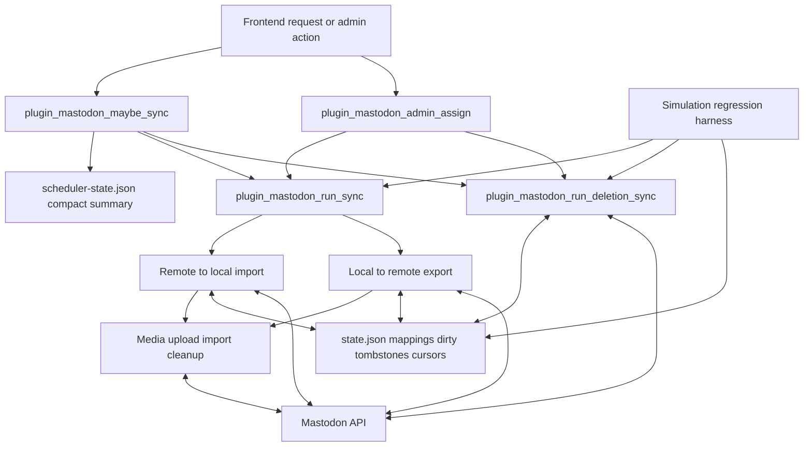
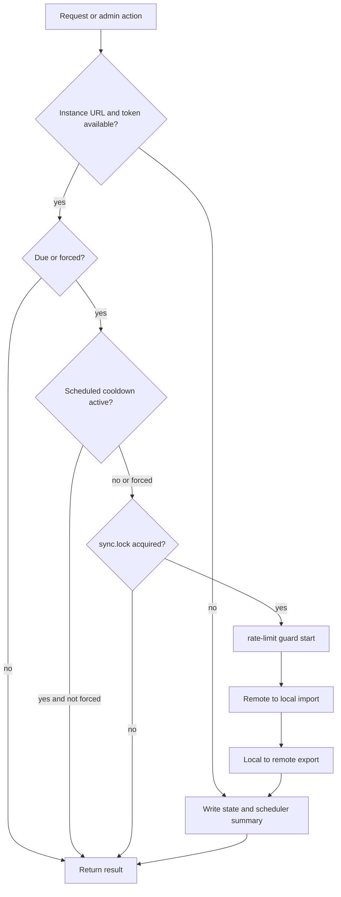
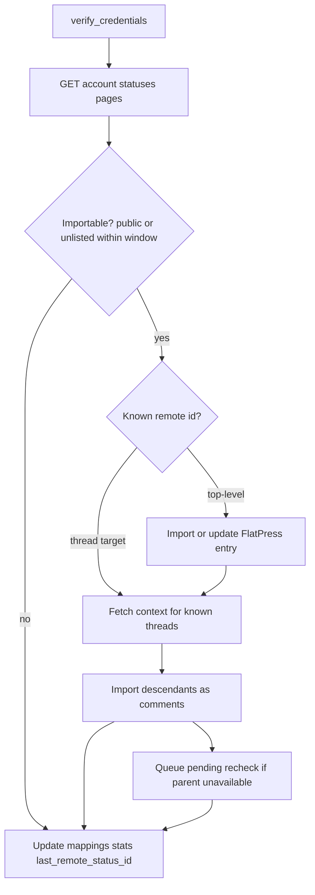
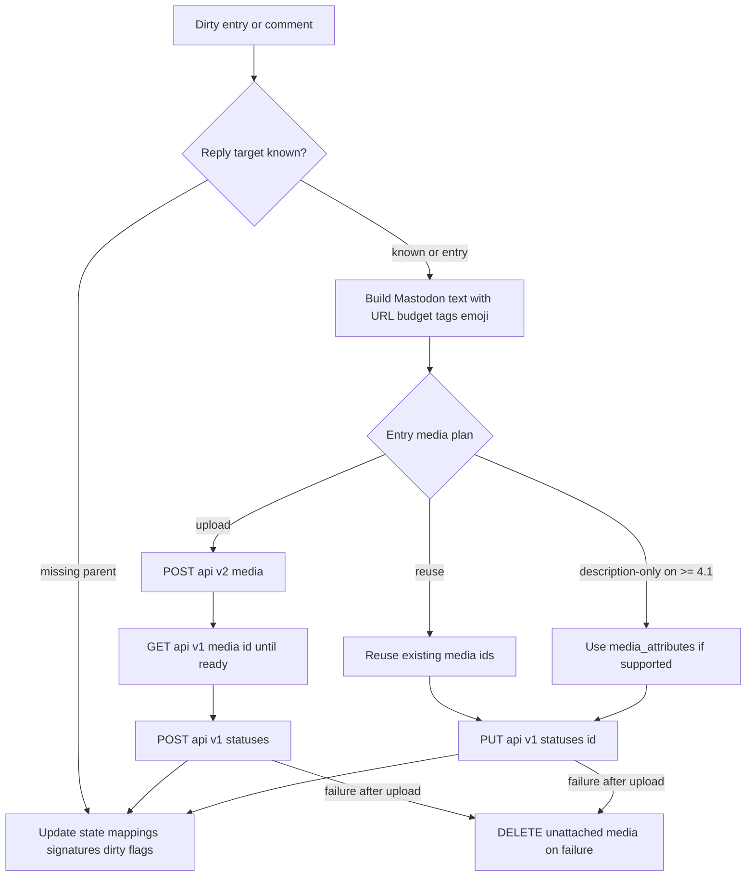
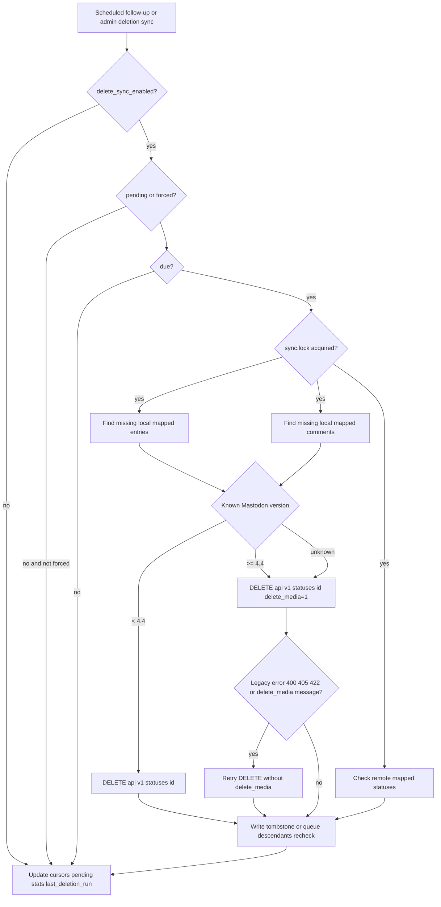
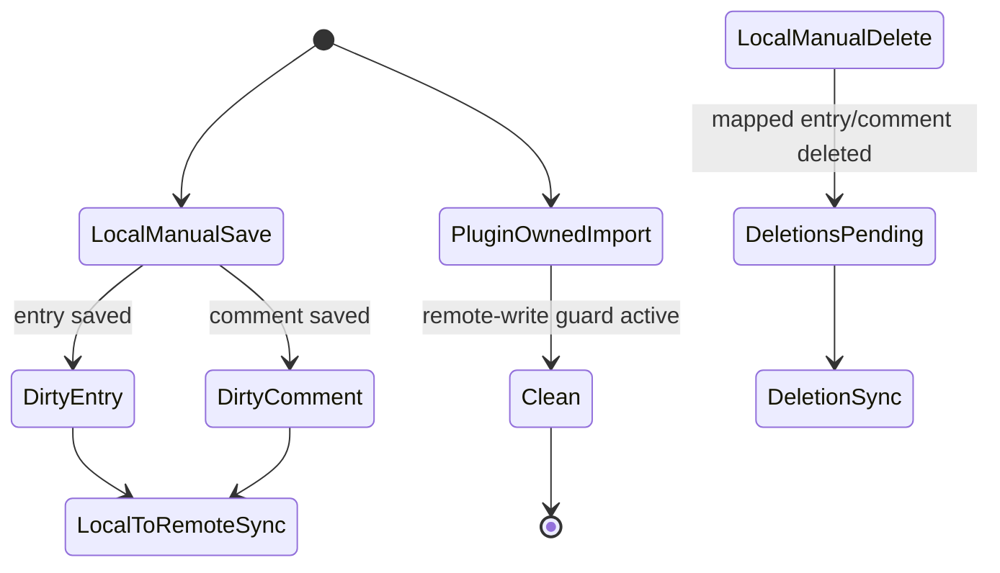
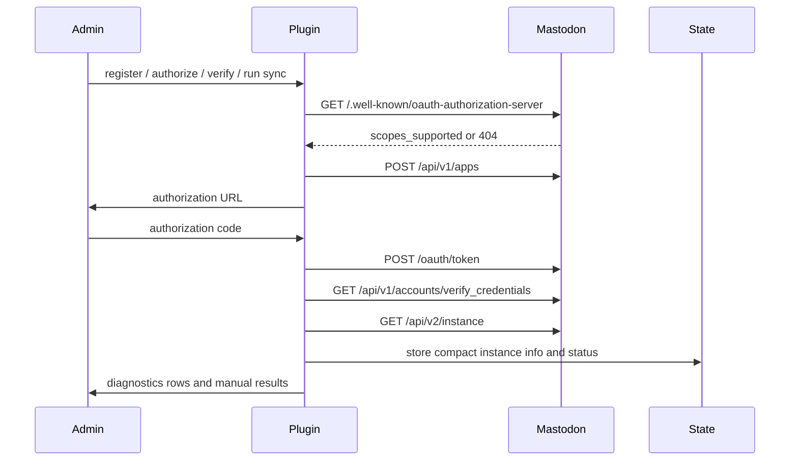

# 01 — Process Map

## High-level process map



## Process catalog

| ID  | Process                             | Trigger                                                       | Core behavior                                                                                                                                   | Primary state                                                                  | Regression focus                                                                           |
| --- | ----------------------------------- | ------------------------------------------------------------- | ----------------------------------------------------------------------------------------------------------------------------------------------- | ------------------------------------------------------------------------------ | ------------------------------------------------------------------------------------------ |
| P1  | Scheduled content sync              | Frontend `init` hook via `plugin_mastodon_maybe_sync()`       | Reads compact scheduler-state first; may call `plugin_mastodon_run_sync(false)`.                                                                | scheduler-state.json, sync.guard.json, sync.lock, state.json                   | Simulation scheduler, cooldown, compact-state and large-state tests.                       |
| P2  | Manual content sync                 | Admin actions in `plugin_mastodon_admin_assign()`             | Calls `plugin_mastodon_run_sync(true, ...)` and bypasses due window; still respects lock and budgets.                                           | state.json, sync.lock, rate-limit-windows.json                                 | Manual normal/full synchronization tests.                                                  |
| P3  | Remote top-level status import      | Content sync when `update_local_from_remote` is enabled       | Verifies account, pages statuses, filters, converts HTML/media/tags, saves FlatPress entries.                                                   | entries, entries_remote, last_remote_status_id, content_stats                  | Remote import and content-window tests.                                                    |
| P4  | Remote reply import                 | Remote context pass for known imported/exported threads       | Fetches context descendants, resolves parent comments, queues rechecks or tombstones.                                                           | comments, comments_remote, comment_tombstones, pending_comment_remote_rechecks | Reply tree, self-reply, quote, comment-as-entry tests.                                     |
| P5  | Local entry export/update           | Dirty entry or local candidate in manual/full sync            | Builds status text, validates media, creates or edits Mastodon status, writes mappings.                                                         | dirty_entries, entries, entries_remote, media signatures, content_stats        | Local export, URL-budget, media reuse and update tests.                                    |
| P6  | Local comment export/update         | Dirty comment or local candidate under a mapped entry/comment | Resolves reply target, builds reply text, creates/edits Mastodon reply, handles pending parents.                                                | dirty_comments, comments, comments_remote, pending flags                       | Comment export, nested reply and pending parent tests.                                     |
| P7  | Media export                        | Local entry export/update                                     | Collects image/gallery/audio/video BBCode media, validates files, selects one Mastodon-compatible media family, uploads/polls/reuses/cleans up. | entry media metadata, rate-limit-windows.json                                  | Media upload, AudioVideo, media-family selection, thumbnail, processing and cleanup tests. |
| P8  | Media import                        | Remote status/reply import                                    | Downloads media via URL fallback order and builds FlatPress BBCode or AudioVideo tags.                                                          | imported entry/comment content, media files, captions                          | Remote media import tests.                                                                 |
| P9  | Deletion sync                       | Scheduled follow-up or admin action                           | Processes local missing mapped items and remote missing statuses; uses status delete fallback for pre-4.4 servers.                              | deletions_pending, deletion cursors, tombstones, rechecks, deletion_stats      | Deletion sync, legacy delete_media fallback and tombstone tests.                           |
| P10 | Dirty tracking hooks                | FlatPress post-success hooks                                  | Marks local changes unless a plugin-owned remote import/write guard is active.                                                                  | dirty_entries, dirty_comments, deletions_pending                               | Dirty tracking, remote-write guard and deletion tests.                                     |
| P11 | OAuth and instance capability setup | Admin registration/authorize/verify or first capability query | Registers app, discovers scopes, exchanges token, caches compact instance document.                                                             | options, instance_info_json, oauth_registered_scopes                           | OAuth, scope discovery, instance cache tests.                                              |
| P12 | Admin diagnostics                   | Opening plugin admin panel                                    | Reads options, state summaries, companion-plugin status, stats and manual-action results.                                                       | options, scheduler-state.json, state.json, sync.log                            | Admin assignment and diagnostics tests.                                                    |

## P1/P2 — Scheduled and manual content synchronization



Manual sync bypasses the daily due check and can request a full window, but it still uses `sync.lock`, request budgets, media/delete windows and state writes. This matters on shared hosting: manual repair must not become unbounded.

## P3/P4 — Remote import



Remote import must respect local deletion protection. A remote reply with a tombstone must not be recreated as a FlatPress comment merely because it appears again in a context response.

## P5/P6/P7 — Local export and media lifecycle



The media plan is one of the most important extension points. It compares attachment signatures and description signatures. If attachments did not change, the plugin can reuse remote media IDs. If only descriptions changed and the instance supports status `media_attributes`, it updates alt text without re-uploading. Otherwise it re-uploads.

Before the media plan computes signatures or uploads anything, it applies the Mastodon status media-family policy:

```text
if images exist: export images only, up to the instance image/media limit
else if audio exists: export exactly one audio attachment
else if video exists: export exactly one video attachment, with poster as thumbnail only
```

This policy belongs in the export planner, not in the raw collector. The collector still finds images, galleries, audio and video so diagnostics and change detection remain transparent. The planner then reduces the collected set to the one media family Mastodon will accept for a single status.

## P9 — Deletion synchronization



For Mastodon before 4.4.0, the status delete endpoint exists, but the optional `delete_media` parameter is not documented. The plugin therefore omits it when the cached version is known to be older and retries without it for unknown-version legacy failures.

## P10 — Dirty tracking and remote-write guard



A remote import writes FlatPress files too. The remote-write guard prevents those plugin-owned writes from being treated as local user edits that would immediately export back to Mastodon.

## P11/P12 — OAuth, capability setup and admin diagnostics



Admin diagnostics should remain cheap enough for normal admin page loads while still showing enough information to diagnose missing credentials, stale state, companion plugin availability and last sync/deletion results.
