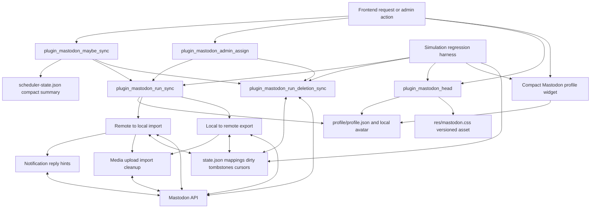
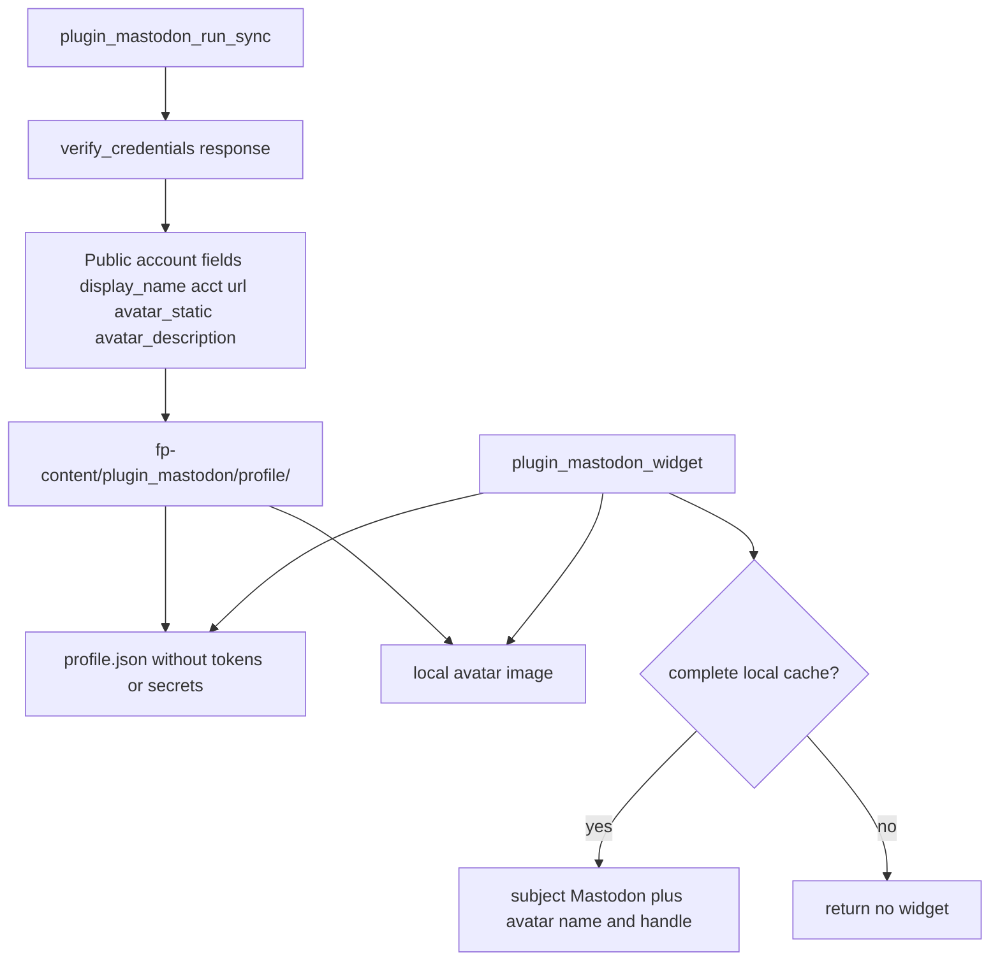
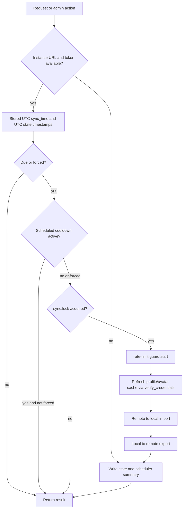
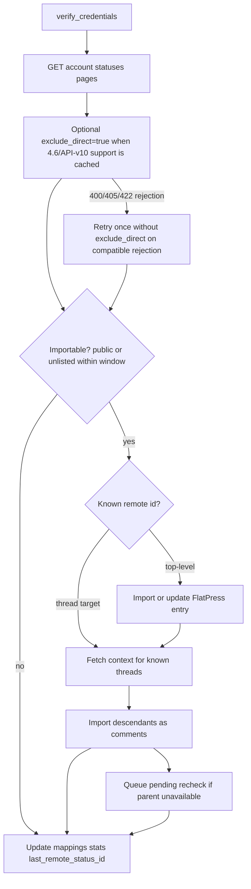
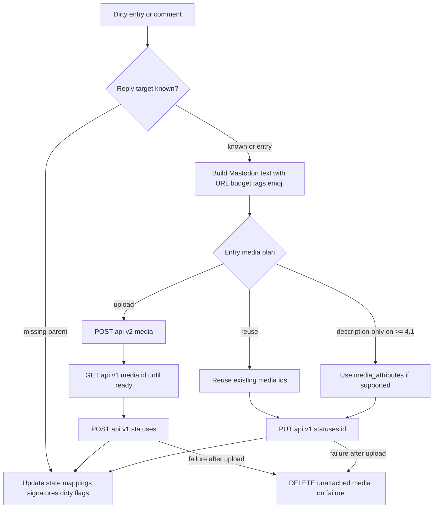
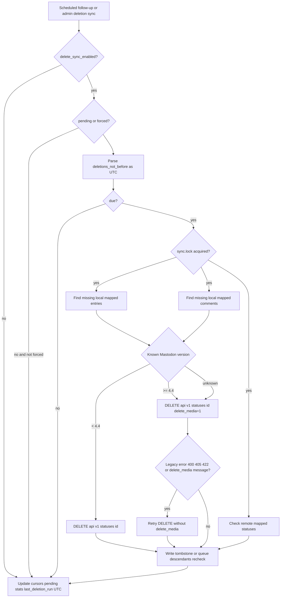
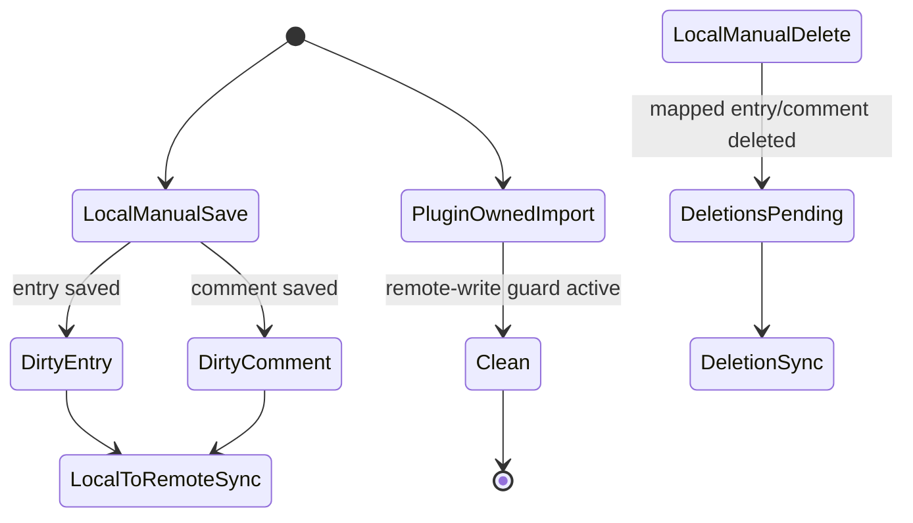
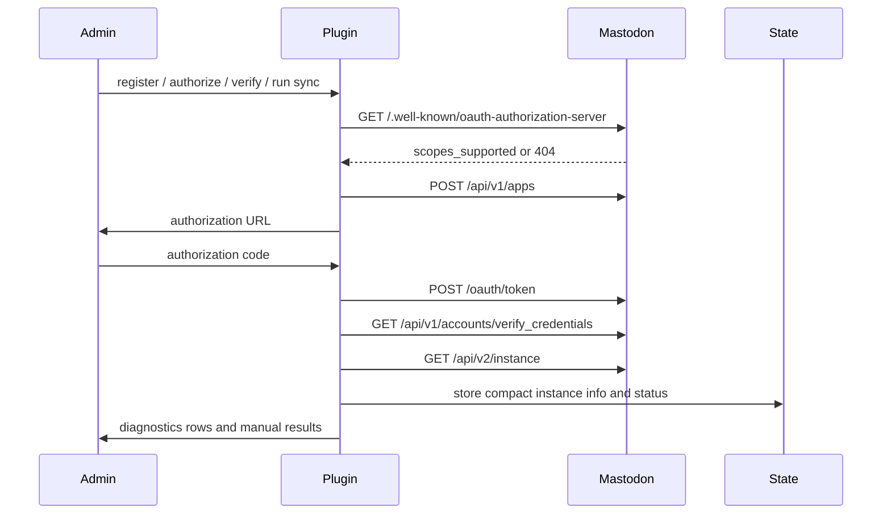

# 01 — Process Map

## High-level process map



## Process catalog

| ID  | Process                             | Trigger                                                                                           | Core behavior                                                                                                                                                                                                                                 | Primary state                                                                           | Regression focus                                                                           |
| --- | ----------------------------------- | ------------------------------------------------------------------------------------------------- | --------------------------------------------------------------------------------------------------------------------------------------------------------------------------------------------------------------------------------------------- | --------------------------------------------------------------------------------------- | ------------------------------------------------------------------------------------------ |
| P1  | Scheduled content sync              | Frontend `init` hook via `plugin_mastodon_maybe_sync()`                                           | Reads compact scheduler-state first; UTC-normalized due checks decide whether to call `plugin_mastodon_run_sync(false)`.                                                                                                                      | scheduler-state.json, sync.guard.json, sync.lock, state.json                            | Scheduler, timezone, cooldown, compact-state and large-state tests.                        |
| P2  | Manual content sync                 | Admin actions in `plugin_mastodon_admin_assign()`                                                 | Calls `plugin_mastodon_run_sync(true, ...)` and bypasses due window; still respects lock and budgets.                                                                                                                                         | state.json, sync.lock, rate-limit-windows.json                                          | Manual normal/full synchronization tests.                                                  |
| P2a | Mode-aware admin settings UI        | Admin save/template render with `disable_remote_import` on                                        | Hides import-only controls, `read:notifications` hints and local-write counters; preserves hidden import options during save.                                                                                                                 | plugin options, content_stats, deletion_stats                                           | One-way admin UI and hidden-option preservation tests.                                     |
| P3  | Remote top-level status import      | Content sync when `disable_remote_import` is off                                                  | Verifies account, pages statuses with Mastodon 4.6/API-v10 `exclude_direct` privacy hardening when confirmed, filters, converts HTML/media/tags, saves FlatPress entries. Existing-entry updates still obey `update_local_from_remote`.       | entries, entries_remote, last_remote_status_id, content_stats                           | Remote import, one-way-mode, content-window and `exclude_direct` fallback tests.           |
| P4  | Remote reply import                 | Remote context pass when `disable_remote_import` is off                                           | Fetches context descendants, resolves parent comments, queues rechecks or tombstones.                                                                                                                                                         | comments, comments_remote, comment_tombstones, pending_comment_remote_rechecks          | Reply tree, self-reply, quote, comment-as-entry and one-way-mode tests.                    |
| P4a | Notification reply hints            | Content sync with `old_thread_reply_check`, `read:notifications`, and `disable_remote_import` off | Polls mention notifications, directly imports mapped-parent replies, and spends the same old-thread budget on unresolved notification contexts.                                                                                               | last_remote_notification_id, comments_remote, old_thread_context_cursor                 | Notification hint, nested reply, shared-budget and one-way-mode tests.                     |
| P5  | Local entry export/update           | Dirty entry or local candidate in manual/full sync                                                | Builds status text, validates media, creates or edits Mastodon status, writes mappings.                                                                                                                                                       | dirty_entries, entries, entries_remote, media signatures, content_stats                 | Local export, URL-budget, media reuse and update tests.                                    |
| P6  | Local comment export/update         | Dirty comment or local candidate under a mapped entry/comment                                     | Resolves reply target, builds reply text, creates/edits Mastodon reply, handles pending parents and fresh old-entry comments.                                                                                                                 | dirty_comments, comments, comments_remote, pending flags                                | Comment export, nested reply, dirty fresh-comment and pending parent tests.                |
| P7  | Media export                        | Local entry export/update                                                                         | Collects image/gallery/audio/video BBCode media, validates files, selects one Mastodon-compatible media family, uploads/polls/reuses/cleans up.                                                                                               | entry media metadata, rate-limit-windows.json                                           | Media upload, AudioVideo, media-family selection, thumbnail, processing and cleanup tests. |
| P8  | Media import                        | Remote status/reply import                                                                        | Downloads media via URL fallback order and builds FlatPress BBCode or AudioVideo tags.                                                                                                                                                        | imported entry/comment content, media files, captions                                   | Remote media import tests.                                                                 |
| P9  | Deletion sync                       | Scheduled follow-up or admin action                                                               | Processes missing local mapped items as remote deletes. Missing remote statuses delete local content only when remote import is enabled; one-way mode unlinks stale mappings and queues re-export.                                            | deletions_pending, deletion cursors, tombstones, rechecks, dirty queues, deletion_stats | Deletion sync, one-way-mode, legacy delete_media fallback and tombstone tests.             |
| P10 | Dirty tracking hooks                | FlatPress post-success hooks                                                                      | Marks local changes unless a plugin-owned remote import/write guard is active.                                                                                                                                                                | dirty_entries, dirty_comments, deletions_pending                                        | Dirty tracking, remote-write guard and deletion tests.                                     |
| P11 | OAuth and instance capability setup | Admin registration/authorize/verify or first capability query                                     | Registers app, discovers scopes including optional `read:notifications`, exchanges token, caches compact instance document, prefers `api_versions[mastodon]` for capabilities and negatively caches failed live instance lookups per request. | options, instance_info_json, oauth_registered_scopes                                    | OAuth, scope discovery, instance cache tests.                                              |
| P12 | Admin diagnostics                   | Opening plugin admin panel                                                                        | Reads options, state summaries, companion-plugin status, stats and manual-action results.                                                                                                                                                     | options, scheduler-state.json, state.json, sync.log                                     | Admin assignment and diagnostics tests.                                                    |
| P13 | Compact profile widget              | Sync-time profile refresh, widget rendering and `plugin_mastodon_head()` on frontend pages         | `plugin_mastodon_run_sync()` refreshes the local profile/avatar cache via `verify_credentials` even in one-way export mode; rendering still reads only local files and the head loads versioned CSS only for a complete cache.                 | profile/profile.json, profile/avatar.*, res/mastodon.css                                | Sync-time cache refresh, no-HTTP render, versioned CSS, avatar alt text and language tests. |

The compact profile widget remains outside the frontend rendering critical path: `plugin_mastodon_run_sync()` refreshes profile data through the already authenticated `verify_credentials` path during scheduled and manual synchronization, including explicit one-way/export-only runs. Normal widget rendering only reads local cache files and hides itself if the cache is incomplete. The widget markup contains no inline stylesheet; `plugin_mastodon_head()` emits the versioned `fp-plugins/mastodon/res/mastodon.css` link only when the local cache is complete enough for the widget.

One-way admin rendering is treated as part of the synchronization contract: admin save preserves hidden import options because `plugin_mastodon_admin_apply_save_post()` keeps the hidden values from the previous configuration. The UI therefore communicates the active FlatPress-to-Mastodon direction without erasing the administrator's stored bidirectional preferences.

## P13 — Compact Mastodon profile widget



The widget callback never calls the Mastodon API and never downloads a remote avatar. Profile cache refresh is triggered at the start of scheduled/manual `plugin_mastodon_run_sync()` runs through account verification code that already talks to Mastodon, then the public cache stores only display name, account handle, profile URL, avatar metadata and alt-text data. This keeps normal CMS response time independent from the Mastodon instance and still refreshes the profile in pure export mode.

## P1/P2 — Scheduled and manual content synchronization



Manual sync bypasses the daily due check and can request a full window, but it still uses `sync.lock`, request budgets, media/delete windows, the sync-time profile/avatar refresh and UTC state writes. The automatic due check treats stored `sync_time`, `last_run`, `last_deletion_run` and `deletions_not_before` as UTC so host or plugin changes to PHP's default timezone do not shift the daily 03:00-style FlatPress-local schedule. This matters on shared hosting: manual repair must not become unbounded.

## P3/P4 — Remote import and explicit one-way mode



Remote import must respect local deletion protection. A remote reply with a tombstone must not be recreated as a FlatPress comment merely because it appears again in a context response. When `disable_remote_import` is enabled, the whole Mastodon-to-FlatPress import family is skipped before account-status paging, context traversal or notification-hint imports can write local entries/comments. The local-to-remote export family remains active.

## P5/P6/P7 — Local export and media lifecycle



The media plan is one of the most important extension points. It compares attachment signatures and description signatures. If attachments did not change, the plugin can reuse remote media IDs. If only descriptions changed and the instance supports status `media_attributes` according to `api_versions[mastodon]` or the version fallback, it updates alt text without re-uploading. Otherwise it re-uploads.

Before the media plan computes signatures or uploads anything, it applies the Mastodon status media-family policy:

```text
if images exist: export images only, up to the instance image/media limit
else if audio exists: export exactly one audio attachment
else if video exists: export exactly one video attachment, with poster as thumbnail only
```

This policy belongs in the export planner, not in the raw collector. The collector still finds images, galleries, audio and video so diagnostics and change detection remain transparent. The planner then reduces the collected set to the one media family Mastodon will accept for a single status.

## P9 — Deletion synchronization



For Mastodon before 4.4.0, the status delete endpoint exists, but the optional `delete_media` parameter is not documented. The plugin therefore omits it when the cached version is known to be older and retries without it for unknown-version legacy failures.

## P10 — Dirty tracking and remote-write guard



A remote import writes FlatPress files too. The remote-write guard prevents those plugin-owned writes from being treated as local user edits that would immediately export back to Mastodon.

## P11/P12 — OAuth, capability setup and admin diagnostics



Admin diagnostics should remain cheap enough for normal admin page loads while still showing enough information to diagnose missing credentials, stale state, companion plugin availability and last sync/deletion results.
