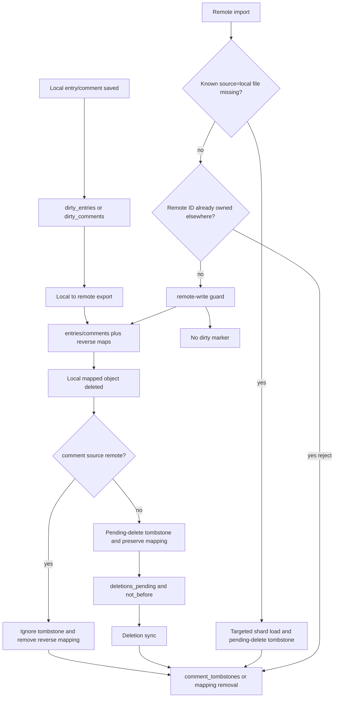

# 02 — State Model

## Files and responsibilities

| File                                                            | Responsibility                                                                        | Read by                                            | Written by                                    |
| --------------------------------------------------------------- | ------------------------------------------------------------------------------------- | -------------------------------------------------- | --------------------------------------------- |
| `fp-content/plugin_mastodon/state.json`                         | Compact main synchronization index, global cursors, reverse maps and queues.          | Sync, deletion sync, admin diagnostics.            | `plugin_mastodon_state_write()` / repair.     |
| `fp-content/plugin_mastodon/state-comments/YY/MM/entry*.json`   | Per-entry comment mapping shards for high-volume comment metadata.                    | StateStore helpers, sync and deletion paths.       | Shard write helpers via temp file + rename.   |
| `fp-content/plugin_mastodon/state.json.migration-backup-*.json` | Timestamped safety copy of a legacy inline-comment state before split migration.      | Manual recovery and diagnostics.                   | Legacy migration before any shard rewrite.    |
| `fp-content/plugin_mastodon/scheduler-state.json`               | Compact request-time status summary.                                                  | `plugin_mastodon_maybe_sync()`, admin diagnostics. | state writes and scheduler helpers.           |
| `fp-content/plugin_mastodon/sync.lock`                          | Non-blocking file lock preventing concurrent content/deletion runs.                   | content and deletion orchestrators.                | Opened/locked by run functions.               |
| `fp-content/plugin_mastodon/state-write.lock`                   | Short lock serializing multi-file state mutations outside and inside sync runs.       | state read/write and repair helpers.               | `plugin_mastodon_state_write_lock_acquire()`. |
| `fp-plugins/mastodon/mastodon-state-cli.php`                    | Optional CLI entry point for read-only diagnostics or shard repair.                   | CLI operators on development/hosting shells.       | Invokes diagnostic or repair helpers only.    |
| `fp-content/plugin_mastodon/sync.guard.json`                    | File-backed cooldown guard; APCu uses the same key suffix through FlatPress wrappers. | scheduled content/deletion paths.                  | `plugin_mastodon_sync_guard_mark()`.          |
| `fp-content/plugin_mastodon/rate-limit-windows.json`            | Persistent cross-run upload/delete/status-page budgets.                               | rate-limit guard.                                  | rate-limit guard.                             |
| `fp-content/plugin_mastodon/sync.log`                           | Append-only operational log with bounded rotation.                                    | administrators and tests.                          | `plugin_mastodon_log()`.                      |

## Split comment-shard model

`state.json` remains the main authoritative index, but high-volume comment mappings are now
stored in per-entry shard files under `state-comments/YY/MM/entryYYMMDD-HHMMSS.json`.

The main file keeps `entries`, `entries_remote`, `comments_remote`, dirty queues, notification and rotation cursors,
tombstones, pending rechecks, counters and `comment_shards` metadata. The inline `comments`
array in new `state.json` writes is intentionally empty. `plugin_mastodon_state_read()`
reconstructs the runtime state from the main file and referenced shards so existing call
sites continue to receive the familiar `$state['comments']` array.

Legacy monolithic states remain readable. When `plugin_mastodon_state_read()` sees a legacy
state with inline comments, it creates a timestamped `state.json.migration-backup-*.json`,
streams the top-level `comments` object into per-entry shards and rewrites a compact main state
without inline comment mappings.

The split is local to FlatPress storage. It does not change Mastodon API payloads or the
semantics of entry/comment mappings.

`plugin_mastodon_state_read(array(...))` can now load only the comment shards required for a
known working set. Partial states carry internal loaded-shard markers so
`plugin_mastodon_state_write()` can update the loaded shards without deleting untouched shards.
This is used by dirty-entry/comment hooks and by content-sync paths that process a bounded set
of local or imported entry threads. Full deletion synchronization still loads all comment
shards after the deletion lock has been acquired because it must evaluate every stored comment
mapping and descendant relationship; the scheduler fast path still uses `scheduler-state.json`
and does not load comment shards.

## `state.json` fields

| Field                           | Type                                    | Meaning                                                                             | Usually written by                                                                                        | Usually read by                                                                         |
| ------------------------------- | --------------------------------------- | ----------------------------------------------------------------------------------- | --------------------------------------------------------------------------------------------------------- | --------------------------------------------------------------------------------------- |
| version                         | integer                                 | State schema version, currently 5.                                                  | default_state; normalization on read.                                                                     | state read/write, migrations, diagnostics.                                              |
| last_run                        | UTC datetime string                     | Last completed content sync timestamp.                                              | run_sync via `gmdate()`.                                                                                  | scheduler-state summary and UTC due check.                                              |
| last_deletion_run               | UTC datetime string                     | Last completed deletion sync timestamp.                                             | run_deletion_sync via `gmdate()`.                                                                         | scheduler-state summary and admin display.                                              |
| deletions_pending               | 0/1                                     | Whether follow-up deletion sync work exists.                                        | delete hooks, state_set_deletions_pending.                                                                | maybe_sync, run_deletion_sync.                                                          |
| deletions_pending_scope         | full\entries\comments                   | Limits what deletion work is currently needed.                                      | state_set_deletions_pending.                                                                              | deletion sync candidate selection.                                                      |
| deletions_not_before            | UTC datetime string                     | Earliest follow-up deletion run time.                                               | state_set_deletions_pending.                                                                              | UTC deletion_sync_due cooldown.                                                         |
| last_error                      | string                                  | Last operational error or rate-limit reason.                                        | sync and deletion paths.                                                                                  | admin diagnostics, scheduler summary.                                                   |
| last_remote_status_id           | string                                  | Newest seen imported remote top-level status.                                       | remote-to-local sync.                                                                                     | next remote import since_id/max logic.                                                  |
| last_remote_notification_id     | string                                  | Newest processed mention notification hint.                                         | notification hint pass.                                                                                   | next notifications since_id logic.                                                      |
| entries                         | map localEntryId -> meta                | Local FlatPress entry mapped to a Mastodon status.                                  | local export, remote import.                                                                              | updates, media reuse, deletions; one-way unlink/re-export.                              |
| entries_remote                  | map remoteStatusId -> localEntryId      | Reverse lookup preventing duplicate imported entries.                               | state_set_entry_mapping.                                                                                  | remote import, context import.                                                          |
| comments                        | map entryId:commentId -> meta           | Local FlatPress comment mapped to a Mastodon reply.                                 | comment export/import.                                                                                    | reply export, deletion sync; one-way unlink/re-export.                                  |
| comments_remote                 | map remoteStatusId -> local comment key | Authoritative one-to-one owner index for imported/exported replies.                 | state_set_comment_mapping.                                                                                | targeted shard lookup, context import, duplicate/conflict prevention.                   |
| dirty_entries                   | map localEntryId -> metadata            | Local entries that need export/update.                                              | entry saved hook, admin/manual paths, one-way remote-missing repair.                                      | local-to-remote sync.                                                                   |
| dirty_comments                  | map commentKey -> metadata              | Local comments queued for export/update.                                            | comment saved hook incl. fresh comments, one-way remote-missing repair.                                   | comment export and pending resolution; cleared when `disable_comment_reply_sync` is on. |
| comment_reply_optins            | map commentKey -> metadata              | Visitor approval or authenticated-author grant for Mastodon/Fediverse reply export. | `{comment_mastodon}` opt-in handling, logged-in comment save hook, and credential-deferred comment saves. | local comment export guard; removed after successful mapping or comment deletion.       |
| comment_tombstones              | map remoteStatusId -> metadata          | Remote replies intentionally not to be re-imported.                                 | deletion sync, local deletion protection, imported-reply local delete.                                    | remote reply import.                                                                    |
| pending_comment_remote_rechecks | map scope -> metadata                   | Remote reply descendants to revisit later.                                          | context import, deletion sync.                                                                            | follow-up deletion/comment reconciliation.                                              |
| old_thread_context_cursor       | string                                  | Cursor for rotating known old thread context checks.                                | remote context collection.                                                                                | old_thread_reply_check and context limit.                                               |
| deletion_cursor_entries         | string                                  | Cursor for large entry deletion sweeps.                                             | run_deletion_sync.                                                                                        | next deletion pass.                                                                     |
| deletion_cursor_comments        | string                                  | Cursor for large comment deletion sweeps.                                           | run_deletion_sync.                                                                                        | next deletion pass.                                                                     |
| content_stats                   | object                                  | Counters for the last content sync.                                                 | run_sync.                                                                                                 | admin diagnostics.                                                                      |
| deletion_stats                  | object                                  | Counters for the last deletion sync.                                                | run_deletion_sync.                                                                                        | admin diagnostics.                                                                      |

CommentCenter moderation stores pending visitor comments outside the normal FlatPress comment directory. When a moderated visitor has set the Mastodon checkbox, the `commentcenter_comment_logged` hook stores only the `comment_reply_optins` grant in the Mastodon state. No final comment file rewrite is needed; the later approval reuses the stored grant to queue `dirty_comments`.

## Important nested metadata

### Entry metadata in `entries`

A mapped entry typically carries:

| Key                           | Meaning                                                                                                           |
| ----------------------------- | ----------------------------------------------------------------------------------------------------------------- |
| `remote_id`                   | Mastodon status ID for the local entry.                                                                           |
| `hash`                        | Content hash used to skip unchanged local entries.                                                                |
| `date_key` / timestamps       | Used for sync window decisions.                                                                                   |
| `remote_media`                | Stored remote media descriptors for the effective Mastodon media selection, used for reuse and cleanup decisions. |
| `media_attachment_signature`  | Signature of the selected local status media files/paths/types, not every media tag found in the FlatPress entry. |
| `media_description_signature` | Signature of descriptions/alt text for the selected status media set.                                             |
| `remote_source` flags         | Indicates whether a local entry originated from Mastodon.                                                         |

The media signatures are computed after `plugin_mastodon_select_status_media_items()` has reduced the collected media to one Mastodon-compatible family. For example, if an entry contains images, audio, and video, only the selected image set contributes to the stored media signatures and remote media descriptors. The raw FlatPress content hash still includes the content itself, so ignored media changes can still make the entry dirty, but they do not force an invalid mixed-media Mastodon status.

### Comment metadata in `comments`

A mapped comment typically carries:

| Key                         | Meaning                                                                                             |
| --------------------------- | --------------------------------------------------------------------------------------------------- |
| `remote_id`                 | Mastodon reply status ID.                                                                           |
| `hash`                      | Export hash used to skip unchanged comments.                                                        |
| `parent_comment_id`         | Local parent comment ID for nested replies.                                                         |
| `in_reply_to_remote_id`     | Remote status ID that the reply must target.                                                        |
| `remote_source` flags       | Indicates whether a local comment originated from Mastodon.                                         |
| `optin_comment_to_reply`    | Preserves that an exported local visitor comment had explicit Mastodon/Fediverse approval.          |
| `optin_comment_to_reply_at` | Stores the approval timestamp copied from `comment_reply_optins` when the reply mapping is created. |

### Comment-to-reply export grants (Comment-to-reply opt-in markers)

`comment_reply_optins` is intentionally kept in the main state instead of rewriting FlatPress comment files or creating one file per comment. It is only needed for public visitor approvals; authenticated FlatPress/admin comments are recognized from the comment payload. The marker is small, uses the same `entryId:commentId` key as comment mappings and is written together with the existing Mastodon state update that already follows a successful local comment save. If the visitor does not tick the checkbox, no error is shown: the comment remains local and the later local-to-remote export guard skips it.

When a marked comment is successfully exported, `plugin_mastodon_state_set_comment_mapping()` copies the approval metadata into the durable comment mapping and the temporary marker is removed. Deleting the comment removes any pending marker as well.

### Tombstones and rechecks

Context refreshes must preserve existing `source=local` comment ownership when a locally exported FlatPress comment is seen again in Mastodon context; otherwise a later local deletion could be misclassified as an imported remote reply ignore instead of a remote deletion candidate.

| State area                                             | Purpose                                                                                                                                                                      |
| ------------------------------------------------------ | ---------------------------------------------------------------------------------------------------------------------------------------------------------------------------- |
| `comment_tombstones`                                   | Prevents a locally deleted remote/imported reply from being imported again from a later context response, even if that remote reply was edited after the FlatPress deletion. |
| `pending_comment_remote_rechecks`                      | Keeps a small queue for remote descendants whose parent or deletion state could not be resolved yet.                                                                         |
| `deletion_cursor_entries` / `deletion_cursor_comments` | Allows large sites to spread deletion work over multiple runs.                                                                                                               |

### Locally deleted mapped replies

When a FlatPress admin deletes a comment whose mapping has `source=remote`, the deletion is treated as a local ignore decision. `plugin_mastodon_on_comment_deleted()` sets a `comment_tombstone`, removes the `comments_remote` reverse mapping and clears pending rechecks without marking the remote status for deletion. A later content sync that sees the same Mastodon status through `/api/v1/statuses/:id/context` must skip it before comparing hashes or writing a new FlatPress comment.

When the deleted comment has `source=local`, the same hook immediately creates `local_deleted_pending_remote_delete`, clears pending descendant rechecks and marks full deletion work pending. It intentionally preserves both the forward comment mapping and `comments_remote` owner entry so the later deletion run can delete the FlatPress-owned Mastodon reply. This immediate tombstone is the primary invariant and does not depend on whether the old entry's comment shard belongs to the next partial content-sync workset.

`plugin_mastodon_import_remote_comment()` independently enforces the invariant at the remote-import boundary. If a remote ID still resolves through `comments_remote` to a missing `source=local` file, the helper loads only that referenced entry shard, creates the same tombstone and refuses the import. This is a compatibility and repair path for legacy states, manual file deletion or an earlier hook failure; it is not a reason to load every comment shard.

Deletion sync also handles legacy or already-pending states where the local file is gone but the `source=remote` mapping still exists. If the parent entry still exists, the plugin writes the same tombstone reason (`local_deleted_imported_remote_ignored`) and removes the mapping without an outbound status `DELETE`; if the parent entry itself was removed because its remote status disappeared, the existing mirrored-content cleanup path may still remove the related remote-mirrored child mappings as part of the remote deletion workflow.

## State invariants

1. `entries` and `entries_remote` must remain consistent in both directions.
2. `comments` and `comments_remote` must remain consistent in both directions.
3. One remote reply ID may be owned by exactly one local comment key; conflicting mappings are rejected instead of overwriting `comments_remote`.
4. A legitimate remap of the same local comment to another remote ID must remove the previous reverse-index entry.
5. A missing exported `source=local` comment must have `local_deleted_pending_remote_delete` before any remote reply import can write a replacement.
6. `comment_shards.entries`, shard files and `comments_remote` must be repairable from shard files.
7. A dirty marker should be removed only after the corresponding remote create/update is known to be successful or intentionally skipped.
8. Plugin-owned remote imports must not set dirty markers; the remote-write guard protects this.
9. Tombstones must be consulted before importing remote replies from a context response.
10. Large `state.json` files must not be loaded during the ordinary fast scheduler path when `scheduler-state.json` is fresh.
11. Every state write should refresh the compact scheduler state so admin and frontend checks remain cheap.
12. `state.json` writes use compact JSON without `JSON_PRETTY_PRINT`; old pretty-printed files remain readable because both forms are ordinary JSON.

## Full-state write format

`state.json` is intentionally written as compact JSON. This keeps the authoritative mapping state human-inspectable enough for diagnostics while avoiding the whitespace overhead of pretty-printed JSON on large installations. The read path still accepts legacy pretty-printed files without migration, and `scheduler-state.json` remains the small request-time summary that protects normal frontend requests from loading the full mapping state.

## Content and deletion counters

`content_stats` contains:

- `imported_entries`
- `updated_entries`
- `exported_entries`
- `updated_remote_entries`
- `imported_comments`
- `updated_local_comments`
- `exported_comments`
- `updated_remote_comments`

`deletion_stats` contains:

- `deleted_local_entries`
- `deleted_local_comments`
- `deleted_remote_entries`
- `deleted_remote_comments`

Counters describe the last run; they are diagnostics, not authoritative mappings.

## Mapping ownership lifecycle

## State ownership rules

| State area                         | Owner                                                                      | Do not update directly from                                                   |
| ---------------------------------- | -------------------------------------------------------------------------- | ----------------------------------------------------------------------------- |
| `dirty_entries`                    | FlatPress entry hooks and explicit admin/full sync preparation             | Remote import helper unless the remote-write guard is intentionally bypassed. |
| `dirty_comments`                   | FlatPress comment hooks and comment export preparation                     | Remote reply import.                                                          |
| `entries` / `entries_remote`       | Mapping helpers only                                                       | Ad-hoc array writes in API wrappers.                                          |
| `comments` / `comments_remote`     | Mapping helpers with remote-ID conflict checks                             | Text conversion, media helpers or direct reverse-index overwrite.             |
| `comment_tombstones`               | Deletion sync, deletion-protection helpers and imported-reply local delete | Normal import unless explicitly preventing reimport.                          |
| `pending_comment_remote_rechecks`  | Context import and deletion sync                                           | Pure text/media functions.                                                    |
| `content_stats` / `deletion_stats` | Run orchestrators                                                          | Deep helper functions that cannot know the whole run result.                  |

## Failure-state policy

- A transient API failure should set `last_error` and keep enough dirty/pending state for a later retry.
- A confirmed `404` or `410` for a remote status is treated as missing/deleted, not as a retryable transport failure.
- A state-write failure after successful remote work is dangerous; callers should surface the error because mappings may not reflect remote side effects.
- Budget/rate-limit blocks are intentional partial failures and should not be "fixed" by retry loops in lower-level helpers.

## Completed Split-State Guardrails

The split-state implementation now uses six additional guardrails:

UTC timestamp guardrail: scheduler and deletion due checks parse stored state datetimes as UTC, write new technical state timestamps with `gmdate()`, and only apply the FlatPress `locale.timeoffset` when formatting admin-local values or building FlatPress-local date keys.

- A short-lived `state-write.lock` serializes every `state.json` and comment-shard mutation, including FlatPress dirty hooks that run outside the long content/deletion sync lock.
- Partial states carry internal loaded-shard markers. `plugin_mastodon_state_write()` updates only loaded comment shards and preserves unloaded shards.
- Very large legacy inline-comment states are checked before normal `json_decode()`. When a top-level `comments` object is present, the migration path creates a backup, extracts that object, writes per-entry shards, then rewrites the compact main state without inline comments.
- Non-contiguous legacy comments for the same entry are merged with an existing entry shard before the shard is rewritten, preventing overwrite loss.
- `plugin_mastodon_state_diagnose_comment_shards()` and `plugin_mastodon_state_repair_comment_shards()` can validate and rebuild shard metadata plus the global `comments_remote` reverse index from shard files.

### Shard loading policy

| Path                      | Comment-shard loading policy                                              |
| ------------------------- | ------------------------------------------------------------------------- |
| Frontend due check        | No comment shards; uses `scheduler-state.json`.                           |
| Scheduled content sync    | Loads only active-window and dirty parent-entry shards.                   |
| Dirty entry/comment hooks | Loads only the affected parent-entry shard.                               |
| Full local-to-remote sync | Iterates entries and loads each processed entry shard on demand.          |
| Deletion sync             | Iterates comment shards by cursor and avoids loading all shards up front. |
| Full state diagnostics    | May still request a full state when explicitly needed by admin tooling.   |

### Legacy migration safety

The streaming legacy migration is intentionally narrow. It only handles the known Mastodon plugin state shape: a top-level JSON object with a high-volume top-level `comments` object. It does not attempt to be a general JSON parser for arbitrary files.

Migration is fail-closed: if the migration backup, a shard write or the compact main-state write fails, the read path falls back to the legacy state instead of claiming success. Re-running the migration is safe because a later flush for the same entry merges already-written shard comments with the current legacy batch before replacing the shard.

### State-write error marker

The state-write path now records the concrete request-local failure reason with
`plugin_mastodon_state_write_error_set()` and exposes it through
`plugin_mastodon_state_write_last_error()`. Orchestrators use
`plugin_mastodon_state_write_with_last_error()` so a failed shard write, lock
acquisition, JSON encode or compact-main-state write is copied into the runtime
`last_error` field before the caller reports failure.

### Admin and CLI maintenance access

`plugin_mastodon_state_diagnose_comment_shards()` is available from the admin
maintenance panel and from `fp-plugins/mastodon/mastodon-state-cli.php diagnose`.
`plugin_mastodon_state_repair_comment_shards()` is intentionally explicit and is
triggered only by the admin repair button or `mastodon-state-cli.php repair`.
Both entry points use the same diagnostics payload so web UI and CLI checks are
machine-comparable.

### Shard diagnostics and repair

| Function                                          | Role                                                                 | Persistence behavior                                         |
| ------------------------------------------------- | -------------------------------------------------------------------- | ------------------------------------------------------------ |
| `plugin_mastodon_state_create_migration_backup()` | Copies legacy `state.json` before split migration.                   | Fails closed: no migration when backup creation fails.       |
| `plugin_mastodon_state_diagnose_comment_shards()` | Scans shard files, metadata and `comments_remote`.                   | Read-only; reports errors, warnings and rebuilt maps.        |
| `plugin_mastodon_state_repair_comment_shards()`   | Rebuilds `comment_shards.entries` and `comments_remote` from shards. | Writes only the compact main state under `state-write.lock`. |

## Dedicated maintenance UI

Comment-shard diagnostics and repair are reachable from a separate admin action/template instead of being embedded directly in the main configuration form. This keeps the everyday plugin page readable while preserving the same repair primitives for the CLI and admin UI.

| Surface              | Purpose                                               | Mutates state             |
| -------------------- | ----------------------------------------------------- | ------------------------- |
| Main admin page      | Configuration, authorization, manual sync and status. | Yes                       |
| Maintenance page     | Comment-shard diagnostics and repair result display.  | Diagnose: no; repair: yes |
| CLI maintenance tool | Scriptable diagnostics and repair for administrators. | Diagnose: no; repair: yes |

## Explicit one-way mode state lifecycle

`disable_remote_import` is a configuration value rather than a new state file. Its state effects are intentionally limited:

| Situation                                 | State action in one-way mode                                                                     | Reason                                                                                       |
| ----------------------------------------- | ------------------------------------------------------------------------------------------------ | -------------------------------------------------------------------------------------------- |
| Remote account-status/content import      | Do not create or update `entries`, `entries_remote`, `comments` or `comments_remote`.            | Mastodon must not become a local-content source.                                             |
| Remote status missing for a local entry   | Remove `entries[entry_id]` and matching `entries_remote[remote_id]`, then add `dirty_entries`.   | The local entry remains authoritative and should be exported again with a new remote status. |
| Remote reply missing for a local comment  | Remove the comment mapping and matching `comments_remote[remote_id]`, then add `dirty_comments`. | The local comment remains authoritative and should be exported again as a new reply.         |
| Pending descendant recheck remote missing | Drop the stale recheck/mapping and add `dirty_comments`; do not create a tombstone.              | A tombstone would block the intended re-export of still-local content.                       |
| Admin save with hidden import UI          | Keep stored import options; save visible one-way, export and deletion options.                   | Hiding controls must not erase bidirectional preferences.                                    |

Local deletions are not changed by this option: if a mapped FlatPress entry or comment disappears locally, deletion sync may still delete the corresponding Mastodon status and remove the mapping.

The admin page does not add one-way state. It only suppresses import-only controls, notification hints, import-only companion diagnostics and local-write counters while the save path keeps the previously stored import settings intact.

## Comment/reply synchronization gate lifecycle

`disable_comment_reply_sync` is a configuration value, not a new state file. It is intentionally narrower than `disable_remote_import`: entry synchronization keeps running in the configured direction, while comment and reply synchronization is blocked at every fachliche Grenze.

| Situation                       | State/action when gate is enabled                                                                                        | Reason                                                                               |
| ------------------------------- | ------------------------------------------------------------------------------------------------------------------------ | ------------------------------------------------------------------------------------ |
| Local FlatPress comment saved   | Do not add `dirty_comments`; remove an existing dirty marker for that entry/comment.                                     | A visitor comment must not be exported later by a stale queue.                       |
| Local FlatPress comment deleted | Do not add a comment deletion tombstone or pending remote-delete work; clear matching dirty/recheck work.                | Disabling synchronization should not trigger reply deletion follow-ups.              |
| Local-to-remote sync            | Keep entry export/update active; clear `dirty_comments` and skip comment candidates.                                     | Entries must still synchronize while comments stay local.                            |
| Remote-to-local sync            | Keep top-level status import active when one-way mode is off; skip context descendants and notification replies.         | Mastodon replies must not become FlatPress comments.                                 |
| Deletion sync                   | Keep entry deletion reconciliation active; skip comment/reply mapping deletion and clear pending reply rechecks/cursors. | Existing mappings remain safe, but no comment/reply side effects run while disabled. |
| Re-enabling the option          | Existing mappings are retained and can be used again by later sync runs.                                                 | The option is reversible and does not destroy synchronization history.               |

