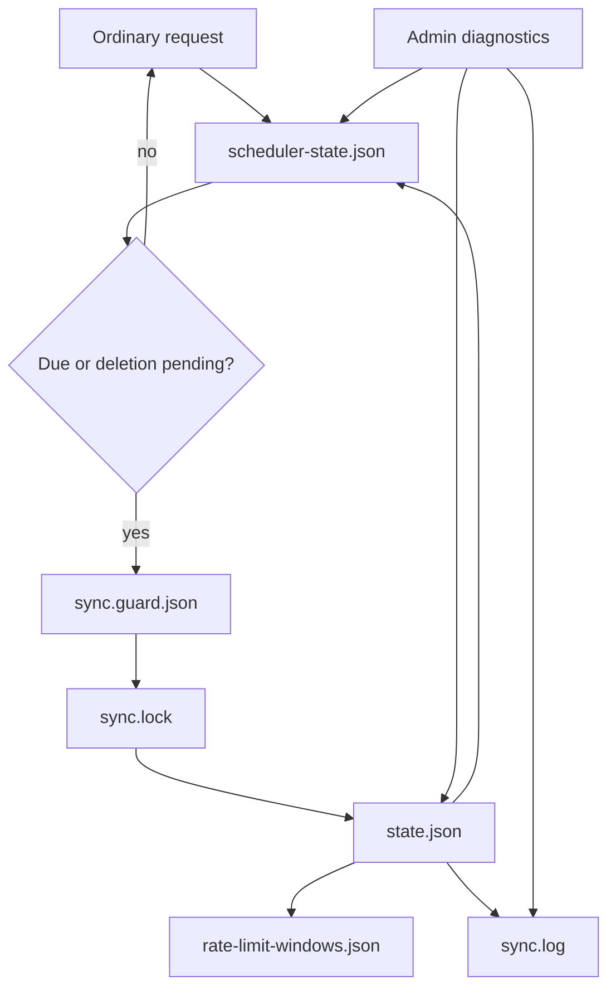
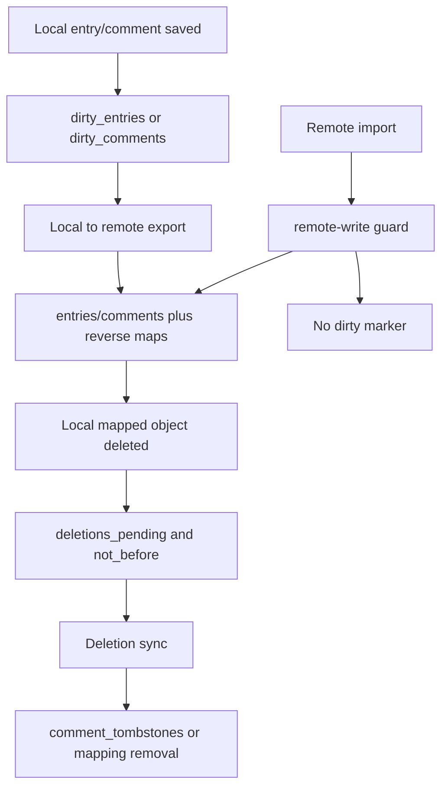

# 02 — State Model

## Files and responsibilities

| File                                                 | Responsibility                                                      | Read by                                            | Written by                           |
|------------------------------------------------------|---------------------------------------------------------------------|----------------------------------------------------|--------------------------------------|
| `fp-content/plugin_mastodon/state.json`              | Authoritative full synchronization state.                           | Sync, deletion sync, admin full diagnostics.       | `plugin_mastodon_state_write()`.     |
| `fp-content/plugin_mastodon/scheduler-state.json`    | Compact request-time status summary.                                | `plugin_mastodon_maybe_sync()`, admin diagnostics. | state writes and scheduler helpers.  |
| `fp-content/plugin_mastodon/sync.lock`               | Non-blocking file lock preventing concurrent content/deletion runs. | content and deletion orchestrators.                | Opened/locked by run functions.      |
| `fp-content/plugin_mastodon/sync.guard.json`         | File-backed cooldown guard.                                         | scheduled content/deletion paths.                  | `plugin_mastodon_sync_guard_mark()`. |
| `fp-content/plugin_mastodon/rate-limit-windows.json` | Persistent cross-run upload/delete/status-page budgets.             | rate-limit guard.                                  | rate-limit acquire/release helpers.  |
| `fp-content/plugin_mastodon/sync.log`                | Rotating operational log.                                           | Admin/debugging.                                   | `plugin_mastodon_log()`.             |

## `state.json` fields

| Field                           | Type                                    | Meaning                                               | Usually written by                         | Usually read by                                         |
| ------------------------------- | --------------------------------------- | ----------------------------------------------------- | ------------------------------------------ | ------------------------------------------------------- |
| version                         | integer                                 | State schema version, currently 5.                    | default_state; normalization on read.      | state read/write, migrations, diagnostics.              |
| last_run                        | UTC datetime string                     | Last completed content sync timestamp.                | run_sync.                                  | scheduler-state summary, admin diagnostics, due checks. |
| last_deletion_run               | UTC datetime string                     | Last completed deletion sync timestamp.               | run_deletion_sync.                         | scheduler-state summary, admin diagnostics.             |
| deletions_pending               | 0/1                                     | Whether follow-up deletion sync work exists.          | delete hooks, state_set_deletions_pending. | maybe_sync, run_deletion_sync.                          |
| deletions_pending_scope         | full\|entries\|comments                 | Limits what deletion work is currently needed.        | state_set_deletions_pending.               | deletion sync candidate selection.                      |
| deletions_not_before            | UTC datetime string                     | Earliest follow-up deletion run time.                 | state_set_deletions_pending.               | deletion_sync_due.                                      |
| last_error                      | string                                  | Last operational error or rate-limit reason.          | sync and deletion paths.                   | admin diagnostics, scheduler summary.                   |
| last_remote_status_id           | string                                  | Newest seen imported remote top-level status.         | remote-to-local sync.                      | next remote import since_id/max logic.                  |
| entries                         | map localEntryId -> meta                | Local FlatPress entry mapped to a Mastodon status.    | local export, remote import.               | updates, media reuse, deletions.                        |
| entries_remote                  | map remoteStatusId -> localEntryId      | Reverse lookup preventing duplicate imported entries. | state_set_entry_mapping.                   | remote import, context import.                          |
| comments                        | map entryId:commentId -> meta           | Local FlatPress comment mapped to a Mastodon reply.   | comment export/import.                     | reply export, deletion sync.                            |
| comments_remote                 | map remoteStatusId -> local comment key | Reverse lookup for imported/exported replies.         | state_set_comment_mapping.                 | context import, duplicate prevention.                   |
| dirty_entries                   | map localEntryId -> metadata            | Local entries that need export/update.                | entry saved hook, admin/manual paths.      | local-to-remote sync.                                   |
| dirty_comments                  | map commentKey -> metadata              | Local comments that need export/update.               | comment saved hook.                        | comment export and pending resolution.                  |
| comment_tombstones              | map remoteStatusId -> metadata          | Remote replies intentionally not to be re-imported.   | deletion sync, local deletion protection.  | remote reply import.                                    |
| pending_comment_remote_rechecks | map scope -> metadata                   | Remote reply descendants to revisit later.            | context import, deletion sync.             | follow-up deletion/comment reconciliation.              |
| old_thread_context_cursor       | string                                  | Cursor for rotating known old thread context checks.  | remote context collection.                 | old_thread_reply_check.                                 |
| deletion_cursor_entries         | string                                  | Cursor for large entry deletion sweeps.               | run_deletion_sync.                         | next deletion pass.                                     |
| deletion_cursor_comments        | string                                  | Cursor for large comment deletion sweeps.             | run_deletion_sync.                         | next deletion pass.                                     |
| content_stats                   | object                                  | Counters for the last content sync.                   | run_sync.                                  | admin diagnostics.                                      |
| deletion_stats                  | object                                  | Counters for the last deletion sync.                  | run_deletion_sync.                         | admin diagnostics.                                      |

## Important nested metadata

### Entry metadata in `entries`

A mapped entry typically carries:

| Key                           | Meaning                                                                                                           |
|-------------------------------|-------------------------------------------------------------------------------------------------------------------|
| `remote_id`                   | Mastodon status ID for the local entry.                                                                           |
| `hash`                        | Content hash used to skip unchanged local entries.                                                                |
| `date_key` / timestamps       | Used for sync window decisions.                                                                                   |
| `remote_media`                | Stored remote media descriptors for the effective Mastodon media selection, used for reuse and cleanup decisions. |
| `media_attachment_signature`  | Signature of the selected local status media files/paths/types, not every media tag found in the FlatPress entry. |
| `media_description_signature` | Signature of descriptions/alt text for the selected status media set.                                             |
| `remote_source` flags         | Indicates whether a local entry originated from Mastodon.                                                         |

The media signatures are computed after `plugin_mastodon_select_status_media_items()` has reduced the collected media to one Mastodon-compatible family. For example, if an entry contains images, audio, and video, only the selected image set contributes to the stored media signatures and remote media descriptors. The raw FlatPress content hash still includes the content itself, so ignored media changes can still make the entry dirty, but they do not force an invalid mixed-media Mastodon status.

### Comment metadata in `comments`

A mapped comment typically carries:

| Key                     | Meaning                                                     |
|-------------------------|-------------------------------------------------------------|
| `remote_id`             | Mastodon reply status ID.                                   |
| `hash`                  | Export hash used to skip unchanged comments.                |
| `parent_comment_id`     | Local parent comment ID for nested replies.                 |
| `in_reply_to_remote_id` | Remote status ID that the reply must target.                |
| `remote_source` flags   | Indicates whether a local comment originated from Mastodon. |

### Tombstones and rechecks

| State area                                             | Purpose                                                                                                   |
|--------------------------------------------------------|-----------------------------------------------------------------------------------------------------------|
| `comment_tombstones`                                   | Prevents a locally deleted remote/imported reply from being imported again from a later context response. |
| `pending_comment_remote_rechecks`                      | Keeps a small queue for remote descendants whose parent or deletion state could not be resolved yet.      |
| `deletion_cursor_entries` / `deletion_cursor_comments` | Allows large sites to spread deletion work over multiple runs.                                            |

## State invariants

1. `entries` and `entries_remote` must remain consistent in both directions.
2. `comments` and `comments_remote` must remain consistent in both directions.
3. A dirty marker should be removed only after the corresponding remote create/update is known to be successful or intentionally skipped.
4. Plugin-owned remote imports must not set dirty markers; the remote-write guard protects this.
5. Tombstones must be consulted before importing remote replies from a context response.
6. Large `state.json` files must not be loaded during the ordinary fast scheduler path when `scheduler-state.json` is fresh.
7. Every state write should refresh the compact scheduler state so admin and frontend checks remain cheap.

## Content and deletion counters

`content_stats` contains:

- `imported_entries`
- `updated_entries`
- `exported_entries`
- `updated_remote_entries`
- `imported_comments`
- `updated_local_comments`
- `exported_comments`
- `updated_remote_comments`

`deletion_stats` contains:

- `deleted_local_entries`
- `deleted_local_comments`
- `deleted_remote_entries`
- `deleted_remote_comments`

Counters describe the last run; they are diagnostics, not authoritative mappings.

## Mapping ownership lifecycle

## State ownership rules

| State area                         | Owner                                                          | Do not update directly from                                                   |
|------------------------------------|----------------------------------------------------------------|-------------------------------------------------------------------------------|
| `dirty_entries`                    | FlatPress entry hooks and explicit admin/full sync preparation | Remote import helper unless the remote-write guard is intentionally bypassed. |
| `dirty_comments`                   | FlatPress comment hooks and comment export preparation         | Remote reply import.                                                          |
| `entries` / `entries_remote`       | Mapping helpers only                                           | Ad-hoc array writes in API wrappers.                                          |
| `comments` / `comments_remote`     | Mapping helpers only                                           | Text conversion or media helpers.                                             |
| `comment_tombstones`               | Deletion sync and deletion-protection helpers                  | Normal import unless explicitly preventing reimport.                          |
| `pending_comment_remote_rechecks`  | Context import and deletion sync                               | Pure text/media functions.                                                    |
| `content_stats` / `deletion_stats` | Run orchestrators                                              | Deep helper functions that cannot know the whole run result.                  |

## Failure-state policy

- A transient API failure should set `last_error` and keep enough dirty/pending state for a later retry.
- A confirmed `404` or `410` for a remote status is treated as missing/deleted, not as a retryable transport failure.
- A state-write failure after successful remote work is dangerous; callers should surface the error because mappings may not reflect remote side effects.
- Budget/rate-limit blocks are intentional partial failures and should not be "fixed" by retry loops in lower-level helpers.
