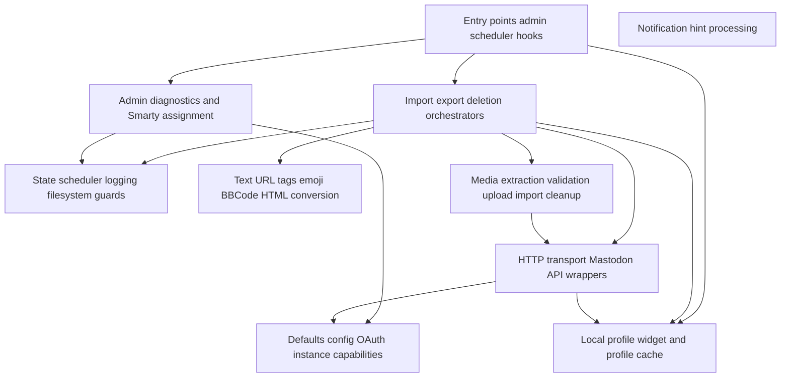

# 03 — Function-to-Process Matrix

This matrix links implementation functions to the process map. It is intentionally change-oriented: before editing a function, check the process, state areas and regression focus in the same row.

| Function(s)                                                                                                                              | Process            | Responsibility                                                                                              | State/API touched                                                                                  | Important side effects                                                                                                                          | Regression focus                       |
| ---------------------------------------------------------------------------------------------------------------------------------------- | ------------------ | ----------------------------------------------------------------------------------------------------------- | -------------------------------------------------------------------------------------------------- | ----------------------------------------------------------------------------------------------------------------------------------------------- | -------------------------------------- |
| `smarty_modifier_is_external_url()`                                                                                                      | P14                | Classifies comment author URLs as internal or external for frontend rendering.                              | `fp_config[general][www]`, `BLOG_BASEURL`, comment URL                                             | External links receive `target="_blank"` while relative and configured blog-base URLs remain in the current tab.                                | Comment author target-decision test    |
| plugin_mastodon_maybe_sync                                                                                                               | P1/P9              | Ordinary request scheduler entry point.                                                                     | scheduler-state.json, sync.guard.json                                                              | May call content and deletion sync.                                                                                                             | Scheduler tests                        |
| plugin_mastodon_run_sync                                                                                                                 | P1/P2              | Main content sync orchestrator.                                                                             | state.json, scheduler-state.json, sync.lock, rate-limit windows                                    | Calls remote-to-local then local-to-remote; writes stats and errors.                                                                            | Manual/scheduled sync tests            |
| plugin_mastodon_sync_remote_to_local                                                                                                     | P3/P4/P4a          | Remote import coordinator.                                                                                  | last_remote_status_id, last_remote_notification_id, entries_remote, comments_remote                | Fetches account statuses with privacy hardening when supported, notification hints and contexts.                                                | Remote import/thread tests             |
| plugin_mastodon_sync_local_to_remote                                                                                                     | P5/P6/P7           | Local export coordinator.                                                                                   | dirty entries/comments, mappings, media metadata                                                   | Creates/updates statuses and replies.                                                                                                           | Local export/comment/media tests       |
| plugin_mastodon_run_deletion_sync                                                                                                        | P9                 | Main deletion reconciliation coordinator.                                                                   | deletions_pending, cursors, mappings, tombstones                                                   | Deletes remote statuses or local mappings; queues rechecks.                                                                                     | Deletion sync tests                    |
| plugin_mastodon_delete_status                                                                                                            | P9/API             | Deletes a Mastodon status.                                                                                  | instance_info_json via capability helper                                                           | Adds or omits `delete_media`; retries without it for legacy failures.                                                                           | delete_media fallback tests            |
| plugin_mastodon_instance_supports_account_statuses_exclude_direct / plugin_mastodon_account_statuses_exclude_direct_should_retry_without | P3/API             | Capability check and rejection retry gate for the Mastodon 4.6 `exclude_direct` account-status parameter.   | Cached/stored `/api/v2/instance` `api_versions` and version fallback; account-status HTTP response | Sends `exclude_direct` only when support is known; retries once without it for compatible 400/405/422 failures.                                 | Account-status privacy hardening tests |
| plugin_mastodon_instance_supports_status_delete_media                                                                                    | P9/API             | Capability check for the delete_media parameter.                                                            | Cached/stored `/api/v2/instance` `api_versions` and version fallback                               | Returns true/false/null; never performs a network request during deletion sync.                                                                 | Version-specific delete tests          |
| plugin_mastodon_instance_supports_media_delete                                                                                           | P9/API             | Capability check for unattached media DELETE cleanup.                                                       | Cached/stored `/api/v2/instance` `api_versions` and version fallback                               | Returns true/false/null; never performs a network request during upload cleanup failure paths.                                                  | Media cleanup capability tests         |
| plugin_mastodon_instance_supports_status_media_attributes                                                                                | P5/P7/API          | Capability check for media alt-text update in status edit.                                                  | `/api/v2/instance` `api_versions`, version fallback and per-request failed cache                   | Controls reuse+media_attributes vs re-upload without repeated failed instance lookups.                                                          | Media reuse/update tests               |
| plugin_mastodon_instance_document / plugin_mastodon_instance_document_api_version / plugin_mastodon_normalized_instance_version          | P11/API            | Load compact instance snapshots and normalize capability evidence.                                          | Runtime cache, saved options, APCu, `/api/v2/instance`, `api_versions[mastodon]`                   | Caches success, negatively caches failed live lookups per request and avoids `/api/v1/instance`.                                                | Instance capability tests              |
| plugin_mastodon_prepare_entry_media_sync_plan                                                                                            | P5/P7              | Decides none/upload/reuse for the selected local entry media.                                               | Entry media signatures and remote media metadata                                                   | Calls media-family selection before comparing signatures.                                                                                       | Media signature/reuse tests            |
| plugin_mastodon_select_status_media_items                                                                                                | P7                 | Applies Mastodon media-family policy before signatures/uploads.                                             | Selected local media set; skipped-media diagnostics                                                | Chooses images first, otherwise one audio, otherwise one video.                                                                                 | Media-family selection tests           |
| plugin_mastodon_upload_media_items                                                                                                       | P7/API             | Uploads media through `/api/v2/media` and polls if necessary.                                               | rate-limit window, instance limits                                                                 | Returns media IDs or failure details.                                                                                                           | Upload/processing tests                |
| plugin_mastodon_cleanup_uploaded_media                                                                                                   | P7/API             | Deletes uploaded but unattached media after post/update failure.                                            | media IDs from current run                                                                         | Skips known-unsupported servers; otherwise calls `DELETE /api/v1/media/:id`.                                                                    | Cleanup and capability tests           |
| plugin_mastodon_collect_local_entry_media                                                                                                | P7                 | Extracts images/galleries/audio/video from FlatPress content.                                               | FlatPress entry body and companion plugin formats                                                  | Builds candidate local media descriptors.                                                                                                       | Local media extraction tests           |
| plugin_mastodon_build_entry_status_text                                                                                                  | P5                 | Builds Mastodon text from FlatPress entry.                                                                  | Entry title/body, tags, URL budget, instance limits                                                | Adds permalink and hashtag footer.                                                                                                              | Text/tag/URL tests                     |
| plugin_mastodon_build_comment_status_text                                                                                                | P6                 | Builds Mastodon reply text from FlatPress comment.                                                          | Comment author/body, public comment URL                                                            | Localizes and converts text/emoji.                                                                                                              | Comment export tests                   |
| plugin_mastodon_import_remote_entry                                                                                                      | P3/P8              | Writes a remote top-level status as FlatPress entry.                                                        | Remote status JSON                                                                                 | Writes entry, media, tags, mappings and the imported status source footer built from `Status.url`.                                              | Remote entry import tests              |
| plugin_mastodon_imported_status_footer_bbcode                                                                                            | P3                 | Builds the imported Mastodon status source footer BBCode.                                                   | Mastodon `Status.url`                                                                              | Emits `[url=... target=_blank rel="nofollow noopener noreferrer"]Mastodon[/url]` for the single toot/status.                                    | Status-footer target tests             |
| plugin_mastodon_import_remote_comment                                                                                                    | P4/P8              | Writes a remote reply as FlatPress comment.                                                                 | Remote context descendant and parent mapping                                                       | Writes comment, mappings, tombstone-aware decisions.                                                                                            | Remote reply import tests              |
| plugin_mastodon_fetch_reply_notifications / plugin_mastodon_process_remote_reply_notifications                                           | P4a                | Polls mention notifications and prioritizes old-thread reply hints.                                         | notifications API, last_remote_notification_id, comments_remote                                    | Directly imports mapped-parent replies or spends the old-thread context budget.                                                                 | Notification hint tests                |
| plugin_mastodon_process_pending_comment_remote_rechecks                                                                                  | P4/P9              | Retries remote reply descendant checks later.                                                               | pending_comment_remote_rechecks                                                                    | Imports or clears queued rechecks.                                                                                                              | Pending recheck tests                  |
| plugin_mastodon_state_read / plugin_mastodon_state_write                                                                                 | All sync processes | Load and persist full synchronization state.                                                                | state.json                                                                                         | Normalize defaults and write scheduler summary.                                                                                                 | State/scheduler tests                  |
| plugin_mastodon_scheduler_state_read / write                                                                                             | P1/P12             | Compact status summary optimized for normal requests.                                                       | scheduler-state.json                                                                               | Avoids loading huge state files in common case.                                                                                                 | Compact scheduler tests                |
| `plugin_mastodon_rate_limit_guard_start()` / `plugin_mastodon_rate_limit_acquire()` / `plugin_mastodon_rate_limit_guard_stop()`          | P1/P2/P7/P9        | Local request budget and remote rate-limit guard.                                                           | rate-limit-windows.json and runtime globals                                                        | Blocks expensive calls with visible errors.                                                                                                     | Budget/rate-limit tests                |
| plugin_mastodon_oauth_scopes                                                                                                             | P11                | Chooses OAuth scopes for app registration/authorization.                                                    | oauth_registered_scopes, discovery metadata                                                        | Prefers profile plus notifications on current servers and keeps existing legacy clients stable.                                                 | OAuth scope tests                      |
| plugin_mastodon_head / plugin_mastodon_widget / profile-cache helpers                                                                    | P13                | Loads the versioned widget stylesheet and renders the compact Mastodon widget from local public cache only. | profile/profile.json, profile/avatar.*, res/mastodon.css                                           | Refreshes the cache from `plugin_mastodon_run_sync()` even in one-way export mode; widget render performs no HTTP request or inline CSS output. | Widget cache/render/CSS/sync tests     |
| plugin_mastodon_admin_assign                                                                                                             | P12/P2/P9/P11      | Admin controller and diagnostics provider.                                                                  | options, state, scheduler-state, manual actions                                                    | Assigns Smarty variables and triggers manual operations.                                                                                        | Admin assignment tests                 |
| plugin_mastodon_on_entry_saved/deleted                                                                                                   | P10                | FlatPress core hook handlers for entry changes.                                                             | state.json, remote-write guard                                                                     | Marks dirty or deletion-pending.                                                                                                                | Dirty/deletion hook tests              |
| plugin_mastodon_on_comment_saved/deleted                                                                                                 | P10                | FlatPress core hook handlers for comment changes.                                                           | state.json, remote-write guard                                                                     | Marks dirty or deletion-pending.                                                                                                                | Dirty/deletion hook tests              |

## Function families

## Change impact examples

| Change area              | First functions to inspect                                                                                                             | State to inspect                                | Tests to inspect                         |
| ------------------------ | -------------------------------------------------------------------------------------------------------------------------------------- | ----------------------------------------------- | ---------------------------------------- |
| Mastodon delete behavior | `plugin_mastodon_delete_status()`, `plugin_mastodon_run_deletion_sync()`                                                               | `deletions_pending`, cursors, tombstones        | Delete fallback and deletion sync tests  |
| Media alt text update    | `plugin_mastodon_prepare_entry_media_sync_plan()`, `plugin_mastodon_status_media_attributes()`, `plugin_mastodon_update_status()`      | entry media signatures, `remote_media`          | Media reuse and description update tests |
| Remote reply import      | `plugin_mastodon_import_remote_comment()`, `plugin_mastodon_import_remote_context_descendants()`                                       | `comments_remote`, tombstones, pending rechecks | Reply tree and tombstone tests           |
| Scheduler performance    | `plugin_mastodon_maybe_sync()`, scheduler-state helpers                                                                                | `scheduler-state.json`, large `state.json`      | Compact scheduler/large state tests      |
| OAuth scopes             | `plugin_mastodon_oauth_scopes()`, discovery helpers                                                                                    | options `oauth_registered_scopes`               | Scope discovery tests                    |
| Profile widget           | `plugin_mastodon_widget()`, `plugin_mastodon_refresh_profile_cache_for_sync()`, `plugin_mastodon_refresh_profile_cache_from_account()` | `profile/profile.json`, local avatar file       | Widget cache/render/sync tests           |
| Text conversion          | BBCode/HTML/text helper functions                                                                                                      | usually no state                                | HTML/BBCode/URL/tag/emoji tests          |

## Reading guidance

- Start with orchestrators (`run_sync`, `sync_remote_to_local`, `sync_local_to_remote`, `run_deletion_sync`).
- Then follow the helper family that owns the state you need to change.
- Avoid adding direct file or HTTP behavior in deep conversion helpers; keep side effects in orchestrators or API wrappers.
- Widget callbacks must not make HTTP calls; refresh local profile cache from authenticated `plugin_mastodon_run_sync()`/account-verification paths.

## Side-effect boundaries and compatibility rules

| Rule                                                                                               | Reason                                                            |
| -------------------------------------------------------------------------------------------------- | ----------------------------------------------------------------- |
| Keep pure text/BBCode/URL conversion helpers free of file and HTTP side effects.                   | They are heavily tested and should remain deterministic.          |
| Keep Mastodon endpoint strings centralized in API wrapper functions.                               | Makes fallback and budget behavior auditable.                     |
| Use mapping helpers for `entries`, `entries_remote`, `comments` and `comments_remote`.             | Prevents one-way mapping corruption.                              |
| Do not load full `state.json` in ordinary request fast paths when `scheduler-state.json` is fresh. | Required for large FlatPress installations and shared hosting.    |
| Do not introduce PHP syntax newer than PHP 7.2.                                                    | Plugin target includes PHP 7.2 through 8.5.                       |
| Avoid dynamic shapes that PHPStan Level 5 cannot follow without normalization.                     | Normalize arrays before reads; use clear guards for mixed values. |
| Keep Smarty-facing admin values as simple arrays/scalars.                                          | Maintains compatibility with Smarty 4.x/5.x templates.            |
| Add regression tests for any new long-lived state key.                                             | State bugs are often delayed until a later scheduled run.         |
