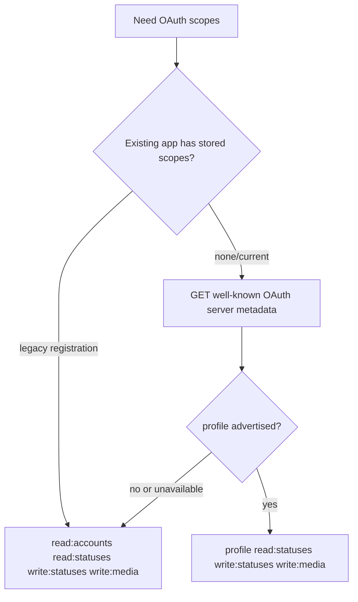
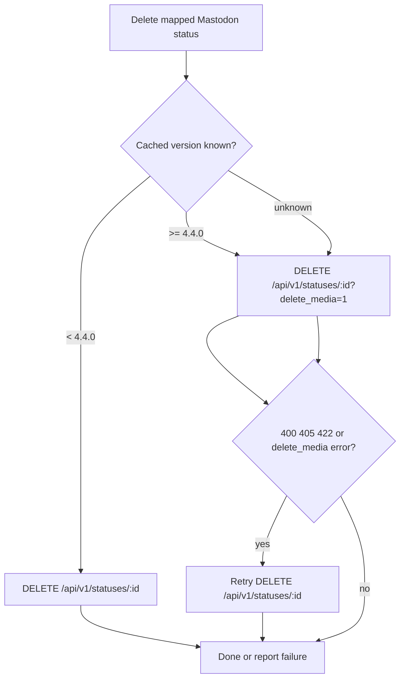
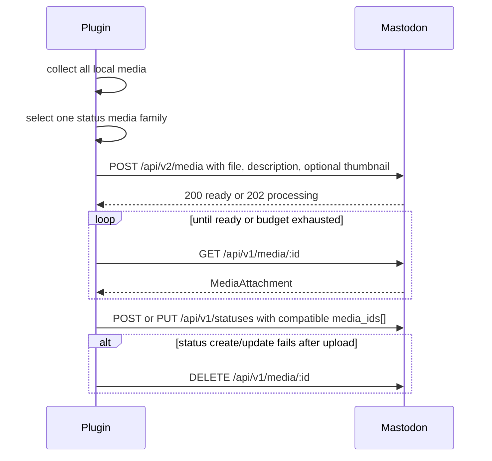

# 04 — API Endpoint and Version Documentation

## Supported Mastodon range

The current plugin implementation is best described as:

| Range      | Status                                                                                                                                                          |
|------------|-----------------------------------------------------------------------------------------------------------------------------------------------------------------|
| `< 4.0.0`  | Not supported by the current documented plugin target because `/api/v2/instance` is the capability source and there is no `/api/v1/instance` API fallback.      |
| `>= 4.0.0` | Technical target. Core endpoints used by the plugin are available; newer capability fields may be missing and internal defaults apply.                          |
| `>= 4.4.0` | Recommended for full documented delete/media-cleanup behavior because `delete_media` on status delete and `DELETE /api/v1/media/:id` are documented from 4.4.0. |
| Future 4.x | No hard upper bound is encoded. Continue checking official Mastodon API changelogs before changing endpoint behavior.                                           |

## Endpoint matrix

| Purpose                 | Method | Endpoint                                | API history                               | Auth/scope              | Fallback behavior in plugin                                                                             | Main function(s)                                                     |
| ----------------------- | ------ | --------------------------------------- | ----------------------------------------- | ----------------------- | ------------------------------------------------------------------------------------------------------- | -------------------------------------------------------------------- |
| OAuth discovery         | GET    | /.well-known/oauth-authorization-server | 4.3.0                                     | Public                  | If unavailable, use legacy `read:accounts` instead of `profile`.                                        | plugin_mastodon_oauth_server_metadata / plugin_mastodon_oauth_scopes |
| App registration        | POST   | /api/v1/apps                            | 0.0.0                                     | Public                  | No alternate endpoint. Existing registrations keep stored scopes.                                       | plugin_mastodon_register_app                                         |
| Authorize URL           | GET    | /oauth/authorize                        | 0.1.0 era OAuth                           | Browser                 | No endpoint fallback; generated URL uses stored app credentials.                                        | plugin_mastodon_authorize_url                                        |
| Token exchange          | POST   | /oauth/token                            | 0.1.0 era OAuth                           | Public/client           | No endpoint fallback.                                                                                   | plugin_mastodon_exchange_code                                        |
| Verify credentials      | GET    | /api/v1/accounts/verify_credentials     | 0.0.0                                     | User token              | Scope fallback: `profile` on current servers, `read:accounts` on older servers.                         | plugin_mastodon_verify_credentials                                   |
| Instance info           | GET    | /api/v2/instance                        | 4.0.0                                     | Public                  | No `/api/v1/instance` API fallback; internal defaults are used if fields are missing.                   | plugin_mastodon_instance_document                                    |
| Account statuses        | GET    | /api/v1/accounts/:id/statuses           | 0.0.0                                     | Public or read:statuses | Budgeted paging; limit 40, up to 5 plugin pages.                                                        | plugin_mastodon_fetch_account_statuses                               |
| Status context          | GET    | /api/v1/statuses/:id/context            | 0.0.0                                     | Public or read:statuses | Failures produce no descendants for that target; later rechecks may be queued.                          | plugin_mastodon_fetch_status_context                                 |
| Single status           | GET    | /api/v1/statuses/:id                    | 0.0.0                                     | Public or read:statuses | 404/410 are treated as missing/deleted.                                                                 | plugin_mastodon_fetch_status                                         |
| Create status           | POST   | /api/v1/statuses                        | 0.0.0                                     | write:statuses          | No create fallback.                                                                                     | plugin_mastodon_create_status                                        |
| Edit status             | PUT    | /api/v1/statuses/:id                    | 3.5.0                                     | write:statuses          | No delete-and-redraft fallback. `media_attributes` are only used when instance version is >= 4.1.0.     | plugin_mastodon_update_status                                        |
| Delete status           | DELETE | /api/v1/statuses/:id?delete_media=1     | status delete 0.0.0; `delete_media` 4.4.0 | write:statuses          | Known < 4.4 omits parameter; unknown may retry without parameter on 400/405/422 or delete_media errors. | plugin_mastodon_delete_status                                        |
| Upload media            | POST   | /api/v2/media                           | 3.1.3; `thumbnail` parameter 3.2.0        | write:media             | No deprecated `/api/v1/media` upload fallback. Video posters are sent as upload thumbnails.             | plugin_mastodon_upload_media_items                                   |
| Poll media              | GET    | /api/v1/media/:id                       | 3.1.3                                     | write:media             | Media-type-aware polling and timeout windows.                                                           | plugin_mastodon_wait_for_media_attachment                            |
| Delete unattached media | DELETE | /api/v1/media/:id                       | 4.4.0                                     | write:media             | Used for cleanup. 404 is tolerated as already gone.                                                     | plugin_mastodon_delete_media_attachment                              |

## Mastodon status media-family rule

The status endpoint accepts `media_ids[]`, but Mastodon status validation rejects mixed media families when audio or video is present. User-facing Mastodon limits are the safest developer rule: up to several images may be attached to one post, but only one video or one audio file may be attached to one post. The plugin therefore never sends image+video, image+audio, or audio+video media IDs in one status.

The local export policy is deterministic:

1. If one or more images are present, export images only, up to `configuration.statuses.max_media_attachments`.
2. Otherwise, if audio is present, export exactly one audio attachment.
3. Otherwise, if video is present, export exactly one video attachment.
4. A FlatPress video `poster` image is passed as the `/api/v2/media` `thumbnail` field for the selected video upload; it is never appended as a second `media_id`.

The low-level upload helper can upload the media items it receives, but `plugin_mastodon_prepare_entry_media_sync_plan()` calls `plugin_mastodon_select_status_media_items()` before signatures, reuse checks, uploads, and final `POST`/`PUT /api/v1/statuses`.

## Instance-derived limits and internal defaults

The plugin reads `/api/v2/instance` and uses `configuration` values when present. Missing values fall back to safe internal defaults.

| Limit                       | Instance field                                         | Default/fallback                                                                          |
|-----------------------------|--------------------------------------------------------|-------------------------------------------------------------------------------------------|
| Status max characters       | `configuration.statuses.max_characters`                | `500`                                                                                     |
| Reserved characters per URL | `configuration.statuses.characters_reserved_per_url`   | `23`                                                                                      |
| Max media attachments       | `configuration.statuses.max_media_attachments`         | `4`                                                                                       |
| Media description length    | `configuration.media_attachments.description_limit`    | `1500`                                                                                    |
| Supported MIME types        | `configuration.media_attachments.supported_mime_types` | Plugin validates broadly when unknown.                                                    |
| Image size limit            | `configuration.media_attachments.image_size_limit`     | No local size rejection when unknown.                                                     |
| Video size limit            | `configuration.media_attachments.video_size_limit`     | No local size rejection when unknown.                                                     |
| Audio size limit            | `configuration.media_attachments.audio_size_limit`     | Falls back to video size if explicit audio limit is absent; otherwise no local rejection. |

## Internal budgets and operational limits

| Name                                              | Value   | Purpose                                                                |
| ------------------------------------------------- | ------- | ---------------------------------------------------------------------- |
| PLUGIN_MASTODON_DEFAULT_SYNC_TIME                 | 03:00   | Default scheduled sync time.                                           |
| PLUGIN_MASTODON_MAX_STATUS_PAGES                  | 5       | Maximum account-status pages imported in one remote pass.              |
| Mastodon account-status page limit                | 40      | The plugin requests the API maximum for /api/v1/accounts/:id/statuses. |
| PLUGIN_MASTODON_IMPORTED_MEDIA_WIDTH              | 320     | Width used in imported FlatPress image markup.                         |
| PLUGIN_MASTODON_PENDING_COMMENT_RECHECK_LIMIT     | 3       | Remote reply recheck attempts per pending comment scope.               |
| PLUGIN_MASTODON_OLD_THREAD_CONTEXT_ROTATION_LIMIT | 3       | Old-thread context targets rotated per run.                            |
| PLUGIN_MASTODON_STATE_FALLBACK_TTL                | 300s    | Fallback cache TTL for state-related helpers.                          |
| PLUGIN_MASTODON_COOLDOWN_TTL                      | 300s    | File/APCu cooldown guard for scheduled sync paths.                     |
| PLUGIN_MASTODON_RUN_REQUEST_BUDGET                | 240     | Per-run general Mastodon API request budget.                           |
| PLUGIN_MASTODON_RUN_MEDIA_UPLOAD_BUDGET           | 24      | Per-run media upload budget.                                           |
| PLUGIN_MASTODON_RUN_DELETE_BUDGET                 | 24      | Per-run remote status delete budget.                                   |
| PLUGIN_MASTODON_WINDOW_MEDIA_UPLOAD_TTL           | 1800s   | Persistent upload budget window.                                       |
| PLUGIN_MASTODON_WINDOW_DELETE_TTL                 | 1800s   | Persistent delete budget window.                                       |
| PLUGIN_MASTODON_WINDOW_STATUS_PAGE_BUDGET         | 300     | Cross-run status page budget.                                          |
| PLUGIN_MASTODON_WINDOW_STATUS_PAGE_TTL            | 900s    | Persistent account-status paging budget window.                        |
| PLUGIN_MASTODON_RATE_LIMIT_REMAINING_FLOOR        | 10      | Stop before the remote server's remaining quota is exhausted.          |
| PLUGIN_MASTODON_LOG_MAX_BYTES                     | 1048576 | Rotate sync.log when it grows beyond 1 MiB.                            |
| PLUGIN_MASTODON_LOG_ROTATE_FILES                  | 3       | Keep up to three rotated sync logs.                                    |

## API fallback diagrams

### OAuth scope negotiation

### Status deletion compatibility

### Media upload and cleanup

## External documentation references

- Mastodon instance API: https://docs.joinmastodon.org/methods/instance/
- Mastodon statuses API: https://docs.joinmastodon.org/methods/statuses/
- Mastodon media API: https://docs.joinmastodon.org/methods/media/
- Mastodon apps API: https://docs.joinmastodon.org/methods/apps/
- Mastodon accounts API: https://docs.joinmastodon.org/methods/accounts/
- Mastodon OAuth methods and discovery: https://docs.joinmastodon.org/methods/oauth/
- Mastodon OAuth scopes: https://docs.joinmastodon.org/api/oauth-scopes/

## Capability sources

| Capability                             | Source                                    | Unknown behavior                                                  |
|----------------------------------------|-------------------------------------------|-------------------------------------------------------------------|
| Status character limit                 | `/api/v2/instance` configuration          | Use `500`.                                                        |
| URL reserved length                    | `/api/v2/instance` configuration          | Use `23`.                                                         |
| Max media attachments                  | `/api/v2/instance` configuration          | Use `4`.                                                          |
| Media MIME/size support                | `/api/v2/instance` configuration          | Validate conservatively; do not invent server limits.             |
| Status `media_attributes` update       | Parsed instance version `>= 4.1.0`        | Treat as unsupported and re-upload when descriptions changed.     |
| Status delete `delete_media` parameter | Cached/stored instance version `>= 4.4.0` | Try with parameter, retry without on known legacy-style failures. |
| OAuth `profile` scope                  | OAuth discovery `scopes_supported`        | Fall back to `read:accounts`.                                     |

## API change playbooks

### Adding a new Mastodon request

1. Add one API wrapper function rather than scattering raw endpoint strings.
2. Decide whether it consumes the general request budget or a specialized budget.
3. Define response-code handling, especially `401`, `403`, `404`, `410`, `422`, `429` and transport-code `0`.
4. Add state behavior for partial success/failure.
5. Add a simulation test with a mocked success response and at least one failure/fallback response.
6. Update the endpoint matrix in this file.

### Changing a fallback

1. Identify whether the decision is version-based, field-based, response-code-based or transport-error-based.
2. Prefer cached instance information for scheduled/deletion paths to avoid extra requests.
3. Avoid fallback retry loops that can exceed budgets.
4. Preserve the first response metadata if the fallback response is returned to callers.
5. Add tests for known old version, known current version and unknown version if all three branches exist.

### Changing media behavior

1. Check both export and import paths.
2. Check instance limits and local validation.
3. Check upload cleanup on status create/update failure.
4. Check description-only changes and `media_attributes` capability.
5. Check that remote media import still has URL fallback order and safe local filenames.
