# 06 — Process Flows

## Scope and important state files

The plugin keeps a compact scheduler layer and a full synchronization layer.

- `fp-content/plugin_mastodon/scheduler-state.json` is the compact scheduler summary used on
  ordinary requests. It tells the plugin whether a scheduled content sync or a follow-up
  deletion sync is due without loading the full mapping state.
- `fp-content/plugin_mastodon/state.json` is the full synchronization state. It contains
  entry/comment mappings, reverse remote mappings, dirty queues, tombstones, media metadata,
  cursors, statistics, and last-error information, and is written as compact JSON without
  `JSON_PRETTY_PRINT` to keep large-state writes smaller and faster.
- `sync.lock` serializes real content/deletion sync runs.
- `sync.guard.json` stores short cooldown markers for content and deletion runs.
- `rate-limit-windows.json` stores persistent cross-request windows for media uploads,
  status deletes, and status-page fetches.
- `sync.log` plus rotated `sync.log.1` to `sync.log.3` stores operational diagnostics.

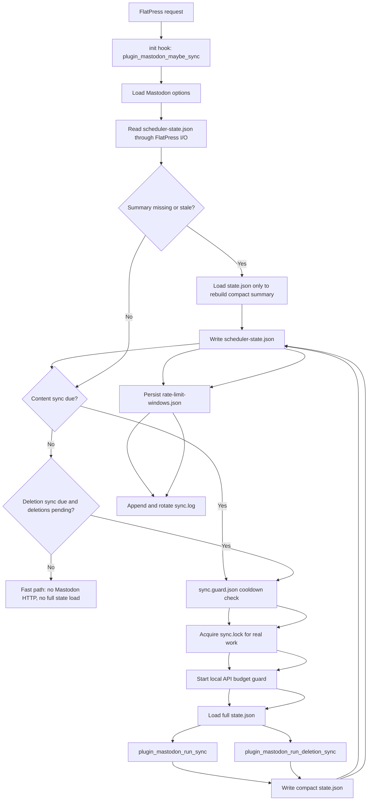

### Full state schema and mapping lifecycle

The full state is not just a cache. It is the durable reconciliation layer between FlatPress
file IDs and Mastodon status IDs.

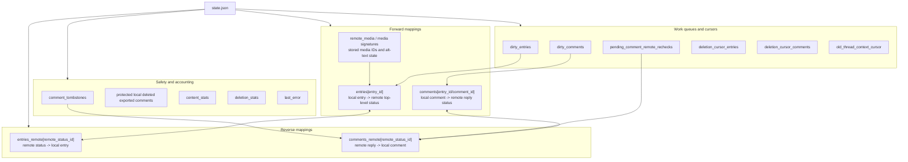

## 1. Bidirectional content synchronization

### 1.1 FlatPress entry candidate selection and dirty decision

A local FlatPress entry is exported as a Mastodon top-level status only when it is inside the
active synchronization window, when a post-success hook queued it as dirty, or when a manual
full sync intentionally scans all entries.

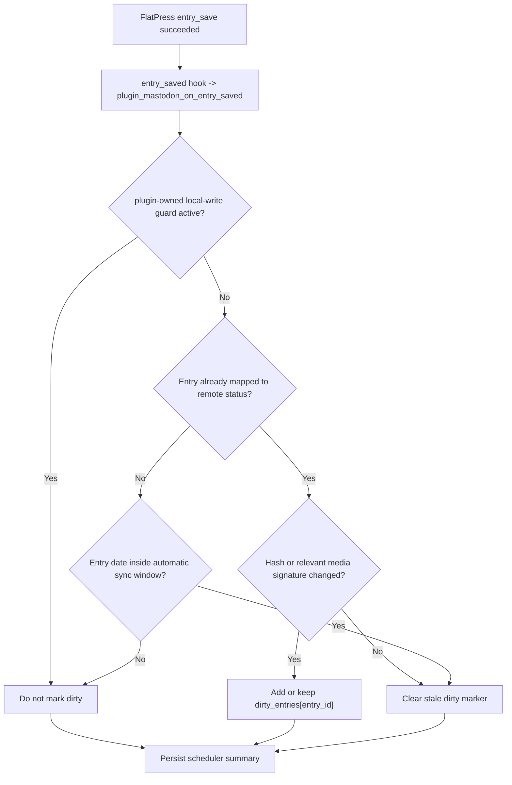

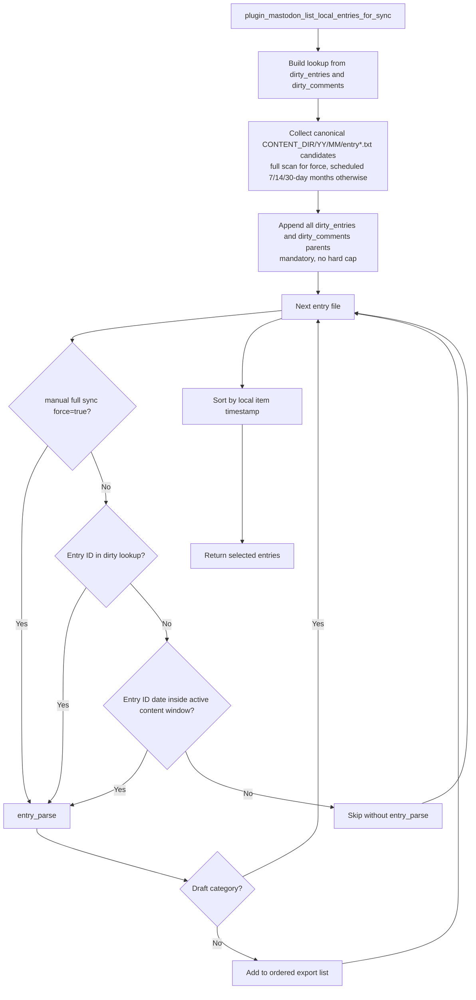

The collector reads only canonical FlatPress `YY/MM/entry*.txt` files directly from month directories. Manual full syncs scan all canonical months. Scheduled/non-full syncs scan only months that can intersect the admin-selected 7/14/30-day active content window and then append every canonical parent entry from `dirty_entries` and `dirty_comments`. Dirty candidates are mandatory and intentionally have no simple three-item hard cap; a future throttle would need a persisted rotating cursor, logging and a full-sync bypass. Local comments are still evaluated later per selected parent entry via the comment-listing path, so entry-like files below comment storage must not inflate the local entry candidate set.

### 1.2 FlatPress entry to Mastodon status

The export path builds text, tags, media IDs, and update metadata before it decides between
`POST /api/v1/statuses` and `PUT /api/v1/statuses/:id`.

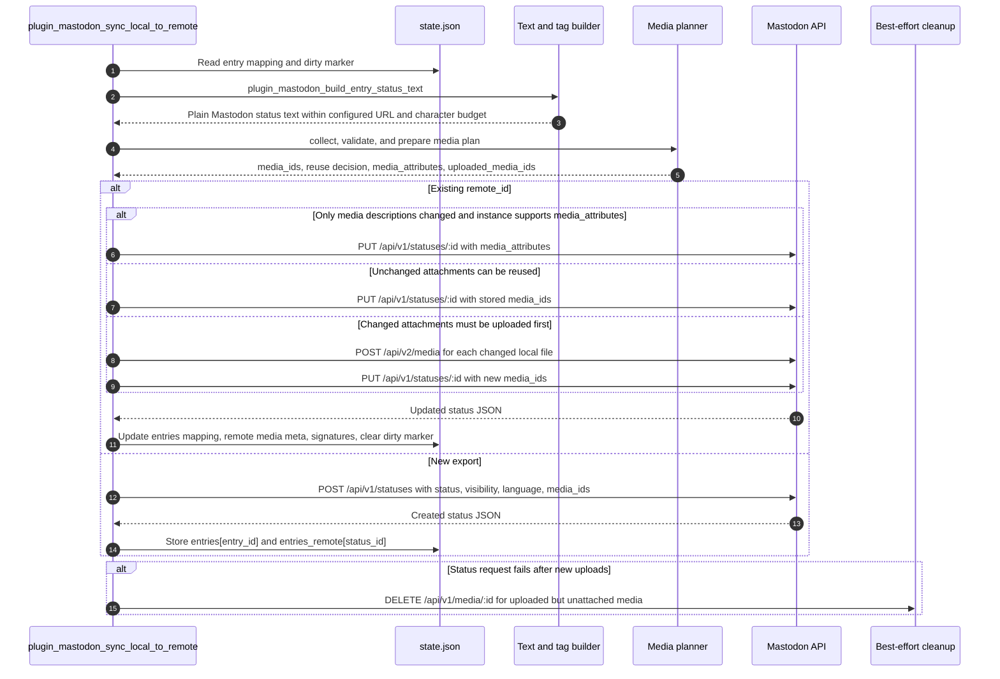

### 1.3 FlatPress comment and comment reply export

FlatPress comments are exported only after the parent entry has a remote status mapping. Nested
comment replies are delayed until their local parent comment has a remote mapping.

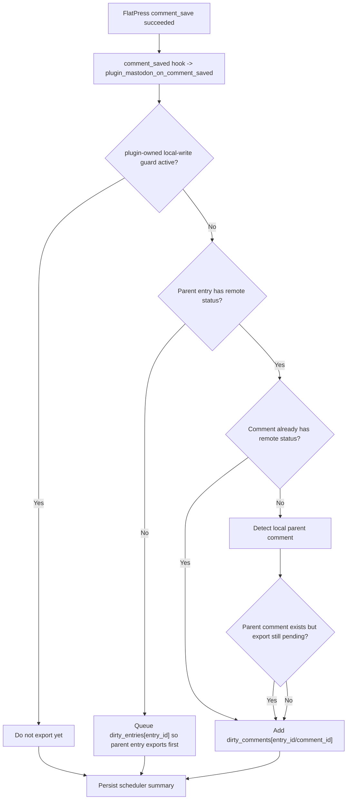

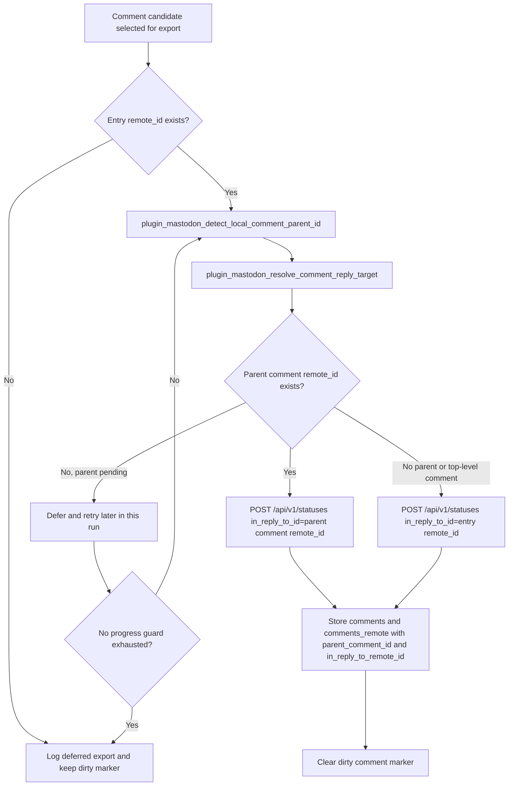

### 1.4 Mastodon top-level status to FlatPress entry

The remote-to-local path imports top-level statuses owned by the configured Mastodon account,
filters them by visibility/window/source, converts HTML to FlatPress markup, imports remote
media, and writes through the local-write guard.

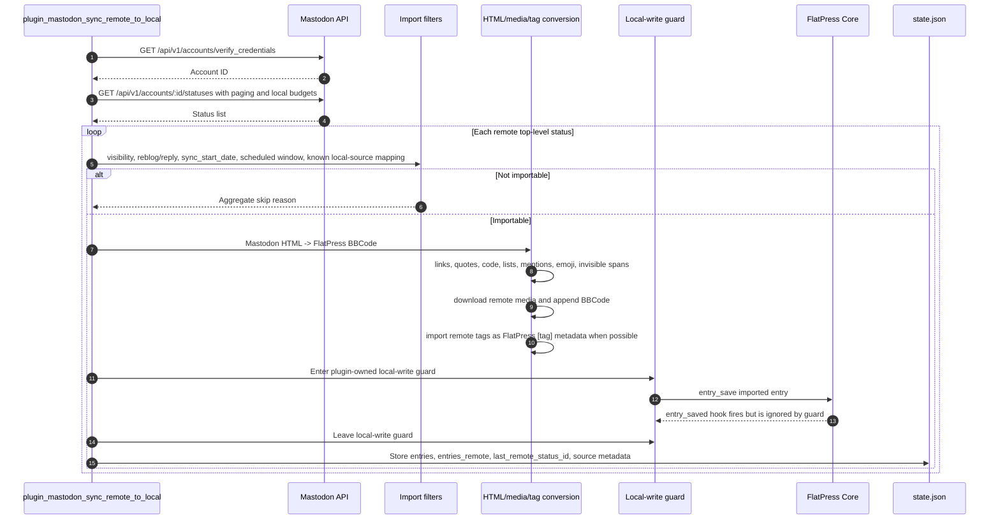

### 1.5 Mastodon replies in a known imported thread to FlatPress comments

After importing or refreshing a known entry status, the plugin fetches the Mastodon context and
walks descendants. This path must avoid resurrecting locally deleted comments, must not break
thread order, and must cope with temporarily unresolved parents.

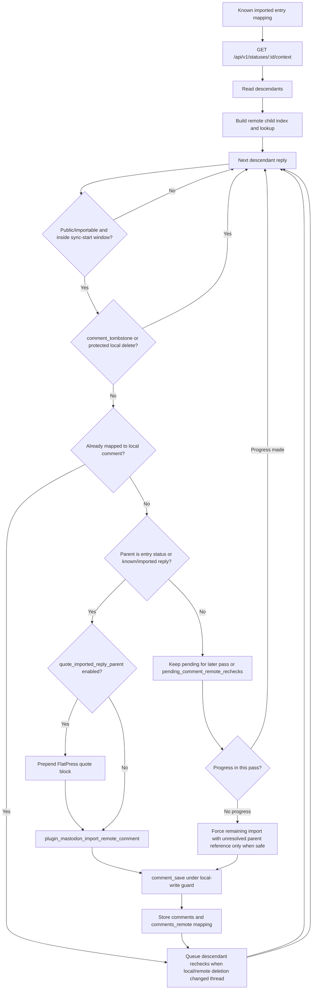

## 2. Text, URLs, tags, media, and companion plugins

### 2.1 Local-to-remote status-text pipeline

The status-text builder intentionally keeps Mastodon-visible length calculation separate from
FlatPress storage. Mastodon counts each URL as the instance's configured URL budget.

```mermaid
flowchart LR
    Source["FlatPress entry or comment body"]
    StripMeta["Strip local-only metadata<br/>draft/category/tag BBCode where needed"]
    BBCode["Flatten or convert supported BBCode"]
    MediaRefs["Remove media-only markup from plain text"]
    Links["Normalize public URLs and link text"]
    Emoji["Convert FlatPress emoticons or keep shortcode-safe text"]
    Tags["Extract and normalize FlatPress tags"]
    Footer["Build plugin-owned hashtag footer"]
    Join["Join body and footer"]
    InstanceLimits["Load /api/v2/instance limits<br/>max_characters and URL reserved length"]
    Budget["plugin_mastodon_status_text_length"]
    Truncate["plugin_mastodon_limit_status_text"]
    Result["Mastodon status text"]

    Source --> StripMeta --> BBCode --> MediaRefs --> Links --> Emoji --> Tags --> Footer --> Join
    Join --> InstanceLimits --> Budget
    Budget --> Truncate --> Result
```

### 2.2 Remote-to-local HTML and BBCode pipeline

Remote Mastodon content arrives as HTML. The plugin converts only the safe and supported
structures into FlatPress markup and then appends imported media markup.

```mermaid
flowchart LR
    HTML["Mastodon status.content HTML"]
    DOM["DOMDocument-based parsing with fallback cleanup"]
    Blocks["p, br, blockquote, pre, code, ul, ol, li"]
    Links["a tags -> FlatPress URL markup or plain URL"]
    Mentions["mentions and hashtags preserved as text/links"]
    Invisible["Mastodon invisible/ellipsis spans cleaned"]
    Emoji["custom emoji shortcode/text handling"]
    Cleanup["Final whitespace and round-trip cleanup"]
    Media["Append imported media BBCode"]
    Tags["Append [tag] metadata when Tag plugin is active"]
    Result["FlatPress entry/comment content"]

    HTML --> DOM --> Blocks --> Links --> Mentions --> Invisible --> Emoji --> Cleanup
    Cleanup --> Media --> Tags --> Result
```

### 2.3 Local media collection, validation, and Mastodon media-family selection

The plugin scans entries for image, gallery, audio, and video markup, then validates the
corresponding files against instance capabilities and internal budgets. The collector keeps
all recognized local media candidates, but the export planner selects only one media family
before upload because Mastodon accepts either multiple images or one audio/video attachment
per status.

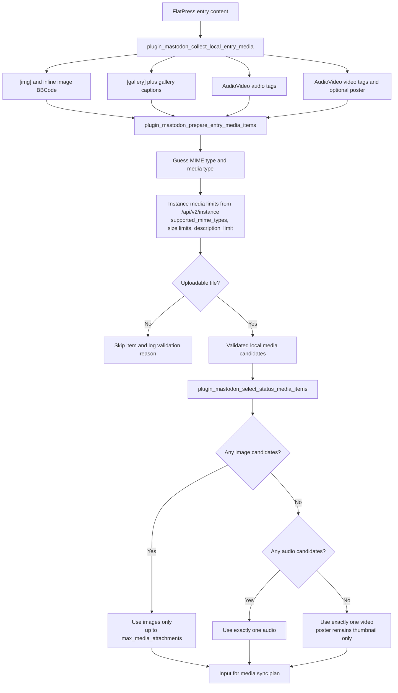

Selection priority is deterministic: images first, otherwise audio, otherwise video. Skipped
media are logged and counted in the media plan; they do not make the sync fail.

### 2.4 Media reuse, upload, update, and cleanup lifecycle

The media plan receives the selected Mastodon-compatible media family, then decides whether existing remote IDs can be reused, whether alt text can be
updated in place through `media_attributes`, or whether files must be uploaded again. Attachment and description signatures are based on the selected media set.

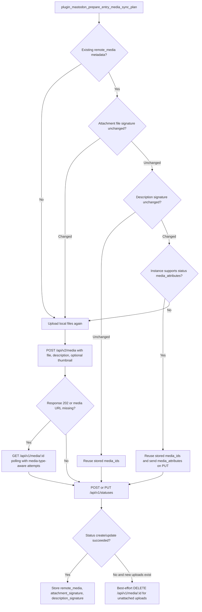

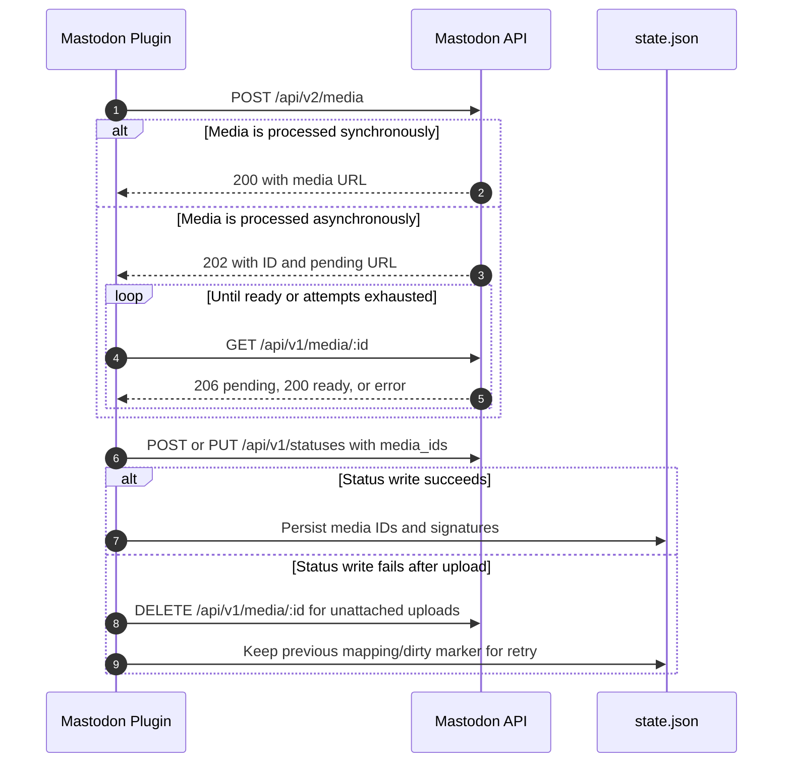

### 2.5 Mastodon media attachments to FlatPress media markup

Remote media import uses a URL fallback order and stores downloaded files in FlatPress-managed
directories before it emits BBCode for the matching companion renderer.

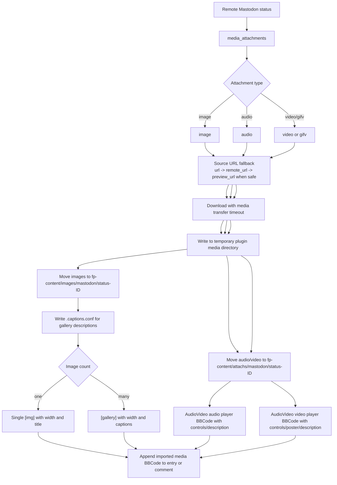

### 2.6 Tags and hashtags when the FlatPress Tag plugin is active

When the Tag plugin is active, local FlatPress tag metadata becomes a Mastodon hashtag footer.
On import, plugin-generated footer noise is stripped while real remote hashtags remain usable.

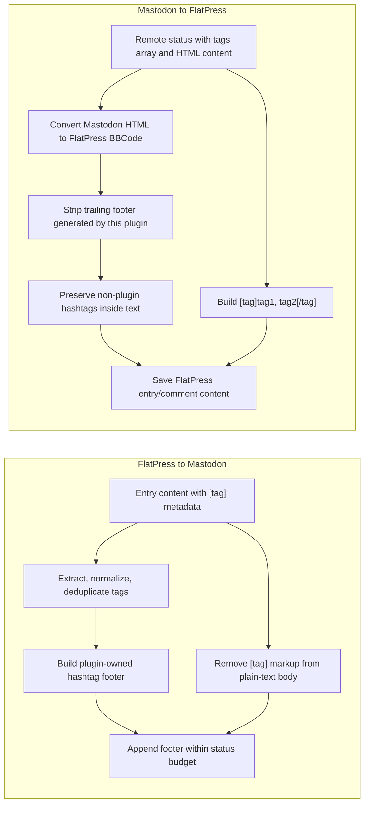

### 2.7 Companion plugin dependency overview

The Mastodon plugin can store imported content without all companion plugins, but these plugins
determine whether imported markup renders correctly in the FlatPress frontend.

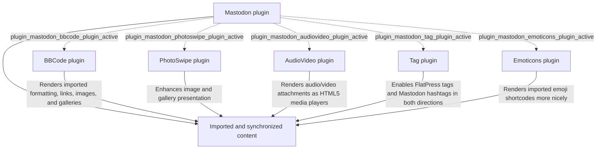

## 3. Mastodon API endpoints, capabilities, and fallbacks

### 3.1 API endpoint map

The plugin uses Mastodon HTTP APIs through `plugin_mastodon_mastodon_json()` and the multipart
media transport. The FlatPress side is real code; tests usually simulate the remote Mastodon
server.

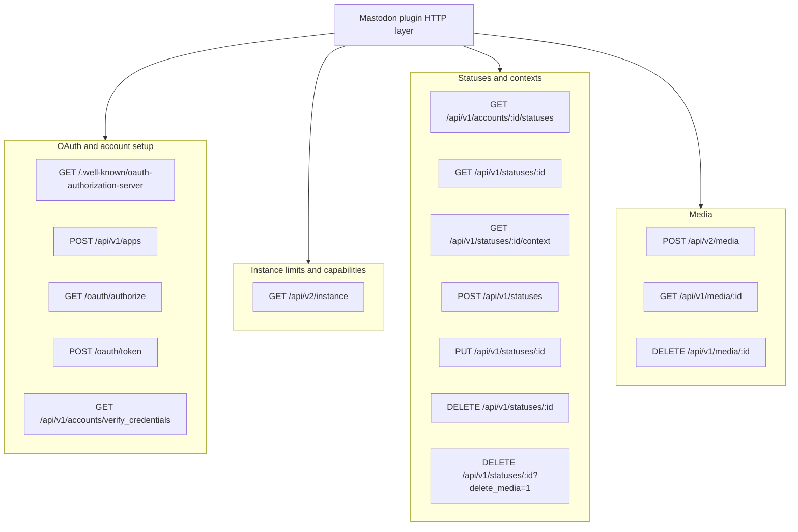

### 3.2 Instance version and capability decisions

`/api/v2/instance` is the central source for instance limits. If a field is missing, the plugin
uses conservative internal defaults. It does not fall back to `/api/v1/instance`.

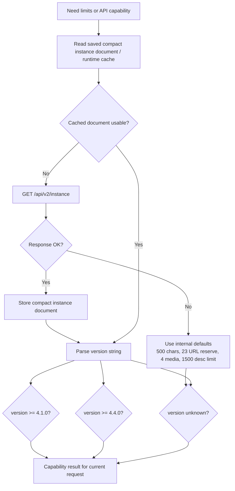

### 3.3 OAuth scope compatibility

The OAuth scope path prefers modern discovery when available and keeps a legacy fallback for
older Mastodon instances.

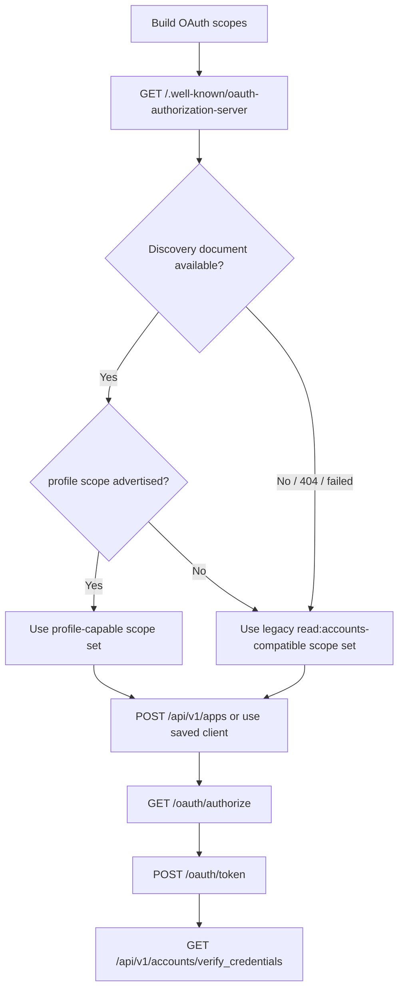

### 3.4 Status deletion fallback for Mastodon before 4.4.0

Mastodon has long supported deleting a status through `DELETE /api/v1/statuses/:id`. The
`delete_media` query parameter is newer. The plugin therefore omits the parameter when a cached
instance version proves that the server is older than 4.4.0, and it retries once without the
parameter when an unknown server rejects the first request.

```mermaid
flowchart TD
    Delete["plugin_mastodon_delete_status(status_id, deleteMedia=true)"]
    Version["plugin_mastodon_instance_supports_status_delete_media"]
    KnownOld{"Cached version says older than 4.4.0?"}
    KnownNew{"Cached version says 4.4.0 or newer?"}
    Unknown{"Version unknown?"}
    PlainFirst["DELETE /api/v1/statuses/:id"]
    WithParam["DELETE /api/v1/statuses/:id?delete_media=1"]
    Response{"Response OK or 404/410 handled by caller?"}
    LegacyError{"400, 405, 422, or error mentioning delete_media?"}
    RetryPlain["Retry once: DELETE /api/v1/statuses/:id"]
    Return["Return final response to deletion sync"]

    Delete --> Version
    Version --> KnownOld
    KnownOld -- "Yes" --> PlainFirst --> Return
    KnownOld -- "No" --> KnownNew
    KnownNew -- "Yes" --> WithParam --> Response
    KnownNew -- "No" --> Unknown
    Unknown -- "Yes" --> WithParam
    Response -- "OK / non-legacy error" --> Return
    Response -- "Failed" --> LegacyError
    LegacyError -- "Yes" --> RetryPlain --> Return
    LegacyError -- "No" --> Return
```

### 3.5 Rate-limit and local budget guard

The plugin protects ordinary web requests and Mastodon servers with a per-run budget and
persistent cross-run windows.

```mermaid
stateDiagram-v2
    [*] --> Idle
    Idle --> GuardStarted: plugin_mastodon_rate_limit_guard_start
    GuardStarted --> RequestAllowed: general request budget available
    RequestAllowed --> RequestAllowed: non-budgeted API request
    RequestAllowed --> MediaWindow: POST /api/v2/media
    RequestAllowed --> DeleteWindow: DELETE status or unreblog
    RequestAllowed --> PageWindow: account statuses page fetch
    MediaWindow --> RequestAllowed: under 24 uploads / 1800s
    DeleteWindow --> RequestAllowed: under 24 deletes / 1800s
    PageWindow --> RequestAllowed: under 300 pages / 900s
    RequestAllowed --> RemoteLimit: HTTP 429 or X-RateLimit-Remaining <= 10
    MediaWindow --> LocalLimit: media window exhausted
    DeleteWindow --> LocalLimit: delete window exhausted
    PageWindow --> LocalLimit: page window exhausted
    RequestAllowed --> RunBudgetExhausted: 240 request budget exhausted
    RemoteLimit --> GuardStopped: stop cleanly with state/log error
    LocalLimit --> GuardStopped: stop cleanly with state/log error
    RunBudgetExhausted --> GuardStopped: stop cleanly with state/log error
    GuardStarted --> GuardStopped: plugin_mastodon_rate_limit_guard_stop
    GuardStopped --> [*]
```

## 4. Scheduled and manual sync flows

### 4.1 Daily scheduled content synchronization

The scheduled content sync is started from the `init` hook. Ordinary POST requests, missing
configuration, active cooldowns, and a not-due scheduler summary all return quickly.

```mermaid
flowchart TD
    Init["init hook"]
    Method{"Request method POST?"}
    Options["Load plugin options"]
    Configured{"Instance URL and access token configured?"}
    Scheduler["Read scheduler-state.json"]
    Due{"plugin_mastodon_sync_due?"}
    Cooldown{"Content sync cooldown active?"}
    Lock["Acquire sync.lock non-blocking"]
    RateGuard["Start API rate/budget guard"]
    FullState["Load full state.json"]
    Protect["Protect locally deleted exported comments"]
    Stats["Reset content_stats and last_error"]
    RemoteToLocal["plugin_mastodon_sync_remote_to_local"]
    LocalToRemote["plugin_mastodon_sync_local_to_remote"]
    FlushSkips["Flush aggregated skip-log summaries"]
    MarkDeletion{"Deletion sync enabled?"}
    Pending["Set deletions_pending and deletions_not_before"]
    Write["Write state and scheduler summary"]
    Release["Release lock and stop rate guard"]
    End["Return to normal FlatPress request"]

    Init --> Method
    Method -- "Yes" --> End
    Method -- "No" --> Options --> Configured
    Configured -- "No" --> End
    Configured -- "Yes" --> Scheduler --> Due
    Due -- "No" --> End
    Due -- "Yes" --> Cooldown
    Cooldown -- "Active" --> End
    Cooldown -- "Clear" --> Lock
    Lock --> RateGuard --> FullState --> Protect --> Stats --> RemoteToLocal --> LocalToRemote --> FlushSkips --> MarkDeletion
    MarkDeletion -- "Yes" --> Pending --> Write
    MarkDeletion -- "No" --> Write
    Write --> Release --> End
```

### 4.2 Follow-up deletion synchronization

The deletion sync is intentionally separate from the content sync. It compares stored mappings
against local files and remote statuses. Local deletions are propagated to Mastodon; remote
deletions are reflected back into FlatPress under the local-write guard.

```mermaid
flowchart TD
    Start["plugin_mastodon_run_deletion_sync"]
    Options["Load options and full state"]
    Enabled{"Deletion sync enabled?"}
    Pending{"Force or deletions_pending?"}
    Due{"Deletion sync due?"}
    Lock["Acquire sync.lock"]
    RateGuard["Start API rate/budget guard"]
    RecheckOnly{"Only pending descendant rechecks?"}
    EntryLoop["Iterate entry mappings with cursor"]
    EntryScope{"Mapping inside sync_start_date?"}
    EntryLocal{"Local entry exists?"}
    DeleteRemoteEntry["Delete remote entry status"]
    EntryLookupWindow{"Remote lookup window allows check?"}
    FetchRemoteEntry["GET /api/v1/statuses/:id"]
    MissingRemoteEntry{"Remote entry missing 404/410?"}
    DeleteLocalEntry["entry_delete under local-write guard"]
    CommentLoop["Iterate comment mappings with cursor"]
    CommentScope{"Mapping inside sync_start_date?"}
    CommentLocal{"Local comment exists?"}
    DeleteRemoteComment["Delete remote comment status"]
    QueueDesc["Queue descendant remote rechecks"]
    CommentLookupWindow{"Remote lookup window allows check?"}
    FetchRemoteComment["GET /api/v1/statuses/:id"]
    MissingRemoteComment{"Remote comment missing 404/410?"}
    DeleteLocalComment["comment_delete under local-write guard"]
    ProcessRechecks["Process pending_comment_remote_rechecks"]
    Complete{"Failures or rate limit?"}
    ClearPending["Clear pending flags and cursors"]
    Retry["Keep deletions_pending with cooldown"]
    Write["Write state and scheduler summary"]

    Start --> Options --> Enabled
    Enabled -- "No" --> ClearPending --> Write
    Enabled -- "Yes" --> Pending
    Pending -- "No" --> Write
    Pending -- "Yes" --> Due
    Due -- "No" --> Write
    Due -- "Yes" --> Lock --> RateGuard --> RecheckOnly
    RecheckOnly -- "No" --> EntryLoop
    EntryLoop --> EntryScope
    EntryScope -- "No" --> CommentLoop
    EntryScope -- "Yes" --> EntryLocal
    EntryLocal -- "No" --> DeleteRemoteEntry --> CommentLoop
    EntryLocal -- "Yes" --> EntryLookupWindow
    EntryLookupWindow -- "No" --> CommentLoop
    EntryLookupWindow -- "Yes" --> FetchRemoteEntry --> MissingRemoteEntry
    MissingRemoteEntry -- "Yes" --> DeleteLocalEntry --> CommentLoop
    MissingRemoteEntry -- "No" --> CommentLoop
    CommentLoop --> CommentScope
    CommentScope -- "No" --> ProcessRechecks
    CommentScope -- "Yes" --> CommentLocal
    CommentLocal -- "No" --> DeleteRemoteComment --> QueueDesc --> ProcessRechecks
    CommentLocal -- "Yes" --> CommentLookupWindow
    CommentLookupWindow -- "No" --> ProcessRechecks
    CommentLookupWindow -- "Yes" --> FetchRemoteComment --> MissingRemoteComment
    MissingRemoteComment -- "Yes" --> DeleteLocalComment --> QueueDesc --> ProcessRechecks
    MissingRemoteComment -- "No" --> ProcessRechecks
    RecheckOnly -- "Yes" --> ProcessRechecks
    ProcessRechecks --> Complete
    Complete -- "No failures" --> ClearPending --> Write
    Complete -- "Failures or rate limit" --> Retry --> Write
```

```mermaid
sequenceDiagram
    autonumber
    participant Del as Deletion sync
    participant State as state.json
    participant Caps as Instance capability cache
    participant API as Mastodon API
    participant Core as FlatPress Core

    Del->>State: Select mapped entry/comment whose local item disappeared
    Del->>Caps: Check cached support for status delete_media
    alt Cached Mastodon version before 4.4.0
        Del->>API: DELETE /api/v1/statuses/:id
    else Cached version 4.4.0 or newer
        Del->>API: DELETE /api/v1/statuses/:id?delete_media=1
    else Version unknown
        Del->>API: DELETE /api/v1/statuses/:id?delete_media=1
        alt Server rejects delete_media as legacy parameter
            Del->>API: DELETE /api/v1/statuses/:id
        end
    end
    API-->>Del: OK, 404/410 already gone, or failure
    Del->>State: Update mapping/tombstone/cursor or keep pending for retry

    Del->>API: GET /api/v1/statuses/:id for still-local mapped item
    alt Remote missing
        Del->>Core: entry_delete/comment_delete under local-write guard
        Del->>State: Queue descendant rechecks and tombstones when needed
    end
```

### 4.3 Manual full synchronization in the admin area

Manual admin runs are repair paths. They intentionally load the full state and can bypass the
scheduled due check, but they still use the lock, rate-limit guard, and persisted budgets.

```mermaid
sequenceDiagram
    autonumber
    actor Admin as FlatPress admin
    participant AdminUI as Mastodon admin panel
    participant Plugin as Mastodon Plugin
    participant State as state.json
    participant Core as FlatPress Core
    participant API as Mastodon API

    Admin->>AdminUI: Press Run now or Run full synchronization
    AdminUI->>Plugin: plugin_mastodon_run_sync(true, fullWindow)
    Plugin->>State: Load full state.json
    Plugin->>Plugin: Bypass scheduled due/cooldown because force=true
    Plugin->>Plugin: Acquire sync.lock and start rate-limit guard
    Plugin->>API: Verify credentials and fetch instance/status/context data
    Plugin->>Core: Import/update entries/comments under local-write guard
    alt Full window requested
        Plugin->>Plugin: Parse every local entry as repair path
    else Manual non-full run
        Plugin->>Plugin: Use configured window plus dirty candidates
    end
    Plugin->>API: Create/update statuses and replies
    Plugin->>State: Update mappings, content_stats, scheduler summary
    Plugin-->>AdminUI: Return result and diagnostics

    Admin->>AdminUI: Press Run deletion synchronization
    AdminUI->>Plugin: plugin_mastodon_run_deletion_sync(true)
    Plugin->>State: Load full state.json
    Plugin->>Plugin: Ignore not-before cooldown because force=true
    Plugin->>API: Delete remote statuses for local deletions with delete_media fallback
    Plugin->>Core: Delete local entries/comments under local-write guard when remote disappeared
    Plugin->>State: Update tombstones, cursors, deletion_stats
    Plugin-->>AdminUI: Return deletion result
```

### 4.4 Admin UI diagnostics

The admin panel intentionally surfaces operational state so maintainers can distinguish missing
credentials, stale instance information, rate-limit stops, and content/deletion sync failures.

```mermaid
flowchart TD
    AdminAssign["plugin_mastodon_admin_assign"]
    Options["Load options and normalize instance URL"]
    State["Load state.json"]
    Scheduler["Load scheduler-state.json"]
    Instance["Build instance info rows"]
    OAuth["Evaluate registration, OAuth and scope status"]
    Plugins["Detect companion plugin status"]
    Content["Expose content_stats and last_run_local"]
    Deletion["Expose deletion_stats, deletions_pending, last_deletion_run_local"]
    Errors["Expose last_error and log hints"]
    Template["admin.plugin.mastodon.tpl"]

    AdminAssign --> Options --> State
    AdminAssign --> Scheduler
    Options --> Instance
    Options --> OAuth
    AdminAssign --> Plugins
    State --> Content
    State --> Deletion
    State --> Errors
    Scheduler --> Content
    Scheduler --> Deletion
    Instance --> Template
    OAuth --> Template
    Plugins --> Template
    Content --> Template
    Deletion --> Template
    Errors --> Template
```

## 5. Core post-success hooks, dirty tracking, and local-write guard

The current design depends on post-success hooks in the FlatPress core. These hooks fire after
a write or delete operation has succeeded. The Mastodon plugin uses them to queue local manual
changes instead of rediscovering every old change by scanning the whole archive daily.

```mermaid
flowchart TD
    subgraph Core["FlatPress core"]
        EntrySave["entry_save succeeds"]
        EntrySaved["do_action entry_saved"]
        EntryDelete["entry_delete succeeds"]
        EntryDeleted["do_action entry_deleted"]
        CommentSave["comment_save succeeds"]
        CommentSaved["do_action comment_saved"]
        CommentDelete["comment_delete succeeds"]
        CommentDeleted["do_action comment_deleted"]
    end

    subgraph Plugin["Mastodon plugin hook handlers"]
        Guard{"plugin_mastodon_local_write_guard_active?"}
        EntryDirty["plugin_mastodon_on_entry_saved sets dirty_entries when needed"]
        EntryDeletion["plugin_mastodon_on_entry_deleted sets deletions_pending when mapped"]
        CommentDirty["plugin_mastodon_on_comment_saved sets dirty_comments or queues parent entry"]
        CommentDeletion["plugin_mastodon_on_comment_deleted sets deletions_pending when mapped"]
        StateWrite["Write compact state.json and scheduler-state.json"]
        Stop["Ignore hook to avoid false dirty/deletion markers"]
    end

    EntrySave --> EntrySaved --> Guard
    EntryDelete --> EntryDeleted --> Guard
    CommentSave --> CommentSaved --> Guard
    CommentDelete --> CommentDeleted --> Guard

    Guard -- "Yes, plugin-owned remote import/delete" --> Stop
    Guard -- "No, local manual entry save" --> EntryDirty --> StateWrite
    Guard -- "No, local manual entry deletion" --> EntryDeletion --> StateWrite
    Guard -- "No, local manual comment save" --> CommentDirty --> StateWrite
    Guard -- "No, local manual comment deletion" --> CommentDeletion --> StateWrite
```

```mermaid
stateDiagram-v2
    [*] --> LocalManualChange
    [*] --> PluginOwnedWrite

    LocalManualChange --> DirtyEntry: entry_saved mapped and changed
    LocalManualChange --> DirtyComment: comment_saved mapped or parent pending
    LocalManualChange --> DeletionPending: mapped entry/comment deleted
    DirtyEntry --> ScheduledOrManualSync
    DirtyComment --> ScheduledOrManualSync
    DeletionPending --> FollowUpDeletionSync

    PluginOwnedWrite --> GuardEntered: plugin_mastodon_local_write_guard_enter
    GuardEntered --> CoreWrite: entry_save/comment_save/entry_delete/comment_delete
    CoreWrite --> HookFired: FlatPress post-success hook fires
    HookFired --> Ignored: guard active
    Ignored --> GuardLeft: plugin_mastodon_local_write_guard_leave
    GuardLeft --> AuthoritativeMappingUpdate

    ScheduledOrManualSync --> [*]
    FollowUpDeletionSync --> [*]
    AuthoritativeMappingUpdate --> [*]
```

## 6. Error handling and partial-failure strategy

A sync run may partially succeed. The plugin therefore distinguishes API failure, local
rate-limit stops, missing remote objects, and state-write failures.

```mermaid
flowchart TD
    Operation["Sync operation"]
    API["Mastodon API call"]
    Response{"Response category"}
    OK["OK: update mapping/statistics"]
    Missing["404/410: treat remote object as missing where caller allows it"]
    RemoteLimit["429 or X-RateLimit floor reached"]
    LegacyFallback["Legacy compatibility fallback, e.g. retry delete without delete_media"]
    HardFailure["Hard failure: keep dirty/pending marker"]
    UploadFailure["Status failed after media upload"]
    Cleanup["Best-effort cleanup uploaded media"]
    StateWrite["Write compact state.json and scheduler summary"]
    StateOK{"State write succeeded?"}
    LastError["Set last_error and log diagnostics"]
    Retry["Keep cooldown/pending marker for future run"]

    Operation --> API --> Response
    Response -- "2xx" --> OK --> StateWrite
    Response -- "404/410 in lookup/delete context" --> Missing --> StateWrite
    Response -- "429 / local budget stop" --> RemoteLimit --> LastError --> Retry
    Response -- "legacy delete_media rejection" --> LegacyFallback --> API
    Response -- "other error" --> HardFailure --> LastError --> Retry
    HardFailure --> UploadFailure
    UploadFailure -- "new unattached uploads exist" --> Cleanup --> Retry
    StateWrite --> StateOK
    StateOK -- "Yes" --> Operation
    StateOK -- "No" --> LastError
```

## 7. Simulation and regression-test architecture

`simulate_mastodon_plugin.php` loads the real plugin code from the checked-out tree. It replaces
the external Mastodon side with deterministic fixtures and mock HTTP responses so the regression
suite can verify state transitions, API requests, media handling, and edge-case conversion logic.

```mermaid
flowchart TD
    Script["simulate_mastodon_plugin.php"]
    OutputMode{"--summary or SIMULATE_MASTODON_SUMMARY=1?"}
    VerboseOutput["Verbose per-test details"]
    SummaryOutput["Compact per-test details"]
    SandboxPolicy{"Include live fp-content/content?"}
    MinimalSandbox["Create sandbox without live fp-content/content"]
    LiveSandbox["Explicit live-content smoke sandbox"]
    EmptyContent["Create empty fp-content/content"]
    CoreStubs["Load FlatPress includes and test helpers"]
    Plugin["require fp-plugins/mastodon/plugin.mastodon.php"]
    Fixtures["Create deterministic entries, comments, media files, options, and state fixtures"]
    HTTPQueue["Mock Mastodon HTTP response queue"]
    RunSync["Call real plugin sync/deletion functions"]
    Assertions["test_result / test_warn / test_skip assertions"]
    CompactWrite["Assert state.json compact-write roundtrip"]
    SmallState["Always-on 300x10 scheduler-state regression"]
    MemoryGuard["Check memory before building 3000x10 state"]
    CIRaise["CI: try to raise memory_limit to 384M"]
    LargeState["Run 3000x10 scheduler-state regression"]
    Warn["Shared-host low memory: emit WARN"]
    Skip["CI cannot raise memory: emit SKIP"]
    InspectState["Inspect state.json, scheduler-state.json, files, and captured API calls"]
    FinalSummary["Always print Exit-code and OK/FAIL/WARN/SKIP counters"]
    OptionalLive["Optional --live-auth credentials smoke test"]
    Cleanup["Delete temporary sandbox"]

    Script --> OutputMode
    OutputMode -- "No" --> VerboseOutput --> SandboxPolicy
    OutputMode -- "Yes" --> SummaryOutput --> SandboxPolicy
    SandboxPolicy -- "default" --> MinimalSandbox --> EmptyContent --> CoreStubs
    SandboxPolicy -- "--include-live-content or env flag" --> LiveSandbox --> CoreStubs
    CoreStubs --> Plugin --> Fixtures
    Fixtures --> HTTPQueue --> RunSync --> Assertions
    Assertions --> CompactWrite --> SmallState --> MemoryGuard
    MemoryGuard -- "enough memory" --> LargeState --> InspectState
    MemoryGuard -- "CI + low limit" --> CIRaise
    CIRaise -- "raised" --> LargeState
    CIRaise -- "not raised" --> Skip --> InspectState
    MemoryGuard -- "non-CI low limit" --> Warn --> InspectState
    Assertions --> InspectState --> FinalSummary --> Cleanup
    Script -. "only when explicitly requested" .-> OptionalLive
```

The simulation sandbox deliberately excludes live `fp-content/content` in the default regression run. It still copies configuration and plugin files, creates an empty content directory, and then seeds deterministic fixtures. This prevents production-like 3000x10 blogs from spending most of the request copying and deleting live entries/comments before the first assertion. Explicit live-content smoke coverage remains available with `--include-live-content` or `SIMULATE_MASTODON_INCLUDE_LIVE_CONTENT=1`.

The output mode is independent of the assertions. Normal output keeps full details for one-file diagnostics. Summary output can be requested with `--summary` or `SIMULATE_MASTODON_SUMMARY=1`; it keeps the status and test name, but collapses verbose details to short text or JSON key summaries. Both output modes always end with the same counter block: `Exit-code`, `[OK]`, `[FAIL]`, `[WARN]`, and `[SKIP]`.

The compact-state regression first verifies that legacy pretty-printed `state.json` files remain readable and that new `state.json` writes are compact JSON while preserving all mapping queues. The large `3000x10` scheduler-state regression is intentionally guarded before its synthetic state is built. On 128 MiB shared-hosting-style PHP limits, the large PHP array plus full JSON string can exhaust memory before the compact scheduler-state behavior is reached. The smaller `300x10` state test always runs; the heavy test runs when memory is sufficient, warns in low-memory non-CI environments, and is skipped in CI only after an attempted memory-limit raise fails. The CI skip branch can be tested deterministically with `SIMULATE_MASTODON_DISABLE_MEMORY_RAISE=1`.

## 8. Operational guarantees and intentional behavior

```mermaid
flowchart TD
    Goal["Large FlatPress archive"]
    OrdinaryRequest["Ordinary frontend GET"]
    ScheduledRun["Scheduled content sync"]
    DeletionRun["Follow-up deletion sync"]
    ManualRun["Manual full admin sync"]
    SchedulerOnly["Uses compact scheduler-state.json first"]
    TargetedScan["Scans active window plus dirty entries/comments"]
    FullStateNeeded["Loads full state.json because mappings are required"]
    FullRepair["Full repair scan remains available"]
    Budgets["Local budgets and Mastodon rate-limit headers stop safely"]
    NoFalseDirty["Local-write guard prevents plugin-owned writes from becoming local dirty markers"]
    Compatibility["Mastodon >= 4.0.0 path with documented delete_media fallback for older than 4.4.0"]

    Goal --> OrdinaryRequest --> SchedulerOnly
    Goal --> ScheduledRun --> TargetedScan
    Goal --> DeletionRun --> FullStateNeeded
    Goal --> ManualRun --> FullRepair
    ScheduledRun --> Budgets
    DeletionRun --> Budgets
    ManualRun --> Budgets
    ScheduledRun --> NoFalseDirty
    DeletionRun --> NoFalseDirty
    ManualRun --> NoFalseDirty
    DeletionRun --> Compatibility
```

Key implications for developers:

- Scheduled content syncs are optimized for large blogs by using direct `YY/MM` month scans bound to the admin-selected
  7/14/30-day window, plus uncapped mandatory post-success dirty-entry and dirty-comment-parent candidates.
- Manual full syncs deliberately remain exhaustive and should not be replaced by dirty queues.
- Deletion syncs need the full mapping state because they compare local existence with remote
  status existence and maintain tombstones and descendant rechecks.
- Status deletion uses `delete_media=1` only when it is supported or plausibly supported, and
  falls back to plain `DELETE /api/v1/statuses/:id` for older Mastodon behavior.
- Companion plugins improve rendering and feature completeness, but the Mastodon plugin still
  stores importable FlatPress markup even when a companion renderer is currently inactive.
