# 06 — Process Flows

## Scope and important state files

The plugin keeps a compact scheduler layer and a full synchronization layer.

- `fp-content/plugin_mastodon/scheduler-state.json` is the compact scheduler summary used on
  ordinary requests. It tells the plugin whether a scheduled content sync or a follow-up
  deletion sync is due without loading the full mapping state.
- `fp-content/plugin_mastodon/state.json` is the compact main synchronization index. It contains
  entry mappings, reverse remote maps, dirty queues, tombstones, media metadata, cursors,
  statistics, last-error information and `comment_shards` metadata. New writes keep inline
  `comments` empty.
- `fp-content/plugin_mastodon/state-comments/YY/MM/entry*.json` stores high-volume comment
  mappings per parent entry. Legacy inline comment states are backed up and migrated on the next
  state read that detects inline comments.
- `sync.lock` serializes real content/deletion sync runs.
- `sync.guard.json` stores short cooldown markers for content and deletion runs; when APCu is active, the same guard key suffix is stored, fetched, and deleted through FlatPress `core.apcu.php` wrappers.
- `rate-limit-windows.json` stores persistent cross-request windows for media uploads,
  status deletes, and status-page fetches.
- `sync.log` plus rotated `sync.log.1` to `sync.log.3` stores operational diagnostics.
- `fp-content/plugin_mastodon/profile/profile.json` plus `profile/avatar.*` stores public profile-widget data and the local avatar cache. It contains no access token, client secret or authorization header.

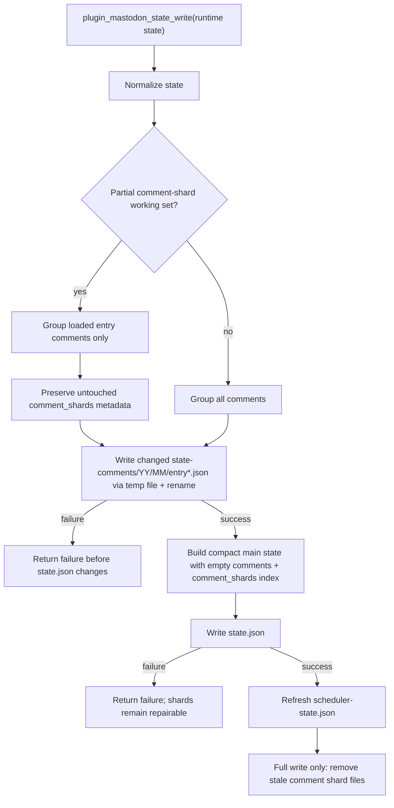

Partial state reads are used when a caller knows the affected entry ids. The write path preserves
unloaded shards so a dirty-comment hook or one local-sync entry cannot accidentally delete other
comment mappings. Full maintenance paths can still load every shard explicitly after acquiring
the synchronization lock.

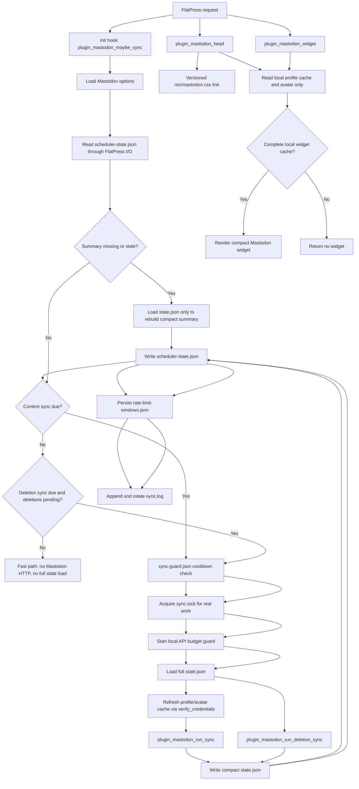

### Compact profile widget cache flow

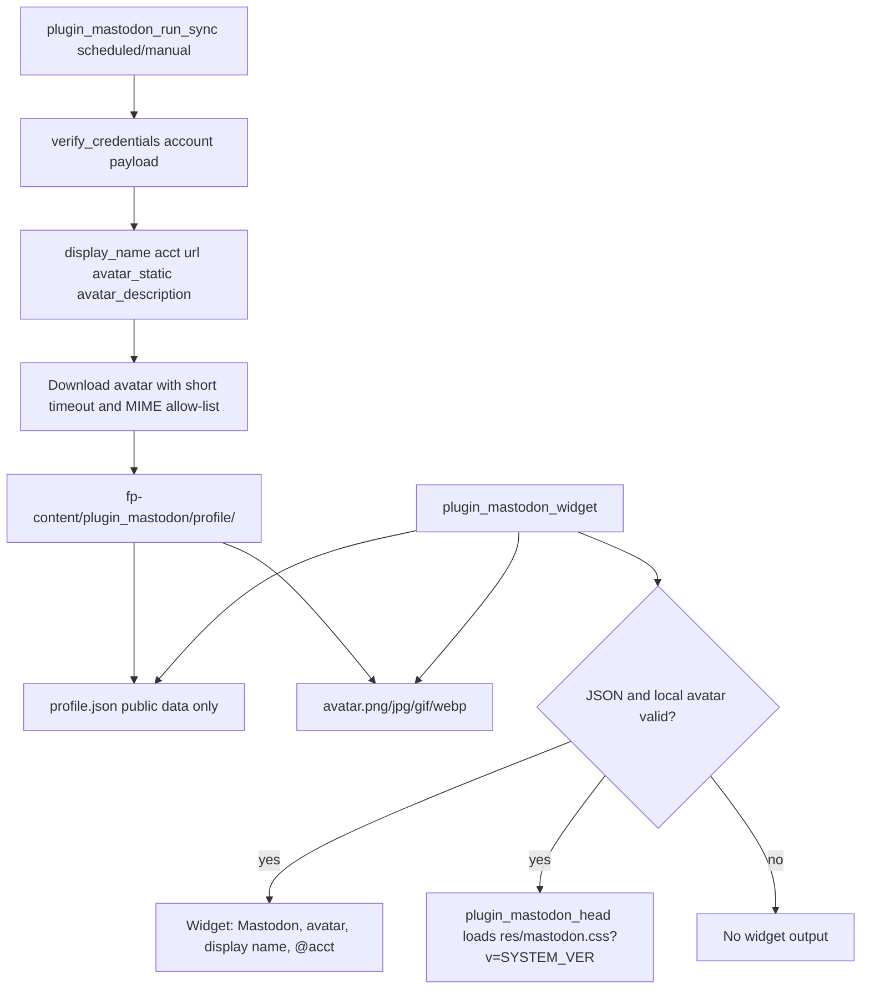

The widget render path must remain local-cache-only. Cache refresh belongs to `plugin_mastodon_run_sync()` and account verification work that already talks to Mastodon; ordinary theme/sidebar rendering only reads the JSON and local avatar file. Scheduled, manual and one-way/export-only content syncs therefore check profile/avatar changes before import/export work, while `plugin_mastodon_head()` performs the equally cheap local-cache check and emits the versioned `res/mastodon.css` link when the widget can render. The widget HTML itself contains no inline stylesheet. Missing or incomplete data is treated as a clean "no widget" condition so CMS response time does not depend on Mastodon availability.

### Full state schema and mapping lifecycle

The full state is not just a cache. It is the durable reconciliation layer between FlatPress
file IDs and Mastodon status IDs.

```mermaid
flowchart TD
    State["state.json"]

    subgraph ForwardMaps["Forward mappings"]
        Entries["entries[entry_id]<br/>local entry -> remote top-level status"]
        Comments["comments[entry_id/comment_id]<br/>local comment -> remote reply status"]
        RemoteMedia["remote_media / media signatures<br/>stored media IDs and alt-text state"]
    end

    subgraph ReverseMaps["Reverse mappings"]
        EntriesRemote["entries_remote[remote_status_id]<br/>remote status -> local entry"]
        CommentsRemote["comments_remote[remote_status_id]<br/>remote reply -> local comment"]
    end

    subgraph WorkQueues["Work queues and cursors"]
        DirtyEntries["dirty_entries"]
        DirtyComments["dirty_comments"]
        CommentOptins["comment_reply_optins"]
        PendingRechecks["pending_comment_remote_rechecks"]
        EntryCursor["deletion_cursor_entries"]
        CommentCursor["deletion_cursor_comments"]
        OldThreadCursor["old_thread_context_cursor"]
        NotificationCursor["last_remote_notification_id"]
    end

    subgraph Safety["Safety and accounting"]
        Tombstones["comment_tombstones"]
        ProtectedDeletes["protected local deleted exported comments"]
        ImportedIgnores["locally deleted imported remote replies"]
        ContentStats["content_stats"]
        DeletionStats["deletion_stats"]
        LastError["last_error"]
    end

    State --> ForwardMaps
    State --> ReverseMaps
    State --> WorkQueues
    State --> Safety
    Entries <--> EntriesRemote
    Comments <--> CommentsRemote
    DirtyEntries --> Entries
    DirtyComments --> Comments
    PendingRechecks --> CommentsRemote
    Tombstones --> CommentsRemote
    ImportedIgnores --> Tombstones
    RemoteMedia --> Entries
```

## Comment author link target decision

Imported Mastodon replies are rendered as FlatPress comments. The comment author link target decision is deliberately separate from the import path: the importer stores the Mastodon profile URL from `account.url`, while `fp-interface/themes/leggero/comments.tpl` asks `modifier.is_external_url.php` whether that URL leaves the configured blog. The modifier can rely on `BLOG_BASEURL`/`BLOG_ROOT` because `defaults.php` loads `core.connection.php` before Smarty registers and executes the modifier.

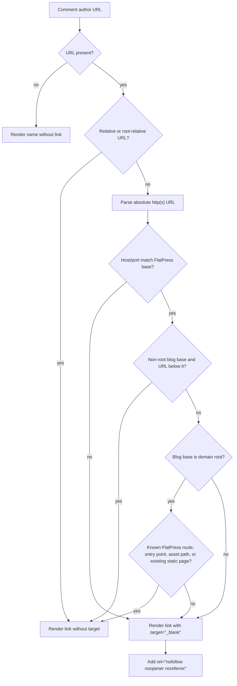

Relative URL or configured blog-base match? Those URLs remain in the current tab because they stay inside the FlatPress blog. Absolute `http` or `https` URLs outside the configured blog base, including external Mastodon profile URLs, open in a new browser tab/window and receive `noopener`/`noreferrer`. When the configured blog base is the domain root, unknown same-host root paths are treated as external unless they match known FlatPress routes, FlatPress entry points, FlatPress-owned asset directories or an existing static page.

## 1. Bidirectional content synchronization and optional one-way mode

The optional `disable_remote_import` setting is an explicit direction gate: FlatPress-to-Mastodon export and local-deletion propagation continue, but Mastodon responses must not create, update or delete FlatPress entries/comments. The separate `disable_comment_reply_sync` setting is narrower: entry synchronization continues, while FlatPress comments, Mastodon replies, reply notifications/contexts and reply deletion follow-ups are skipped.

### 1.0 Admin UI direction gate

The admin page mirrors the same direction gate. In one-way mode it hides Mastodon-to-FlatPress import controls, `read:notifications` hints, import-only/local-write counters and import-only companion diagnostics, but keeps export, OAuth, instance, token, state-maintenance, deletion-sync output and export helper diagnostics visible. The save handler preserves hidden import options from the previous configuration so switching back to bidirectional mode restores them unchanged.

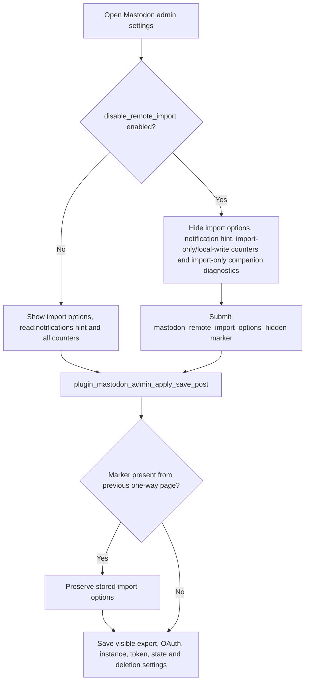

### 1.0a Comment/reply synchronization gate

The `disable_comment_reply_sync` option is checked before every fachliche Grenze that can create, import, update or delete a comment/reply. It is deliberately independent of the one-way gate: in one-way mode it disables the remaining FlatPress-comment-to-Mastodon export; in bidirectional mode it disables both comment/reply directions.

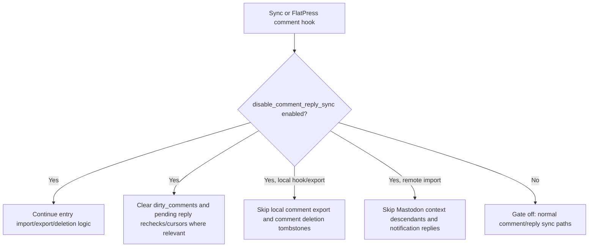

### 1.0b Visitor opt-in for FlatPress comment-to-Mastodon reply export

The `{comment_mastodon}` Smarty hook is a narrow template bridge. The Mastodon plugin decides whether the notice is needed from the comment/reply synchronization gate, not from the current token state. That allows a visitor approval to be captured even before Mastodon credentials are completed. Missing approval does not reject the local FlatPress comment; it only prevents later Mastodon/Fediverse publication. If CommentCenter holds a visitor comment for moderation, `commentcenter_comment_logged` stores the opt-in grant before the later admin approval writes the final comment. Authenticated FlatPress comments receive an authenticated state grant only when the stored comment payload carries FlatPress's `LOGGEDIN` marker. A current admin session alone is not enough, because CommentCenter can publish visitor comments while an administrator is logged in.

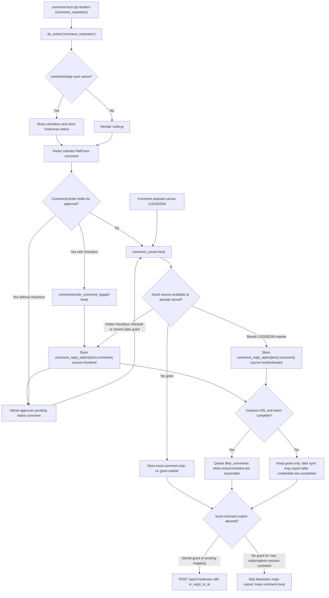

### 1.1 FlatPress entry candidate selection and dirty decision

A local FlatPress entry is exported as a Mastodon top-level status only when it is inside the
active synchronization window, when a post-success hook queued it as dirty, or when a manual
full sync intentionally scans all entries.

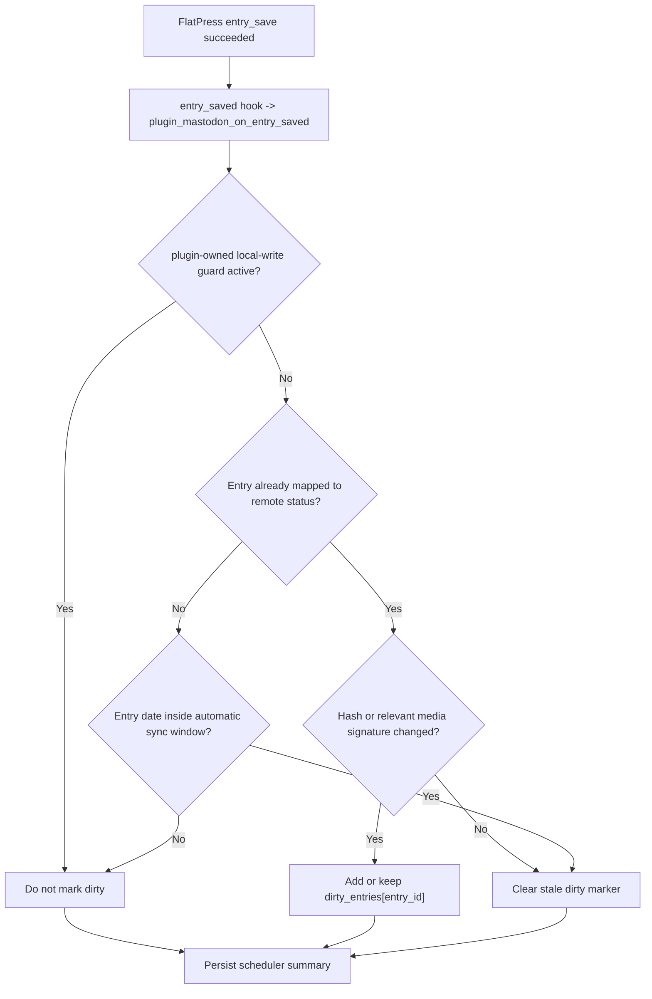

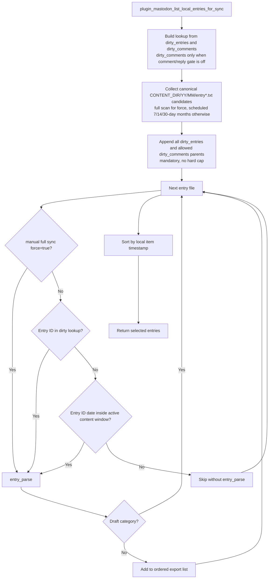

The collector reads only canonical FlatPress `YY/MM/entry*.txt` files directly from month directories. Manual full syncs scan all canonical months. Scheduled/non-full syncs scan only months that can intersect the admin-selected 7/14/30-day active content window and then append every canonical parent entry from `dirty_entries` and `dirty_comments`. Dirty candidates are mandatory and intentionally have no simple three-item hard cap; a future throttle would need a persisted rotating cursor, logging and a full-sync bypass. Local comments are still evaluated later per selected parent entry via the comment-listing path, so entry-like files below comment storage must not inflate the local entry candidate set.

### 1.2 FlatPress entry to Mastodon status

The export path builds text, tags, media IDs, and update metadata before it decides between
`POST /api/v1/statuses` and `PUT /api/v1/statuses/:id`.

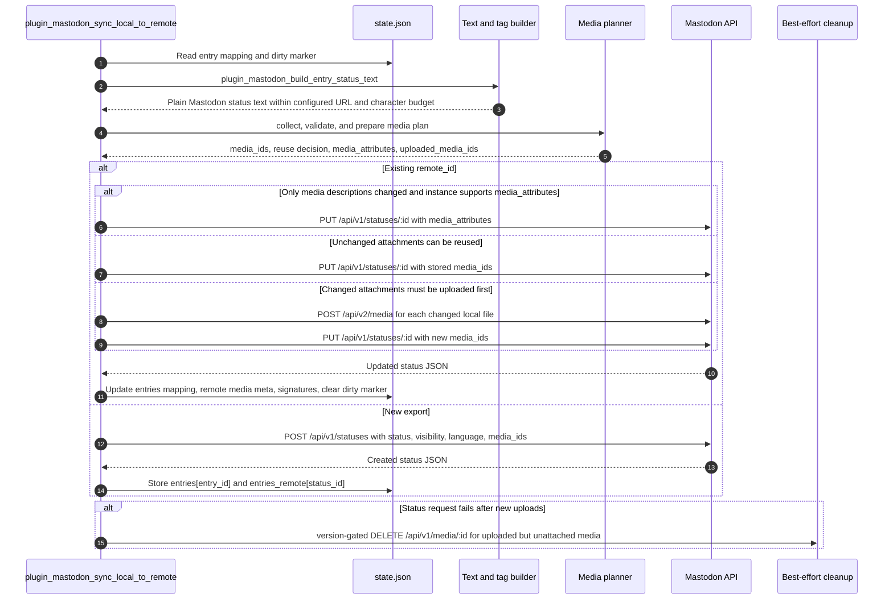

### 1.3 FlatPress comment and comment reply export

FlatPress comments are exported only when `disable_comment_reply_sync` is off and after the parent entry has a remote status mapping. Nested
comment replies are delayed until their local parent comment has a remote mapping. A fresh unmapped
comment inside the active scheduled content window is persisted as `dirty_comments` when its old
parent entry is already mapped, so automatic and normal manual sync can load just that parent shard
instead of scanning all old comment folders.

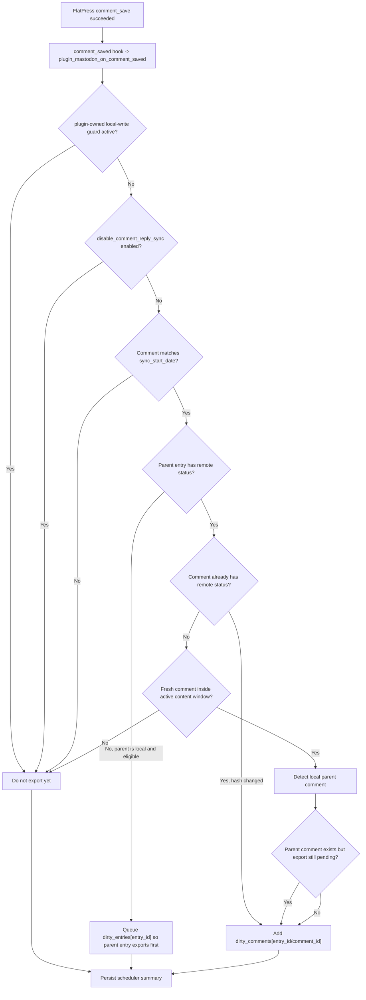

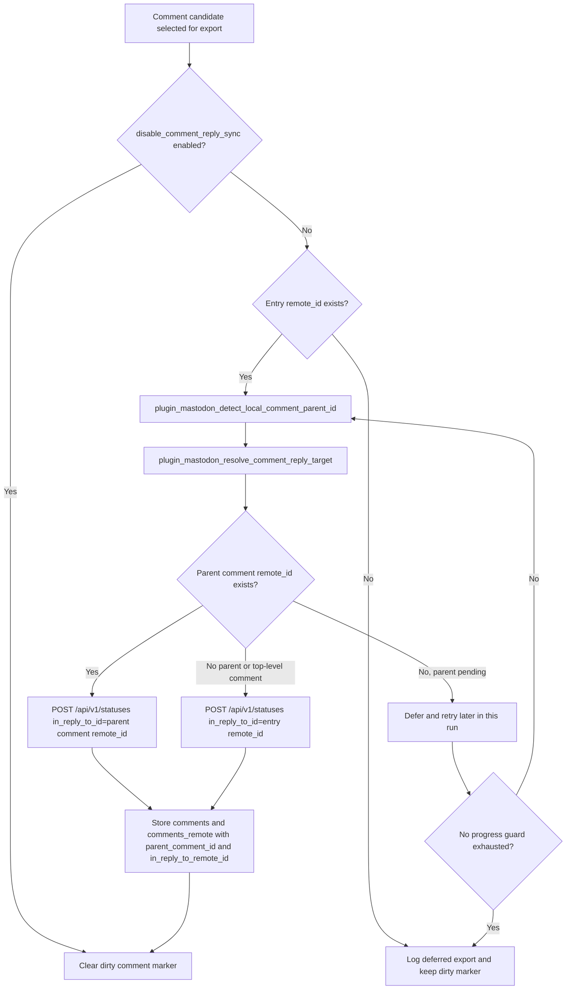

### 1.4 Mastodon top-level status to FlatPress entry

The remote-to-local path imports top-level statuses owned by the configured Mastodon account,
filters them by visibility/window/source, converts HTML to FlatPress markup, imports remote
media, and writes through the local-write guard. On Mastodon 4.6/API-v10 instances the account
status request is additionally hardened with `exclude_direct=true`; compatible-server rejections
are retried once without the optional parameter, and older or unknown instance snapshots keep
the legacy query. In explicit one-way mode, this phase returns before import-specific account-status
paging or local FlatPress writes happen. The separate `plugin_mastodon_run_sync()` profile-cache
refresh has already verified the account and refreshed the local avatar/profile cache when possible.

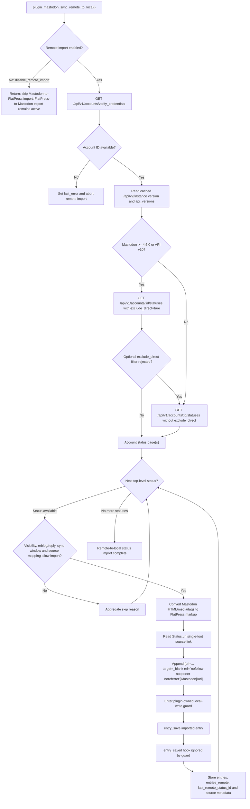

The imported entry footer uses `Status.url`, which is the Mastodon single-status/toot URL, not the author `account.url`. `plugin_mastodon_imported_status_footer_bbcode()` adds `target="_blank"` and `rel="nofollow noopener noreferrer"` through FlatPress BBCode URL attributes; comment author links use the separate external-URL modifier path.

### 1.5 Mastodon replies in a known imported thread to FlatPress comments

After importing or refreshing a known entry status, the plugin fetches the Mastodon context and
walks descendants. This path must avoid resurrecting locally deleted comments, including `source=remote` replies tombstoned by the FlatPress admin and exported `source=local` replies waiting for remote deletion, must not break thread order, and must cope with temporarily unresolved parents. The normal delete hook is the primary protection. The import boundary is an independent repair guard: it resolves `comments_remote[remoteId]`, loads only that referenced comment shard and creates `local_deleted_pending_remote_delete` when the exported local file is missing. When `disable_remote_import` or `disable_comment_reply_sync` is enabled, this context path is skipped together with the rest of the remote reply/comment import path.

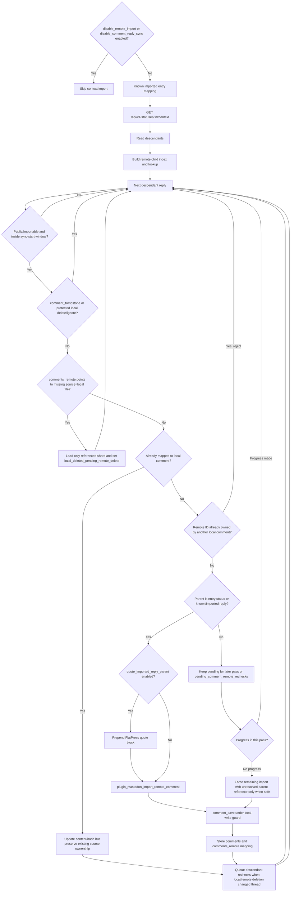

### 1.5 Notification reply-hint pass

The notification pass is optional and runs only when old-thread reply checks are enabled, `disable_remote_import` is off, `disable_comment_reply_sync` is off, and the
current stored OAuth scope set contains `read:notifications`. Direct mapped-parent notifications
are imported without a context request. Unresolved notification replies can spend the same
admin-configured old-thread context budget that normal rotation would otherwise use.

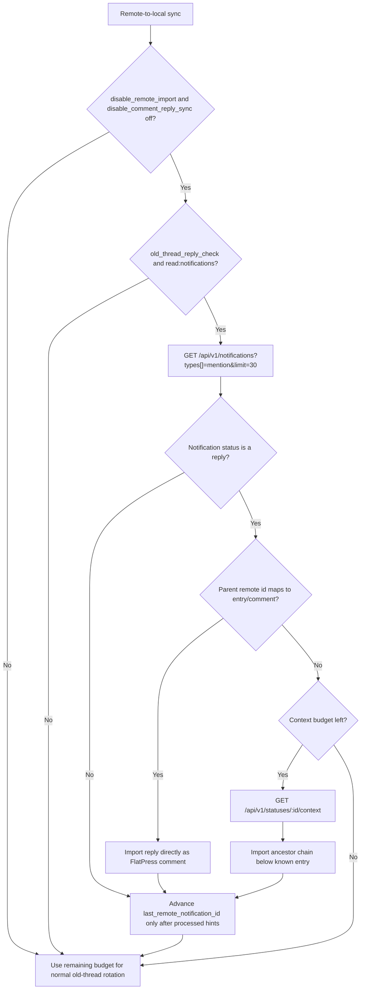

## 2. Text, URLs, tags, media, and companion plugins

### 2.1 Local-to-remote status-text pipeline

The status-text builder intentionally keeps Mastodon-visible length calculation separate from
FlatPress storage. Mastodon counts each URL as the instance's configured URL budget.

```mermaid
flowchart LR
    Source["FlatPress entry or comment body"]
    StripMeta["Strip local-only metadata<br/>draft/category/tag BBCode where needed"]
    BBCode["Flatten or convert supported BBCode"]
    MediaRefs["Remove media-only markup from plain text"]
    Links["Normalize public URLs and link text"]
    Emoji["Convert FlatPress emoticons or keep shortcode-safe text"]
    Tags["Extract and normalize FlatPress tags"]
    Footer["Build plugin-owned hashtag footer"]
    Join["Join body and footer"]
    InstanceLimits["Load /api/v2/instance limits<br/>max_characters and URL reserved length"]
    Budget["plugin_mastodon_status_text_length"]
    Truncate["plugin_mastodon_limit_status_text"]
    Result["Mastodon status text"]

    Source --> StripMeta --> BBCode --> MediaRefs --> Links --> Emoji --> Tags --> Footer --> Join
    Join --> InstanceLimits --> Budget
    Budget --> Truncate --> Result
```

### 2.2 Remote-to-local HTML and BBCode pipeline

Remote Mastodon content arrives as HTML. The plugin converts only the safe and supported
structures into FlatPress markup and then appends imported media markup.

```mermaid
flowchart LR
    HTML["Mastodon status.content HTML"]
    DOM["DOMDocument-based parsing with fallback cleanup"]
    Blocks["p, br, blockquote, pre, code, ul, ol, li"]
    Links["a tags -> FlatPress URL markup or plain URL"]
    Mentions["mentions and hashtags preserved as text/links"]
    Invisible["Mastodon invisible/ellipsis spans cleaned"]
    Emoji["custom emoji shortcode/text handling"]
    Cleanup["Final whitespace and round-trip cleanup"]
    Media["Append imported media BBCode"]
    Tags["Append [tag] metadata when Tag plugin is active"]
    Result["FlatPress entry/comment content"]

    HTML --> DOM --> Blocks --> Links --> Mentions --> Invisible --> Emoji --> Cleanup
    Cleanup --> Media --> Tags --> Result
```

### 2.3 Local media collection, validation, and Mastodon media-family selection

The plugin scans entries for image, gallery, audio, and video markup, then validates the
corresponding files against instance capabilities and internal budgets. The collector keeps
all recognized local media candidates, but the export planner selects only one media family
before upload because Mastodon accepts either multiple images or one audio/video attachment
per status.

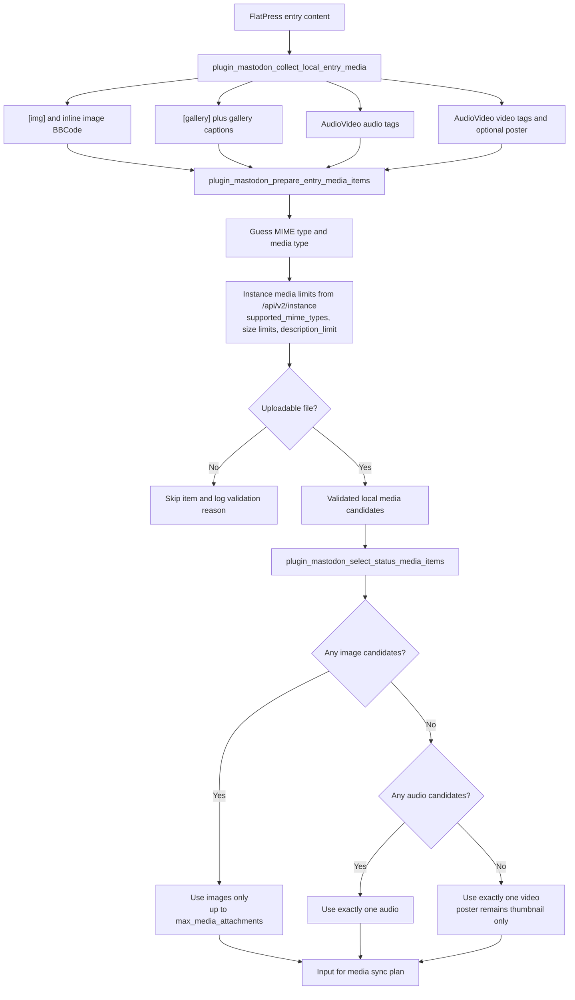

Selection priority is deterministic: images first, otherwise audio, otherwise video. Skipped
media are logged and counted in the media plan; they do not make the sync fail.

### 2.4 Media reuse, upload, update, and cleanup lifecycle

The media plan receives the selected Mastodon-compatible media family, then decides whether existing remote IDs can be reused, whether alt text can be
updated in place through `media_attributes`, or whether files must be uploaded again. Attachment and description signatures are based on the selected media set.

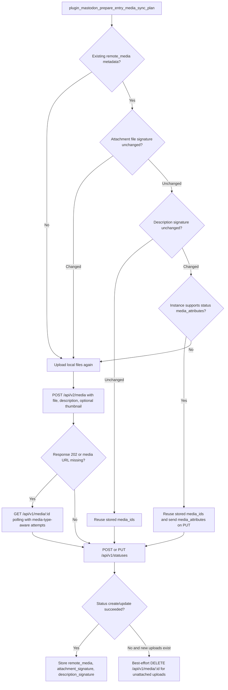

```mermaid
sequenceDiagram
    autonumber
    participant Plugin as Mastodon Plugin
    participant API as Mastodon API
    participant State as state.json

    Plugin->>API: POST /api/v2/media
    alt Media is processed synchronously
        API-->>Plugin: 200 with media URL
    else Media is processed asynchronously
        API-->>Plugin: 202 with ID and pending URL
        loop Until ready or attempts exhausted
            Plugin->>API: GET /api/v1/media/:id
            API-->>Plugin: 206 pending, 200 ready, or error
        end
    end
    Plugin->>API: POST or PUT /api/v1/statuses with media_ids
    alt Status write succeeds
        Plugin->>State: Persist media IDs and signatures
    else Status write fails after upload
        Plugin->>API: DELETE /api/v1/media/:id for unattached uploads
        Plugin->>State: Keep previous mapping/dirty marker for retry
    end
```

### 2.5 Mastodon media attachments to FlatPress media markup

Remote media import uses a URL fallback order and stores downloaded files in FlatPress-managed
directories before it emits BBCode for the matching companion renderer.

```mermaid
flowchart TD
    RemoteStatus["Remote Mastodon status"]
    Attachments["media_attachments"]
    Classify{"Attachment type"}
    Image["image"]
    Audio["audio"]
    Video["video or gifv"]
    URLFallback["Source URL fallback<br/>url -> remote_url -> preview_url when safe"]
    Download["Download with media transfer timeout"]
    Temp["Write to temporary plugin media directory"]
    ImageStore["Move images to fp-content/images/mastodon/status-ID"]
    AttachStore["Move audio/video to fp-content/attachs/mastodon/status-ID"]
    Captions["Write .captions.conf for gallery descriptions"]
    ImageMarkup{"Image count"}
    ImgTag["Single [img] with width and title"]
    GalleryTag["[gallery] with width and captions"]
    AudioTag["AudioVideo audio player BBCode with controls/description"]
    VideoTag["AudioVideo video player BBCode with controls/poster/description"]
    Content["Append imported media BBCode to entry or comment"]

    RemoteStatus --> Attachments --> Classify
    Classify -- "image" --> Image --> URLFallback --> Download --> Temp --> ImageStore --> Captions --> ImageMarkup
    ImageMarkup -- "one" --> ImgTag --> Content
    ImageMarkup -- "many" --> GalleryTag --> Content
    Classify -- "audio" --> Audio --> URLFallback --> Download --> Temp --> AttachStore --> AudioTag --> Content
    Classify -- "video/gifv" --> Video --> URLFallback --> Download --> Temp --> AttachStore --> VideoTag --> Content
```

### 2.6 Tags and hashtags when the FlatPress Tag plugin is active

When the Tag plugin is active, local FlatPress tag metadata becomes a Mastodon hashtag footer.
On import, plugin-generated footer noise is stripped while real remote hashtags remain usable.

```mermaid
flowchart LR
    subgraph FlatPress_to_Mastodon["FlatPress to Mastodon"]
        FPEntry["Entry content with [tag] metadata"]
        ExtractTags["Extract, normalize, deduplicate tags"]
        StripTagBBCode["Remove [tag] markup from plain-text body"]
        Footer["Build plugin-owned hashtag footer"]
        StatusText["Append footer within status budget"]
    end

    subgraph Mastodon_to_FlatPress["Mastodon to FlatPress"]
        RemoteStatus["Remote status with tags array and HTML content"]
        ConvertHTML["Convert Mastodon HTML to FlatPress BBCode"]
        StripFooter["Strip trailing footer generated by this plugin"]
        Preserve["Preserve non-plugin hashtags inside text"]
        BuildTagBBCode["Build [tag]tag1, tag2[/tag]"]
        SaveEntry["Save FlatPress entry/comment content"]
    end

    FPEntry --> ExtractTags --> Footer --> StatusText
    FPEntry --> StripTagBBCode --> StatusText
    RemoteStatus --> ConvertHTML --> StripFooter --> Preserve --> SaveEntry
    RemoteStatus --> BuildTagBBCode --> SaveEntry
```

### 2.7 Companion plugin dependency overview

The Mastodon plugin can store imported content without all companion plugins, but these plugins
determine whether imported markup renders correctly in the FlatPress frontend. In explicit
one-way mode, plugin_mastodon_companion_plugins_status() hides import-only helpers
(BBCode, PhotoSwipe and AudioVideo) and shows only export helpers with export-only
descriptions.

```mermaid
flowchart TD
    MastodonPlugin["Mastodon plugin"]
    Mode{"disable_remote_import enabled?"}
    ImportedContent["Imported and synchronized content"]
    ExportedContent["FlatPress-to-Mastodon export"]
    BBCode["BBCode plugin"]
    PhotoSwipe["PhotoSwipe plugin"]
    AudioVideo["AudioVideo plugin"]
    Tag["Tag plugin"]
    Emoticons["Emoticons plugin"]

    MastodonPlugin --> Mode
    Mode -->|"No: bidirectional"| ImportedContent
    Mode -->|"Yes: one-way"| ExportedContent

    BBCode -->|"Renders imported formatting, links, images, and galleries"| ImportedContent
    PhotoSwipe -->|"Enhances imported image and gallery presentation"| ImportedContent
    AudioVideo -->|"Renders imported audio/video attachments as HTML5 media players"| ImportedContent
    Tag -->|"Bidirectional: FlatPress tags and Mastodon hashtags"| ImportedContent
    Tag -->|"One-way: export FlatPress tags as hashtags"| ExportedContent
    Emoticons -->|"Bidirectional: render imported emoji shortcodes"| ImportedContent
    Emoticons -->|"One-way: export local shortcodes as Unicode emoji"| ExportedContent

    MastodonPlugin -. "plugin_mastodon_bbcode_plugin_active" .-> BBCode
    MastodonPlugin -. "plugin_mastodon_photoswipe_plugin_active" .-> PhotoSwipe
    MastodonPlugin -. "plugin_mastodon_audiovideo_plugin_active" .-> AudioVideo
    MastodonPlugin -. "plugin_mastodon_tag_plugin_active" .-> Tag
    MastodonPlugin -. "plugin_mastodon_emoticons_plugin_active" .-> Emoticons
```

## 3. Mastodon API endpoints, capabilities, and fallbacks

### 3.1 API endpoint map

The plugin uses Mastodon HTTP APIs through `plugin_mastodon_mastodon_json()` and the multipart
media transport. The FlatPress side is real code; tests usually simulate the remote Mastodon
server.

```mermaid
flowchart TD
    Plugin["Mastodon plugin HTTP layer"]

    subgraph OAuth["OAuth and account setup"]
        Discovery["GET /.well-known/oauth-authorization-server"]
        Apps["POST /api/v1/apps"]
        Authorize["GET /oauth/authorize"]
        Token["POST /oauth/token"]
        Verify["GET /api/v1/accounts/verify_credentials"]
        Notifications["GET /api/v1/notifications"]
    end

    subgraph Instance["Instance limits and capabilities"]
        InstanceV2["GET /api/v2/instance"]
    end

    subgraph Statuses["Statuses and contexts"]
        AccountStatuses["GET /api/v1/accounts/:id/statuses"]
        StatusGet["GET /api/v1/statuses/:id"]
        Context["GET /api/v1/statuses/:id/context"]
        StatusPost["POST /api/v1/statuses"]
        StatusPut["PUT /api/v1/statuses/:id"]
        StatusDelete["DELETE /api/v1/statuses/:id"]
        StatusDeleteMedia["DELETE /api/v1/statuses/:id?delete_media=1"]
    end

    subgraph Media["Media"]
        MediaPost["POST /api/v2/media"]
        MediaGet["GET /api/v1/media/:id"]
        MediaDelete["DELETE /api/v1/media/:id"]
    end

    Plugin --> OAuth
    Plugin --> Instance
    Plugin --> Statuses
    Plugin --> Media
```

### 3.2 Instance version and capability decisions

`/api/v2/instance` is the central source for instance limits. If a field is missing, the plugin
uses conservative internal defaults. It does not fall back to `/api/v1/instance`. Capability
decisions prefer machine-readable `api_versions[mastodon]` over human-readable version strings,
which keeps forks and nightly strings such as `4.6.0-nightly.2026-06-02` deterministic. A failed
live instance-information request is negatively cached for the current PHP request so repeated
limit helpers do not repeat the same slow network call.

```mermaid
flowchart TD
    NeedCaps["Need limits or API capability"]
    Cache["Read runtime, saved or APCu compact instance document"]
    HasDoc{"Cached document usable?"}
    Failed{"Failed lookup already cached<br/>for this PHP request?"}
    Fetch["GET /api/v2/instance<br/>short instance timeout"]
    OK{"Response OK?"}
    Store["Store compact instance document"]
    Negative["Set request-local failed marker"]
    Defaults["Use internal defaults<br/>500 chars, 23 URL reserve, 4 media, 1500 desc limit"]
    ApiVersion{"api_versions[mastodon] present?"}
    ApiCaps["Use API version capability thresholds<br/>delete_media >= 4"]
    Version["Parse normalized human version string"]
    MediaAttrs{"version >= 4.1.0?"}
    DeleteMedia{"version >= 4.4.0?"}
    Unknown{"capability unknown?"}
    Capabilities["Capability result for current request"]

    NeedCaps --> Cache --> HasDoc
    HasDoc -- "Yes" --> ApiVersion
    HasDoc -- "No" --> Failed
    Failed -- "Yes" --> Defaults
    Failed -- "No" --> Fetch --> OK
    OK -- "Yes" --> Store --> ApiVersion
    OK -- "No" --> Negative --> Defaults
    Defaults --> Unknown
    ApiVersion -- "Yes" --> ApiCaps --> Capabilities
    ApiVersion -- "No" --> Version
    Version --> MediaAttrs --> Capabilities
    Version --> DeleteMedia --> Capabilities
    Version --> Unknown --> Capabilities
```

### 3.3 OAuth scope compatibility

The OAuth scope path prefers modern discovery when available, requests `read:notifications` for new registrations, and keeps stored legacy clients stable until they are re-registered.

```mermaid
flowchart TD
    Start["Build OAuth scopes"]
    Discovery["GET /.well-known/oauth-authorization-server"]
    DiscoveryOK{"Discovery document available?"}
    ProfileSupported{"profile scope advertised?"}
    Modern["Use profile + read:notifications scope set"]
    Compatible["Use read:accounts + read:notifications scope set"]
    Legacy["Use stored legacy client scopes"]
    Register["POST /api/v1/apps or use saved client"]
    Authorize["GET /oauth/authorize"]
    Token["POST /oauth/token"]
    Verify["GET /api/v1/accounts/verify_credentials"]

    Start --> Discovery --> DiscoveryOK
    DiscoveryOK -- "Yes" --> ProfileSupported
    ProfileSupported -- "Yes" --> Modern --> Register
    ProfileSupported -- "No" --> Compatible --> Register
    DiscoveryOK -- "No / 404 / failed" --> Compatible
    Register --> Authorize --> Token --> Verify
```

### 3.4 Status deletion fallback for Mastodon before 4.4.0

Mastodon has long supported deleting a status through `DELETE /api/v1/statuses/:id`. The
`delete_media` query parameter is newer. `plugin_mastodon_instance_supports_mastodon_api_v4()` centralizes the shared API-v4 / 4.4 capability decision. The plugin therefore omits the parameter when cached
`api_versions[mastodon]` is below 4 or, without API-version data, when the stored instance version
proves that the server is older than 4.4.0. It retries once without the parameter when an unknown
server rejects the first request.

```mermaid
flowchart TD
    Delete["plugin_mastodon_delete_status(status_id, deleteMedia=true)"]
    Version["plugin_mastodon_instance_supports_status_delete_media() → plugin_mastodon_instance_supports_mastodon_api_v4()"]
    ApiOld{"api_versions[mastodon] below 4?"}
    KnownOld{"Cached version says older than 4.4.0?"}
    KnownNew{"API version >= 4 or version >= 4.4.0?"}
    Unknown{"Capability unknown?"}
    PlainFirst["DELETE /api/v1/statuses/:id"]
    WithParam["DELETE /api/v1/statuses/:id?delete_media=1"]
    Response{"Response OK or 404/410 handled by caller?"}
    LegacyError{"400, 405, 422, or error mentioning delete_media?"}
    RetryPlain["Retry once: DELETE /api/v1/statuses/:id"]
    Return["Return final response to deletion sync"]

    Delete --> Version
    Version --> ApiOld
    ApiOld -- "Yes" --> PlainFirst --> Return
    ApiOld -- "No / unavailable" --> KnownOld
    KnownOld -- "Yes" --> PlainFirst --> Return
    KnownOld -- "No" --> KnownNew
    KnownNew -- "Yes" --> WithParam --> Response
    KnownNew -- "No" --> Unknown
    Unknown -- "Yes" --> WithParam
    Response -- "OK / non-legacy error" --> Return
    Response -- "Failed" --> LegacyError
    LegacyError -- "Yes" --> RetryPlain --> Return
    LegacyError -- "No" --> Return
```

### 3.5 Rate-limit and local budget guard

The plugin protects ordinary web requests and Mastodon servers with a per-run budget and
persistent cross-run windows.

```mermaid
stateDiagram-v2
    [*] --> Idle
    Idle --> GuardStarted: plugin_mastodon_rate_limit_guard_start
    GuardStarted --> RequestAllowed: general request budget available
    RequestAllowed --> RequestAllowed: non-budgeted API request
    RequestAllowed --> MediaWindow: POST /api/v2/media
    RequestAllowed --> DeleteWindow: DELETE status or unreblog
    RequestAllowed --> PageWindow: account statuses page fetch
    MediaWindow --> RequestAllowed: under 24 uploads / 1800s
    DeleteWindow --> RequestAllowed: under 24 deletes / 1800s
    PageWindow --> RequestAllowed: under 300 pages / 900s
    RequestAllowed --> RemoteLimit: HTTP 429 or X-RateLimit-Remaining <= 10
    MediaWindow --> LocalLimit: media window exhausted
    DeleteWindow --> LocalLimit: delete window exhausted
    PageWindow --> LocalLimit: page window exhausted
    RequestAllowed --> RunBudgetExhausted: 240 request budget exhausted
    RemoteLimit --> GuardStopped: stop cleanly with state/log error
    LocalLimit --> GuardStopped: stop cleanly with state/log error
    RunBudgetExhausted --> GuardStopped: stop cleanly with state/log error
    GuardStarted --> GuardStopped: plugin_mastodon_rate_limit_guard_stop
    GuardStopped --> [*]
```

## 4. Scheduled and manual sync flows

### 4.1 Daily scheduled content synchronization

The scheduled content sync is started from the `init` hook. Ordinary POST requests, missing
configuration, active cooldowns, and a not-due scheduler summary all return quickly. The daily due check treats stored `sync_time` and `last_run` as UTC, while admin display converts them through the FlatPress `locale.timeoffset`; this keeps the automatic run independent of PHP's default timezone. APCu-backed cooldown markers are always accessed through FlatPress `apcu_get()`, `apcu_set()`, and `apcu_delete_key()` so file and APCu guards clear consistently on shared hosting. The initial protection scan remains bounded to loaded comment shards. Correctness does not depend on that workset because the delete hook creates the tombstone immediately and the remote-import boundary can load one reverse-indexed shard defensively.

```mermaid
flowchart TD
    Init["init hook"]
    Method{"Request method POST?"}
    Options["Load plugin options"]
    Configured{"Instance URL and access token configured?"}
    Scheduler["Read scheduler-state.json"]
    UtcDue["Build UTC target from stored sync_time"]
    Due{"plugin_mastodon_sync_due?"}
    GuardLookup["Read cooldown via FlatPress APCu wrapper and sync.guard.json"]
    Cooldown{"Content sync cooldown active?"}
    GuardClear["APCu/file guard clear uses matching FlatPress wrapper key"]
    Lock["Acquire sync.lock non-blocking"]
    RateGuard["Start API rate/budget guard"]
    FullState["Load full state.json"]
    Protect["Protect locally deleted exported comments in currently loaded shards"]
    ImportGuard["Each remote reply import rechecks its reverse-indexed shard"]
    Stats["Reset content_stats and last_error"]
    RemoteToLocal["plugin_mastodon_sync_remote_to_local"]
    LocalToRemote["plugin_mastodon_sync_local_to_remote"]
    FlushSkips["Flush aggregated skip-log summaries"]
    MarkDeletion{"Deletion sync enabled?"}
    Pending["Set deletions_pending and deletions_not_before as UTC"]
    Write["Write state and scheduler summary"]
    Release["Release lock and stop rate guard"]
    End["Return to normal FlatPress request"]

    Init --> Method
    Method -- "Yes" --> End
    Method -- "No" --> Options --> Configured
    Configured -- "No" --> End
    Configured -- "Yes" --> Scheduler --> UtcDue --> Due
    Due -- "No" --> End
    Due -- "Yes" --> GuardLookup --> Cooldown
    Cooldown -- "Active" --> End
    Cooldown -- "Clear" --> GuardClear --> Lock
    Lock --> RateGuard --> FullState --> Protect --> Stats --> RemoteToLocal
    RemoteToLocal --> ImportGuard --> LocalToRemote --> FlushSkips --> MarkDeletion
    MarkDeletion -- "Yes" --> Pending --> Write
    MarkDeletion -- "No" --> Write
    Write --> Release --> End
```

### 4.2 Follow-up deletion synchronization

The deletion sync is intentionally separate from the content sync. It compares stored mappings
against local files and remote statuses. Local deletions are propagated to Mastodon. Remote
deletions are reflected back into FlatPress under the local-write guard only while remote import is enabled; explicit one-way mode instead removes the stale remote mapping and queues the still-local object for export. When `disable_comment_reply_sync` is enabled, deletion sync keeps entry reconciliation active but skips comment/reply deletion follow-ups and clears pending reply rechecks/cursors. A locally deleted imported remote reply (`source=remote`) is different from a locally authored/exported comment: it is a FlatPress-local ignore decision, so deletion sync tombstones and unmaps it without attempting a Mastodon status `DELETE` while the parent entry still exists.

For a locally authored/exported `source=local` comment, `plugin_mastodon_on_comment_deleted()` writes `local_deleted_pending_remote_delete` immediately and preserves the mapping. This makes content-before-deletion scheduling safe: even an old thread outside the partial content window cannot be resurrected while the later deletion run still has the remote ID needed for the owned status `DELETE`.

```mermaid
flowchart TD
    Hook["FlatPress comment_deleted hook"]
    HookSource{"Mapped comment source?"}
    HookLocal["source=local: tombstone now, preserve mapping, mark deletion pending"]
    HookRemote["source=remote: ignore tombstone, remove mapping, no remote DELETE"]
    Start["plugin_mastodon_run_deletion_sync"]
    Options["Load options and full state"]
    Enabled{"Deletion sync enabled?"}
    Pending{"Force or deletions_pending?"}
    Due{"Deletion sync due?"}
    Lock["Acquire sync.lock"]
    RateGuard["Start API rate/budget guard"]
    RecheckOnly{"Only pending descendant rechecks?"}
    EntryLoop["Iterate entry mappings with cursor"]
    EntryScope{"Mapping inside sync_start_date?"}
    EntryLocal{"Local entry exists?"}
    DeleteRemoteEntry["Delete remote entry status"]
    EntryLookupWindow{"Remote lookup window allows check?"}
    FetchRemoteEntry["GET /api/v1/statuses/:id"]
    MissingRemoteEntry{"Remote entry missing 404/410?"}
    RemoteImportEntry{"remote import enabled?"}
    DeleteLocalEntry["entry_delete under local-write guard"]
    UnlinkEntry["Unlink stale remote mapping and queue dirty_entries"]
    CommentGate{"comment/reply sync enabled?"}
    CommentLoop["Iterate comment mappings with cursor"]
    CommentScope{"Mapping inside sync_start_date?"}
    CommentLocal{"Local comment exists?"}
    CommentSource{"comment source remote and entry still exists?"}
    IgnoreRemoteComment["Set comment_tombstone and remove mapping without DELETE"]
    DeleteRemoteComment["Delete remote comment status"]
    QueueDesc["Queue descendant remote rechecks"]
    CommentLookupWindow{"Remote lookup window allows check?"}
    FetchRemoteComment["GET /api/v1/statuses/:id"]
    MissingRemoteComment{"Remote comment missing 404/410?"}
    RemoteImportComment{"remote import enabled?"}
    DeleteLocalComment["comment_delete under local-write guard"]
    UnlinkComment["Unlink stale remote mapping and queue dirty_comments"]
    SkipComments["Skip comment/reply deletion follow-up and clear pending reply rechecks/cursors"]
    ProcessRechecks["Process pending_comment_remote_rechecks"]
    Complete{"Failures or rate limit?"}
    ClearPending["Clear pending flags and cursors"]
    Retry["Keep deletions_pending with cooldown"]
    Write["Write state and scheduler summary"]

    Hook --> HookSource
    HookSource -- "local" --> HookLocal --> Start
    HookSource -- "remote" --> HookRemote --> Write
    Start --> Options --> Enabled
    Enabled -- "No" --> ClearPending --> Write
    Enabled -- "Yes" --> Pending
    Pending -- "No" --> Write
    Pending -- "Yes" --> Due
    Due -- "No" --> Write
    Due -- "Yes" --> Lock --> RateGuard --> RecheckOnly
    RecheckOnly -- "No" --> EntryLoop
    EntryLoop --> EntryScope
    EntryScope -- "No" --> CommentGate
    EntryScope -- "Yes" --> EntryLocal
    EntryLocal -- "No" --> DeleteRemoteEntry --> CommentLoop
    EntryLocal -- "Yes" --> EntryLookupWindow
    EntryLookupWindow -- "No" --> CommentGate
    EntryLookupWindow -- "Yes" --> FetchRemoteEntry --> MissingRemoteEntry
    MissingRemoteEntry -- "Yes" --> RemoteImportEntry
    RemoteImportEntry -- "Yes" --> DeleteLocalEntry --> CommentLoop
    RemoteImportEntry -- "No" --> UnlinkEntry --> CommentLoop
    MissingRemoteEntry -- "No" --> CommentGate
    CommentGate -- "No" --> SkipComments --> Complete
    CommentGate -- "Yes" --> CommentLoop
    CommentLoop --> CommentScope
    CommentScope -- "No" --> ProcessRechecks
    CommentScope -- "Yes" --> CommentLocal
    CommentLocal -- "No" --> CommentSource
    CommentSource -- "Yes" --> IgnoreRemoteComment --> ProcessRechecks
    CommentSource -- "No" --> DeleteRemoteComment --> QueueDesc --> ProcessRechecks
    CommentLocal -- "Yes" --> CommentLookupWindow
    CommentLookupWindow -- "No" --> ProcessRechecks
    CommentLookupWindow -- "Yes" --> FetchRemoteComment --> MissingRemoteComment
    MissingRemoteComment -- "Yes" --> RemoteImportComment
    RemoteImportComment -- "Yes" --> DeleteLocalComment --> QueueDesc --> ProcessRechecks
    RemoteImportComment -- "No" --> UnlinkComment --> ProcessRechecks
    MissingRemoteComment -- "No" --> ProcessRechecks
    RecheckOnly -- "Yes" --> CommentGate
    ProcessRechecks --> Complete
    Complete -- "No failures" --> ClearPending --> Write
    Complete -- "Failures or rate limit" --> Retry --> Write
```

```mermaid
sequenceDiagram
    autonumber
    participant Hook as comment_deleted hook
    participant Del as Deletion sync
    participant State as state.json
    participant Caps as Instance capability cache
    participant API as Mastodon API
    participant Core as FlatPress Core

    Hook->>State: For deleted source=local comment set pending-delete tombstone and preserve mapping
    Hook->>State: For deleted source=remote comment set ignore tombstone and remove mapping
    Del->>State: Select mapped entry/comment whose local item disappeared
    alt Missing comment was imported from remote and parent entry still exists
        Del->>State: Set comment_tombstone and remove comments_remote mapping without DELETE
    else Missing local object should be propagated remotely
        Del->>Caps: Check cached support for status delete_media
    alt Cached Mastodon version before 4.4.0
        Del->>API: DELETE /api/v1/statuses/:id
    else Cached version 4.4.0 or newer
        Del->>API: DELETE /api/v1/statuses/:id?delete_media=1
    else Version unknown
        Del->>API: DELETE /api/v1/statuses/:id?delete_media=1
        alt Server rejects delete_media as legacy parameter
            Del->>API: DELETE /api/v1/statuses/:id
        end
    end
        API-->>Del: OK, 404/410 already gone, or failure
        Del->>State: Update mapping/tombstone/cursor or keep pending for retry
    end

    Del->>API: GET /api/v1/statuses/:id for still-local mapped item
    alt Remote missing and remote import enabled
        Del->>Core: entry_delete/comment_delete under local-write guard
        Del->>State: Queue descendant rechecks and tombstones when needed
    else Remote missing and disable_remote_import enabled
        Del->>State: Unlink stale remote mapping and queue dirty entry/comment for re-export
    end
```

### 4.3 Manual full synchronization in the admin area

Manual admin runs are repair paths. They intentionally load the full state and can bypass the
scheduled due check, but they still use the lock, rate-limit guard, and persisted budgets.

```mermaid
sequenceDiagram
    autonumber
    actor Admin as FlatPress admin
    participant AdminUI as Mastodon admin panel
    participant Plugin as Mastodon Plugin
    participant State as state.json
    participant Core as FlatPress Core
    participant API as Mastodon API

    Admin->>AdminUI: Press Run now or Run full synchronization
    AdminUI->>Plugin: plugin_mastodon_run_sync(true, fullWindow)
    Plugin->>State: Load full state.json
    Plugin->>Plugin: Bypass scheduled due/cooldown because force=true
    Plugin->>Plugin: Acquire sync.lock and start rate-limit guard
    Plugin->>API: Verify credentials and fetch instance/status/context data
    Plugin->>Core: Import/update entries/comments under local-write guard
    alt Full window requested
        Plugin->>Plugin: Parse every local entry as repair path
    else Manual non-full run
        Plugin->>Plugin: Use configured window plus dirty candidates
    end
    Plugin->>API: Create/update statuses and replies
    Plugin->>State: Update mappings, content_stats, scheduler summary
    Plugin-->>AdminUI: Return result and diagnostics

    Admin->>AdminUI: Press Run deletion synchronization
    AdminUI->>Plugin: plugin_mastodon_run_deletion_sync(true)
    Plugin->>State: Load full state.json
    Plugin->>Plugin: Ignore not-before cooldown because force=true
    Plugin->>API: Delete remote statuses for local deletions with delete_media fallback
    Plugin->>Core: Delete local entries/comments under local-write guard when remote disappeared
    Plugin->>State: Update tombstones, cursors, deletion_stats
    Plugin-->>AdminUI: Return deletion result
```

### 4.4 Admin UI diagnostics

The admin panel intentionally surfaces operational state so maintainers can distinguish missing
credentials, stale instance information, rate-limit stops, and content/deletion sync failures.

```mermaid
flowchart TD
    AdminAssign["plugin_mastodon_admin_assign"]
    Options["Load options and normalize instance URL"]
    State["Load state.json"]
    Scheduler["Load scheduler-state.json"]
    Instance["Build instance info rows"]
    OAuth["Evaluate registration, OAuth and scope status"]
    Plugins["Detect companion plugin status"]
    Content["Expose content_stats and last_run_local"]
    Deletion["Expose deletion_stats, deletions_pending, last_deletion_run_local"]
    Errors["Expose last_error and log hints"]
    Template["admin.plugin.mastodon.tpl"]

    AdminAssign --> Options --> State
    AdminAssign --> Scheduler
    Options --> Instance
    Options --> OAuth
    AdminAssign --> Plugins
    State --> Content
    State --> Deletion
    State --> Errors
    Scheduler --> Content
    Scheduler --> Deletion
    Instance --> Template
    OAuth --> Template
    Plugins --> Template
    Content --> Template
    Deletion --> Template
    Errors --> Template
```

## 5. Core post-success hooks, dirty tracking, and local-write guard

The current design depends on post-success hooks in the FlatPress core. These hooks fire after
a write or delete operation has succeeded. The Mastodon plugin uses them to queue local manual
changes instead of rediscovering every old change by scanning the whole archive daily.

```mermaid
flowchart TD
    subgraph Core["FlatPress core"]
        EntrySave["entry_save succeeds"]
        EntrySaved["do_action entry_saved"]
        EntryDelete["entry_delete succeeds"]
        EntryDeleted["do_action entry_deleted"]
        CommentSave["comment_save succeeds"]
        CommentSaved["do_action comment_saved"]
        CommentDelete["comment_delete succeeds"]
        CommentDeleted["do_action comment_deleted"]
    end

    subgraph Plugin["Mastodon plugin hook handlers"]
        Guard{"plugin_mastodon_local_write_guard_active?"}
        EntryDirty["plugin_mastodon_on_entry_saved sets dirty_entries when needed"]
        EntryDeletion["plugin_mastodon_on_entry_deleted sets deletions_pending when mapped"]
        CommentDirty["plugin_mastodon_on_comment_saved sets dirty_comments or queues parent entry"]
        CommentDeletion["plugin_mastodon_on_comment_deleted sets deletions_pending when mapped"]
        StateWrite["Write compact state.json and scheduler-state.json"]
        Stop["Ignore hook to avoid false dirty/deletion markers"]
    end

    EntrySave --> EntrySaved --> Guard
    EntryDelete --> EntryDeleted --> Guard
    CommentSave --> CommentSaved --> Guard
    CommentDelete --> CommentDeleted --> Guard

    Guard -- "Yes, plugin-owned remote import/delete" --> Stop
    Guard -- "No, local manual entry save" --> EntryDirty --> StateWrite
    Guard -- "No, local manual entry deletion" --> EntryDeletion --> StateWrite
    Guard -- "No, local manual comment save" --> CommentDirty --> StateWrite
    Guard -- "No, local manual comment deletion" --> CommentDeletion --> StateWrite
```

```mermaid
stateDiagram-v2
    [*] --> LocalManualChange
    [*] --> PluginOwnedWrite

    LocalManualChange --> DirtyEntry: entry_saved mapped and changed
    LocalManualChange --> DirtyComment: comment_saved mapped or parent pending
    LocalManualChange --> DeletionPending: mapped entry/comment deleted
    DirtyEntry --> ScheduledOrManualSync
    DirtyComment --> ScheduledOrManualSync
    DeletionPending --> FollowUpDeletionSync

    PluginOwnedWrite --> GuardEntered: plugin_mastodon_local_write_guard_enter
    GuardEntered --> CoreWrite: entry_save/comment_save/entry_delete/comment_delete
    CoreWrite --> HookFired: FlatPress post-success hook fires
    HookFired --> Ignored: guard active
    Ignored --> GuardLeft: plugin_mastodon_local_write_guard_leave
    GuardLeft --> AuthoritativeMappingUpdate

    ScheduledOrManualSync --> [*]
    FollowUpDeletionSync --> [*]
    AuthoritativeMappingUpdate --> [*]
```

## 6. Error handling and partial-failure strategy

A sync run may partially succeed. The plugin therefore distinguishes API failure, local
rate-limit stops, missing remote objects, and state-write failures.

```mermaid
flowchart TD
    Operation["Sync operation"]
    API["Mastodon API call"]
    Response{"Response category"}
    OK["OK: update mapping/statistics"]
    Missing["404/410: treat remote object as missing where caller allows it"]
    RemoteLimit["429 or X-RateLimit floor reached"]
    LegacyFallback["Legacy compatibility fallback, e.g. retry delete without delete_media"]
    HardFailure["Hard failure: keep dirty/pending marker"]
    UploadFailure["Status failed after media upload"]
    Cleanup["Best-effort cleanup uploaded media"]
    StateWrite["Write compact state.json and scheduler summary"]
    StateOK{"State write succeeded?"}
    LastError["Set last_error and log diagnostics"]
    Retry["Keep cooldown/pending marker for future run"]

    Operation --> API --> Response
    Response -- "2xx" --> OK --> StateWrite
    Response -- "404/410 in lookup/delete context" --> Missing --> StateWrite
    Response -- "429 / local budget stop" --> RemoteLimit --> LastError --> Retry
    Response -- "legacy delete_media rejection" --> LegacyFallback --> API
    Response -- "other error" --> HardFailure --> LastError --> Retry
    HardFailure --> UploadFailure
    UploadFailure -- "new unattached uploads exist" --> Cleanup --> Retry
    StateWrite --> StateOK
    StateOK -- "Yes" --> Operation
    StateOK -- "No" --> LastError
```

## 7. Simulation and regression-test architecture

`simulate_mastodon_plugin.php` loads the real plugin code from the checked-out tree. It replaces
the external Mastodon side with deterministic fixtures and mock HTTP responses so the regression
suite can verify state transitions, API requests, media handling, and edge-case conversion logic.
The `fp-plugins/mastodon/regression-test/simulate_mastodon_plugin.php` regression-test simulator copy must stay content-identical to the root harness after CRLF/LF line-ending normalization; `check-consistency.php` verifies this so UI, one-way-mode, and synchronization assertions cannot drift between the two locations.

```mermaid
flowchart TD
    Script["simulate_mastodon_plugin.php"]
    OutputMode{"--summary or SIMULATE_MASTODON_SUMMARY=1?"}
    VerboseOutput["Verbose per-test details"]
    SummaryOutput["Compact per-test details"]
    SandboxPolicy{"Include live fp-content/content?"}
    MinimalSandbox["Create sandbox without live fp-content/content"]
    LiveSandbox["Explicit live-content smoke sandbox"]
    EmptyContent["Create empty fp-content/content"]
    CoreStubs["Load FlatPress includes and test helpers"]
    Plugin["require fp-plugins/mastodon/plugin.mastodon.php"]
    Fixtures["Create deterministic entries, comments, media files, options, and state fixtures"]
    HTTPQueue["Mock Mastodon HTTP response queue"]
    GuardIsolation["Dirty-comment scheduled fixture clears content guard"]
    RunSync["Call real plugin sync/deletion functions"]
    Assertions["test_result / test_warn / test_skip assertions"]
    CompactWrite["Assert state.json compact-write roundtrip"]
    SmallState["Always-on 300x10 scheduler-state regression"]
    MemoryGuard["Check memory before building 3000x10 state"]
    CIRaise["CI: try to raise memory_limit to 384M"]
    LargeState["Run 3000x10 scheduler-state regression"]
    Warn["Shared-host low memory: emit WARN"]
    Skip["CI cannot raise memory: emit SKIP"]
    InspectState["Inspect state.json, scheduler-state.json, files, and captured API calls"]
    FinalSummary["Always print Exit-code and OK/FAIL/WARN/SKIP counters"]
    OptionalLive["Optional --live-auth credentials smoke test"]
    Cleanup["Delete temporary sandbox"]

    Script --> OutputMode
    OutputMode -- "No" --> VerboseOutput --> SandboxPolicy
    OutputMode -- "Yes" --> SummaryOutput --> SandboxPolicy
    SandboxPolicy -- "default" --> MinimalSandbox --> EmptyContent --> CoreStubs
    SandboxPolicy -- "--include-live-content or env flag" --> LiveSandbox --> CoreStubs
    CoreStubs --> Plugin --> Fixtures
    Fixtures --> HTTPQueue --> RunSync --> Assertions
    Fixtures -. "APCu/file cooldown isolation" .-> GuardIsolation --> RunSync
    Assertions --> CompactWrite --> SmallState --> MemoryGuard
    MemoryGuard -- "enough memory" --> LargeState --> InspectState
    MemoryGuard -- "CI + low limit" --> CIRaise
    CIRaise -- "raised" --> LargeState
    CIRaise -- "not raised" --> Skip --> InspectState
    MemoryGuard -- "non-CI low limit" --> Warn --> InspectState
    Assertions --> InspectState --> FinalSummary --> Cleanup
    Script -. "only when explicitly requested" .-> OptionalLive
```

The simulation sandbox deliberately excludes live `fp-content/content` in the default regression run. It still copies configuration and plugin files, creates an empty content directory, and then seeds deterministic fixtures. This prevents production-like 3000x10 blogs from spending most of the request copying and deleting live entries/comments before the first assertion. Explicit live-content smoke coverage remains available with `--include-live-content` or `SIMULATE_MASTODON_INCLUDE_LIVE_CONTENT=1`.

The output mode is independent of the assertions. Normal output keeps full details for one-file diagnostics. Summary output can be requested with `--summary` or `SIMULATE_MASTODON_SUMMARY=1`; it keeps the status and test name, but collapses verbose details to short text or JSON key summaries. Both output modes always end with the same counter block: `Exit-code`, `[OK]`, `[FAIL]`, `[WARN]`, and `[SKIP]`.

The APCu cooldown regression verifies that a marked content guard is no longer active after `plugin_mastodon_sync_guard_clear()`; this catches mismatched FlatPress wrapper key usage on APCu-enabled shared hosts. The dirty-comment scheduled-run regression also clears the `content` guard immediately before its own non-forced `plugin_mastodon_run_sync(false)` call, so earlier cooldown assertions cannot survive through APCu and mask the `dirty_comments` export path as `sync_cooldown`. The compact-state regression first verifies that legacy pretty-printed `state.json` files remain readable and that new `state.json` writes are compact JSON while preserving all mapping queues. The large `3000x10` scheduler-state regression is intentionally guarded before its synthetic state is built. On 128 MiB shared-hosting-style PHP limits, the large PHP array plus full JSON string can exhaust memory before the compact scheduler-state behavior is reached. The smaller `300x10` state test always runs; the heavy test runs when memory is sufficient, warns in low-memory non-CI environments, and is skipped in CI only after an attempted memory-limit raise fails. The CI skip branch can be tested deterministically with `SIMULATE_MASTODON_DISABLE_MEMORY_RAISE=1`.

The locally deleted imported remote reply tombstone regressions exercise both a normal context replay and an edited remote reply replay. They ensure `comment_tombstones` block re-import before hash comparison and that deletion sync treats legacy missing `source=remote` comments as local ignore decisions without outbound Mastodon `DELETE` requests.

The exported-comment deletion-invariant regressions use an old entry outside the scheduled window and cover both `plugin_mastodon_run_sync(true, false)` and `plugin_mastodon_run_sync(false)`. They assert that the delete hook tombstones before content sync, the context response imports zero replacement comments and the original mapping remains available for deletion sync. A bypass-hook fixture proves the targeted import-boundary fallback, and a mapping fixture proves duplicate remote-ID rejection plus obsolete reverse-index cleanup during a legitimate remap.

## 8. Operational guarantees and intentional behavior

```mermaid
flowchart TD
    Goal["Large FlatPress archive"]
    OrdinaryRequest["Ordinary frontend GET"]
    ScheduledRun["Scheduled content sync"]
    DeletionRun["Follow-up deletion sync with UTC cooldown"]
    ManualRun["Manual full admin sync"]
    SchedulerOnly["Uses compact scheduler-state.json first"]
    TargetedScan["Scans active window plus dirty entries/comments"]
    FullStateNeeded["Loads full state.json because mappings are required"]
    FullRepair["Full repair scan remains available"]
    Budgets["UTC due checks plus local budgets and Mastodon rate-limit headers stop safely"]
    NoFalseDirty["Local-write guard prevents plugin-owned writes from becoming local dirty markers"]
    DeleteInvariant["Immediate tombstone plus targeted import guard prevents stale reply resurrection"]
    Compatibility["Mastodon >= 4.0.0 path with documented delete_media fallback for older than 4.4.0"]

    Goal --> OrdinaryRequest --> SchedulerOnly
    Goal --> ScheduledRun --> TargetedScan
    Goal --> DeletionRun --> FullStateNeeded
    Goal --> ManualRun --> FullRepair
    ScheduledRun --> Budgets
    DeletionRun --> Budgets
    ManualRun --> Budgets
    ScheduledRun --> NoFalseDirty
    ScheduledRun --> DeleteInvariant
    DeletionRun --> NoFalseDirty
    DeletionRun --> DeleteInvariant
    ManualRun --> NoFalseDirty
    DeletionRun --> Compatibility
```

Key implications for developers:

- Scheduled content syncs are optimized for large blogs by using direct `YY/MM` month scans bound to the admin-selected
  7/14/30-day window, plus uncapped mandatory post-success dirty-entry and dirty-comment-parent candidates.
- Automatic daily due checks keep the existing stored-UTC `sync_time` semantics, write new technical state timestamps with `gmdate()`, and therefore do not move when PHP's default timezone is changed by a host or another plugin.
- Manual full syncs deliberately remain exhaustive and should not be replaced by dirty queues.
- Deletion syncs need the full mapping state because they compare local existence with remote
  status existence and maintain tombstones and descendant rechecks.
- Content-sync correctness for deleted exported comments does not require a full shard load: the
  delete hook creates the tombstone immediately, and the import guard loads at most the shard named
  by `comments_remote[remoteId]` when repairing a missed hook.
- Status deletion uses `delete_media=1` only when it is supported or plausibly supported, and
  falls back to plain `DELETE /api/v1/statuses/:id` for older Mastodon behavior.
- Companion plugins improve rendering and feature completeness, but the Mastodon plugin still
  stores importable FlatPress markup even when a companion renderer is currently inactive.

## Split-state write serialization and legacy migration

```mermaid
flowchart TD
    Caller["State mutation caller"]
    Lock["Acquire state-write.lock"]
    Shards["Write loaded per-entry comment shards"]
    ShardFail["Shard write failed"]
    Main["Write compact state.json"]
    MainFail["Main write failed; repair can rebuild index from shards"]
    Scheduler["Refresh scheduler-state.json"]
    Release["Release state-write.lock"]

    Caller --> Lock --> Shards
    Shards -->|failure| ShardFail --> Release
    Shards -->|success| Main
    Main -->|failure| MainFail --> Release
    Main -->|success| Scheduler --> Release
```

## Shard/cursor deletion synchronization

```mermaid
flowchart TD
    Start["Deletion sync after sync.lock"]
    Entries["Process entry mappings by deletion_cursor_entries"]
    Cursor["Read deletion_cursor_comments"]
    ShardList["List comment shard entry ids"]
    Skip["Skip shards before cursor entry"]
    Load["Load one comment shard"]
    ChildIndex["Build child index from loaded shard"]
    Comments["Process comments after cursor"]
    Unload{"Shard changed?"}
    Drop["Unload unchanged shard from memory"]
    Keep["Keep changed shard for final partial write"]
    Rechecks["Load pending recheck shards"]
    Write["Partial state write preserves unloaded shards"]
    Start --> Entries --> Cursor --> ShardList --> Skip --> Load --> ChildIndex --> Comments --> Unload
    Unload -- "no" --> Drop --> ShardList
    Unload -- "yes" --> Keep --> ShardList
    ShardList --> Rechecks --> Write
```

## Large legacy inline-comment migration

```mermaid
flowchart TD
    Read["state_read() prestats state.json"]
    Check["Find top-level comments object"]
    Lock["Acquire state-write.lock"]
    Backup["Create state.json.migration-backup-*.json"]
    Extract["Extract comments object without full state json_decode"]
    Current["Buffer current entry comments"]
    Existing["Read existing shard for same entry"]
    Merge["Merge existing + current comments"]
    Shard["Write per-entry comment shard via temp file + rename"]
    Compact["Rewrite compact state.json with comments empty"]
    Decode["Continue normal normalized state read"]
    Fallback["Return legacy normalized state"]

    Read --> Check
    Check -- "no inline comments" --> Decode
    Check -- "inline comments present" --> Lock --> Backup
    Backup -- "failure" --> Fallback
    Backup -- "success" --> Extract --> Current --> Existing --> Merge --> Shard
    Shard -- "failure" --> Fallback
    Shard -- "success" --> Compact
    Compact -- "failure" --> Fallback
    Compact -- "success" --> Decode
```

## Comment-shard diagnostics and repair

```mermaid
flowchart TD
    Start["plugin_mastodon_state_diagnose_comment_shards()"]
    Files["Scan state-comments/YY/MM/*.json"]
    Validate["Validate JSON, entry_id and count"]
    Rebuild["Rebuild comment_shards.entries and comments_remote in memory"]
    Compare["Compare rebuilt data with main state metadata"]
    Report["Return ok/errors/warnings/stats"]
    Repair{"Repair requested?"}
    Lock["Acquire state-write.lock"]
    Write["Write compact state.json with rebuilt indexes"]
    Done["Return repair result"]

    Start --> Files --> Validate --> Rebuild --> Compare --> Report --> Repair
    Repair -- "no" --> Done
    Repair -- "yes and no shard errors" --> Lock --> Write --> Done
```

## Admin and CLI shard-maintenance entry points

```mermaid
flowchart TD
    AdminButton["Admin panel diagnose/repair buttons"]
    CliScript["mastodon-state-cli.php diagnose|repair"]
    Formatter["Build admin/CLI maintenance result"]
    Diagnose["plugin_mastodon_state_diagnose_comment_shards()"]
    Repair["plugin_mastodon_state_repair_comment_shards()"]
    StateWrite["plugin_mastodon_state_write_with_last_error()"]
    Output["Return web message or CLI exit code"]

    AdminButton --> Formatter
    CliScript --> Formatter
    Formatter --> Diagnose
    Formatter --> Repair
    Repair --> StateWrite
    Diagnose --> Output
    StateWrite --> Output
```

## State-write failure propagation

```mermaid
flowchart TD
    Write["plugin_mastodon_state_write()"]
    Failure{"Failure kind"}
    Lock["state_write_lock_unavailable"]
    Shard["comment_shard_write_failed"]
    Json["state_json_encode_failed"]
    Main["state_main_write_failed"]
    Marker["plugin_mastodon_state_write_error_set()"]
    Wrapper["plugin_mastodon_state_write_with_last_error()"]
    LastError["runtime state last_error"]

    Write --> Failure
    Failure --> Lock --> Marker
    Failure --> Shard --> Marker
    Failure --> Json --> Marker
    Failure --> Main --> Marker
    Marker --> Wrapper --> LastError
```

## 6. Admin maintenance page separation

The regular Mastodon plugin page keeps configuration, authorization and manual synchronization visible for normal users. Advanced comment-shard diagnostics and repair are intentionally routed to a separate maintenance action/template. Every `lang.*.php` file registers `mastodon_maintenance` as an early FlatPress admin-panel alias for the normal `mastodon` plugin strings, so `shared:errorlist.tpl` can resolve `panelstrings.msgs` before `plugin_mastodon_admin_assign()` runs. The maintenance UI also uses the explicitly assigned `mastodon_lang` array, which is merged from the plugin language file plus safe English fallbacks; this prevents Smarty 5.8 undefined-array-key warnings when hidden admin actions do not expose the full plugin `$plang` context.

```mermaid
flowchart TD
    Main["admin.plugin.mastodon.tpl"]
    Button["State maintenance button"]
    Maint["admin.plugin.mastodon.maintenance.tpl"]
    PanelAlias["lang.* mastodon_maintenance panelstrings alias"]
    ErrorList["shared:errorlist.tpl success/error messages"]
    Lang["mastodon_lang fallback array"]
    Diagnose["mastodon_diagnose_state"]
    Repair["mastodon_repair_state"]
    Result["Diagnostic result table"]

    Main --> Button
    Button --> Maint
    PanelAlias --> ErrorList
    ErrorList --> Maint
    Lang --> Main
    Lang --> Maint
    Maint --> Diagnose
    Maint --> Repair
    Diagnose --> Result
    Repair --> Result
```

```mermaid
sequenceDiagram
    participant Admin
    participant Core as FlatPress admin core
    participant Main as Main settings template
    participant Maint as Maintenance template
    participant Plugin as plugin.mastodon.php
    participant Panel as panelstrings.msgs
    participant Lang as mastodon_lang
    participant State as state.json + comment shards

    Admin->>Core: Open plugin or maintenance action
    Core->>Panel: Read mastodon or mastodon_maintenance from lang.*.php
    Panel-->>Core: Success/error messages for shared:errorlist.tpl
    Core->>Plugin: Run plugin admin assignment
    Plugin->>Lang: Assign localized maintenance strings plus fallbacks
    Lang-->>Main: Safe labels for compact maintenance link
    Main-->>Admin: Show compact maintenance link only
    Admin->>Maint: Open dedicated maintenance page
    Lang-->>Maint: Safe labels for headings, buttons and result table
    Admin->>Plugin: Diagnose or repair
    Plugin->>State: Validate metadata, shards and comments_remote
    State-->>Plugin: Stats, warnings and errors
    Plugin-->>Maint: Template-friendly result rows
    Panel-->>Maint: Localized shared success/error message
    Maint-->>Admin: Display result and back link
```

### 3.4 Unattached media cleanup capability gate

When media upload succeeds but the final status create/update fails, uploaded but unattached media should be cleaned up only when the shared `plugin_mastodon_instance_supports_mastodon_api_v4()` helper says the instance is known to support `DELETE /api/v1/media/:id` or when support is still unknown. Known Mastodon 4.0-4.3 / API-version-below-4 instances skip the endpoint so cleanup never adds an unsupported API call to an already failing export path.

```mermaid
flowchart TD
    Cleanup["plugin_mastodon_cleanup_uploaded_media(media_ids)"]
    Gate["plugin_mastodon_instance_supports_media_delete() → plugin_mastodon_instance_supports_mastodon_api_v4()"]
    ApiOld{"api_versions[mastodon] below 4?"}
    VersionOld{"Cached version older than 4.4.0?"}
    Supported{"API version >= 4 or version >= 4.4.0?"}
    Unknown{"Capability unknown?"}
    Skip["Mark cleanup skipped; no Mastodon request"]
    Delete["DELETE /api/v1/media/:id"]
    Gone{"404?"}
    Success["Treat as cleaned up"]
    Failure["Record cleanup failure"]

    Cleanup --> Gate --> ApiOld
    ApiOld -- yes --> Skip
    ApiOld -- no or missing --> VersionOld
    VersionOld -- yes --> Skip
    VersionOld -- no --> Supported
    Supported -- yes --> Delete
    Supported -- no --> Unknown
    Unknown -- yes --> Delete
    Delete --> Gone
    Gone -- yes --> Success
    Gone -- no --> Success
    Delete -- non-2xx except 404 --> Failure
```

