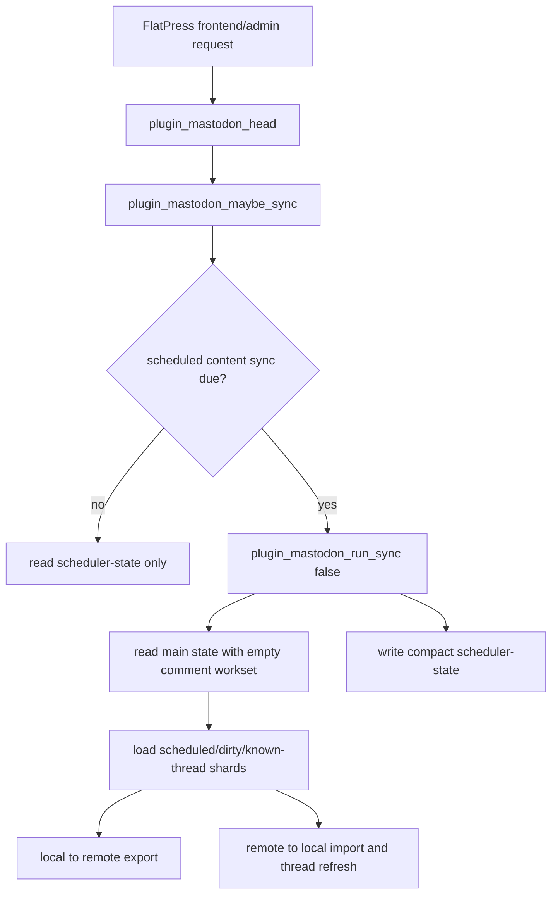
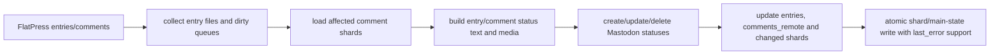
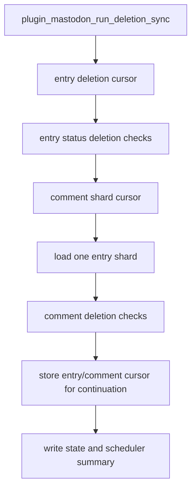
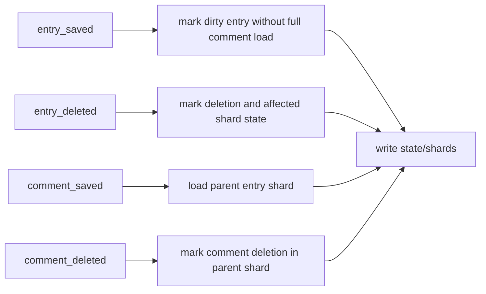
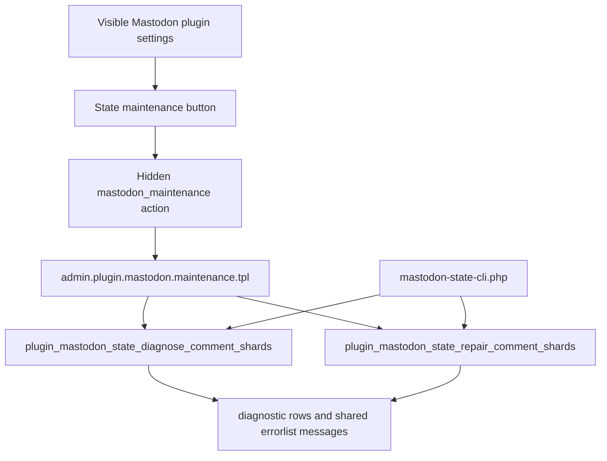

# 07 – PHP Function Organigram

## Purpose of this document

This document gives developers a structured overview of the Mastodon plugin PHP functions.

The file intentionally combines two views:

- a human-oriented organigram that explains responsibilities, call paths and maintenance rules;
- a generated function catalog with current line references that is checked against `fp-plugins/mastodon/plugin.mastodon.php`.

The plugin currently contains **412** callable functions/methods.

- **409** top-level plugin functions
- **6** admin action methods implemented with the shared method names `setup()`, `main()` or `onsubmit()`

## Function count

The count above is derived from the current PHP source and verified by `developer-docs/check-consistency.php`.
Duplicate admin method names such as `setup()`, `main()` and `onsubmit()` are implemented by separate admin action classes, while the generated catalog records the current effective source line for each shared method name.

## Scope

| Topic          | Current behavior in the current split-state stand                                                                                   |
| -------------- | ----------------------------------------------------------------------------------------------------------------------------------- |
| State files    | `state.json` keeps global mappings, cursors, queues and `comments_remote`; per-entry comment mappings live below `state-comments/`. |
| Comment shards | Each entry has one shard file so scheduled/manual sync paths can load only the required comment workset.                            |
| Reverse index  | `comments_remote` remains global so remote reply imports can detect duplicates without scanning every shard.                        |
| Migration      | Legacy inline comments are migrated to shards with a `state.json.migration-backup-*` safety copy.                                   |
| Repair         | Admin and CLI maintenance can diagnose shard metadata and rebuild repairable indexes from shard files.                              |

The focus is the Mastodon plugin PHP code. Template and language files are mentioned when they are part of an admin flow, but the callable catalog below is generated from `plugin.mastodon.php`.

## Mastodon API Endpoints

| Endpoint                                      | Main helper/function area                   | Use                                                                           |
| --------------------------------------------- | ------------------------------------------- | ----------------------------------------------------------------------------- |
| `GET /.well-known/oauth-authorization-server` | `plugin_mastodon_oauth_server_metadata()`   | Discover OAuth scopes and prefer the narrow `profile` scope when available.   |
| `POST /api/v1/apps`                           | `plugin_mastodon_register_app()`            | Register the FlatPress application with compatible scopes.                    |
| `GET /oauth/authorize`                        | `plugin_mastodon_build_authorize_url()`     | Send the administrator to Mastodon OAuth authorization.                       |
| `POST /oauth/token`                           | `plugin_mastodon_exchange_code_for_token()` | Exchange the authorization code for an access token.                          |
| `GET /api/v1/accounts/verify_credentials`     | `plugin_mastodon_verify_credentials()`      | Validate the configured account and cache account metadata.                   |
| `GET /api/v1/accounts/:id/statuses`           | `plugin_mastodon_fetch_account_statuses()`  | Discover statuses already posted by the authenticated account.                |
| `GET /api/v1/notifications`                    | `plugin_mastodon_fetch_reply_notifications()` | Prioritize mention notifications as old-thread reply hints.                 |
| `GET /api/v1/statuses/:id/context`            | `plugin_mastodon_fetch_status_context()`    | Import replies and refresh known synchronized threads.                        |
| `GET /api/v1/statuses/:id`                    | `plugin_mastodon_fetch_status()`            | Verify one remote status or deletion target.                                  |
| `POST /api/v1/statuses`                       | `plugin_mastodon_create_status()`           | Create entry/comment statuses.                                                |
| `PUT /api/v1/statuses/:id`                    | `plugin_mastodon_update_status()`           | Update changed entry/comment statuses when possible.                          |
| `DELETE /api/v1/statuses/:id`                 | `plugin_mastodon_delete_status()`           | Delete remote statuses; version-aware `delete_media` handling is centralized. |
| `GET /api/v2/instance`                        | `plugin_mastodon_upload_media_items()`      | Cache instance limits and feature support.                                    |
| `POST /api/v2/media`                          | `plugin_mastodon_upload_media_items()`      | Upload media before final status creation/update.                             |
| `GET /api/v1/media/:id`                       | `plugin_mastodon_fetch_media_attachment()`  | Poll asynchronous media processing.                                           |
| `DELETE /api/v1/media/:id`                    | `plugin_mastodon_delete_media_attachment()` | Clean up uploaded media that is not attached to a final status.               |

The local state split does not change these API boundaries. It changes how the plugin stores and loads local mappings before and after calling the same Mastodon API helpers.

## High-level call flow

### Frontend and scheduler entry points

Scheduled requests must keep normal page rendering cheap. They therefore prefer `scheduler-state.json` and only enter full synchronization when the configured due checks pass. The due checks treat stored `sync_time`, `last_run` and deletion cooldown values as UTC so PHP default timezone drift cannot shift the FlatPress-local admin schedule. In the current split-state stand the scheduled sync opens the main state without all comment shards, then loads only the entry shards selected by the automatic window, dirty queues and known-thread rotation.

### Local → remote export path

The export path is expected to behave the same for users as before the split-state change: changed FlatPress entries and comments are posted or updated on Mastodon. The implementation difference is that comment mappings are loaded entry-by-entry instead of as one monolithic `comments` array.

### Remote → local import path

`comments_remote` remains global by design. It gives the remote-import path a fast duplicate check before the code loads the affected entry shard. This avoids scanning all shard files when refreshing a known thread.

### Deletion reconciliation path

Deletion synchronization changed more than the other sync paths because it now iterates over entry shards. The important invariant is that the cursor can resume both between entries and within one comment shard.

### FlatPress Core post-success dirty-tracking hooks

The dirty hooks must stay fast because they run during normal FlatPress editing. Stand 36 keeps these hooks shard-aware so saving one comment does not force all historical comment mappings into memory.

### Admin panel and maintenance flow

The regular settings page keeps configuration, authorization and manual sync controls visible. The advanced state maintenance actions live on the separate `mastodon_maintenance` action and are also reachable by CLI.

## A. Entry points and admin integration

This group contains the functions and shared admin action methods that FlatPress calls directly or indirectly. It covers frontend metadata, scheduled entry checks, admin assignment, the separate maintenance panel, state-maintenance result formatting and the CLI maintenance command.

The hidden `mastodon_maintenance` panel must have its language/panelstrings alias in every language file before FlatPress builds `$panelstrings`; the runtime fallback remains only the second safety layer.

- `plugin_mastodon_head()` — line 2291 — Print Mastodon profile metadata into the HTML head.
- `plugin_mastodon_admin_language_strings()` — line 6066 — Return Mastodon admin-language strings with guaranteed maintenance fallbacks.
- `plugin_mastodon_sync_due()` — line 12065 — Determine whether the scheduled synchronization is currently due using stored UTC sync time and UTC `last_run` days.
- `plugin_mastodon_maybe_sync()` — line 12182 — Run the scheduled synchronization when the current request is due.
- `plugin_mastodon_admin_boolean_label()` — line 12214 — Return a localized yes/no/unknown label for admin diagnostics.
- `plugin_mastodon_admin_add_info_row()` — line 12229 — Add one admin diagnostics row when the value is available.
- `plugin_mastodon_instance_registration_summary()` — line 12250 — Summarize the registration state advertised by the Mastodon instance.
- `plugin_mastodon_admin_instance_info_rows()` — line 12276 — Build the rows for the admin instance-information diagnostics table.
- `plugin_mastodon_admin_panel_link()` — line 12349 — Build a local admin-panel link for Mastodon plugin pages.
- `plugin_mastodon_admin_is_maintenance_request()` — line 12369 — Decide whether the current request targets the dedicated Mastodon maintenance page.
- `plugin_mastodon_admin_empty_state_maintenance_result()` — line 12377 — Return an empty admin maintenance result container.
- `plugin_mastodon_admin_state_maintenance_result()` — line 12393 — Convert comment-shard diagnostics into template-friendly admin rows.
- `plugin_mastodon_cli_comment_shard_maintenance()` — line 12430 — Print command-line comment-shard diagnostics or perform a repair.
- `plugin_mastodon_admin_assign()` — line 12464 — Assign plugin data to Smarty for the admin panel.
- `setup()` — line 12608 — Register the active Mastodon admin template and assign plugin data to Smarty.
- `main()` — line 12613 — Keep the FlatPress admin panel lifecycle stable without additional processing.
- `onsubmit()` — line 12617 — Process submitted Mastodon admin actions for the active admin panel.

## B. Defaults, configuration, secrets, and centralized FlatPress feature toggles

This group owns normalized option values, stored secrets, instance snapshots, OAuth scope negotiation, FlatPress time conversion and feature toggles. These helpers should not load comment shards or turn a settings page into a full state scan.

- `plugin_mastodon_default_options()` — line 141 — Return the default plugin option values.
- `plugin_mastodon_clear_saved_instance_info()` — line 174 — Remove any stored Mastodon instance information from the plugin options.
- `plugin_mastodon_compact_instance_document()` — line 193 — Reduce a live Mastodon instance document to the stable subset that is useful for the plugin.
- `plugin_mastodon_saved_instance_document()` — line 398 — Read a previously stored Mastodon instance snapshot from the plugin options.
- `plugin_mastodon_store_instance_document()` — line 443 — Persist a compact Mastodon instance snapshot inside the plugin configuration.
- `plugin_mastodon_store_instance_error()` — line 489 — Persist the latest instance-information refresh error for the admin diagnostics view.
- `plugin_mastodon_refresh_instance_information()` — line 505 — Force a live refresh of the Mastodon instance information and persist the compact snapshot.
- `plugin_mastodon_default_content_stats()` — line 525 — Return the default counters for the last content synchronization.
- `plugin_mastodon_default_deletion_stats()` — line 542 — Return the default counters for the last deletion synchronization.
- `plugin_mastodon_default_state()` — line 555 — Return the default runtime state structure.
- `plugin_mastodon_oauth_legacy_scopes()` — line 592 — Return the legacy OAuth scopes used before scope discovery was added.
- `plugin_mastodon_oauth_profile_scopes()` — line 600 — Return the stricter OAuth scopes preferred on current Mastodon instances.
- `plugin_mastodon_oauth_server_metadata()` — line 617 — Fetch OAuth authorization server metadata for the configured Mastodon instance.
- `plugin_mastodon_oauth_supported_scopes()` — line 636 — Return the OAuth scopes supported by the configured Mastodon instance, if discoverable.
- `plugin_mastodon_oauth_scope_supported()` — line 673 — Determine whether the configured Mastodon instance advertises support for a scope.
- `plugin_mastodon_oauth_preferred_scopes()` — line 694 — Return the preferred OAuth scopes for the configured Mastodon instance.
- `plugin_mastodon_oauth_scopes()` — line 711 — Return the OAuth scopes that the currently registered app may safely request.
- `plugin_mastodon_fp_config()` — line 829 — Return the FlatPress configuration, preferring the early-loaded core cache.
- `plugin_mastodon_fp_config_value()` — line 865 — Read a nested FlatPress configuration value.
- `plugin_mastodon_fp_timeoffset_seconds()` — line 881 — Return the configured FlatPress time offset in seconds.
- `plugin_mastodon_fp_timeoffset_hours()` — line 893 — Return the configured FlatPress time offset in whole hours.
- `plugin_mastodon_fp_timeoffset_label()` — line 901 — Format the configured FlatPress time offset as a UTC label for admin users.
- `plugin_mastodon_sync_time_to_minutes()` — line 931 — Convert a HH:MM time value into minutes after midnight.
- `plugin_mastodon_minutes_to_sync_time()` — line 942 — Convert minutes after midnight into a normalized HH:MM time value.
- `plugin_mastodon_sync_time_utc_to_local()` — line 958 — Convert the stored UTC synchronization time to the FlatPress-local admin time.
- `plugin_mastodon_sync_time_local_to_utc()` — line 969 — Convert a FlatPress-local admin synchronization time back to stored UTC time.
- `plugin_mastodon_format_admin_datetime()` — line 980 — Format a stored UTC timestamp for the admin panel using FlatPress local time and configured formats without depending on PHP's default timezone.
- `plugin_mastodon_get_options()` — line 1929 — Load the saved plugin options and merge them with defaults.
- `plugin_mastodon_save_options()` — line 1990 — Persist plugin options.
- `plugin_mastodon_secret_key()` — line 2084 — Build the encryption key used for stored secrets.
- `plugin_mastodon_secret_encode()` — line 2101 — Encode a secret value before storing it in the configuration.
- `plugin_mastodon_secret_decode()` — line 2124 — Decode a previously stored secret value.
- `plugin_mastodon_normalize_instance_url()` — line 2155 — Normalize the configured Mastodon instance URL.
- `plugin_mastodon_normalize_head_username()` — line 2188 — Normalize the configured Mastodon username for HTML head metadata.
- `plugin_mastodon_instance_authority()` — line 2227 — Return the Mastodon instance authority used in fediverse creator metadata.
- `plugin_mastodon_profile_url()` — line 2257 — Build the public Mastodon profile URL used for the rel-me link.
- `plugin_mastodon_fediverse_creator_value()` — line 2273 — Build the fediverse creator meta value.
- `plugin_mastodon_normalize_status_language()` — line 2331 — Normalize a FlatPress locale string to a Mastodon-compatible ISO 639-1 code.
- `plugin_mastodon_configured_status_language()` — line 2353 — Read the configured FlatPress locale and return the Mastodon language code.
- `plugin_mastodon_normalize_sync_time()` — line 2373 — Normalize the configured daily sync time.
- `plugin_mastodon_normalize_sync_start_date()` — line 2390 — Normalize the configured sync start date.
- `plugin_mastodon_normalize_scheduled_window_days()` — line 2416 — Normalize the automatic scheduled synchronization window.
- `plugin_mastodon_scheduled_window_choices()` — line 2428 — Return the admin radio choices for the scheduled synchronization window.
- `plugin_mastodon_normalize_boolean_option()` — line 2441 — Normalize a boolean-like option value to the stored string representation.
- `plugin_mastodon_normalize_update_local_from_remote()` — line 2457 — Normalize the toggle that controls whether existing local content may be updated from remote Mastodon data.
- `plugin_mastodon_should_update_local_from_remote()` — line 2466 — Check whether remote Mastodon updates may overwrite already existing local FlatPress content.
- `plugin_mastodon_normalize_import_synced_comments_as_entries()` — line 2475 — Normalize the toggle that allows importing already synchronized local comments as entries.
- `plugin_mastodon_should_import_synced_comments_as_entries()` — line 2484 — Check whether a remote Mastodon status that is already mapped to a local FlatPress comment may also be imported as an entry.
- `plugin_mastodon_normalize_quote_imported_reply_parent()` — line 2493 — Normalize the toggle that controls whether imported Mastodon replies should quote the replied-to comment in FlatPress.
- `plugin_mastodon_should_quote_imported_reply_parent()` — line 2502 — Check whether imported Mastodon replies should include a quote of the replied-to comment.
- `plugin_mastodon_normalize_old_thread_reply_check()` — line 2511 — Normalize the toggle that enables rotating context checks for known synchronized Mastodon threads.
- `plugin_mastodon_should_check_old_thread_replies()` — line 2520 — Check whether known synchronized Mastodon threads should be checked for replies in rotating batches.
- `plugin_mastodon_normalize_delete_sync_enabled()` — line 2566 — Normalize the toggle that enables the follow-up deletion synchronization.
- `plugin_mastodon_should_run_deletion_sync()` — line 2575 — Check whether the follow-up deletion synchronization is enabled.
- `plugin_mastodon_enabled_plugin_state()` — line 6152 — Determine whether a FlatPress plugin is enabled in the centralized plugin configuration.
- `plugin_mastodon_tag_plugin_active()` — line 6217 — Determine whether the Tag plugin is active for the current FlatPress request.
- `plugin_mastodon_bbcode_plugin_active()` — line 6234 — Determine whether the BBCode plugin is active for the current FlatPress request.
- `plugin_mastodon_photoswipe_plugin_active()` — line 6251 — Determine whether the PhotoSwipe plugin is active for the current FlatPress request.
- `plugin_mastodon_audiovideo_plugin_active()` — line 6268 — Determine whether the Audio/Video plugin is active for the current FlatPress request.
- `plugin_mastodon_emoticons_plugin_active()` — line 6285 — Determine whether the Emoticons plugin is active for the current FlatPress request.
- `plugin_mastodon_companion_plugins_status()` — line 6300 — Return the status of companion FlatPress plugins used for the full Mastodon feature set.

## C. Caching, filesystem helpers, logging, and persisted state

This group owns request-local caches, FlatPress file I/O wrappers, log rotation, scheduler summaries, sync cooldown guards, state migration, per-entry comment shards, repair/diagnosis, dirty queues, tombstones, pending rechecks and durable state-write error reporting.

- `plugin_mastodon_runtime_cache_get()` — line 772 — Return a value from the request-local plugin cache.
- `plugin_mastodon_runtime_cache_set()` — line 796 — Store a value in the request-local plugin cache.
- `plugin_mastodon_runtime_cache_clear()` — line 814 — Clear one request-local plugin cache bucket or the complete cache.
- `plugin_mastodon_io_read_file()` — line 1017 — Read a file through the FlatPress I/O layer when available.
- `plugin_mastodon_io_read_file_uncached()` — line 1033 — Read a file without FlatPress request-local caches.
- `plugin_mastodon_file_permissions_mode()` — line 1051 — Return the FlatPress file permission mode for runtime files.
- `plugin_mastodon_apply_file_permissions()` — line 1060 — Apply FlatPress FILE_PERMISSIONS to a runtime file.
- `plugin_mastodon_io_write_file()` — line 1073 — Write a file through the FlatPress I/O layer when available.
- `plugin_mastodon_io_append_file()` — line 1094 — Append to a file without re-reading and rewriting the complete payload.
- `plugin_mastodon_log_max_bytes()` — line 1134 — Return the maximum sync.log size before rotation.
- `plugin_mastodon_log_rotate_files()` — line 1145 — Return the number of retained sync.log rotation files.
- `plugin_mastodon_io_rotate_file_if_needed()` — line 1158 — Rotate an append-only log file when the next append would exceed the size cap.
- `plugin_mastodon_apcu_enabled()` — line 1197 — Check whether shared APCu caching is available for the plugin.
- `plugin_mastodon_apcu_cache_key()` — line 1206 — Build the plugin APCu key suffix passed to the FlatPress APCu wrappers.
- `plugin_mastodon_apcu_fetch()` — line 1217 — Fetch a value from APCu through the FlatPress namespace helper.
- `plugin_mastodon_apcu_store()` — line 1232 — Store a value in APCu through the FlatPress namespace helper.
- `plugin_mastodon_apcu_delete()` — line 1245 — Delete a value from APCu through the FlatPress namespace helper.
- `plugin_mastodon_state_fallback_key()` — line 1256 — Return the legacy APCu key that used to hold a full last-known-good state fallback.
- `plugin_mastodon_state_fallback_store()` — line 1265 — Remove the legacy full-state APCu fallback instead of storing large mapping arrays.
- `plugin_mastodon_state_fallback_read()` — line 1274 — Full-state APCu fallback is intentionally disabled to avoid multi-MiB APCu entries.
- `plugin_mastodon_sync_guard_kind()` — line 1284 — Normalize the cooldown guard kind.
- `plugin_mastodon_sync_guard_apcu_key()` — line 1294 — Return the plugin-local APCu key suffix used for a sync cooldown guard.
- `plugin_mastodon_sync_guard_entry_active()` — line 1304 — Return true when one guard entry is still active.
- `plugin_mastodon_sync_guard_apcu_store()` — line 1315 — Store one cooldown guard through the FlatPress APCu wrapper.
- `plugin_mastodon_sync_guard_file_read()` — line 1328 — Read and prune the file-backed cooldown guard.
- `plugin_mastodon_sync_guard_file_write()` — line 1355 — Write the file-backed cooldown guard.
- `plugin_mastodon_sync_guard_active()` — line 1376 — Return true when a recent scheduled sync/deletion pass should cool down.
- `plugin_mastodon_sync_guard_mark()` — line 1401 — Mark a short cooldown guard for a scheduled sync/deletion pass.
- `plugin_mastodon_sync_guard_clear()` — line 1422 — Clear one sync cooldown guard from both FlatPress APCu wrappers and the file-backed guard.
- `plugin_mastodon_file_prestat()` — line 1898 — Read a cheap file metadata snapshot for cache validation.
- `plugin_mastodon_file_prestat_signature()` — line 1918 — Convert a file metadata snapshot into a stable cache signature.
- `plugin_mastodon_ensure_state_dir()` — line 2900 — Ensure that the plugin runtime directory exists.
- `plugin_mastodon_ensure_comment_shard_dir()` — line 2908 — Ensure that the comment-shard directory exists.
- `plugin_mastodon_state_is_entry_id()` — line 2917 — Return whether a string looks like a FlatPress entry id.
- `plugin_mastodon_state_entry_id_from_comment_key()` — line 2926 — Return the entry id portion from a compound comment-state key.
- `plugin_mastodon_state_comment_shard_file()` — line 2937 — Return the shard path for an entry's comment mappings.
- `plugin_mastodon_state_comment_shard_relative_path()` — line 2952 — Return the relative shard path used in state metadata.
- `plugin_mastodon_state_write_json_file()` — line 2966 — Write a JSON payload atomically when possible.
- `plugin_mastodon_state_write_lock_acquire()` — line 3005 — Acquire the short state-write lock used for multi-file state mutations.
- `plugin_mastodon_state_write_lock_release()` — line 3028 — Release a state-write lock handle.
- `plugin_mastodon_json_decode_string_at()` — line 3041 — Decode a JSON string literal starting at the current offset.
- `plugin_mastodon_json_skip_ws()` — line 3078 — Skip JSON whitespace in a string scanner.
- `plugin_mastodon_json_top_level_property_bounds()` — line 3095 — Find a top-level JSON property value in an object payload without decoding the whole object.
- `plugin_mastodon_state_create_migration_backup()` — line 3196 — Create a timestamped backup of the legacy main state before an inline-to-shard migration mutates it.
- `plugin_mastodon_state_migrate_inline_comments_to_shards()` — line 3218 — Iterate a legacy inline comments object and persist per-entry shards without building one giant comments array.
- `plugin_mastodon_state_try_streaming_legacy_migration()` — line 3357 — Migrate legacy inline comment mappings to per-entry shards without decoding the high-volume comments array.
- `plugin_mastodon_state_pending_recheck_entry_ids()` — line 3408 — Return the entry ids referenced by pending comment rechecks.
- `plugin_mastodon_state_unload_comment_shard_from_memory()` — line 3429 — Drop one loaded comment shard from a partial state's in-memory working set.
- `plugin_mastodon_state_group_comments_by_entry()` — line 3454 — Group comment mappings by their parent entry id.
- `plugin_mastodon_state_read_comment_shard()` — line 3482 — Load one per-entry comment shard.
- `plugin_mastodon_state_write_comment_shards()` — line 3517 — Write all per-entry comment shards.
- `plugin_mastodon_state_main_payload()` — line 3575 — Build the main state payload without high-volume inline comment mappings.
- `plugin_mastodon_state_load_comment_shards()` — line 3594 — Load comment shards into a state array.
- `plugin_mastodon_state_comment_shards_partial()` — line 3634 — Return whether a state array only contains a subset of comment shards.
- `plugin_mastodon_state_loaded_comment_entry_ids()` — line 3643 — Return the entry ids whose comment shards are loaded in a partial state.
- `plugin_mastodon_state_comment_entry_loaded()` — line 3662 — Check whether one entry's comment shard is loaded into the state array.
- `plugin_mastodon_state_mark_comment_entry_loaded()` — line 3676 — Mark one entry's comment shard as loaded in a partial state.
- `plugin_mastodon_state_load_comment_shard_into()` — line 3696 — Load one entry comment shard into a partial state when needed.
- `plugin_mastodon_state_comment_shard_entry_ids()` — line 3717 — Return entry ids with known comment shards.
- `plugin_mastodon_state_load_all_comment_shards_into()` — line 3735 — Load every comment shard into a state array for full-map maintenance paths.
- `plugin_mastodon_state_comment_shard_files()` — line 3747 — Return all comment shard files currently present on disk keyed by entry id.
- `plugin_mastodon_state_diagnose_comment_shards()` — line 3799 — Scan shard files and compare them with the main-state metadata and reverse comment index.
- `plugin_mastodon_state_repair_comment_shards()` — line 3914 — Rebuild the main shard metadata and global comments_remote reverse index from shard files.
- `plugin_mastodon_state_cleanup_stale_comment_shards()` — line 3954 — Remove shard files that are no longer referenced by the main state.
- `plugin_mastodon_state_recover_from_comment_shards()` — line 4011 — Return a recovered state if comment shards were written but the main state is missing.
- `plugin_mastodon_log()` — line 4076 — Append a line to the plugin sync log.
- `plugin_mastodon_log_skip()` — line 4091 — Aggregate high-volume skip messages until the current sync phase ends.
- `plugin_mastodon_log_flush_skip_summaries()` — line 4121 — Flush aggregated skip log messages.
- `plugin_mastodon_state_read()` — line 4151 — Load the persisted runtime state from disk.
- `plugin_mastodon_scheduler_state_default()` — line 4196 — Return an empty scheduler state derived from the full default state.
- `plugin_mastodon_scheduler_source_signature()` — line 4217 — Return the current stat-based signature of the full state file.
- `plugin_mastodon_scheduler_state_normalize()` — line 4226 — Normalize a scheduler summary without touching full mapping arrays.
- `plugin_mastodon_scheduler_state_from_state()` — line 4264 — Build the lightweight scheduler summary from a full runtime state.
- `plugin_mastodon_scheduler_state_write()` — line 4284 — Persist the lightweight scheduler state. Failure only disables the request-time optimization.
- `plugin_mastodon_scheduler_state_decode_fresh()` — line 4310 — Decode a scheduler-state JSON payload only when it matches the current full-state signature.
- `plugin_mastodon_scheduler_state_read()` — line 4329 — Load the lightweight scheduler summary and rebuild it conservatively when stale.
- `plugin_mastodon_state_write()` — line 4375 — Persist the runtime state to disk.
- `plugin_mastodon_normalize_deletions_pending_scope()` — line 4432 — Normalize the pending deletion scope marker.
- `plugin_mastodon_state_normalize()` — line 4445 — Normalize a runtime state array and fill in missing keys.
- `plugin_mastodon_state_comment_key()` — line 4497 — Build the compound state key used for comment mappings.
- `plugin_mastodon_state_comment_mappings()` — line 4506 — Return the loaded comment mapping array from a state object.
- `plugin_mastodon_state_set_comment_mappings()` — line 4524 — Replace the loaded comment mapping array in a state object.
- `plugin_mastodon_state_comment_remote_mappings()` — line 4542 — Return the global remote-comment reverse index.
- `plugin_mastodon_state_set_comment_remote_mappings()` — line 4568 — Replace the global remote-comment reverse index in a state object.
- `plugin_mastodon_state_comment_shard_entries()` — line 4594 — Return the main-state metadata for per-entry comment shards.
- `plugin_mastodon_state_set_comment_shard_entries()` — line 4613 — Replace the main-state metadata for per-entry comment shards.
- `plugin_mastodon_state_write_error_set()` — line 4634 — Store a state write error for callers that need a last_error message even when persistence fails.
- `plugin_mastodon_state_write_error_clear()` — line 4642 — Clear the last state write error marker.
- `plugin_mastodon_state_write_last_error()` — line 4650 — Return the last state write error marker from the current request.
- `plugin_mastodon_state_write_with_last_error()` — line 4660 — Persist state and copy a failed write reason into the caller-visible last_error field.
- `plugin_mastodon_state_set_entry_mapping()` — line 4690 — Store the mapping between a local entry and a remote status.
- `plugin_mastodon_state_set_comment_mapping()` — line 4729 — Store the mapping between a local comment and a remote status.
- `plugin_mastodon_state_remove_entry_mapping()` — line 4771 — Remove the mapping between a local entry and a remote status.
- `plugin_mastodon_state_remove_comment_mapping()` — line 4793 — Remove the mapping between a local comment and a remote status.
- `plugin_mastodon_state_set_dirty_entry()` — line 4827 — Add an older changed entry to the persistent dirty queue.
- `plugin_mastodon_state_remove_dirty_entry()` — line 4847 — Remove an entry from the dirty queue.
- `plugin_mastodon_state_has_dirty_entry()` — line 4860 — Check whether an entry is queued for synchronization although it is outside the scheduled window.
- `plugin_mastodon_state_set_dirty_comment()` — line 4873 — Add an older changed comment to the persistent dirty queue.
- `plugin_mastodon_state_remove_dirty_comment()` — line 4896 — Remove a comment from the dirty queue.
- `plugin_mastodon_state_has_dirty_comment()` — line 4910 — Check whether a comment is queued for synchronization although it is outside the scheduled window.
- `plugin_mastodon_local_write_guard_enter()` — line 4919 — Increase the local-write guard depth while the plugin mirrors remote Mastodon data into FlatPress.
- `plugin_mastodon_local_write_guard_leave()` — line 4930 — Decrease the local-write guard depth after a plugin-owned FlatPress write.
- `plugin_mastodon_local_write_guard_active()` — line 4942 — Return whether FlatPress write hooks are currently triggered by Mastodon remote mirroring.
- `plugin_mastodon_dirty_tracking_options()` — line 4950 — Check whether dirty tracking should persist state for a local FlatPress write hook.
- `plugin_mastodon_on_entry_saved()` — line 4969 — Mark a local FlatPress entry write as dirty for a later Mastodon sync.
- `plugin_mastodon_on_entry_deleted()` — line 5018 — Mark a local FlatPress entry deletion for the Mastodon deletion sync.
- `plugin_mastodon_on_comment_saved()` — line 5045 — Mark a local FlatPress comment write as dirty for a later Mastodon sync.
- `plugin_mastodon_on_comment_deleted()` — line 5106 — Mark a local FlatPress comment deletion for the Mastodon deletion sync.
- `plugin_mastodon_state_get_entry_meta()` — line 5131 — Return mapping metadata for a local entry.
- `plugin_mastodon_state_set_entry_media_meta()` — line 5145 — Persist media metadata for a synchronized local entry.
- `plugin_mastodon_state_entry_remote_media()` — line 5174 — Return sanitized remote-media descriptors stored inside one entry mapping.
- `plugin_mastodon_state_entry_media_attachment_signature()` — line 5204 — Return the stored attachment-signature for one entry mapping.
- `plugin_mastodon_state_entry_media_description_signature()` — line 5214 — Return the stored description-signature for one entry mapping.
- `plugin_mastodon_state_get_comment_meta()` — line 5226 — Return mapping metadata for a local comment.
- `plugin_mastodon_state_set_comment_tombstone()` — line 5241 — Store a tombstone that blocks re-importing a deleted remote comment status.
- `plugin_mastodon_state_has_comment_tombstone()` — line 5261 — Check whether one remote Mastodon comment status was tombstoned locally.
- `plugin_mastodon_protect_locally_deleted_exported_comments()` — line 5272 — Protect locally deleted exported FlatPress comments from stale Mastodon re-imports before deletion sync runs.
- `plugin_mastodon_reattach_local_comment_to_entry_status()` — line 5322 — Reattach one imported local comment to the synchronized entry status after its remote parent reply disappeared.
- `plugin_mastodon_state_remove_pending_comment_remote_recheck()` — line 5382 — Remove one pending descendant recheck marker.
- `plugin_mastodon_state_get_pending_comment_remote_recheck()` — line 5396 — Return one pending descendant recheck marker.
- `plugin_mastodon_state_set_pending_comment_remote_recheck()` — line 5411 — Mark one local comment for follow-up verification after an ancestor status disappeared remotely.
- `plugin_mastodon_state_set_deletions_pending()` — line 5437 — Update the runtime marker that tells the scheduler whether another deletion follow-up request is required.
- `plugin_mastodon_deletion_sync_due()` — line 5451 — Determine whether a pending deletion synchronization may start now using UTC cooldown timestamps.
- `plugin_mastodon_state_has_comment_recheck_scope()` — line 5479 — Check whether the current deletion follow-up request should focus on pending descendant reply rechecks only.
- `plugin_mastodon_build_comment_remote_child_index()` — line 5488 — Build an index of mapped local comments grouped by their direct remote parent status.
- `plugin_mastodon_queue_comment_descendant_remote_rechecks()` — line 5519 — Queue the direct mapped local children of one deleted remote comment for additional verification passes.
- `plugin_mastodon_process_pending_comment_remote_rechecks()` — line 5558 — Process queued descendant reply rechecks using a small FIFO queue.

## D. Date, timestamp, visibility, and threading helpers

This group decides whether local and remote items belong to the configured synchronization start date and automatic content window. It also resolves comment parentage and reply targets without loading unrelated comment shards.

- `plugin_mastodon_timestamp_to_flatpress_time()` — line 915 — Convert a real Unix timestamp into FlatPress's offset-adjusted timestamp model.
- `plugin_mastodon_timestamp_date_key()` — line 2584 — Convert a FlatPress-adjusted timestamp into a stable date key.
- `plugin_mastodon_local_item_date_key()` — line 2598 — Determine the date key of a local FlatPress entry or comment.
- `plugin_mastodon_remote_status_date_key()` — line 2621 — Determine the date key of a remote Mastodon status.
- `plugin_mastodon_datetime_date_key()` — line 2647 — Normalize a date/datetime string to a sync-start date key.
- `plugin_mastodon_date_matches_sync_start()` — line 2671 — Determine whether a content date passes the configured sync start date.
- `plugin_mastodon_scheduled_window_start_date()` — line 2689 — Return the FlatPress-local date key that starts the automatic scheduled sync window.
- `plugin_mastodon_date_matches_content_window()` — line 2706 — Determine whether a date is inside the manual lower bound and, for scheduled runs, the automatic window.
- `plugin_mastodon_local_item_matches_sync_start()` — line 2728 — Determine whether a local FlatPress item should be synchronized.
- `plugin_mastodon_local_item_matches_content_window()` — line 2740 — Determine whether a local FlatPress item is inside the active content synchronization window.
- `plugin_mastodon_remote_status_matches_sync_start()` — line 2750 — Determine whether a remote Mastodon status should be synchronized.
- `plugin_mastodon_remote_status_matches_content_window()` — line 2761 — Determine whether a remote Mastodon status is inside the active content synchronization window.
- `plugin_mastodon_mapping_matches_sync_start()` — line 2772 — Determine whether a synchronized mapping should participate in the deletion follow-up for the current sync start date.
- `plugin_mastodon_mapping_effective_date_key()` — line 2820 — Return the most stable date key available for a synchronized mapping.
- `plugin_mastodon_mapping_matches_deletion_lookup_window()` — line 2861 — Determine whether an existing local mapping should be remotely checked for deletion in this run.
- `plugin_mastodon_mapping_keys_after_cursor()` — line 2882 — Return mapping keys ordered after a saved deletion cursor.
- `plugin_mastodon_parse_iso_datetime()` — line 5668 — Parse an ISO date/time string into FlatPress date format.
- `plugin_mastodon_parse_iso_timestamp()` — line 5687 — Parse an ISO date/time value into a Unix timestamp.
- `plugin_mastodon_remote_status_timestamp()` — line 5710 — Resolve the best timestamp for a remote Mastodon status.
- `plugin_mastodon_remote_status_visibility()` — line 5729 — Return the normalized visibility of a remote Mastodon status.
- `plugin_mastodon_remote_status_is_importable()` — line 5742 — Determine whether a remote Mastodon status may be imported.
- `plugin_mastodon_comment_parent_fields()` — line 5754 — Return the comment fields that may contain a parent reference.
- `plugin_mastodon_normalize_comment_parent_id()` — line 5763 — Normalize a stored local comment parent identifier.
- `plugin_mastodon_detect_local_comment_parent_id()` — line 5780 — Detect the local parent comment identifier from comment data.
- `plugin_mastodon_resolve_comment_reply_target()` — line 5802 — Resolve the remote reply target for a local comment export.
- `plugin_mastodon_local_comment_parent_export_pending()` — line 5827 — Determine whether a local parent comment should be exported before its child reply.
- `plugin_mastodon_list_local_comment_ids()` — line 5855 — List local FlatPress comment identifiers by scanning the entry comment directory directly.

## E. Text, URLs, language strings, tags, emojis, and BBCode/HTML conversion

This group converts between FlatPress text/BBCode/HTML and Mastodon-ready plain text or FlatPress BBCode. It also handles localized strings, public URLs, FlatPress tags, Mastodon hashtags and Emoticons shortcode conversion.

- `plugin_mastodon_guess_subject()` — line 5892 — Guess a subject line from imported plain text.
- `plugin_mastodon_html_entity_decode()` — line 5934 — Decode HTML entities using the plugin defaults.
- `plugin_mastodon_blog_base_url()` — line 5943 — Return the absolute base URL of the current FlatPress installation.
- `plugin_mastodon_extract_url_token()` — line 5979 — Extract the URL token from a BBCode or attribute fragment.
- `plugin_mastodon_absolute_url()` — line 5996 — Convert a URL or path into an absolute URL when possible.
- `plugin_mastodon_lang_string()` — line 6038 — Return a localized plugin string or a provided fallback.
- `plugin_mastodon_normalize_tag_list()` — line 6348 — Normalize a list of tag labels.
- `plugin_mastodon_extract_flatpress_tags()` — line 6379 — Extract FlatPress Tag plugin labels from an entry body.
- `plugin_mastodon_strip_flatpress_tag_bbcode()` — line 6404 — Remove Tag plugin BBCode blocks from entry content.
- `plugin_mastodon_mastodon_hashtag_footer()` — line 6421 — Convert FlatPress tag labels into a Mastodon hashtag footer line.
- `plugin_mastodon_remote_status_tags()` — line 6442 — Collect remote Mastodon tags from a status entity.
- `plugin_mastodon_strip_trailing_mastodon_hashtag_footer()` — line 6469 — Remove a trailing Mastodon hashtag footer from imported plain text.
- `plugin_mastodon_build_flatpress_tag_bbcode()` — line 6532 — Build Tag plugin BBCode from a list of remote Mastodon tags.
- `plugin_mastodon_emoticon_entity_to_unicode()` — line 6545 — Convert an emoticon HTML entity into a Unicode character.
- `plugin_mastodon_emoticon_map()` — line 6558 — Return the FlatPress emoticon-to-Unicode lookup map.
- `plugin_mastodon_replace_emoticon_shortcodes_with_unicode()` — line 6612 — Replace FlatPress emoticon shortcodes with Unicode glyphs.
- `plugin_mastodon_prepare_emoticons_for_mastodon()` — line 6627 — Convert FlatPress emoticon shortcodes to Mastodon-safe Unicode glyphs when the plugin is active.
- `plugin_mastodon_replace_unicode_emoticons_with_shortcodes()` — line 6640 — Replace Unicode emoticons with FlatPress shortcodes.
- `plugin_mastodon_is_public_host()` — line 6662 — Determine whether a host name resolves to a public endpoint.
- `plugin_mastodon_public_url_for_mastodon()` — line 6685 — Return a Mastodon-safe public URL or an empty string.
- `plugin_mastodon_plain_text_from_bbcode()` — line 6704 — Convert FlatPress BBCode into plain text for Mastodon export.
- `plugin_mastodon_subject_line_is_noise()` — line 6748 — Determine whether an extracted line should be ignored as a subject.
- `plugin_mastodon_domains_match()` — line 6776 — Determine whether two host names belong to the same domain family.
- `plugin_mastodon_cleanup_imported_text()` — line 6790 — Clean imported text before saving it to FlatPress.
- `plugin_mastodon_dom_children_to_flatpress()` — line 6844 — Convert DOM child nodes into FlatPress BBCode text.
- `plugin_mastodon_dom_node_to_flatpress()` — line 6862 — Convert a single DOM node into FlatPress BBCode text.
- `plugin_mastodon_public_entry_url()` — line 6971 — Return the public URL for a FlatPress entry.
- `plugin_mastodon_public_comments_url()` — line 6998 — Return the public comments URL for a FlatPress entry.
- `plugin_mastodon_public_comment_url()` — line 7026 — Return the public URL for a specific FlatPress comment.
- `plugin_mastodon_mastodon_html_to_flatpress()` — line 7041 — Convert Mastodon HTML content into FlatPress BBCode.
- `plugin_mastodon_flatpress_to_mastodon()` — line 7143 — Convert FlatPress content into Mastodon-ready plain text.
- `plugin_mastodon_limit_text()` — line 7260 — Limit text to a maximum number of characters.

## F. Local content access, media processing, hashing, and export ordering

This group reads local entries/comments, handles local and remote media descriptors, computes change signatures and builds efficient direct scanner candidate lists for scheduled and full synchronization paths.

- `plugin_mastodon_entry_hash()` — line 7282 — Build a change-detection hash for a FlatPress entry.
- `plugin_mastodon_comment_hash()` — line 7294 — Build a change-detection hash for a FlatPress comment.
- `plugin_mastodon_safe_path_component()` — line 7312 — Sanitize a string so it can be used as a path component.
- `plugin_mastodon_safe_filename()` — line 7327 — Sanitize a file name for local storage.
- `plugin_mastodon_normalize_media_relative_path()` — line 7340 — Normalize a FlatPress media path relative to fp-content.
- `plugin_mastodon_media_relative_to_absolute()` — line 7363 — Resolve a FlatPress media path to an absolute file path.
- `plugin_mastodon_media_prepare_directory()` — line 7376 — Ensure that a media directory exists.
- `plugin_mastodon_media_delete_tree()` — line 7392 — Delete a directory tree used for imported media.
- `plugin_mastodon_media_copy_tree()` — line 7419 — Copy a directory tree used for media synchronization.
- `plugin_mastodon_bbcode_attr_escape()` — line 7457 — Escape a value for safe BBCode attribute usage.
- `plugin_mastodon_bbcode_text_escape()` — line 7469 — Escape plain text embedded between BBCode tags.
- `plugin_mastodon_media_guess_mime_type()` — line 7491 — Guess the MIME type of a local media file.
- `plugin_mastodon_media_type_from_mime()` — line 7558 — Return a stable FlatPress/Mastodon media family for a MIME type.
- `plugin_mastodon_extension_from_mime_type()` — line 7592 — Return an appropriate file extension for a MIME type.
- `plugin_mastodon_instance_supported_media_mime_types()` — line 7639 — Return instance-advertised supported media MIME types.
- `plugin_mastodon_instance_media_size_limit()` — line 7659 — Return the configured byte-size limit for a media family, or 0 if unknown.
- `plugin_mastodon_validate_local_media_item()` — line 7686 — Validate a local media item against known instance upload limits.
- `plugin_mastodon_media_parse_tag_attributes()` — line 7713 — Parse key/value attributes from a FlatPress media tag.
- `plugin_mastodon_media_description_from_bbcode_content()` — line 7744 — Normalize optional AudioVideo BBCode content into a Mastodon media description.
- `plugin_mastodon_media_extract_default_path()` — line 7770 — Extract the default path parameter from a FlatPress media tag attribute string.
- `plugin_mastodon_add_local_media_item()` — line 7799 — Append a local media item to the collection while avoiding duplicates.
- `plugin_mastodon_collect_local_entry_media()` — line 7848 — Collect local images, galleries, audio and video referenced by an entry.
- `plugin_mastodon_select_status_media_items()` — line 7994 — Select a Mastodon-compatible media set for one status.
- `plugin_mastodon_prepare_entry_media_items()` — line 8055 — Normalize local entry media items for signature and export planning.
- `plugin_mastodon_entry_media_attachment_signature_from_items()` — line 8083 — Build a signature for the actual media payload of local entry attachments.
- `plugin_mastodon_entry_media_description_signature_from_items()` — line 8106 — Build a signature for local entry media descriptions.
- `plugin_mastodon_entry_media_signature()` — line 8125 — Build a signature for media references contained in entry content.
- `plugin_mastodon_remote_media_attachment_type()` — line 8142 — Return the normalized Mastodon attachment type.
- `plugin_mastodon_remote_status_media_attachments()` — line 8169 — Extract supported media attachments from a remote Mastodon status.
- `plugin_mastodon_remote_status_image_attachments()` — line 8199 — Extract image attachments from a remote Mastodon status.
- `plugin_mastodon_remote_media_source_url()` — line 8208 — Resolve the best downloadable source URL for a remote attachment.
- `plugin_mastodon_remote_media_source_urls()` — line 8226 — Return direct-download candidate URLs for a remote media attachment.
- `plugin_mastodon_remote_media_description()` — line 8248 — Resolve the best description for a remote attachment.
- `plugin_mastodon_remote_media_focus()` — line 8262 — Resolve the stored focus string for a remote attachment, if any.
- `plugin_mastodon_remote_media_descriptors_from_status()` — line 8279 — Build sanitized remote-media descriptors from a Mastodon status payload.
- `plugin_mastodon_remote_media_descriptors_from_media_ids()` — line 8310 — Build remote-media descriptors from freshly uploaded media IDs and the current local descriptions.
- `plugin_mastodon_status_media_attributes()` — line 8344 — Build media_attributes descriptors for PUT /api/v1/statuses/:id.
- `plugin_mastodon_media_download()` — line 8377 — Download a remote media asset.
- `plugin_mastodon_remote_download_basename()` — line 8391 — Build a safe basename for a downloaded remote attachment.
- `plugin_mastodon_store_remote_media_url()` — line 8421 — Download and store one remote media URL.
- `plugin_mastodon_build_imported_media_bbcode()` — line 8443 — Build FlatPress BBCode for imported remote media attachments.
- `plugin_mastodon_is_two_digit_path_segment()` — line 9430 — Determine whether a FlatPress content-tree path segment is a two-digit date segment.
- `plugin_mastodon_two_digit_year_to_full_year()` — line 9439 — Convert a FlatPress two-digit year segment into the full year used by PHP's legacy date parser.
- `plugin_mastodon_entry_month_end_date_key()` — line 9450 — Return the last date key that can occur inside a FlatPress YY/MM content directory.
- `plugin_mastodon_entry_month_may_match_scheduled_window()` — line 9472 — Determine whether a FlatPress YY/MM directory can contain scheduled-sync entry candidates.
- `plugin_mastodon_collect_entry_files_from_month()` — line 9492 — Collect direct entry files from one canonical FlatPress YY/MM content directory.
- `plugin_mastodon_collect_entry_files_legacy()` — line 9525 — Legacy fallback for non-canonical content trees.
- `plugin_mastodon_collect_entry_files()` — line 9553 — Collect canonical entry files directly from FlatPress YY/MM content directories.
- `plugin_mastodon_collect_scheduled_entry_files()` — line 9596 — Collect scheduled-sync entry candidates directly from relevant FlatPress YY/MM content directories.
- `plugin_mastodon_add_dirty_entry_files()` — line 9641 — Append existing dirty entry files by canonical FlatPress ID.
- `plugin_mastodon_collect_entry_files_for_sync()` — line 9661 — Collect local entry files for a local-to-remote synchronization pass; scheduled runs add all dirty parents without a hard cap.
- `plugin_mastodon_local_item_timestamp()` — line 9680 — Resolve the best timestamp for a local FlatPress item.
- `plugin_mastodon_compare_local_entries_for_export()` — line 9709 — Compare local FlatPress entries for Mastodon export order.
- `plugin_mastodon_test_note_local_entry_parse()` — line 9728 — Increment a simulation-only local-entry parse counter when enabled.
- `plugin_mastodon_dirty_entry_id_lookup()` — line 9740 — Return entry identifiers that are explicitly queued by dirty entry/comment hooks.
- `plugin_mastodon_content_sync_comment_entry_ids()` — line 9770 — Return entry ids whose comment shards may be needed by the current content-sync workset.
- `plugin_mastodon_state_load_content_sync_comment_workset()` — line 9794 — Load comment shards needed for the current content synchronization workset.
- `plugin_mastodon_should_parse_local_entry_for_sync()` — line 9810 — Determine whether a local entry file should be parsed during a scheduled local-to-remote pass.
- `plugin_mastodon_list_local_entries_for_sync()` — line 9835 — List local FlatPress entries for a local-to-remote synchronization pass.
- `plugin_mastodon_list_local_entries()` — line 9874 — List local FlatPress entries ordered for export.

## G. HTTP transport, PHP timeout budgeting, instance capability lookup, status-length budgeting, OAuth, Mastodon API calls, and media upload

This group performs network-facing work: request budgeting, persistent rate-limit windows, HTTP transport, OAuth API calls, instance capability lookup, status length budgeting, media upload/polling/cleanup and Mastodon status create/update/delete helpers.

- `plugin_mastodon_rate_limit_default_budgets()` — line 1437 — Return the default Mastodon API budgets for one synchronization run.
- `plugin_mastodon_rate_limit_window_budgets()` — line 1461 — Return the persistent Mastodon API window budgets across synchronization runs.
- `plugin_mastodon_rate_limit_window_config()` — line 1488 — Return persistent window configuration for one request kind.
- `plugin_mastodon_rate_limit_window_entry()` — line 1508 — Normalize one persistent rate-limit window entry.
- `plugin_mastodon_rate_limit_window_read()` — line 1528 — Read the persistent rate-limit windows.
- `plugin_mastodon_rate_limit_window_write()` — line 1560 — Persist the current rate-limit windows.
- `plugin_mastodon_rate_limit_window_acquire()` — line 1585 — Reserve one item from a persistent cross-run Mastodon rate-limit window.
- `plugin_mastodon_rate_limit_window_clear()` — line 1634 — Clear persistent rate-limit windows, mainly for tests and recovery tooling.
- `plugin_mastodon_rate_limit_guard_start()` — line 1646 — Start a per-run Mastodon API rate-limit guard.
- `plugin_mastodon_rate_limit_guard_stop()` — line 1672 — Stop the current per-run Mastodon API rate-limit guard while keeping its summary inspectable.
- `plugin_mastodon_rate_limit_guard_active()` — line 1683 — Return whether a per-run Mastodon API rate-limit guard is active.
- `plugin_mastodon_rate_limit_guard_summary()` — line 1691 — Return the current rate-limit guard summary.
- `plugin_mastodon_rate_limit_headers()` — line 1700 — Normalize a response header map for rate-limit checks.
- `plugin_mastodon_rate_limit_request_kind()` — line 1721 — Determine whether a Mastodon API request consumes one of the stricter per-run budgets.
- `plugin_mastodon_rate_limit_block()` — line 1746 — Mark the current rate-limit guard as blocked.
- `plugin_mastodon_rate_limit_acquire()` — line 1790 — Reserve budget for one Mastodon API request.
- `plugin_mastodon_rate_limit_observe_response()` — line 1835 — Update the current per-run guard from Mastodon rate-limit response headers.
- `plugin_mastodon_rate_limit_blocked_reason()` — line 1859 — Return the current rate-limit block reason, if any.
- `plugin_mastodon_rate_limit_blocked_response()` — line 1871 — Build a synthetic API response for locally blocked Mastodon requests.
- `plugin_mastodon_rate_limit_state_error()` — line 1888 — Return the rate-limit reason that should be written to sync state, if any.
- `plugin_mastodon_extend_time_limit()` — line 8639 — Best-effort refresh/increase of the PHP execution time budget for long-running Mastodon work.
- `plugin_mastodon_instance_document()` — line 8670 — Load and cache the full Mastodon instance document returned by /api/v2/instance.
- `plugin_mastodon_instance_version()` — line 8714 — Return the Mastodon version string advertised by /api/v2/instance, if any.
- `plugin_mastodon_instance_supports_status_media_attributes()` — line 8732 — Determine whether the configured Mastodon instance should support media description updates on already-posted statuses.
- `plugin_mastodon_instance_supports_status_delete_media()` — line 8756 — Determine whether cached instance information confirms support for the delete_media query parameter on DELETE /api/v1/statuses/:id.
- `plugin_mastodon_instance_configuration()` — line 8773 — Load and cache the Mastodon instance configuration document.
- `plugin_mastodon_instance_media_limit()` — line 8783 — Return the media attachment limit of the configured instance.
- `plugin_mastodon_instance_media_description_limit()` — line 8796 — Return the media description length limit of the configured instance.
- `plugin_mastodon_instance_url_reserved_length()` — line 8809 — Return the per-URL character budget used by the configured instance.
- `plugin_mastodon_status_text_length()` — line 8823 — Calculate the Mastodon-visible length of a plain-text status.
- `plugin_mastodon_limit_status_text()` — line 8855 — Limit Mastodon plain text while respecting the instance URL budget.
- `plugin_mastodon_http_request_multipart()` — line 8934 — Perform a multipart HTTP request.
- `plugin_mastodon_fetch_media_attachment()` — line 9067 — Fetch the current processing status of a Mastodon media attachment.
- `plugin_mastodon_delete_media_attachment()` — line 9077 — Delete an uploaded Mastodon media attachment before it is attached to a final status.
- `plugin_mastodon_cleanup_uploaded_media()` — line 9096 — Best-effort cleanup for uploaded Mastodon media that never reached a final status request.
- `plugin_mastodon_media_processing_attempts()` — line 9132 — Determine how patiently the plugin should wait for Mastodon media processing.
- `plugin_mastodon_media_transfer_timeout()` — line 9156 — Determine a practical transfer timeout for one media upload.
- `plugin_mastodon_wait_for_media_attachment()` — line 9176 — Wait briefly until an asynchronously uploaded Mastodon media attachment is ready.
- `plugin_mastodon_upload_media_items()` — line 9225 — Upload local media items to Mastodon and collect the created media IDs.
- `plugin_mastodon_prepare_entry_media_sync_plan()` — line 9342 — Decide whether a local entry update can reuse already-uploaded Mastodon media or needs a fresh upload.
- `plugin_mastodon_parse_http_response_headers()` — line 9912 — Parse raw HTTP response headers.
- `plugin_mastodon_stream_context_request()` — line 9942 — Perform an HTTP request through a stream context fallback.
- `plugin_mastodon_array_is_list()` — line 9982 — Detect whether a value is a numerically indexed list.
- `plugin_mastodon_array_contains_only_form_scalars()` — line 10002 — Detect whether a list contains only scalar-compatible form values.
- `plugin_mastodon_http_build_query()` — line 10020 — Build an application/x-www-form-urlencoded query string for Mastodon requests.
- `plugin_mastodon_http_request()` — line 10076 — Perform an HTTP request using cURL or the stream fallback.
- `plugin_mastodon_mastodon_api()` — line 10194 — Call the Mastodon API and return the raw HTTP response.
- `plugin_mastodon_mastodon_json()` — line 10243 — Call the Mastodon API and decode a JSON response.
- `plugin_mastodon_response_error_message()` — line 10258 — Extract the most useful error message from an API response.
- `plugin_mastodon_register_app()` — line 10287 — Register the FlatPress application on the configured Mastodon instance.
- `plugin_mastodon_build_authorize_url()` — line 10310 — Build the OAuth authorization URL.
- `plugin_mastodon_exchange_code_for_token()` — line 10330 — Exchange an OAuth authorization code for an access token.
- `plugin_mastodon_verify_credentials()` — line 10360 — Verify the currently configured access token.
- `plugin_mastodon_instance_character_limit()` — line 10377 — Return the status character limit of the configured instance.
- `plugin_mastodon_fetch_account_statuses()` — line 10392 — Fetch statuses for the authenticated Mastodon account.
- `plugin_mastodon_fetch_status_context()` — line 10439 — Fetch the conversation context for a Mastodon status.
- `plugin_mastodon_fetch_status()` — line 10473 — Fetch a single Mastodon status.
- `plugin_mastodon_delete_status()` — line 10484 — Delete a Mastodon status.
- `plugin_mastodon_delete_status_should_retry_without_delete_media()` — line 10512 — Check whether a failed status deletion may be caused by Mastodon versions before 4.4.0 not understanding the optional delete_media query parameter.
- `plugin_mastodon_status_missing_response()` — line 10532 — Check whether an API response means that the referenced Mastodon status is missing.
- `plugin_mastodon_create_status()` — line 10545 — Create a Mastodon status.
- `plugin_mastodon_update_status()` — line 10572 — Update an existing Mastodon status.

## H. Import/export builders and synchronization orchestration

This group composes lower-level helpers into visible synchronization behavior. It is the first group to inspect when automatic sync, normal manual sync, full manual sync, full deletion continuation or rotating known-thread refresh behaves differently after a state-format change.

- `plugin_mastodon_build_entry_status_text()` — line 10598 — Build the status body used when exporting a FlatPress entry.
- `plugin_mastodon_build_comment_status_text()` — line 10666 — Build the status body used when exporting a FlatPress comment.
- `plugin_mastodon_import_remote_entry()` — line 10704 — Import a remote Mastodon status into FlatPress as an entry.
- `plugin_mastodon_remote_status_author_label()` — line 10814 — Build a readable account label for a Mastodon status author.
- `plugin_mastodon_strip_leading_quote_block()` — line 10847 — Remove one leading BBCode quote block from imported comment text.
- `plugin_mastodon_imported_reply_quote_payload()` — line 10880 — Resolve the author and body that should be quoted for an imported Mastodon reply.
- `plugin_mastodon_build_imported_reply_quote()` — line 10923 — Build an optional BBCode quote block for an imported Mastodon reply.
- `plugin_mastodon_import_remote_comment()` — line 10965 — Import a remote Mastodon reply into FlatPress as a comment.
- `plugin_mastodon_import_remote_context_descendants()` — line 11218 — Import remote Mastodon replies from a fetched thread context.
- `plugin_mastodon_old_thread_context_rotation_limit()` — line 11320 — Return the maximum number of known synchronized threads checked for replies per content sync run.
- `plugin_mastodon_collect_known_entry_context_targets()` — line 11337 — Collect known synchronized entry threads that should have their Mastodon reply context refreshed.
- `plugin_mastodon_sync_remote_to_local()` — line 11410 — Synchronize remote Mastodon content into FlatPress.
- `plugin_mastodon_sync_local_to_remote()` — line 11488 — Synchronize local FlatPress content to Mastodon.
- `plugin_mastodon_run_deletion_sync()` — line 11720 — Run the deletion synchronization in a follow-up request after content sync completed.
- `plugin_mastodon_run_sync()` — line 12096 — Run a full synchronization cycle.

## Recommended reading order for new developers

| Step | Read                                                                                                    |
| ---- | ------------------------------------------------------------------------------------------------------- |
| 1    | Purpose, scope and API endpoint table to understand the external boundaries.                            |
| 2    | High-level call flow diagrams before reading individual functions.                                      |
| 3    | Responsibility groups A–H for the subsystem you need to change.                                         |
| 4    | `02-State-Model.md` for state format details before touching shard/write logic.                         |
| 5    | `05-Regression-Test-Matrix.md` before changing sync, deletion, migration or admin maintenance behavior. |
| 6    | Generated function catalog for current line numbers when editing code.                                  |

## Current feature areas reflected in the function set

| Feature area            | Functions to inspect first                                                                                                 | Why it matters                                                                          |
| ----------------------- | -------------------------------------------------------------------------------------------------------------------------- | --------------------------------------------------------------------------------------- |
| Configuration and OAuth | `plugin_mastodon_default_options()`, `plugin_mastodon_normalize_*()`, OAuth helpers                                        | Controls admin options, scopes, authorization and account verification.                 |
| State and scheduler     | `plugin_mastodon_state_read()`, `plugin_mastodon_state_write_with_last_error()`, scheduler-state helpers                   | Keeps frontend requests cheap and sync state recoverable.                               |
| Comment shards          | `plugin_mastodon_state_load_comment_shard_into()`, `plugin_mastodon_state_write_comment_shards()`, diagnose/repair helpers | Prevents the old monolithic comment state from dominating memory.                       |
| Local export            | `plugin_mastodon_sync_local_to_remote()`, builders, hash/media helpers                                                     | Creates or updates Mastodon statuses from FlatPress entries/comments.                   |
| Remote import           | `plugin_mastodon_sync_remote_to_local()`, remote context/import helpers                                                    | Imports remote replies and updates synchronized threads.                                |
| Deletion reconciliation | `plugin_mastodon_run_deletion_sync()`, cursor helpers, delete API helper                                                   | Keeps local and remote deletions aligned without scanning everything at once.           |
| Admin/CLI maintenance   | `plugin_mastodon_admin_assign()`, `plugin_mastodon_cli_comment_shard_maintenance()`                                        | Provides human-facing diagnostics and repair without cluttering the main settings page. |

## Maintenance notes

- Do not reintroduce a path that decodes every comment shard for normal frontend, admin or scheduled-window requests.
- Keep `comments_remote` and per-entry comment shards consistent; when one side cannot be trusted, run the diagnostic/repair flow rather than guessing.
- Keep migration backups. A downgrade to a pre-shard plugin cannot understand a compact post-migration `state.json` without restoring the legacy backup.
- Any change to `plugin_mastodon_run_sync()`, `plugin_mastodon_sync_remote_to_local()` or `plugin_mastodon_run_deletion_sync()` should be checked against automatic sync, manual normal sync, full manual sync and deletion-resume tests.
- The admin maintenance page uses `mastodon_lang` in templates and the language-file alias `mastodon_maintenance` for FlatPress `shared:errorlist.tpl` messages.
- When adding a new callable function, update this generated catalog by rerunning the documentation generation step or by updating the line reference and running `check-consistency.php`.

## Alphabetical appendix / Generated function catalog

The appendix is alphabetical and repeats every callable function/method with the current source line and PHPDoc-derived summary. The consistency checker verifies the function names, line numbers and that every generated entry has a non-empty description.

- `main()` — line 12613 — Keep the FlatPress admin panel lifecycle stable without additional processing.
- `onsubmit()` — line 12617 — Process submitted Mastodon admin actions for the active admin panel.
- `plugin_mastodon_absolute_url()` — line 5996 — Convert a URL or path into an absolute URL when possible.
- `plugin_mastodon_add_dirty_entry_files()` — line 9641 — Append existing dirty entry files by canonical FlatPress ID.
- `plugin_mastodon_add_local_media_item()` — line 7799 — Append a local media item to the collection while avoiding duplicates.
- `plugin_mastodon_admin_add_info_row()` — line 12229 — Add one admin diagnostics row when the value is available.
- `plugin_mastodon_admin_assign()` — line 12464 — Assign plugin data to Smarty for the admin panel.
- `plugin_mastodon_admin_boolean_label()` — line 12214 — Return a localized yes/no/unknown label for admin diagnostics.
- `plugin_mastodon_admin_empty_state_maintenance_result()` — line 12377 — Return an empty admin maintenance result container.
- `plugin_mastodon_admin_instance_info_rows()` — line 12276 — Build the rows for the admin instance-information diagnostics table.
- `plugin_mastodon_admin_is_maintenance_request()` — line 12369 — Decide whether the current request targets the dedicated Mastodon maintenance page.
- `plugin_mastodon_admin_language_strings()` — line 6066 — Return Mastodon admin-language strings with guaranteed maintenance fallbacks.
- `plugin_mastodon_admin_panel_link()` — line 12349 — Build a local admin-panel link for Mastodon plugin pages.
- `plugin_mastodon_admin_state_maintenance_result()` — line 12393 — Convert comment-shard diagnostics into template-friendly admin rows.
- `plugin_mastodon_apcu_cache_key()` — line 1206 — Build the plugin APCu key suffix passed to the FlatPress APCu wrappers.
- `plugin_mastodon_apcu_delete()` — line 1245 — Delete a value from APCu through the FlatPress namespace helper.
- `plugin_mastodon_apcu_enabled()` — line 1197 — Check whether shared APCu caching is available for the plugin.
- `plugin_mastodon_apcu_fetch()` — line 1217 — Fetch a value from APCu through the FlatPress namespace helper.
- `plugin_mastodon_apcu_store()` — line 1232 — Store a value in APCu through the FlatPress namespace helper.
- `plugin_mastodon_apply_file_permissions()` — line 1060 — Apply FlatPress FILE_PERMISSIONS to a runtime file.
- `plugin_mastodon_array_contains_only_form_scalars()` — line 10002 — Detect whether a list contains only scalar-compatible form values.
- `plugin_mastodon_array_is_list()` — line 9982 — Detect whether a value is a numerically indexed list.
- `plugin_mastodon_audiovideo_plugin_active()` — line 6268 — Determine whether the Audio/Video plugin is active for the current FlatPress request.
- `plugin_mastodon_bbcode_attr_escape()` — line 7457 — Escape a value for safe BBCode attribute usage.
- `plugin_mastodon_bbcode_plugin_active()` — line 6234 — Determine whether the BBCode plugin is active for the current FlatPress request.
- `plugin_mastodon_bbcode_text_escape()` — line 7469 — Escape plain text embedded between BBCode tags.
- `plugin_mastodon_blog_base_url()` — line 5943 — Return the absolute base URL of the current FlatPress installation.
- `plugin_mastodon_build_authorize_url()` — line 10310 — Build the OAuth authorization URL.
- `plugin_mastodon_build_comment_remote_child_index()` — line 5488 — Build an index of mapped local comments grouped by their direct remote parent status.
- `plugin_mastodon_build_comment_status_text()` — line 10666 — Build the status body used when exporting a FlatPress comment.
- `plugin_mastodon_build_entry_status_text()` — line 10598 — Build the status body used when exporting a FlatPress entry.
- `plugin_mastodon_build_flatpress_tag_bbcode()` — line 6532 — Build Tag plugin BBCode from a list of remote Mastodon tags.
- `plugin_mastodon_build_imported_media_bbcode()` — line 8443 — Build FlatPress BBCode for imported remote media attachments.
- `plugin_mastodon_build_imported_reply_quote()` — line 10923 — Build an optional BBCode quote block for an imported Mastodon reply.
- `plugin_mastodon_cleanup_imported_text()` — line 6790 — Clean imported text before saving it to FlatPress.
- `plugin_mastodon_cleanup_uploaded_media()` — line 9096 — Best-effort cleanup for uploaded Mastodon media that never reached a final status request.
- `plugin_mastodon_clear_saved_instance_info()` — line 174 — Remove any stored Mastodon instance information from the plugin options.
- `plugin_mastodon_cli_comment_shard_maintenance()` — line 12430 — Print command-line comment-shard diagnostics or perform a repair.
- `plugin_mastodon_collect_entry_files()` — line 9553 — Collect canonical entry files directly from FlatPress YY/MM content directories.
- `plugin_mastodon_collect_entry_files_for_sync()` — line 9661 — Collect local entry files for a local-to-remote synchronization pass; scheduled runs add all dirty parents without a hard cap.
- `plugin_mastodon_collect_entry_files_from_month()` — line 9492 — Collect direct entry files from one canonical FlatPress YY/MM content directory.
- `plugin_mastodon_collect_entry_files_legacy()` — line 9525 — Legacy fallback for non-canonical content trees.
- `plugin_mastodon_collect_known_entry_context_targets()` — line 11337 — Collect known synchronized entry threads that should have their Mastodon reply context refreshed.
- `plugin_mastodon_collect_local_entry_media()` — line 7848 — Collect local images, galleries, audio and video referenced by an entry.
- `plugin_mastodon_collect_scheduled_entry_files()` — line 9596 — Collect scheduled-sync entry candidates directly from relevant FlatPress YY/MM content directories.
- `plugin_mastodon_comment_hash()` — line 7294 — Build a change-detection hash for a FlatPress comment.
- `plugin_mastodon_comment_parent_fields()` — line 5754 — Return the comment fields that may contain a parent reference.
- `plugin_mastodon_compact_instance_document()` — line 193 — Reduce a live Mastodon instance document to the stable subset that is useful for the plugin.
- `plugin_mastodon_companion_plugins_status()` — line 6300 — Return the status of companion FlatPress plugins used for the full Mastodon feature set.
- `plugin_mastodon_compare_local_entries_for_export()` — line 9709 — Compare local FlatPress entries for Mastodon export order.
- `plugin_mastodon_configured_status_language()` — line 2353 — Read the configured FlatPress locale and return the Mastodon language code.
- `plugin_mastodon_content_sync_comment_entry_ids()` — line 9770 — Return entry ids whose comment shards may be needed by the current content-sync workset.
- `plugin_mastodon_create_status()` — line 10545 — Create a Mastodon status.
- `plugin_mastodon_date_matches_content_window()` — line 2706 — Determine whether a date is inside the manual lower bound and, for scheduled runs, the automatic window.
- `plugin_mastodon_date_matches_sync_start()` — line 2671 — Determine whether a content date passes the configured sync start date.
- `plugin_mastodon_datetime_date_key()` — line 2647 — Normalize a date/datetime string to a sync-start date key.
- `plugin_mastodon_default_content_stats()` — line 525 — Return the default counters for the last content synchronization.
- `plugin_mastodon_default_deletion_stats()` — line 542 — Return the default counters for the last deletion synchronization.
- `plugin_mastodon_default_options()` — line 141 — Return the default plugin option values.
- `plugin_mastodon_default_state()` — line 555 — Return the default runtime state structure.
- `plugin_mastodon_delete_media_attachment()` — line 9077 — Delete an uploaded Mastodon media attachment before it is attached to a final status.
- `plugin_mastodon_delete_status()` — line 10484 — Delete a Mastodon status.
- `plugin_mastodon_delete_status_should_retry_without_delete_media()` — line 10512 — Check whether a failed status deletion may be caused by Mastodon versions before 4.4.0 not understanding the optional delete_media query parameter.
- `plugin_mastodon_deletion_sync_due()` — line 5451 — Determine whether a pending deletion synchronization may start now using UTC cooldown timestamps.
- `plugin_mastodon_detect_local_comment_parent_id()` — line 5780 — Detect the local parent comment identifier from comment data.
- `plugin_mastodon_dirty_entry_id_lookup()` — line 9740 — Return entry identifiers that are explicitly queued by dirty entry/comment hooks.
- `plugin_mastodon_dirty_tracking_options()` — line 4950 — Check whether dirty tracking should persist state for a local FlatPress write hook.
- `plugin_mastodon_dom_children_to_flatpress()` — line 6844 — Convert DOM child nodes into FlatPress BBCode text.
- `plugin_mastodon_dom_node_to_flatpress()` — line 6862 — Convert a single DOM node into FlatPress BBCode text.
- `plugin_mastodon_domains_match()` — line 6776 — Determine whether two host names belong to the same domain family.
- `plugin_mastodon_emoticon_entity_to_unicode()` — line 6545 — Convert an emoticon HTML entity into a Unicode character.
- `plugin_mastodon_emoticon_map()` — line 6558 — Return the FlatPress emoticon-to-Unicode lookup map.
- `plugin_mastodon_emoticons_plugin_active()` — line 6285 — Determine whether the Emoticons plugin is active for the current FlatPress request.
- `plugin_mastodon_enabled_plugin_state()` — line 6152 — Determine whether a FlatPress plugin is enabled in the centralized plugin configuration.
- `plugin_mastodon_ensure_comment_shard_dir()` — line 2908 — Ensure that the comment-shard directory exists.
- `plugin_mastodon_ensure_state_dir()` — line 2900 — Ensure that the plugin runtime directory exists.
- `plugin_mastodon_entry_hash()` — line 7282 — Build a change-detection hash for a FlatPress entry.
- `plugin_mastodon_entry_media_attachment_signature_from_items()` — line 8083 — Build a signature for the actual media payload of local entry attachments.
- `plugin_mastodon_entry_media_description_signature_from_items()` — line 8106 — Build a signature for local entry media descriptions.
- `plugin_mastodon_entry_media_signature()` — line 8125 — Build a signature for media references contained in entry content.
- `plugin_mastodon_entry_month_end_date_key()` — line 9450 — Return the last date key that can occur inside a FlatPress YY/MM content directory.
- `plugin_mastodon_entry_month_may_match_scheduled_window()` — line 9472 — Determine whether a FlatPress YY/MM directory can contain scheduled-sync entry candidates.
- `plugin_mastodon_exchange_code_for_token()` — line 10330 — Exchange an OAuth authorization code for an access token.
- `plugin_mastodon_extend_time_limit()` — line 8639 — Best-effort refresh/increase of the PHP execution time budget for long-running Mastodon work.
- `plugin_mastodon_extension_from_mime_type()` — line 7592 — Return an appropriate file extension for a MIME type.
- `plugin_mastodon_extract_flatpress_tags()` — line 6379 — Extract FlatPress Tag plugin labels from an entry body.
- `plugin_mastodon_extract_url_token()` — line 5979 — Extract the URL token from a BBCode or attribute fragment.
- `plugin_mastodon_fediverse_creator_value()` — line 2273 — Build the fediverse creator meta value.
- `plugin_mastodon_fetch_account_statuses()` — line 10392 — Fetch statuses for the authenticated Mastodon account.
- `plugin_mastodon_fetch_media_attachment()` — line 9067 — Fetch the current processing status of a Mastodon media attachment.
- `plugin_mastodon_fetch_status()` — line 10473 — Fetch a single Mastodon status.
- `plugin_mastodon_fetch_status_context()` — line 10439 — Fetch the conversation context for a Mastodon status.
- `plugin_mastodon_file_permissions_mode()` — line 1051 — Return the FlatPress file permission mode for runtime files.
- `plugin_mastodon_file_prestat()` — line 1898 — Read a cheap file metadata snapshot for cache validation.
- `plugin_mastodon_file_prestat_signature()` — line 1918 — Convert a file metadata snapshot into a stable cache signature.
- `plugin_mastodon_flatpress_to_mastodon()` — line 7143 — Convert FlatPress content into Mastodon-ready plain text.
- `plugin_mastodon_format_admin_datetime()` — line 980 — Format a stored UTC timestamp for the admin panel using FlatPress local time and configured formats without depending on PHP's default timezone.
- `plugin_mastodon_fp_config()` — line 829 — Return the FlatPress configuration, preferring the early-loaded core cache.
- `plugin_mastodon_fp_config_value()` — line 865 — Read a nested FlatPress configuration value.
- `plugin_mastodon_fp_timeoffset_hours()` — line 893 — Return the configured FlatPress time offset in whole hours.
- `plugin_mastodon_fp_timeoffset_label()` — line 901 — Format the configured FlatPress time offset as a UTC label for admin users.
- `plugin_mastodon_fp_timeoffset_seconds()` — line 881 — Return the configured FlatPress time offset in seconds.
- `plugin_mastodon_get_options()` — line 1929 — Load the saved plugin options and merge them with defaults.
- `plugin_mastodon_guess_subject()` — line 5892 — Guess a subject line from imported plain text.
- `plugin_mastodon_head()` — line 2291 — Print Mastodon profile metadata into the HTML head.
- `plugin_mastodon_html_entity_decode()` — line 5934 — Decode HTML entities using the plugin defaults.
- `plugin_mastodon_http_build_query()` — line 10020 — Build an application/x-www-form-urlencoded query string for Mastodon requests.
- `plugin_mastodon_http_request()` — line 10076 — Perform an HTTP request using cURL or the stream fallback.
- `plugin_mastodon_http_request_multipart()` — line 8934 — Perform a multipart HTTP request.
- `plugin_mastodon_import_remote_comment()` — line 10965 — Import a remote Mastodon reply into FlatPress as a comment.
- `plugin_mastodon_import_remote_context_descendants()` — line 11218 — Import remote Mastodon replies from a fetched thread context.
- `plugin_mastodon_import_remote_entry()` — line 10704 — Import a remote Mastodon status into FlatPress as an entry.
- `plugin_mastodon_imported_reply_quote_payload()` — line 10880 — Resolve the author and body that should be quoted for an imported Mastodon reply.
- `plugin_mastodon_instance_authority()` — line 2227 — Return the Mastodon instance authority used in fediverse creator metadata.
- `plugin_mastodon_instance_character_limit()` — line 10377 — Return the status character limit of the configured instance.
- `plugin_mastodon_instance_configuration()` — line 8773 — Load and cache the Mastodon instance configuration document.
- `plugin_mastodon_instance_document()` — line 8670 — Load and cache the full Mastodon instance document returned by /api/v2/instance.
- `plugin_mastodon_instance_media_description_limit()` — line 8796 — Return the media description length limit of the configured instance.
- `plugin_mastodon_instance_media_limit()` — line 8783 — Return the media attachment limit of the configured instance.
- `plugin_mastodon_instance_media_size_limit()` — line 7659 — Return the configured byte-size limit for a media family, or 0 if unknown.
- `plugin_mastodon_instance_registration_summary()` — line 12250 — Summarize the registration state advertised by the Mastodon instance.
- `plugin_mastodon_instance_supported_media_mime_types()` — line 7639 — Return instance-advertised supported media MIME types.
- `plugin_mastodon_instance_supports_status_delete_media()` — line 8756 — Determine whether cached instance information confirms support for the delete_media query parameter on DELETE /api/v1/statuses/:id.
- `plugin_mastodon_instance_supports_status_media_attributes()` — line 8732 — Determine whether the configured Mastodon instance should support media description updates on already-posted statuses.
- `plugin_mastodon_instance_url_reserved_length()` — line 8809 — Return the per-URL character budget used by the configured instance.
- `plugin_mastodon_instance_version()` — line 8714 — Return the Mastodon version string advertised by /api/v2/instance, if any.
- `plugin_mastodon_io_append_file()` — line 1094 — Append to a file without re-reading and rewriting the complete payload.
- `plugin_mastodon_io_read_file()` — line 1017 — Read a file through the FlatPress I/O layer when available.
- `plugin_mastodon_io_read_file_uncached()` — line 1033 — Read a file without FlatPress request-local caches.
- `plugin_mastodon_io_rotate_file_if_needed()` — line 1158 — Rotate an append-only log file when the next append would exceed the size cap.
- `plugin_mastodon_io_write_file()` — line 1073 — Write a file through the FlatPress I/O layer when available.
- `plugin_mastodon_is_public_host()` — line 6662 — Determine whether a host name resolves to a public endpoint.
- `plugin_mastodon_is_two_digit_path_segment()` — line 9430 — Determine whether a FlatPress content-tree path segment is a two-digit date segment.
- `plugin_mastodon_json_decode_string_at()` — line 3041 — Decode a JSON string literal starting at the current offset.
- `plugin_mastodon_json_skip_ws()` — line 3078 — Skip JSON whitespace in a string scanner.
- `plugin_mastodon_json_top_level_property_bounds()` — line 3095 — Find a top-level JSON property value in an object payload without decoding the whole object.
- `plugin_mastodon_lang_string()` — line 6038 — Return a localized plugin string or a provided fallback.
- `plugin_mastodon_limit_status_text()` — line 8855 — Limit Mastodon plain text while respecting the instance URL budget.
- `plugin_mastodon_limit_text()` — line 7260 — Limit text to a maximum number of characters.
- `plugin_mastodon_list_local_comment_ids()` — line 5855 — List local FlatPress comment identifiers by scanning the entry comment directory directly.
- `plugin_mastodon_list_local_entries()` — line 9874 — List local FlatPress entries ordered for export.
- `plugin_mastodon_list_local_entries_for_sync()` — line 9835 — List local FlatPress entries for a local-to-remote synchronization pass.
- `plugin_mastodon_local_comment_parent_export_pending()` — line 5827 — Determine whether a local parent comment should be exported before its child reply.
- `plugin_mastodon_local_item_date_key()` — line 2598 — Determine the date key of a local FlatPress entry or comment.
- `plugin_mastodon_local_item_matches_content_window()` — line 2740 — Determine whether a local FlatPress item is inside the active content synchronization window.
- `plugin_mastodon_local_item_matches_sync_start()` — line 2728 — Determine whether a local FlatPress item should be synchronized.
- `plugin_mastodon_local_item_timestamp()` — line 9680 — Resolve the best timestamp for a local FlatPress item.
- `plugin_mastodon_local_write_guard_active()` — line 4942 — Return whether FlatPress write hooks are currently triggered by Mastodon remote mirroring.
- `plugin_mastodon_local_write_guard_enter()` — line 4919 — Increase the local-write guard depth while the plugin mirrors remote Mastodon data into FlatPress.
- `plugin_mastodon_local_write_guard_leave()` — line 4930 — Decrease the local-write guard depth after a plugin-owned FlatPress write.
- `plugin_mastodon_log()` — line 4076 — Append a line to the plugin sync log.
- `plugin_mastodon_log_flush_skip_summaries()` — line 4121 — Flush aggregated skip log messages.
- `plugin_mastodon_log_max_bytes()` — line 1134 — Return the maximum sync.log size before rotation.
- `plugin_mastodon_log_rotate_files()` — line 1145 — Return the number of retained sync.log rotation files.
- `plugin_mastodon_log_skip()` — line 4091 — Aggregate high-volume skip messages until the current sync phase ends.
- `plugin_mastodon_mapping_effective_date_key()` — line 2820 — Return the most stable date key available for a synchronized mapping.
- `plugin_mastodon_mapping_keys_after_cursor()` — line 2882 — Return mapping keys ordered after a saved deletion cursor.
- `plugin_mastodon_mapping_matches_deletion_lookup_window()` — line 2861 — Determine whether an existing local mapping should be remotely checked for deletion in this run.
- `plugin_mastodon_mapping_matches_sync_start()` — line 2772 — Determine whether a synchronized mapping should participate in the deletion follow-up for the current sync start date.
- `plugin_mastodon_mastodon_api()` — line 10194 — Call the Mastodon API and return the raw HTTP response.
- `plugin_mastodon_mastodon_hashtag_footer()` — line 6421 — Convert FlatPress tag labels into a Mastodon hashtag footer line.
- `plugin_mastodon_mastodon_html_to_flatpress()` — line 7041 — Convert Mastodon HTML content into FlatPress BBCode.
- `plugin_mastodon_mastodon_json()` — line 10243 — Call the Mastodon API and decode a JSON response.
- `plugin_mastodon_maybe_sync()` — line 12182 — Run the scheduled synchronization when the current request is due.
- `plugin_mastodon_media_copy_tree()` — line 7419 — Copy a directory tree used for media synchronization.
- `plugin_mastodon_media_delete_tree()` — line 7392 — Delete a directory tree used for imported media.
- `plugin_mastodon_media_description_from_bbcode_content()` — line 7744 — Normalize optional AudioVideo BBCode content into a Mastodon media description.
- `plugin_mastodon_media_download()` — line 8377 — Download a remote media asset.
- `plugin_mastodon_media_extract_default_path()` — line 7770 — Extract the default path parameter from a FlatPress media tag attribute string.
- `plugin_mastodon_media_guess_mime_type()` — line 7491 — Guess the MIME type of a local media file.
- `plugin_mastodon_media_parse_tag_attributes()` — line 7713 — Parse key/value attributes from a FlatPress media tag.
- `plugin_mastodon_media_prepare_directory()` — line 7376 — Ensure that a media directory exists.
- `plugin_mastodon_media_processing_attempts()` — line 9132 — Determine how patiently the plugin should wait for Mastodon media processing.
- `plugin_mastodon_media_relative_to_absolute()` — line 7363 — Resolve a FlatPress media path to an absolute file path.
- `plugin_mastodon_media_transfer_timeout()` — line 9156 — Determine a practical transfer timeout for one media upload.
- `plugin_mastodon_media_type_from_mime()` — line 7558 — Return a stable FlatPress/Mastodon media family for a MIME type.
- `plugin_mastodon_minutes_to_sync_time()` — line 942 — Convert minutes after midnight into a normalized HH:MM time value.
- `plugin_mastodon_normalize_boolean_option()` — line 2441 — Normalize a boolean-like option value to the stored string representation.
- `plugin_mastodon_normalize_comment_parent_id()` — line 5763 — Normalize a stored local comment parent identifier.
- `plugin_mastodon_normalize_delete_sync_enabled()` — line 2566 — Normalize the toggle that enables the follow-up deletion synchronization.
- `plugin_mastodon_normalize_deletions_pending_scope()` — line 4432 — Normalize the pending deletion scope marker.
- `plugin_mastodon_normalize_head_username()` — line 2188 — Normalize the configured Mastodon username for HTML head metadata.
- `plugin_mastodon_normalize_import_synced_comments_as_entries()` — line 2475 — Normalize the toggle that allows importing already synchronized local comments as entries.
- `plugin_mastodon_normalize_instance_url()` — line 2155 — Normalize the configured Mastodon instance URL.
- `plugin_mastodon_normalize_media_relative_path()` — line 7340 — Normalize a FlatPress media path relative to fp-content.
- `plugin_mastodon_normalize_old_thread_reply_check()` — line 2511 — Normalize the toggle that enables rotating context checks for known synchronized Mastodon threads.
- `plugin_mastodon_normalize_quote_imported_reply_parent()` — line 2493 — Normalize the toggle that controls whether imported Mastodon replies should quote the replied-to comment in FlatPress.
- `plugin_mastodon_normalize_scheduled_window_days()` — line 2416 — Normalize the automatic scheduled synchronization window.
- `plugin_mastodon_normalize_status_language()` — line 2331 — Normalize a FlatPress locale string to a Mastodon-compatible ISO 639-1 code.
- `plugin_mastodon_normalize_sync_start_date()` — line 2390 — Normalize the configured sync start date.
- `plugin_mastodon_normalize_sync_time()` — line 2373 — Normalize the configured daily sync time.
- `plugin_mastodon_normalize_tag_list()` — line 6348 — Normalize a list of tag labels.
- `plugin_mastodon_normalize_update_local_from_remote()` — line 2457 — Normalize the toggle that controls whether existing local content may be updated from remote Mastodon data.
- `plugin_mastodon_oauth_legacy_scopes()` — line 592 — Return the legacy OAuth scopes used before scope discovery was added.
- `plugin_mastodon_oauth_preferred_scopes()` — line 694 — Return the preferred OAuth scopes for the configured Mastodon instance.
- `plugin_mastodon_oauth_profile_scopes()` — line 600 — Return the stricter OAuth scopes preferred on current Mastodon instances.
- `plugin_mastodon_oauth_scope_supported()` — line 673 — Determine whether the configured Mastodon instance advertises support for a scope.
- `plugin_mastodon_oauth_scopes()` — line 711 — Return the OAuth scopes that the currently registered app may safely request.
- `plugin_mastodon_oauth_server_metadata()` — line 617 — Fetch OAuth authorization server metadata for the configured Mastodon instance.
- `plugin_mastodon_oauth_supported_scopes()` — line 636 — Return the OAuth scopes supported by the configured Mastodon instance, if discoverable.
- `plugin_mastodon_old_thread_context_rotation_limit()` — line 11320 — Return the maximum number of known synchronized threads checked for replies per content sync run.
- `plugin_mastodon_on_comment_deleted()` — line 5106 — Mark a local FlatPress comment deletion for the Mastodon deletion sync.
- `plugin_mastodon_on_comment_saved()` — line 5045 — Mark a local FlatPress comment write as dirty for a later Mastodon sync.
- `plugin_mastodon_on_entry_deleted()` — line 5018 — Mark a local FlatPress entry deletion for the Mastodon deletion sync.
- `plugin_mastodon_on_entry_saved()` — line 4969 — Mark a local FlatPress entry write as dirty for a later Mastodon sync.
- `plugin_mastodon_parse_http_response_headers()` — line 9912 — Parse raw HTTP response headers.
- `plugin_mastodon_parse_iso_datetime()` — line 5668 — Parse an ISO date/time string into FlatPress date format.
- `plugin_mastodon_parse_iso_timestamp()` — line 5687 — Parse an ISO date/time value into a Unix timestamp.
- `plugin_mastodon_photoswipe_plugin_active()` — line 6251 — Determine whether the PhotoSwipe plugin is active for the current FlatPress request.
- `plugin_mastodon_plain_text_from_bbcode()` — line 6704 — Convert FlatPress BBCode into plain text for Mastodon export.
- `plugin_mastodon_prepare_emoticons_for_mastodon()` — line 6627 — Convert FlatPress emoticon shortcodes to Mastodon-safe Unicode glyphs when the plugin is active.
- `plugin_mastodon_prepare_entry_media_items()` — line 8055 — Normalize local entry media items for signature and export planning.
- `plugin_mastodon_prepare_entry_media_sync_plan()` — line 9342 — Decide whether a local entry update can reuse already-uploaded Mastodon media or needs a fresh upload.
- `plugin_mastodon_process_pending_comment_remote_rechecks()` — line 5558 — Process queued descendant reply rechecks using a small FIFO queue.
- `plugin_mastodon_profile_url()` — line 2257 — Build the public Mastodon profile URL used for the rel-me link.
- `plugin_mastodon_protect_locally_deleted_exported_comments()` — line 5272 — Protect locally deleted exported FlatPress comments from stale Mastodon re-imports before deletion sync runs.
- `plugin_mastodon_public_comment_url()` — line 7026 — Return the public URL for a specific FlatPress comment.
- `plugin_mastodon_public_comments_url()` — line 6998 — Return the public comments URL for a FlatPress entry.
- `plugin_mastodon_public_entry_url()` — line 6971 — Return the public URL for a FlatPress entry.
- `plugin_mastodon_public_url_for_mastodon()` — line 6685 — Return a Mastodon-safe public URL or an empty string.
- `plugin_mastodon_queue_comment_descendant_remote_rechecks()` — line 5519 — Queue the direct mapped local children of one deleted remote comment for additional verification passes.
- `plugin_mastodon_rate_limit_acquire()` — line 1790 — Reserve budget for one Mastodon API request.
- `plugin_mastodon_rate_limit_block()` — line 1746 — Mark the current rate-limit guard as blocked.
- `plugin_mastodon_rate_limit_blocked_reason()` — line 1859 — Return the current rate-limit block reason, if any.
- `plugin_mastodon_rate_limit_blocked_response()` — line 1871 — Build a synthetic API response for locally blocked Mastodon requests.
- `plugin_mastodon_rate_limit_default_budgets()` — line 1437 — Return the default Mastodon API budgets for one synchronization run.
- `plugin_mastodon_rate_limit_guard_active()` — line 1683 — Return whether a per-run Mastodon API rate-limit guard is active.
- `plugin_mastodon_rate_limit_guard_start()` — line 1646 — Start a per-run Mastodon API rate-limit guard.
- `plugin_mastodon_rate_limit_guard_stop()` — line 1672 — Stop the current per-run Mastodon API rate-limit guard while keeping its summary inspectable.
- `plugin_mastodon_rate_limit_guard_summary()` — line 1691 — Return the current rate-limit guard summary.
- `plugin_mastodon_rate_limit_headers()` — line 1700 — Normalize a response header map for rate-limit checks.
- `plugin_mastodon_rate_limit_observe_response()` — line 1835 — Update the current per-run guard from Mastodon rate-limit response headers.
- `plugin_mastodon_rate_limit_request_kind()` — line 1721 — Determine whether a Mastodon API request consumes one of the stricter per-run budgets.
- `plugin_mastodon_rate_limit_state_error()` — line 1888 — Return the rate-limit reason that should be written to sync state, if any.
- `plugin_mastodon_rate_limit_window_acquire()` — line 1585 — Reserve one item from a persistent cross-run Mastodon rate-limit window.
- `plugin_mastodon_rate_limit_window_budgets()` — line 1461 — Return the persistent Mastodon API window budgets across synchronization runs.
- `plugin_mastodon_rate_limit_window_clear()` — line 1634 — Clear persistent rate-limit windows, mainly for tests and recovery tooling.
- `plugin_mastodon_rate_limit_window_config()` — line 1488 — Return persistent window configuration for one request kind.
- `plugin_mastodon_rate_limit_window_entry()` — line 1508 — Normalize one persistent rate-limit window entry.
- `plugin_mastodon_rate_limit_window_read()` — line 1528 — Read the persistent rate-limit windows.
- `plugin_mastodon_rate_limit_window_write()` — line 1560 — Persist the current rate-limit windows.
- `plugin_mastodon_reattach_local_comment_to_entry_status()` — line 5322 — Reattach one imported local comment to the synchronized entry status after its remote parent reply disappeared.
- `plugin_mastodon_refresh_instance_information()` — line 505 — Force a live refresh of the Mastodon instance information and persist the compact snapshot.
- `plugin_mastodon_register_app()` — line 10287 — Register the FlatPress application on the configured Mastodon instance.
- `plugin_mastodon_remote_download_basename()` — line 8391 — Build a safe basename for a downloaded remote attachment.
- `plugin_mastodon_remote_media_attachment_type()` — line 8142 — Return the normalized Mastodon attachment type.
- `plugin_mastodon_remote_media_description()` — line 8248 — Resolve the best description for a remote attachment.
- `plugin_mastodon_remote_media_descriptors_from_media_ids()` — line 8310 — Build remote-media descriptors from freshly uploaded media IDs and the current local descriptions.
- `plugin_mastodon_remote_media_descriptors_from_status()` — line 8279 — Build sanitized remote-media descriptors from a Mastodon status payload.
- `plugin_mastodon_remote_media_focus()` — line 8262 — Resolve the stored focus string for a remote attachment, if any.
- `plugin_mastodon_remote_media_source_url()` — line 8208 — Resolve the best downloadable source URL for a remote attachment.
- `plugin_mastodon_remote_media_source_urls()` — line 8226 — Return direct-download candidate URLs for a remote media attachment.
- `plugin_mastodon_remote_status_author_label()` — line 10814 — Build a readable account label for a Mastodon status author.
- `plugin_mastodon_remote_status_date_key()` — line 2621 — Determine the date key of a remote Mastodon status.
- `plugin_mastodon_remote_status_image_attachments()` — line 8199 — Extract image attachments from a remote Mastodon status.
- `plugin_mastodon_remote_status_is_importable()` — line 5742 — Determine whether a remote Mastodon status may be imported.
- `plugin_mastodon_remote_status_matches_content_window()` — line 2761 — Determine whether a remote Mastodon status is inside the active content synchronization window.
- `plugin_mastodon_remote_status_matches_sync_start()` — line 2750 — Determine whether a remote Mastodon status should be synchronized.
- `plugin_mastodon_remote_status_media_attachments()` — line 8169 — Extract supported media attachments from a remote Mastodon status.
- `plugin_mastodon_remote_status_tags()` — line 6442 — Collect remote Mastodon tags from a status entity.
- `plugin_mastodon_remote_status_timestamp()` — line 5710 — Resolve the best timestamp for a remote Mastodon status.
- `plugin_mastodon_remote_status_visibility()` — line 5729 — Return the normalized visibility of a remote Mastodon status.
- `plugin_mastodon_replace_emoticon_shortcodes_with_unicode()` — line 6612 — Replace FlatPress emoticon shortcodes with Unicode glyphs.
- `plugin_mastodon_replace_unicode_emoticons_with_shortcodes()` — line 6640 — Replace Unicode emoticons with FlatPress shortcodes.
- `plugin_mastodon_resolve_comment_reply_target()` — line 5802 — Resolve the remote reply target for a local comment export.
- `plugin_mastodon_response_error_message()` — line 10258 — Extract the most useful error message from an API response.
- `plugin_mastodon_run_deletion_sync()` — line 11720 — Run the deletion synchronization in a follow-up request after content sync completed.
- `plugin_mastodon_run_sync()` — line 12096 — Run a full synchronization cycle.
- `plugin_mastodon_runtime_cache_clear()` — line 814 — Clear one request-local plugin cache bucket or the complete cache.
- `plugin_mastodon_runtime_cache_get()` — line 772 — Return a value from the request-local plugin cache.
- `plugin_mastodon_runtime_cache_set()` — line 796 — Store a value in the request-local plugin cache.
- `plugin_mastodon_safe_filename()` — line 7327 — Sanitize a file name for local storage.
- `plugin_mastodon_safe_path_component()` — line 7312 — Sanitize a string so it can be used as a path component.
- `plugin_mastodon_save_options()` — line 1990 — Persist plugin options.
- `plugin_mastodon_saved_instance_document()` — line 398 — Read a previously stored Mastodon instance snapshot from the plugin options.
- `plugin_mastodon_scheduled_window_choices()` — line 2428 — Return the admin radio choices for the scheduled synchronization window.
- `plugin_mastodon_scheduled_window_start_date()` — line 2689 — Return the FlatPress-local date key that starts the automatic scheduled sync window.
- `plugin_mastodon_scheduler_source_signature()` — line 4217 — Return the current stat-based signature of the full state file.
- `plugin_mastodon_scheduler_state_decode_fresh()` — line 4310 — Decode a scheduler-state JSON payload only when it matches the current full-state signature.
- `plugin_mastodon_scheduler_state_default()` — line 4196 — Return an empty scheduler state derived from the full default state.
- `plugin_mastodon_scheduler_state_from_state()` — line 4264 — Build the lightweight scheduler summary from a full runtime state.
- `plugin_mastodon_scheduler_state_normalize()` — line 4226 — Normalize a scheduler summary without touching full mapping arrays.
- `plugin_mastodon_scheduler_state_read()` — line 4329 — Load the lightweight scheduler summary and rebuild it conservatively when stale.
- `plugin_mastodon_scheduler_state_write()` — line 4284 — Persist the lightweight scheduler state. Failure only disables the request-time optimization.
- `plugin_mastodon_secret_decode()` — line 2124 — Decode a previously stored secret value.
- `plugin_mastodon_secret_encode()` — line 2101 — Encode a secret value before storing it in the configuration.
- `plugin_mastodon_secret_key()` — line 2084 — Build the encryption key used for stored secrets.
- `plugin_mastodon_select_status_media_items()` — line 7994 — Select a Mastodon-compatible media set for one status.
- `plugin_mastodon_should_check_old_thread_replies()` — line 2520 — Check whether known synchronized Mastodon threads should be checked for replies in rotating batches.
- `plugin_mastodon_should_import_synced_comments_as_entries()` — line 2484 — Check whether a remote Mastodon status that is already mapped to a local FlatPress comment may also be imported as an entry.
- `plugin_mastodon_should_parse_local_entry_for_sync()` — line 9810 — Determine whether a local entry file should be parsed during a scheduled local-to-remote pass.
- `plugin_mastodon_should_quote_imported_reply_parent()` — line 2502 — Check whether imported Mastodon replies should include a quote of the replied-to comment.
- `plugin_mastodon_should_run_deletion_sync()` — line 2575 — Check whether the follow-up deletion synchronization is enabled.
- `plugin_mastodon_should_update_local_from_remote()` — line 2466 — Check whether remote Mastodon updates may overwrite already existing local FlatPress content.
- `plugin_mastodon_state_cleanup_stale_comment_shards()` — line 3954 — Remove shard files that are no longer referenced by the main state.
- `plugin_mastodon_state_comment_entry_loaded()` — line 3662 — Check whether one entry's comment shard is loaded into the state array.
- `plugin_mastodon_state_comment_key()` — line 4497 — Build the compound state key used for comment mappings.
- `plugin_mastodon_state_comment_mappings()` — line 4506 — Return the loaded comment mapping array from a state object.
- `plugin_mastodon_state_comment_remote_mappings()` — line 4542 — Return the global remote-comment reverse index.
- `plugin_mastodon_state_comment_shard_entries()` — line 4594 — Return the main-state metadata for per-entry comment shards.
- `plugin_mastodon_state_comment_shard_entry_ids()` — line 3717 — Return entry ids with known comment shards.
- `plugin_mastodon_state_comment_shard_file()` — line 2937 — Return the shard path for an entry's comment mappings.
- `plugin_mastodon_state_comment_shard_files()` — line 3747 — Return all comment shard files currently present on disk keyed by entry id.
- `plugin_mastodon_state_comment_shard_relative_path()` — line 2952 — Return the relative shard path used in state metadata.
- `plugin_mastodon_state_comment_shards_partial()` — line 3634 — Return whether a state array only contains a subset of comment shards.
- `plugin_mastodon_state_create_migration_backup()` — line 3196 — Create a timestamped backup of the legacy main state before an inline-to-shard migration mutates it.
- `plugin_mastodon_state_diagnose_comment_shards()` — line 3799 — Scan shard files and compare them with the main-state metadata and reverse comment index.
- `plugin_mastodon_state_entry_id_from_comment_key()` — line 2926 — Return the entry id portion from a compound comment-state key.
- `plugin_mastodon_state_entry_media_attachment_signature()` — line 5204 — Return the stored attachment-signature for one entry mapping.
- `plugin_mastodon_state_entry_media_description_signature()` — line 5214 — Return the stored description-signature for one entry mapping.
- `plugin_mastodon_state_entry_remote_media()` — line 5174 — Return sanitized remote-media descriptors stored inside one entry mapping.
- `plugin_mastodon_state_fallback_key()` — line 1256 — Return the legacy APCu key that used to hold a full last-known-good state fallback.
- `plugin_mastodon_state_fallback_read()` — line 1274 — Full-state APCu fallback is intentionally disabled to avoid multi-MiB APCu entries.
- `plugin_mastodon_state_fallback_store()` — line 1265 — Remove the legacy full-state APCu fallback instead of storing large mapping arrays.
- `plugin_mastodon_state_get_comment_meta()` — line 5226 — Return mapping metadata for a local comment.
- `plugin_mastodon_state_get_entry_meta()` — line 5131 — Return mapping metadata for a local entry.
- `plugin_mastodon_state_get_pending_comment_remote_recheck()` — line 5396 — Return one pending descendant recheck marker.
- `plugin_mastodon_state_group_comments_by_entry()` — line 3454 — Group comment mappings by their parent entry id.
- `plugin_mastodon_state_has_comment_recheck_scope()` — line 5479 — Check whether the current deletion follow-up request should focus on pending descendant reply rechecks only.
- `plugin_mastodon_state_has_comment_tombstone()` — line 5261 — Check whether one remote Mastodon comment status was tombstoned locally.
- `plugin_mastodon_state_has_dirty_comment()` — line 4910 — Check whether a comment is queued for synchronization although it is outside the scheduled window.
- `plugin_mastodon_state_has_dirty_entry()` — line 4860 — Check whether an entry is queued for synchronization although it is outside the scheduled window.
- `plugin_mastodon_state_is_entry_id()` — line 2917 — Return whether a string looks like a FlatPress entry id.
- `plugin_mastodon_state_load_all_comment_shards_into()` — line 3735 — Load every comment shard into a state array for full-map maintenance paths.
- `plugin_mastodon_state_load_comment_shard_into()` — line 3696 — Load one entry comment shard into a partial state when needed.
- `plugin_mastodon_state_load_comment_shards()` — line 3594 — Load comment shards into a state array.
- `plugin_mastodon_state_load_content_sync_comment_workset()` — line 9794 — Load comment shards needed for the current content synchronization workset.
- `plugin_mastodon_state_loaded_comment_entry_ids()` — line 3643 — Return the entry ids whose comment shards are loaded in a partial state.
- `plugin_mastodon_state_main_payload()` — line 3575 — Build the main state payload without high-volume inline comment mappings.
- `plugin_mastodon_state_mark_comment_entry_loaded()` — line 3676 — Mark one entry's comment shard as loaded in a partial state.
- `plugin_mastodon_state_migrate_inline_comments_to_shards()` — line 3218 — Iterate a legacy inline comments object and persist per-entry shards without building one giant comments array.
- `plugin_mastodon_state_normalize()` — line 4445 — Normalize a runtime state array and fill in missing keys.
- `plugin_mastodon_state_pending_recheck_entry_ids()` — line 3408 — Return the entry ids referenced by pending comment rechecks.
- `plugin_mastodon_state_read()` — line 4151 — Load the persisted runtime state from disk.
- `plugin_mastodon_state_read_comment_shard()` — line 3482 — Load one per-entry comment shard.
- `plugin_mastodon_state_recover_from_comment_shards()` — line 4011 — Return a recovered state if comment shards were written but the main state is missing.
- `plugin_mastodon_state_remove_comment_mapping()` — line 4793 — Remove the mapping between a local comment and a remote status.
- `plugin_mastodon_state_remove_dirty_comment()` — line 4896 — Remove a comment from the dirty queue.
- `plugin_mastodon_state_remove_dirty_entry()` — line 4847 — Remove an entry from the dirty queue.
- `plugin_mastodon_state_remove_entry_mapping()` — line 4771 — Remove the mapping between a local entry and a remote status.
- `plugin_mastodon_state_remove_pending_comment_remote_recheck()` — line 5382 — Remove one pending descendant recheck marker.
- `plugin_mastodon_state_repair_comment_shards()` — line 3914 — Rebuild the main shard metadata and global comments_remote reverse index from shard files.
- `plugin_mastodon_state_set_comment_mapping()` — line 4729 — Store the mapping between a local comment and a remote status.
- `plugin_mastodon_state_set_comment_mappings()` — line 4524 — Replace the loaded comment mapping array in a state object.
- `plugin_mastodon_state_set_comment_remote_mappings()` — line 4568 — Replace the global remote-comment reverse index in a state object.
- `plugin_mastodon_state_set_comment_shard_entries()` — line 4613 — Replace the main-state metadata for per-entry comment shards.
- `plugin_mastodon_state_set_comment_tombstone()` — line 5241 — Store a tombstone that blocks re-importing a deleted remote comment status.
- `plugin_mastodon_state_set_deletions_pending()` — line 5437 — Update the runtime marker that tells the scheduler whether another deletion follow-up request is required.
- `plugin_mastodon_state_set_dirty_comment()` — line 4873 — Add an older changed comment to the persistent dirty queue.
- `plugin_mastodon_state_set_dirty_entry()` — line 4827 — Add an older changed entry to the persistent dirty queue.
- `plugin_mastodon_state_set_entry_mapping()` — line 4690 — Store the mapping between a local entry and a remote status.
- `plugin_mastodon_state_set_entry_media_meta()` — line 5145 — Persist media metadata for a synchronized local entry.
- `plugin_mastodon_state_set_pending_comment_remote_recheck()` — line 5411 — Mark one local comment for follow-up verification after an ancestor status disappeared remotely.
- `plugin_mastodon_state_try_streaming_legacy_migration()` — line 3357 — Migrate legacy inline comment mappings to per-entry shards without decoding the high-volume comments array.
- `plugin_mastodon_state_unload_comment_shard_from_memory()` — line 3429 — Drop one loaded comment shard from a partial state's in-memory working set.
- `plugin_mastodon_state_write()` — line 4375 — Persist the runtime state to disk.
- `plugin_mastodon_state_write_comment_shards()` — line 3517 — Write all per-entry comment shards.
- `plugin_mastodon_state_write_error_clear()` — line 4642 — Clear the last state write error marker.
- `plugin_mastodon_state_write_error_set()` — line 4634 — Store a state write error for callers that need a last_error message even when persistence fails.
- `plugin_mastodon_state_write_json_file()` — line 2966 — Write a JSON payload atomically when possible.
- `plugin_mastodon_state_write_last_error()` — line 4650 — Return the last state write error marker from the current request.
- `plugin_mastodon_state_write_lock_acquire()` — line 3005 — Acquire the short state-write lock used for multi-file state mutations.
- `plugin_mastodon_state_write_lock_release()` — line 3028 — Release a state-write lock handle.
- `plugin_mastodon_state_write_with_last_error()` — line 4660 — Persist state and copy a failed write reason into the caller-visible last_error field.
- `plugin_mastodon_status_media_attributes()` — line 8344 — Build media_attributes descriptors for PUT /api/v1/statuses/:id.
- `plugin_mastodon_status_missing_response()` — line 10532 — Check whether an API response means that the referenced Mastodon status is missing.
- `plugin_mastodon_status_text_length()` — line 8823 — Calculate the Mastodon-visible length of a plain-text status.
- `plugin_mastodon_store_instance_document()` — line 443 — Persist a compact Mastodon instance snapshot inside the plugin configuration.
- `plugin_mastodon_store_instance_error()` — line 489 — Persist the latest instance-information refresh error for the admin diagnostics view.
- `plugin_mastodon_store_remote_media_url()` — line 8421 — Download and store one remote media URL.
- `plugin_mastodon_stream_context_request()` — line 9942 — Perform an HTTP request through a stream context fallback.
- `plugin_mastodon_strip_flatpress_tag_bbcode()` — line 6404 — Remove Tag plugin BBCode blocks from entry content.
- `plugin_mastodon_strip_leading_quote_block()` — line 10847 — Remove one leading BBCode quote block from imported comment text.
- `plugin_mastodon_strip_trailing_mastodon_hashtag_footer()` — line 6469 — Remove a trailing Mastodon hashtag footer from imported plain text.
- `plugin_mastodon_subject_line_is_noise()` — line 6748 — Determine whether an extracted line should be ignored as a subject.
- `plugin_mastodon_sync_due()` — line 12065 — Determine whether the scheduled synchronization is currently due using stored UTC sync time and UTC `last_run` days.
- `plugin_mastodon_sync_guard_active()` — line 1376 — Return true when a recent scheduled sync/deletion pass should cool down.
- `plugin_mastodon_sync_guard_apcu_key()` — line 1294 — Return the plugin-local APCu key suffix used for a sync cooldown guard.
- `plugin_mastodon_sync_guard_apcu_store()` — line 1315 — Store one cooldown guard through the FlatPress APCu wrapper.
- `plugin_mastodon_sync_guard_clear()` — line 1422 — Clear one sync cooldown guard from both FlatPress APCu wrappers and the file-backed guard.
- `plugin_mastodon_sync_guard_entry_active()` — line 1304 — Return true when one guard entry is still active.
- `plugin_mastodon_sync_guard_file_read()` — line 1328 — Read and prune the file-backed cooldown guard.
- `plugin_mastodon_sync_guard_file_write()` — line 1355 — Write the file-backed cooldown guard.
- `plugin_mastodon_sync_guard_kind()` — line 1284 — Normalize the cooldown guard kind.
- `plugin_mastodon_sync_guard_mark()` — line 1401 — Mark a short cooldown guard for a scheduled sync/deletion pass.
- `plugin_mastodon_sync_local_to_remote()` — line 11488 — Synchronize local FlatPress content to Mastodon.
- `plugin_mastodon_sync_remote_to_local()` — line 11410 — Synchronize remote Mastodon content into FlatPress.
- `plugin_mastodon_sync_time_local_to_utc()` — line 969 — Convert a FlatPress-local admin synchronization time back to stored UTC time.
- `plugin_mastodon_sync_time_to_minutes()` — line 931 — Convert a HH:MM time value into minutes after midnight.
- `plugin_mastodon_sync_time_utc_to_local()` — line 958 — Convert the stored UTC synchronization time to the FlatPress-local admin time.
- `plugin_mastodon_tag_plugin_active()` — line 6217 — Determine whether the Tag plugin is active for the current FlatPress request.
- `plugin_mastodon_test_note_local_entry_parse()` — line 9728 — Increment a simulation-only local-entry parse counter when enabled.
- `plugin_mastodon_timestamp_date_key()` — line 2584 — Convert a FlatPress-adjusted timestamp into a stable date key.
- `plugin_mastodon_timestamp_to_flatpress_time()` — line 915 — Convert a real Unix timestamp into FlatPress's offset-adjusted timestamp model.
- `plugin_mastodon_two_digit_year_to_full_year()` — line 9439 — Convert a FlatPress two-digit year segment into the full year used by PHP's legacy date parser.
- `plugin_mastodon_update_status()` — line 10572 — Update an existing Mastodon status.
- `plugin_mastodon_upload_media_items()` — line 9225 — Upload local media items to Mastodon and collect the created media IDs.
- `plugin_mastodon_validate_local_media_item()` — line 7686 — Validate a local media item against known instance upload limits.
- `plugin_mastodon_verify_credentials()` — line 10360 — Verify the currently configured access token.
- `plugin_mastodon_wait_for_media_attachment()` — line 9176 — Wait briefly until an asynchronously uploaded Mastodon media attachment is ready.
- `setup()` — line 12608 — Register the active Mastodon admin template and assign plugin data to Smarty.
- `plugin_mastodon_fetch_reply_notifications()` — line 10450 — Fetch recent mention notifications for prioritized old-thread reply hints.
- `plugin_mastodon_import_remote_notification_context()` — line 11095 — Use a notification status context to import an unmapped parent chain below a known entry.
- `plugin_mastodon_import_remote_notification_reply()` — line 11057 — Directly import a notification reply when its mapped parent entry or comment is already known.
- `plugin_mastodon_normalize_old_thread_context_limit()` — line 2529 — Clamp the admin-configurable old-thread refresh limit to the supported 1-10 range.
- `plugin_mastodon_oauth_compatible_scopes()` — line 608 — Return broad new-registration OAuth scopes for instances without scope discovery.
- `plugin_mastodon_oauth_notifications_scope_available()` — line 760 — Determine whether the configured scope set can call the notifications endpoint.
- `plugin_mastodon_oauth_scope_list()` — line 728 — Split and normalize an OAuth scope string.
- `plugin_mastodon_oauth_scopes_include()` — line 750 — Check whether an OAuth scope string contains one required scope token.
- `plugin_mastodon_old_thread_context_limit_choices()` — line 2544 — Build the 1-10 admin select choices for old-thread context refreshes.
- `plugin_mastodon_process_remote_reply_notifications()` — line 11148 — Process mention notifications as budgeted reply hints before normal old-thread rotation.
- `plugin_mastodon_should_poll_reply_notifications()` — line 2557 — Check whether reply-notification polling is enabled and authorized.
