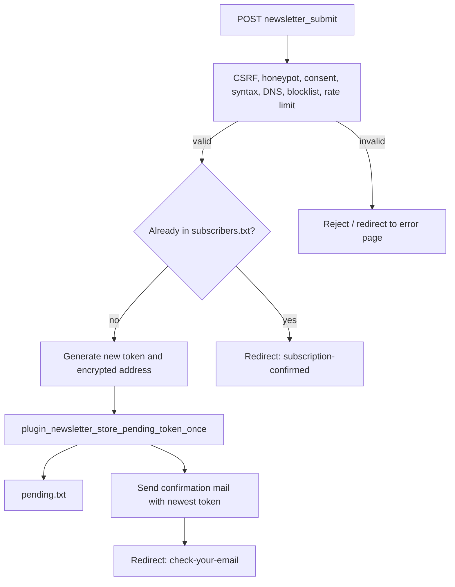
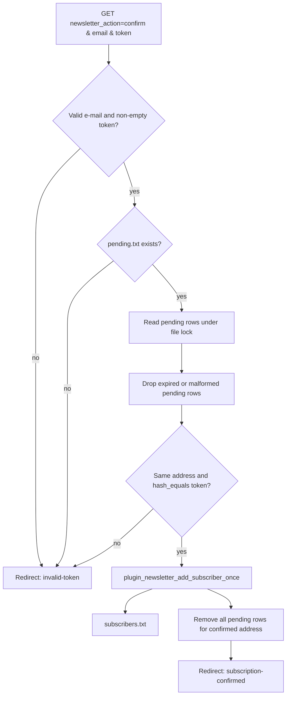
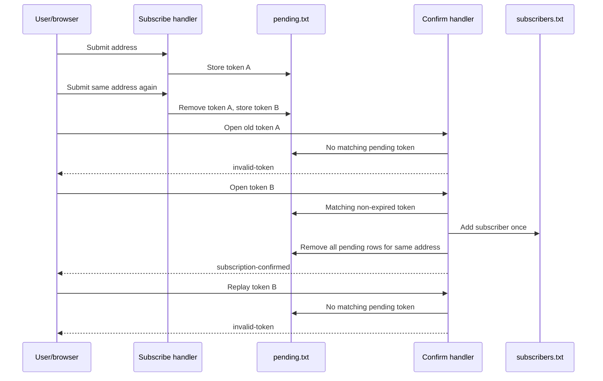

# 01 — Double Opt-in De-duplication

## Goal

The newsletter plugin must never allow one e-mail address to create several active pending confirmation links or several confirmed subscriber rows.

The implementation uses three layers:

1. `plugin_newsletter_store_pending_token_once()` replaces older non-expired pending tokens for the same address whenever a new subscription request is accepted.
2. `plugin_newsletter_confirm_pending_token()` confirms only a non-expired matching token and removes every pending token for that same address after a successful confirmation.
3. `plugin_newsletter_add_subscriber_once()` appends the subscriber only when no matching subscriber row exists and reduces legacy duplicate rows for that address to one preserved row.

## Address comparison

Encrypted storage cannot be compared directly because encryption is randomized. The plugin therefore decrypts stored addresses and compares normalized plain addresses through `plugin_newsletter_email_matches()`.

The comparison key keeps the local part unchanged and normalizes the domain part through `plugin_newsletter_normalize_domain()` to lower-case ASCII when possible. This avoids duplicate rows caused by domain casing or IDN spelling while not merging local parts that a strict mail system could treat as different mailboxes.

## Subscription flow

## Confirmation flow

## Sequence of duplicate protection

## Invariants

| Invariant                                                                                                                 | Enforced by                                            |
| ------------------------------------------------------------------------------------------------------------------------- | ------------------------------------------------------ |
| At most one active pending token per address after a normal subscription request                                          | `plugin_newsletter_store_pending_token_once()`         |
| A successful confirmation removes all pending tokens for that address                                                     | `plugin_newsletter_confirm_pending_token()`            |
| A subscriber row is appended only if the address is not already confirmed                                                 | `plugin_newsletter_add_subscriber_once()`              |
| Legacy duplicate subscriber rows for a confirmed address are reduced to one row on the next confirmation for that address | `plugin_newsletter_add_subscriber_once()`              |
| Other addresses are not affected by the cleanup                                                                           | Storage callbacks filter only matching comparison keys |
