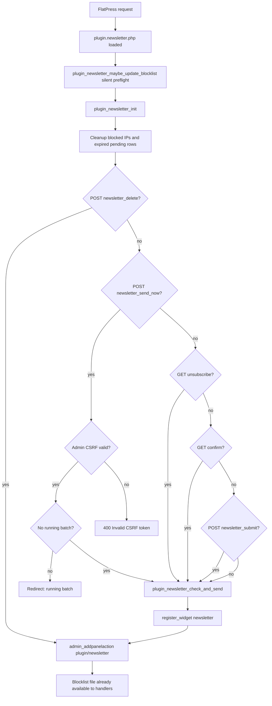
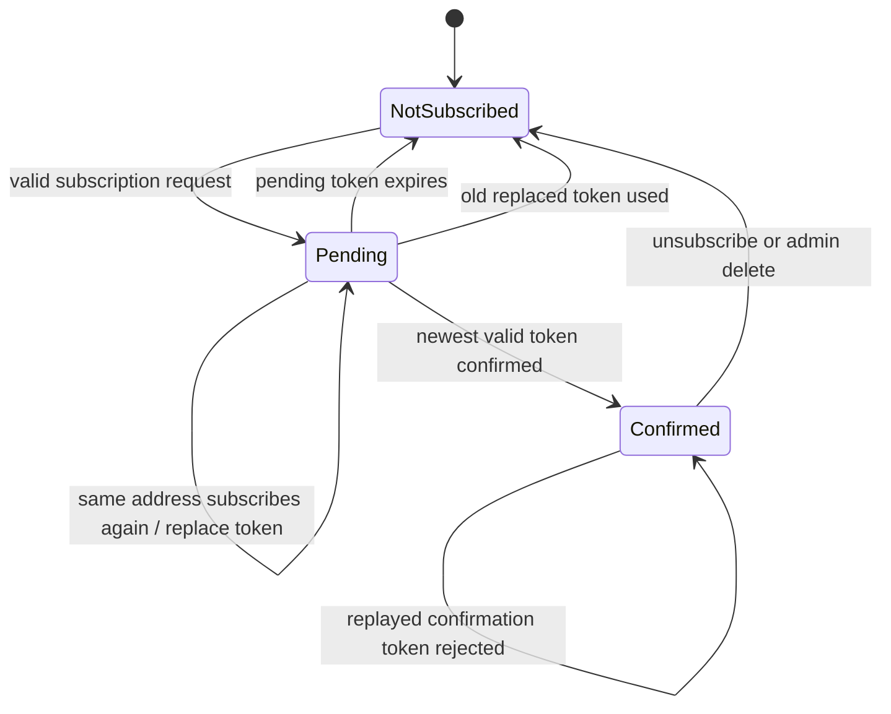
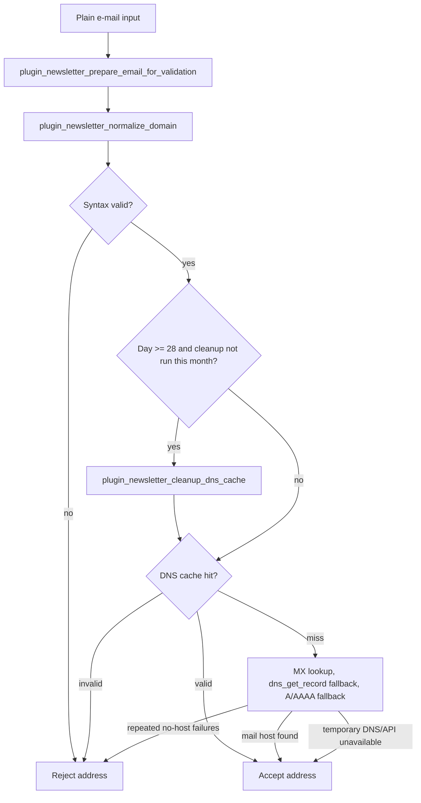
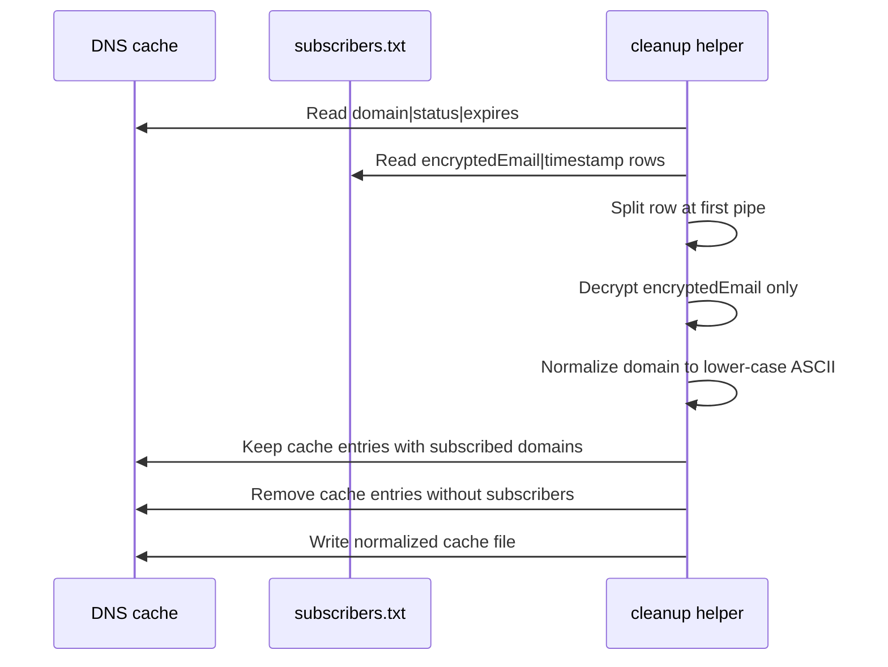

# 02 — State and Events

## Main state files

| File                             | Purpose                                                                   | Writer                                                    |
| -------------------------------- | ------------------------------------------------------------------------- | --------------------------------------------------------- |
| `pending.txt`                    | Non-confirmed double opt-in entries: `encryptedEmail|token|UnixTimestamp` | subscription and confirmation logic                       |
| `subscribers.txt`                | Confirmed entries: `encryptedEmail|UnixTimestamp`                         | confirmation, unsubscribe, admin delete, dispatch cleanup |
| `batch-offset.txt`               | Current staggered dispatch offset                                         | automatic and manual dispatch                             |
| `next-send-date.txt`             | Next scheduled dispatch timestamp                                         | automatic and manual dispatch                             |
| `manual-flag.txt`                | Marks a manual batch run after admin CSRF validation                      | admin send-now and dispatch completion                    |
| `blocked-ips.txt`                | Honeypot/rate-limit lockouts                                              | subscription handler                                      |
| `disposable-email-blocklist.txt` | Local disposable-domain list                                              | blocklist updater                                         |
| `newsletter-dns-cache.txt`       | Cached DNS validation results                                             | validation routine                                        |

## Request-level event map

## Request-order invariants

| Invariant                                                                                          | Reason                                                                                    |
| -------------------------------------------------------------------------------------------------- | ----------------------------------------------------------------------------------------- |
| Blocklist maintenance runs before subscription handling                                            | A clean installation can apply a freshly downloaded disposable-domain list immediately    |
| Failed pre-request blocklist fetches are silent and throttled                                      | Redirects and headers must not be broken by warning output on strict shared hosting       |
| `manual-flag.txt` is created only after a valid admin CSRF token                                   | Forged or stale POST requests must not leave a manual-dispatch marker                     |
| A running batch prevents a new manual send-now dispatch before `manual-flag.txt` is created        | Existing automatic or manual batch state remains authoritative                            |

## Double opt-in state machine

## Storage rules for pending and subscribers

- `pending.txt` is treated as a short-lived token queue.
- New pending entries are written through `plugin_newsletter_store_pending_token_once()`.
- Confirmations are processed through `plugin_newsletter_confirm_pending_token()`.
- Confirmed rows are written through `plugin_newsletter_add_subscriber_once()`.
- Stored encrypted values are never compared directly; comparison always decrypts and normalizes the plain address.
- Malformed and expired pending rows are removed opportunistically during storage and confirmation operations.

## Validation and DNS-cache lifecycle

## DNS-cache cleanup invariant

The DNS cache stores normalized ASCII domains. Cleanup must therefore derive subscriber domains from the subscriber row format `encryptedEmail|UnixTimestamp` by decrypting only the first column.

