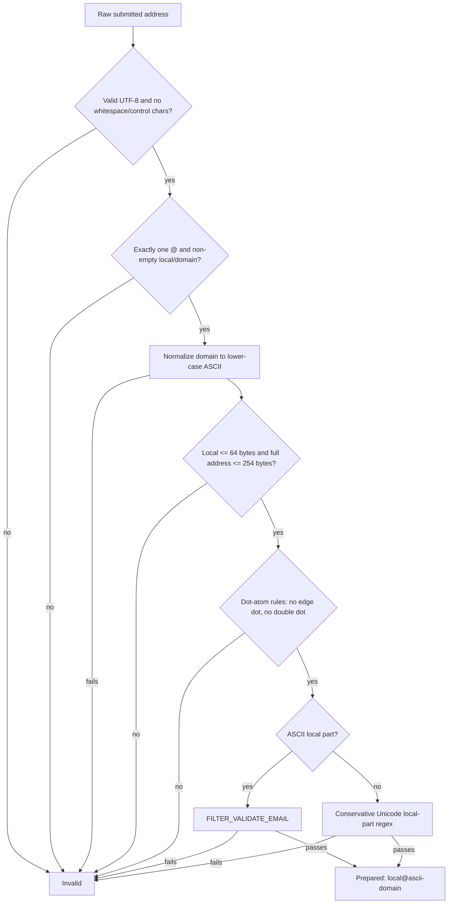
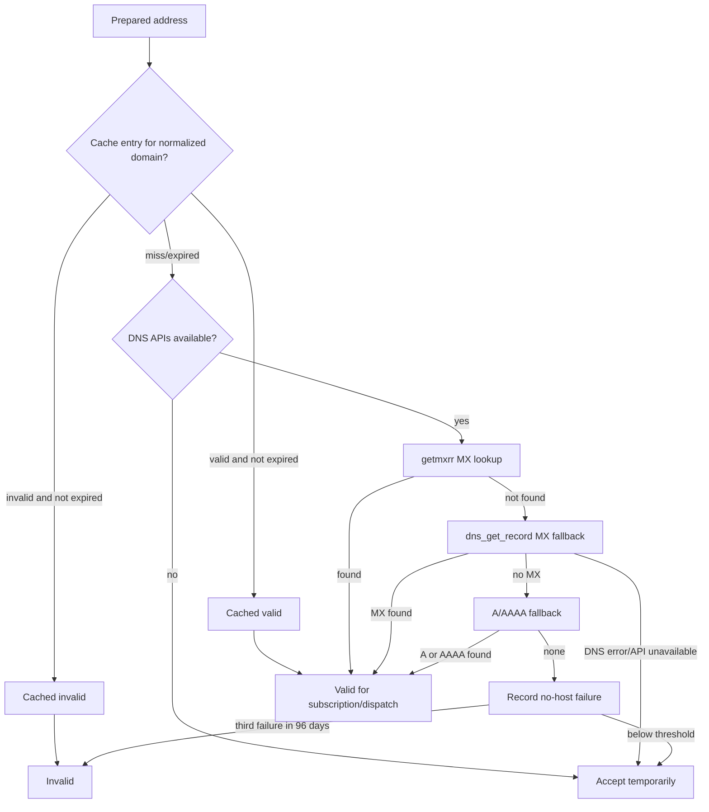
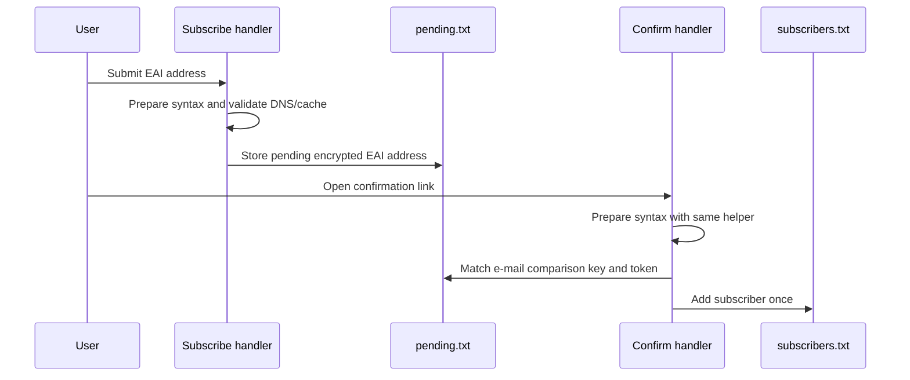

# 04 — Email Validation and DNS Cache

## Goal

The newsletter plugin should accept valid ASCII addresses and improve support for EAI/SMTPUTF8-style Unicode local parts without breaking shared-hosting compatibility.

The implementation separates three concerns:

1. `plugin_newsletter_prepare_email_for_validation()` performs syntax preparation and returns a normalized representation.
2. `plugin_newsletter_normalize_domain()` converts domains to lower-case ASCII and uses IDN/Punycode conversion when PHP's `intl` extension is available.
3. `plugin_newsletter_cleanup_dns_cache()` removes DNS-cache entries whose normalized domains no longer belong to confirmed subscribers.

## Validation flow

## DNS flow

## DNS-cache cleanup

The cleanup runs at most once per month from day 28 when validation is called. It can also be called directly by the simulation.

Rules:

- Cache rows are parsed as `domain|status|expires`.
- Cache domains are normalized before being used as keys.
- Subscriber rows are parsed as `encryptedEmail|UnixTimestamp`.
- Only the encrypted e-mail column is decrypted.
- The subscriber domain is normalized with the same helper as validation.
- Cache entries for domains without confirmed subscribers are removed.

## EAI boundaries

The fallback improves compatibility for Unicode local parts on PHP builds where `FILTER_VALIDATE_EMAIL` rejects them. It does not guarantee that every downstream mail transport or provider accepts SMTPUTF8 during delivery. The plugin can validate and store such addresses; final delivery still depends on the server MTA and the receiving provider.

IDN domains require PHP's `intl` extension for reliable conversion. When `intl` is unavailable and a submitted domain contains non-ASCII characters, the plugin rejects the address rather than performing an invalid DNS lookup.

## Confirmation links

The confirmation handler uses the same syntax preparation helper as subscription validation for the formal e-mail check. This avoids a split-brain situation where a Unicode local part is accepted during subscription but rejected by the later confirmation link before `pending.txt` is checked.

