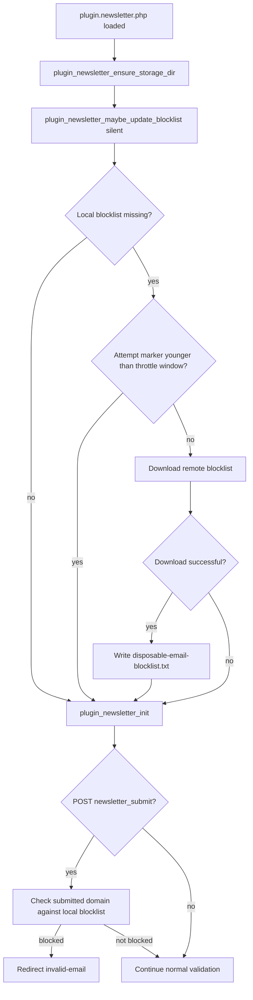
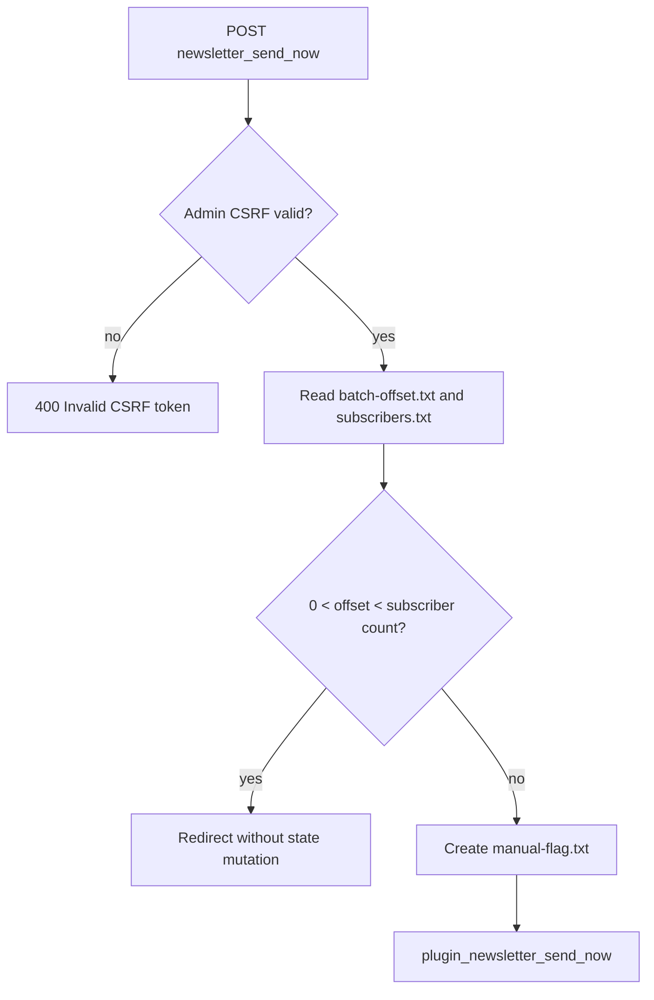

# 05 — Request Ordering and Blocklist Bootstrap

## Goal

Two request-ordering guarantees protect the newsletter state before any visible side effect is created:

1. The disposable-domain blocklist is refreshed before request handlers can accept a subscription.
2. The admin send-now request validates CSRF before `manual-flag.txt` can be created.

Both changes are deliberately small and keep the plugin compatible with flat-file shared hosting.

## Blocklist strategy

| Step | Condition                                     | Action                                                                                    |
| ---- | --------------------------------------------- | ----------------------------------------------------------------------------------------- |
| B1   | Plugin file is loaded                         | Ensure `FP_CONTENT/plugin_newsletter/` exists                                             |
| B2   | Local blocklist is missing                    | Try one initial download before `plugin_newsletter_init()` handles POST/GET actions       |
| B3   | Initial download fails                        | Touch the attempt marker and retry at most once per hour                                  |
| B4   | Local blocklist exists and day of month < 25  | Skip monthly update                                                                       |
| B5   | Local blocklist exists and day of month >= 25 | Update only if the file was not already refreshed in the current month                    |
| B6   | Pre-request update fails                      | Log via `error_log()` instead of emitting a warning before headers                        |
| B7   | Remote source remains unavailable             | Continue with CSRF, consent, syntax, DNS, rate-limit, and existing local blocklist checks |

The strategy avoids a hard dependency on the remote source. A missing or unreachable remote blocklist must not make the blog unusable. When the download succeeds, the first subscription request can already be checked against the downloaded list.

## Blocklist bootstrap flow

## Admin send-now strategy

| Step | Condition                       | Action                                                            |
| ---- | ------------------------------- | ----------------------------------------------------------------- |
| A1   | `POST newsletter_send_now`      | Validate the admin CSRF token first                               |
| A2   | CSRF invalid or missing         | Return `400 Bad Request`; do not read/write manual-dispatch state |
| A3   | CSRF valid                      | Check `batch-offset.txt` and subscriber count                     |
| A4   | Existing batch is still running | Redirect back without creating `manual-flag.txt`                  |
| A5   | No running batch                | Create `manual-flag.txt` and start the normal send-now batch      |

## Admin send-now flow

## Simulation coverage

| ID  | Covered behavior                                                        | Expected result                                      |
| --- | ----------------------------------------------------------------------- | ---------------------------------------------------- |
| R15 | Running batch state before manual send-now preparation                  | No `manual-flag.txt` is created                      |
| R16 | Idle state before manual send-now preparation                           | `manual-flag.txt` is created                         |
| R24 | Monthly blocklist refresh                                               | Newly blocked subscribers are removed                |
| R25 | Invalid admin CSRF request in an isolated child request                 | No `manual-flag.txt` is created                      |
| R26 | First subscription request on a clean install with a remote blocklist   | Blocklist is downloaded before subscription handling |
| R27 | Blocked first-request subscription domain                               | No row is written to `pending.txt`                   |

## Compatibility notes

- The pre-request blocklist call uses the same updater and throttling markers as the later maintenance path.
- Silent mode uses `error_log()` on failure so redirects and `header()` calls remain safe.
- The admin CSRF fix only reorders existing checks and moves state mutation behind validation.
- No Smarty template behavior changes are required.
- No Composer, database, cron job, or long-running process is introduced.
