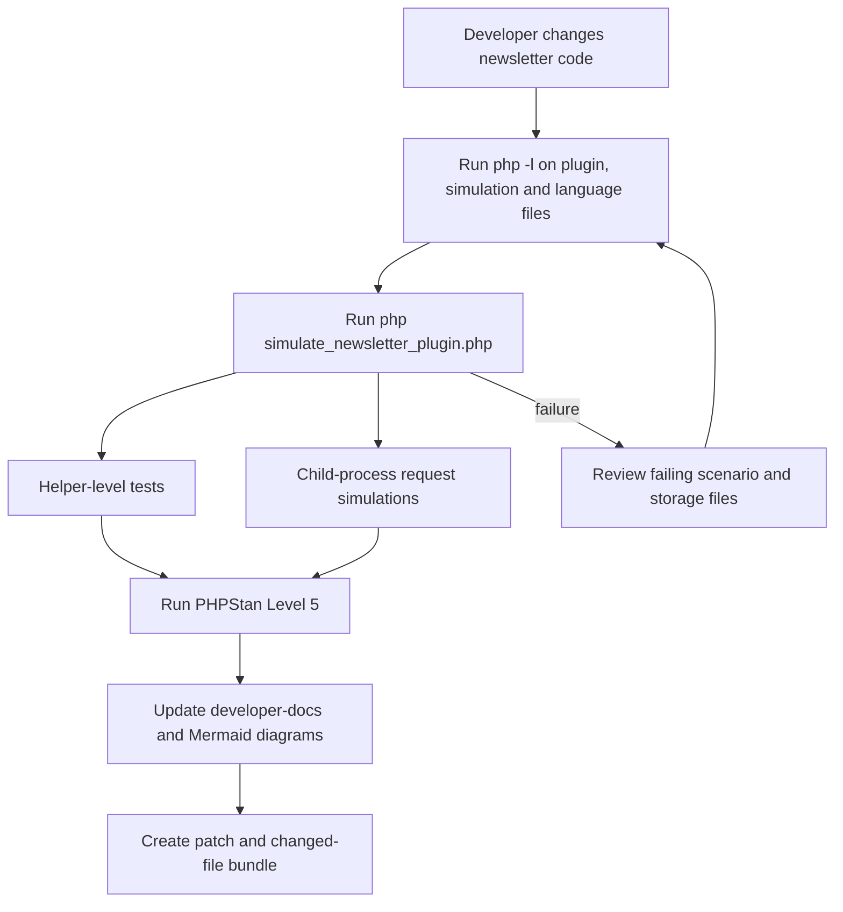
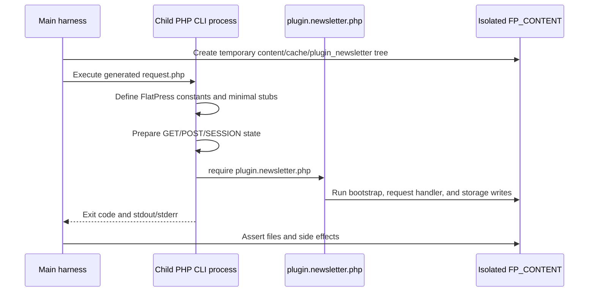

# 03 — Regression Test Matrix

## Simulation script

Run from the FlatPress blog root:

```bash
php simulate_newsletter_plugin.php
```

The simulation creates an isolated temporary `FP_CONTENT` tree, prevents accidental network blocklist downloads in the main harness, includes the real Newsletter plugin, and tests helper functions plus isolated child-process request paths. The child-process checks are important because the plugin performs request handling during file inclusion.

## Current coverage summary

| Area                         | Coverage level | Notes                                                                                 |
| ---------------------------- | -------------- | ------------------------------------------------------------------------------------- |
| Double opt-in storage        | High           | New, replayed, expired, malformed, and legacy-duplicate pending rows are tested       |
| Subscriber deduplication     | High           | Existing duplicate subscriber rows are reduced through the real confirmation helper   |
| E-mail validation            | High           | ASCII, EAI fallback, local-part rejection, domain normalization, and cache paths run  |
| DNS-cache cleanup            | High           | Cleanup parses `encryptedEmail\|timestamp` rows and removes stale cache domains       |
| Admin send-now ordering      | High           | Invalid CSRF, running batch, and allowed manual-dispatch preparation are covered      |
| Blocklist bootstrap/cleanup  | High           | First-request bootstrap and monthly subscriber cleanup are covered                    |
| Front-end subscribe security | High           | Widget CSRF/honeypot, valid request, consent, and honeypot blocking are covered       |
| Dispatch cleanup             | Medium         | Invalid subscriber removal and bounce logging are covered without sending real mail   |
| Unsubscribe                  | Medium         | Matching-row removal is covered in an isolated request                                |
| Mail transport delivery      | Not simulated  | Real SMTP/MTA delivery and provider limits are outside deterministic regression tests |

## Covered scenarios

| ID  | Scenario                                              | Expected result                                                                                                                                 |
| --- | ----------------------------------------------------- | ----------------------------------------------------------------------------------------------------------------------------------------------- |
| R1  | Same address subscribes twice before confirmation     | Only the newest pending token remains                                                                                                           |
| R2  | Older replaced token is confirmed                     | Token is rejected and no subscriber is created                                                                                                  |
| R3  | Newest token is confirmed                             | Exactly one subscriber row is created                                                                                                           |
| R4  | Valid token is replayed after successful confirmation | Replay is rejected and subscriber count stays one                                                                                               |
| R5  | Legacy duplicate pending rows exist before the fix    | First valid confirmation creates one subscriber and removes all pending duplicates for that address                                             |
| R6  | Legacy duplicate subscriber rows exist before the fix | Next confirmation for that address reduces rows to one                                                                                          |
| R7  | Domain casing differs                                 | Domain part is normalized for duplicate detection                                                                                               |
| R8  | Local-part casing differs                             | Local part remains distinct to avoid merging mailboxes a strict provider may treat separately                                                   |
| R9  | Unicode/EAI local part with ASCII domain              | `plugin_newsletter_prepare_email_for_validation()` accepts the address through the fallback path and keeps DNS on the ASCII domain              |
| R10 | EAI confirmation                                      | A Unicode-local-part address can be moved from `pending.txt` to `subscribers.txt` with the same comparison semantics                            |
| R11 | Invalid local part patterns                           | Leading dot, consecutive dot, whitespace, and missing domain are rejected                                                                       |
| R12 | DNS-cache cleanup with subscriber rows                | The cleanup decrypts only the encrypted e-mail column of `encryptedEmail\|timestamp`, keeps subscribed domains, and removes stale cache entries |
| R13 | Subscriber-row helper                                 | `plugin_newsletter_decrypt_subscriber_email()` returns the plain address without treating the timestamp as ciphertext                           |
| R14 | Expired or malformed pending rows                     | Expired and malformed rows cannot be confirmed and are removed during cleanup                                                                   |
| R15 | Running manual/monthly batch state                    | `plugin_newsletter_prepare_manual_dispatch()` refuses a new manual dispatch and does not create `manual-flag.txt`                               |
| R16 | Idle manual dispatch preparation                      | The helper accepts the state and creates `manual-flag.txt` only after dispatch is allowed                                                       |
| R17 | Send-now batch contains an invalid subscriber         | The invalid row is removed from `subscribers.txt` and written to `bounced-log.txt`                                                              |
| R18 | Header-injection style sender/subject input           | Sender fallback and subject encoding remove CRLF header-injection vectors                                                                       |
| R19 | Widget render path                                    | The widget creates CSRF/honeypot state, renders consent controls, and hides itself for a blocked IP                                             |
| R20 | Valid front-end subscription request                  | The request exits cleanly and writes exactly one pending row                                                                                    |
| R21 | Missing privacy consent                               | The request exits cleanly and writes no pending row                                                                                             |
| R22 | Honeypot field is filled                              | The request exits cleanly, records the blocked IP, and writes no pending row                                                                    |
| R23 | Unsubscribe request                                   | The matching subscriber row is removed while unrelated rows remain                                                                              |
| R24 | Monthly blocklist refresh                             | Newly blocked subscriber domains are removed and unreadable legacy rows are preserved                                                           |
| R25 | Invalid admin send-now CSRF                           | The isolated request exits without creating `manual-flag.txt`                                                                                   |
| R26 | First-request blocklist bootstrap                     | A missing local blocklist is downloaded before subscription handling                                                                            |
| R27 | Blocked first-request subscription                    | The submitted address is rejected without adding a pending token                                                                                |

## Regression flow



## Request simulations



## Manual checks after code changes

| Step | Command or review target                                                                                                                    | Expected result                   |
| ---- | ------------------------------------------------------------------------------------------------------------------------------------------- | --------------------------------- |
| M1   | `php -l fp-plugins/newsletter/plugin.newsletter.php`                                                                                        | No syntax errors                  |
| M2   | `php -l simulate_newsletter_plugin.php`                                                                                                     | No syntax errors                  |
| M3   | `php -l fp-plugins/newsletter/lang/*.php`                                                                                                   | No syntax errors                  |
| M4   | `php simulate_newsletter_plugin.php`                                                                                                        | All scenarios report `OK`         |
| M5   | `php .dist/phpstan.phar analyse --configuration=.dist/phpstan.neon.dist fp-plugins/newsletter simulate_newsletter_plugin.php --no-progress` | PHPStan Level 5 reports no errors |
| M6   | Review `developer-docs/*.md` Mermaid blocks                                                                                                 | Diagrams are still valid Markdown |
| M7   | Review generated diff against the exact uploaded archive                                                                                    | Patch is consistent with baseline |

## Compatibility notes

- The simulation uses PHP 7.2-compatible syntax and avoids Composer, databases, cron, shell-only FlatPress assumptions, or external services.
- Child-process tests locate a real PHP CLI binary and reject `php-cgi`, `phpdbg`, Apache/httpd binaries, and other non-CLI candidates.
- Plugin runtime changes avoid Smarty-specific behavior; admin template compatibility with Smarty 5.8.0 is unaffected.
- File updates continue to use newsletter storage helpers and `LOCK_EX`, preserving flat-file hosting compatibility.
- EAI validation does not prove downstream SMTPUTF8 delivery. It verifies plugin-side acceptance, comparison, and storage only.
- IDN domains still need PHP's `intl` extension for portable Punycode conversion. Without it, non-ASCII domains are rejected instead of being queried incorrectly.
