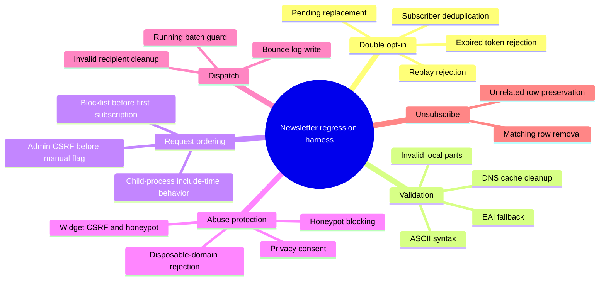
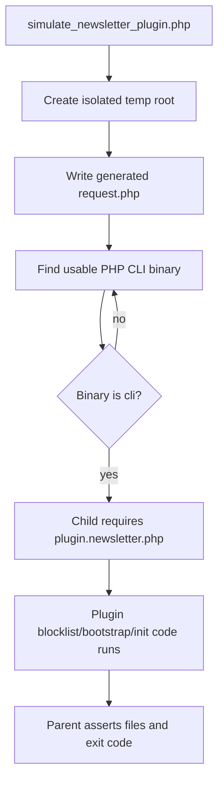

# 06 — Simulation Harness and Coverage

## Purpose

`simulate_newsletter_plugin.php` is a regression harness for maintainers. It is intentionally not a browser test and not an SMTP delivery test. Its job is to verify the sensitive file-based state transitions that are easy to break when the Newsletter plugin is changed.

The script must remain small enough to run on a developer checkout, but broad enough to catch regressions in subscription, confirmation, validation, blocklist, dispatch, and request-order behavior.

## Harness design

| Layer                | What it tests                                                                | Why it exists                                                            |
| -------------------- | ---------------------------------------------------------------------------- | ------------------------------------------------------------------------ |
| Main process         | Pure helper functions and direct storage transformations                     | Fast checks with readable failure messages                               |
| Isolated child PHP   | Request-order paths that run while `plugin.newsletter.php` is included       | The plugin handles POST/GET actions at include time                      |
| Temporary content    | `FP_CONTENT`, `CACHE_DIR`, `plugin_newsletter/`, and generated request files | No developer data or real blog content is touched                        |
| Local blocklist file | First-request bootstrap and monthly cleanup without a network dependency     | Remote GitHub availability must not decide whether regression tests pass |
| DNS cache seeding    | Valid-domain paths without live DNS dependency                               | Shared hosts may have restricted DNS functions                           |

## Coverage model

## Sensitive files asserted by the simulation

| File                                          | Regression concern                                                         | Covered by                |
| --------------------------------------------- | -------------------------------------------------------------------------- | ------------------------- |
| `pending.txt`                                 | Duplicate tokens, expired tokens, malformed rows, blocked subscriptions    | R1-R5, R14, R20-R22, R27  |
| `subscribers.txt`                             | Duplicate subscribers, unsubscribe, invalid-recipient cleanup, blocklist   | R3-R6, R17, R23-R24       |
| `manual-flag.txt`                             | Forged admin requests or running batches creating a manual-dispatch marker | R15-R16, R25              |
| `batch-offset.txt`                            | Running batch detection and active-batch cleanup behavior                  | R15-R17                   |
| `disposable-email-blocklist.txt`              | Bootstrap before first subscription and monthly refresh                    | R24, R26-R27              |
| `disposable-email-blocklist.last_attempt.txt` | Retry throttling interaction during blocklist refresh                      | R24, R26                  |
| `newsletter-dns-cache.txt`                    | Normalized domain cache lookup and cleanup                                 | R9, R12, R17              |
| `dns-cleanup-marker.txt`                      | Monthly DNS cleanup marker write                                           | R12                       |
| `blocked-ips.txt`                             | Honeypot-based temporary IP blocking                                       | R19, R22                  |
| `bounced-log.txt`                             | Invalid subscriber removal audit trail                                     | R17                       |

## Include-time request flow

## What is deliberately not tested

| Not tested                         | Reason                                                                                    |
| ---------------------------------- | ----------------------------------------------------------------------------------------- |
| Real SMTP delivery                 | Provider limits, spam filters, SPF/DKIM/DMARC, and local MTA setup are outside the plugin |
| Live remote blocklist availability | Tests use local files so network outages do not produce false failures                    |
| Live DNS availability              | DNS cache seeding keeps the test deterministic across shared hosting environments         |
| Theme-specific browser rendering   | The harness checks widget state and key form fields, not visual theme output              |
| Smarty template rendering          | No template changes are made by the tested logic                                          |

## Rules for future maintainers

1. Add a regression scenario whenever a bug fix changes a storage file, redirect path, security check, or validation branch.
2. Prefer helper-level tests for deterministic transformations.
3. Use child-process request tests when the behavior depends on plugin include order.
4. Keep tests independent of the public internet and of the developer's real FlatPress content directory.
5. Keep every new assertion readable; the failure message should name the broken guarantee.
