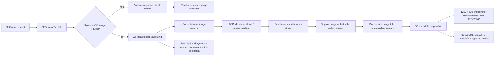

# SEO Meta Tag Info — Developer Documentation

## Scope

Relevant plugin versions:

| Component | Version | Role in this documentation |
|---|---:|---|
| SEO Meta Tag Info | 2.3.2 | Primary subject |
| BBCode | 2.0.4 | Active BBCode grammar and `[img]` rendering |
| PhotoSwipe | 2.0.7 | `[gallery]`, `[photoswipegallery]`, `[photoswipeimage]`, and `[img]` override |
| Thumbnails | 1.1.1 | Preview/thumbnail generation behind `bbcode_img_scale` |
| ReadMore | 1.0.4 | Stream visibility boundary |
| Gallery captions | 1.0.3 | Author-managed per-gallery image titles persisted through FlatPress gallery helpers |
| FlatPress | 1.6.dev | Query, gallery, entry, hook, and filesystem APIs |

The current target range used by the project is **PHP 7.2 through PHP 8.5** and **Smarty 4.5.5 through Smarty 5.8.4**. The Open Graph image pipeline itself does not require Smarty-specific syntax.

This is developer documentation, not end-user documentation. The short end-user file `../doc_seometataginfo.txt` remains separate.

## Source-of-truth rule

When this documentation and the code disagree, **the current target code wins**. The most important implementation files are:

- `../plugin.seometataginfo.php`
- `../inc/og-content-image.php`
- `../inc/hw-helpers.php`
- `../inc/class.iniparser.php`
- `../inc/migrate_data.php`
- `../tpls/admin.plugin.seometataginfo.tpl`
- `../regression-test/*.php`

The image pipeline also depends on behavior defined by:

- `../../bbcode/plugin.bbcode.php`
- `../../photoswipe/plugin.photoswipe.php`
- `../../photoswipe/photoswipefunctions.class.php`
- `../../thumb/plugin.thumb.php`
- `../../readmore/plugin.readmore.php`
- `../../gallerycaptions/plugin.gallerycaptions.php`
- `../../gallerycaptions/admin_uploader_gallerycaptions.class.php`
- `../../../fp-includes/core/core.gallery.php`
- `../../../fp-includes/core/core.fpdb.class.php`

## Documentation map

1. [Architecture and lifecycle](architecture.md)
2. [Open Graph image pipeline](open-graph-image-pipeline.md)
3. [Metadata storage and administration](metadata-storage-admin.md)
4. [Plugin and core integrations](integrations.md)
5. [Configuration, caching, and HTTP behavior](configuration-and-caching.md)
6. [Security model](security.md)
7. [Compatibility](compatibility.md)
8. [Testing and static analysis](testing.md)
9. [API reference](api-reference.md)
10. [Maintenance and extension guide](maintenance.md)

## High-level responsibilities

SEO Meta Tag Info has several responsibilities that should remain conceptually separate:

- persist per-entry, static-page, category, tag, archive, and default SEO metadata;
- emit standard SEO meta tags and canonical URLs;
- emit Open Graph metadata;
- derive article metadata for single-entry views;
- select a content-aware Open Graph image;
- derive `og:image:alt` from the selected image's explicit BBCode `title` or Gallery caption, with site-title fallback;
- serve locally generated 1200 × 630 Open Graph image responses;
- expose per-entry SEO description/keywords to Smarty entry templates;
- provide an administration panel for the host-level `robots.txt`;
- migrate older SEO metadata layouts when explicitly enabled.

The content-aware image feature is deliberately implemented inside the SEO plugin. BBCode, PhotoSwipe, and Thumb are treated as rendering semantics and dependencies; they do not contain SEO-specific logic.

## Key invariants

Developers changing the image pipeline should preserve these invariants:

1. **Original media selection:** SEO selection is based on the original image source, never on a `.thumbs` preview.
2. **Source order:** the first valid visible media occurrence wins.
3. **Gallery order:** `gallery_read_images()` defines gallery ordering, while `gallery_read_captions()` supplies the title for the exact selected gallery file.
4. **ReadMore visibility:** a multi-entry stream must not publish media that ReadMore hides.
5. **Single/static completeness:** single entries and static pages may select media after `[more]`.
6. **No live media rendering during probing:** probing must not create thumbnails or advance PhotoSwipe state.
7. **Primary query safety:** scanning the stream must not consume or replace the page's active query state.
8. **Local-path containment:** local OG sources must resolve inside `IMAGES_DIR`.
9. **No remote fetch:** remote HTTP(S) images are validated syntactically but are not downloaded/proxied by the server.
10. **No distortion:** transformable local JPEG/PNG sources are fitted proportionally onto the configured OG canvas.
11. **Explicit invalid source does not become theme preview:** a requested but invalid `seometa_ogsource` remains an invalid content-image request.
12. **HTML-escaped query tolerance:** copied URLs containing literal `&amp;` / repeated `amp;` parameter prefixes are accepted without weakening parameter precedence or path validation.
13. **Image-description binding:** an explicit `[img ... title="..."]` or the Gallery caption of the exact selected file becomes `og:image:alt`; missing/empty titles fall back to `general.title` and never change image selection.
14. **No alt substitution:** a BBCode `alt` attribute, filename, IPTC title, thumbnail title, or caption from a later gallery image must not substitute for a missing user image title.

## Architectural overview

## What is deliberately not done

- No DOM scraping of the final rendered page.
- No selection from `` because it may point to `.thumbs`.
- No server-side download of remote Open Graph images.
- No direct mutation of the BBCode, PhotoSwipe, or Thumb plugin for SEO purposes.
- No use of `get.php` as an image or thumbnail wrapper.
- No dependency on a specific Apache/nginx/IIS rewrite configuration for the OG endpoint.
