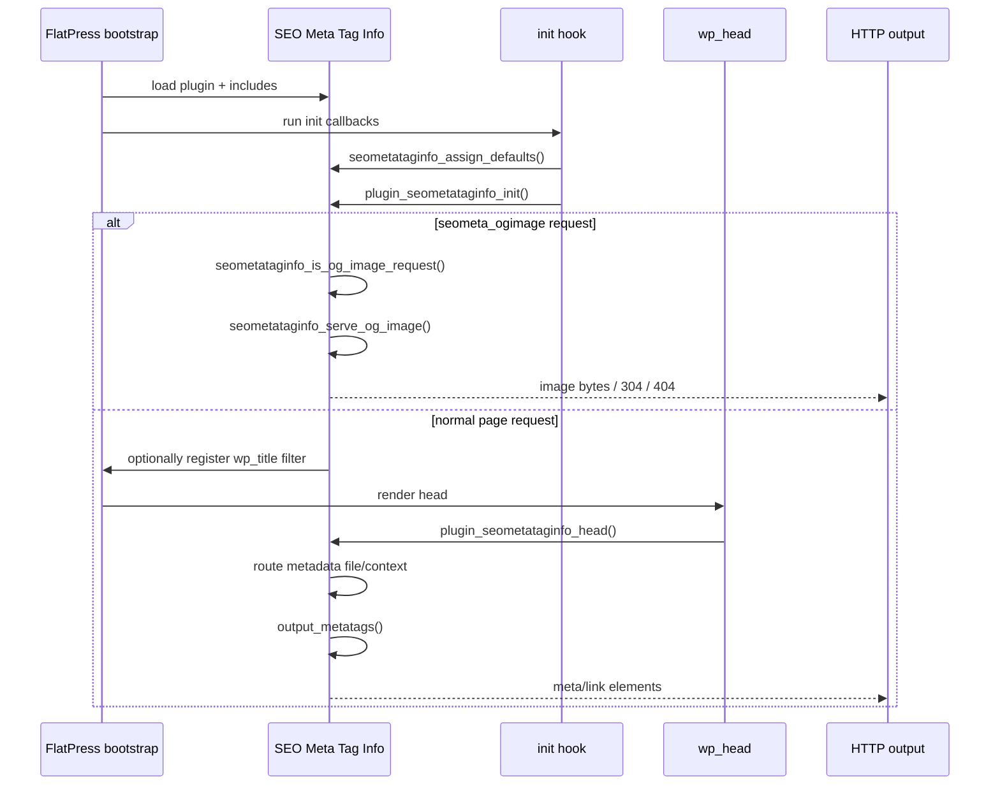
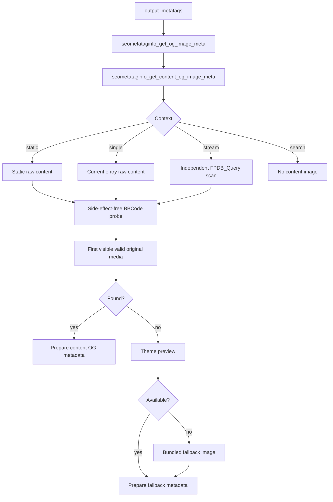

# Architecture and Lifecycle

## 1. Plugin load

`plugin.seometataginfo.php` loads four local includes:

```php
require ('inc/hw-helpers.php');
require ('inc/og-content-image.php');
require ('inc/class.iniparser.php');
require ('inc/migrate_data.php');
```

The main file then defines feature flags, Open Graph constants, storage-directory constants, admin integration, request hooks, metadata emitters, and image-serving functions.

The include order matters because:

- `hw-helpers.php` supplies context helpers such as `is_single()`, `is_static()`, and `currentPageURL()` only when the corresponding function is not already defined;
- `og-content-image.php` relies on constants/functions defined by FlatPress at runtime but is safe to load before it is invoked;
- `iniParser` is used later by metadata routing and admin entry handling;
- migration helpers depend on the SEO storage constants and are invoked only after those constants are defined.

## 2. FlatPress hooks

Primary hooks registered by the plugin:

| Hook | Priority | Callback | Purpose |
|---|---:|---|---|
| `init` | 0 | `seometataginfo_assign_defaults` | Initialize Smarty variables `seo_desc` and `seo_keywords` |
| `init` | default | `plugin_seometataginfo_init` | Serve dynamic OG requests early; otherwise register title filter |
| `wp_head` | 1 | `plugin_seometataginfo_head` | Route page metadata and emit SEO/Open Graph tags |
| `entry_block` | 0 | `seometataginfo_assign_entry_vars` | Populate per-entry SEO Smarty variables |
| `wp_title` | 10 | `makePageTitle` | Add context-specific page title suffix when enabled |

Admin/editor hooks are documented in [metadata-storage-admin.md](metadata-storage-admin.md).

## 3. Request lifecycle



The important separation is that the dynamic image endpoint runs during `init`, while normal metadata generation happens later in `wp_head`.

## 4. Normal metadata routing

`plugin_seometataginfo_head()` distinguishes these contexts:

1. tag;
2. archive;
3. category;
4. single entry;
5. blog page;
6. contact page;
7. ordinary static page;
8. configured static home page;
9. fallback/default metadata.

For tag/archive/category contexts, specialized `process_*_meta()` functions call the shared `process_meta()` helper.

For entries and static/blog/contact pages, the function resolves the appropriate INI file, calls `seometataginfo_ensure_metafile()`, reads values through `iniParser`, and calls `output_metatags()`.

## 5. Open Graph image architecture

The normal page request never waits for final entry HTML to exist. Open Graph metadata is needed in `<head>`, before the template has rendered the full body.

Therefore the image subsystem operates on the current FlatPress data/query model:



## 6. Why the parser is cloned

`seometataginfo_content_probe_media()` calls `plugin_bbcode_init()` and **clones** the active parser. It does not run the real media callbacks.

On the clone, it replaces only media callbacks that are actually registered:

- `img`
- `photoswipeimage`
- `gallery`
- `photoswipegallery`

The replacement callback emits a unique marker and stores the parsed attributes. All other BBCode grammar, nesting rules, content types, and code flags are retained.

This design provides three properties simultaneously:

- syntax matches the current BBCode parser;
- tags hidden by parser rules such as literal code blocks do not become media;
- probing does not invoke thumbnail generation or PhotoSwipe rendering state.

## 7. Global-state restoration

Two areas use temporary global state and explicitly restore it.

### Media probe context

`$GLOBALS['seometataginfo_media_probe_context']` stores the current marker counter, nonce, and token list while the cloned parser runs. Any pre-existing value is restored in `finally`.

### Stream query scan

Creating `new FPDB_Query(...)` changes `$GLOBALS['current_query']` as a constructor side effect. Entry parsing may also change `$GLOBALS['post']`.

`seometataginfo_get_stream_content_image_meta()` saves both keys, scans in `try`, and restores/unsets them in `finally`.

This is a critical regression invariant.

## 8. Search context

`seometataginfo_get_content_og_image_meta()` intentionally returns no content image for `is_search()`.

FlatPress search uses a result collection that is different from the ordinary FPDB stream window. Publishing a media item from the ordinary query in that context could therefore be unrelated to the visible search results. The normal theme/plugin fallback remains available.
