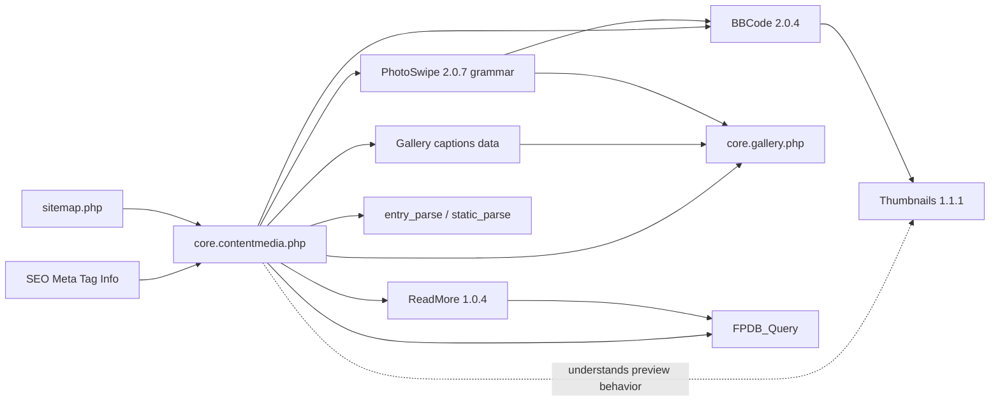

# Plugin and Core Integrations

## 1. Integration map



The arrows do not all represent direct function calls. Some represent semantic dependencies that the shared content-media resolver deliberately mirrors without invoking the renderer. SEO and the sitemap are separate consumers of that resolver.

## 2. BBCode

### Relevant hooks

BBCode registers:

```text
the_content priority 1 -> BBCode
the_excerpt priority 1 -> BBCode
bbcode_init            -> extension point
```

`plugin_bbcode_init()` constructs the parser and applies the `bbcode_init` filter before returning it.

The shared resolver calls `plugin_bbcode_init()` to obtain the **active grammar**, then clones the parser.

### `[img]`

BBCode's image callback starts with the original source:

```php
$absolutepath = $actualpath = $attributes['default'];
```

For local `images/...` sources, `bbcode_remap_url()` maps the namespace to `IMAGES_DIR`.

When rendered dimensions differ, BBCode calls `bbcode_img_scale`. The resulting thumbnail path can become ``.

This is the core reason SEO must not select the final HTML ``.

### Attachments versus images

Current BBCode behavior explicitly keeps image paths as direct filesystem/public paths. The `get.php` wrapper is for attachment downloads, not for image or thumbnail distribution.

The SEO image resolver therefore uses direct image paths under `IMAGES_DIR`.

## 3. PhotoSwipe

PhotoSwipe requires BBCode.

At `init`, `PhotoSwipeFunctions::initializePluginTags()`:

- adds `[gallery]`;
- adds legacy `[photoswipegallery]`;
- removes/replaces `[img]`;
- adds legacy `[photoswipeimage]`.

### Image rendering

PhotoSwipe's `getImageHtml()`:

- obtains the original image URL;
- delegates preview-image HTML to `do_bbcode_img()`;
- can therefore display a thumbnail as the preview;
- puts the original in PhotoSwipe's `href`/`contentUrl` path;
- increments a class-wide `lastusedDataIndex` when PhotoSwipe markup is produced.

The shared resolver's cloned-parser marker callbacks avoid calling `getImageHtml()`, so probing does not advance this index.

### Gallery rendering

PhotoSwipe's `getGalleryHtml()` calls:

```php
gallery_read_images($dir)
gallery_read_captions($dir)
```

and then renders each file through `getImageHtml()`.

The shared resolver does not render the gallery. It calls `gallery_read_images()` for source order and, after the exact valid file has been selected, `gallery_read_captions()` for that file's Open Graph image description.

### Deactivated PhotoSwipe

Because the shared resolver only replaces media codes that are registered in the active parser:

- normal BBCode `[img]` still works;
- PhotoSwipe-specific aliases are not treated as valid media unless registered;
- `[gallery]` is not invented by the shared resolver when the active parser does not define it.

This prevents SEO metadata or sitemap output from advertising media the page renderer itself would not recognize.

## 4. Thumbnails

Thumb registers:

```text
bbcode_img_scale priority 0 -> plugin_thumb_bbcodehook
```

It stores generated thumbnails in:

```text
<source-directory>/.thumbs/<source-filename>
```

Thumb currently supports creation paths for GIF, JPEG, PNG, and WebP when the corresponding GD functions exist.

The shared resolver does not call the thumbnail filter. Its only contract with Thumb is an invariant:

> `.thumbs` is display-preview infrastructure and must never become the selected Open Graph content source.

The OG formatter has its own transient HTTP rendering pipeline and does not write the 1200 × 630 result into `.thumbs`.

## 5. ReadMore

ReadMore registers:

```text
the_content priority 1 -> plugin_readmore_main
```

The patched 1.0.4 version exposes:

```php
plugin_readmore_get_mode()
plugin_readmore_get_stream_excerpt()
```

The latter contains the same chopping algorithm used by `plugin_readmore_main()` but does not build links or inspect the current query.

The shared resolver uses this helper only for stream visibility.

### Why the helper receives probe HTML

ReadMore normally sees content after the BBCode filter stage in the standard plugin ordering.

The shared probe therefore parses the content with the real BBCode grammar (media callbacks replaced by markers) and gives the resulting text to `plugin_readmore_get_stream_excerpt()`.

This avoids maintaining a second, slightly different ReadMore algorithm inside SEO.

## 6. FlatPress gallery core

`gallery_read_images()` is the canonical source for gallery file order.

It:

1. remaps the `images/` prefix to `IMAGES_DIR`;
2. obtains the directory list through `fs_filelister`;
3. excludes caption metadata files;
4. sorts filenames.

The shared resolver reuses this function rather than implementing its own directory scan.

### Gallery captions

The Gallery captions plugin is primarily the authoring/admin writer for per-image captions. It sanitizes submitted values and persists them through `gallery_write_captions()`.

The shared resolver does **not** depend on the Gallery captions admin class or on a frontend plugin callback. It reads the canonical persisted data through the FlatPress core function `gallery_read_captions()`, which is the same reader PhotoSwipe uses.

For a selected gallery file `<file>`:

```text
gallery_read_images() -> choose first valid <file>
gallery_read_captions() -> caption[<file>] only
```

If that key is absent or empty, the image remains selected and `og:image:alt` falls back to the configured site title.

This separation means Gallery captions can remain an optional authoring feature while SEO consumes the core gallery data format directly.

## 7. FPDB query

`FPDB_Query::__construct()` sets:

```php
$GLOBALS['current_query'] = &$this;
```

`hasMore()` and `peekEntry()` may prepare the query. `getEntry()` advances the walker/pointer.

SEO therefore follows two different rules:

### Current single entry

Use `peekEntry()` so the primary query is not advanced.

### Multi-entry stream scan

Create a separate lightweight query and advance **that** query. Always restore `$GLOBALS['current_query']` and `$GLOBALS['post']`.

## 8. Tag plugin

SEO uses the Tag plugin only for single-entry `article:tag` metadata.

The tag integration is optional and guarded by plugin availability/enabled checks.

When the fallback content parser (`tag_list()`) is needed, the Tag plugin's previous internal tag list is restored after inspection.

## 9. Smarty

The Open Graph image resolver is PHP-side and does not depend on Smarty syntax.

Smarty integration is limited primarily to:

- reading the current `static_page` template variable when available;
- assigning `seo_desc` / `seo_keywords`;
- rendering the robots administration template.

This keeps the media-selection architecture stable across Smarty 4.5.5 and 5.8.4.

## 10. Hook-order design note

The SEO `<head>` callback runs at `wp_head` priority 1. By normal FlatPress lifecycle, `init` has already run, allowing optional plugins such as PhotoSwipe to register their BBCode tags before SEO probes the active parser.

Avoid moving content-image selection to an earlier lifecycle stage unless the active parser registration order is re-verified.
