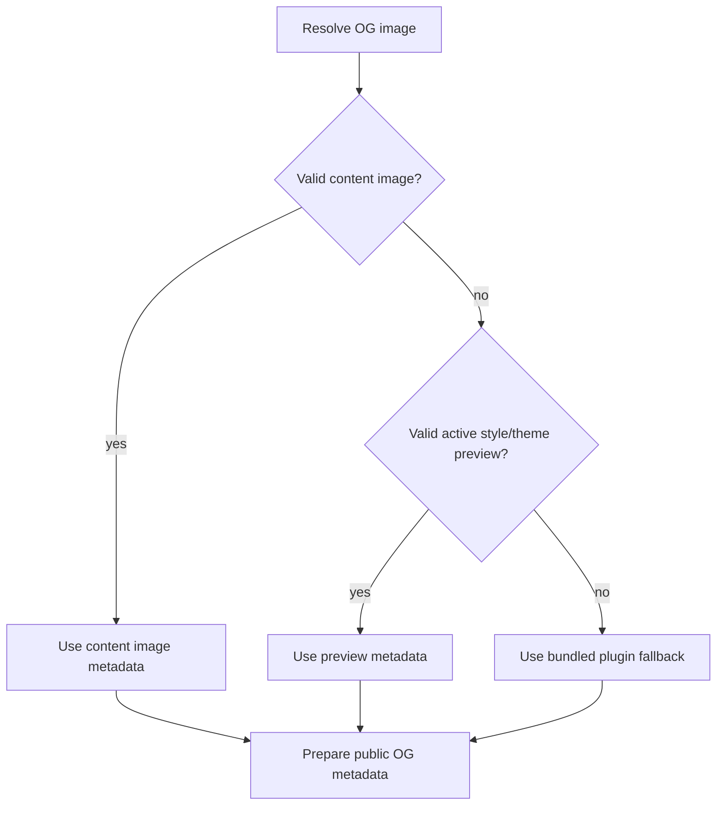
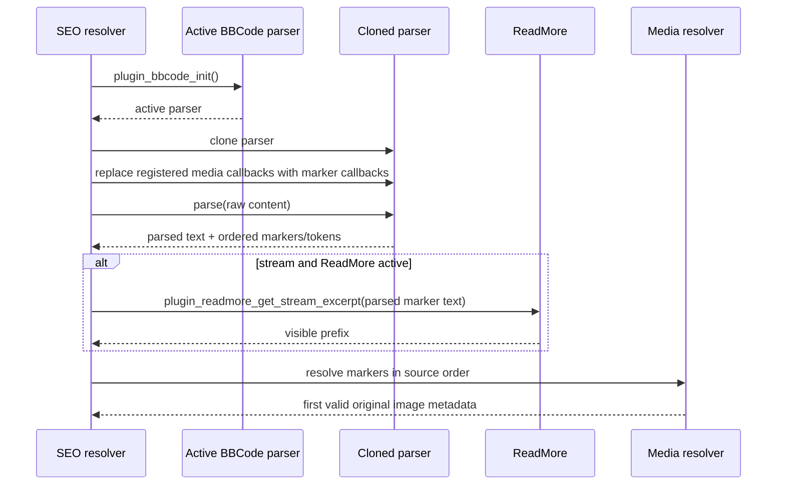

# Open Graph Image Pipeline

## 1. Selection goal

The content-aware Open Graph implementation selects the first valid **original** image that corresponds to what the current page shows.

Supported media tags are determined from the active BBCode grammar:

- `[img=...]`
- `[photoswipeimage=...]`
- `[gallery=...]`
- `[photoswipegallery=...]`

A tag is only probed when it is actually registered in the active parser. This is important for optional PhotoSwipe integration.

## 2. Source priority

The final `og:image` source priority is:

1. first valid content image for the current page context;
2. active style/theme preview;
3. bundled `fp-plugins/seometataginfo/imgs/og-image.png`.



## 3. Page-context rules

### Single entry

`seometataginfo_get_current_single_entry_data()` prefers `FPDB_Query::peekEntry()`, then falls back to `$fp_params['entry']`, and finally `entry_parse()` when required.

The entire entry content is eligible. Media after `[more]` can therefore be selected.

### Static page

`seometataginfo_get_current_static_content()` first tries Smarty's `static_page` template variable. It falls back to the page ID from `$fp_params['page']` or the configured start page and then calls `static_parse()`.

The entire static-page content is eligible. `[more]` does not impose a visibility boundary here.

### Multi-entry stream

The active page query is not consumed.

`seometataginfo_get_stream_query_params()` copies the visible query window into a lightweight secondary query using:

- `fullparse = false`
- `start`
- `count`
- optional `y`, `m`, `d`
- optional `category`
- optional `exclude`

The secondary query is iterated in stream order. Each selected entry ID is passed to `entry_parse()`. The scan stops at the first valid visible original image.

### Single/random FPDB query

If the active query is internally marked `single`, the resolver uses the already selected entry with `peekEntry()` instead of performing another random/single query.

### Search

Search intentionally receives no content-specific image from this resolver; fallback image selection applies.

## 4. Side-effect-free media probe

The probe does **not** render actual image/gallery callbacks.



Marker shape is internal and intentionally opaque:

```text
__FPSEOMEDIA_<content-hash-prefix>_<counter>__
```

The marker exists only to determine visibility/order. It is never emitted to the public page.

## 5. ReadMore visibility

In streams, `seometataginfo_find_first_content_image_meta()` calls `plugin_readmore_get_stream_excerpt()` when:

- ReadMore exposes that helper;
- stream visibility is being applied;
- `$_GET['page']` is not set.

The helper receives the probe output after BBCode parsing, matching the stage at which ReadMore normally operates.

Modes preserved by ReadMore 1.0.4:

| Mode | Behavior in current code |
|---|---|
| `manual` | cut at first `[more]` |
| `auto` | cut when content length exceeds the threshold |
| `semiauto` | historical order: auto behavior first, then manual branch only if auto did not cut |
| `sentence` | cut according to sentence punctuation matches |

The current default threshold in `plugin_readmore_get_stream_excerpt()` is `4`, preserving the patched ReadMore behavior of this snapshot.

A token marker missing from the visible excerpt is treated as hidden. Once a hidden marker is encountered in stream mode, later media tokens are not considered.

## 6. Single-image resolution

`seometataginfo_content_image_meta()` distinguishes:

The source resolver itself does not invent a description. For parsed `[img]` and `[photoswipeimage]` tokens, `seometataginfo_content_resolve_token()` separately reads only the explicit `title` attribute and normalizes it through `seometataginfo_content_normalize_image_alt()`. A BBCode `alt` attribute is intentionally not used as the Open Graph image description.

### Remote HTTP(S)

`seometataginfo_content_remote_image_meta()`:

- trims and HTML-decodes the source;
- converts a leading `www.` to `https://`;
- rejects control characters;
- requires `parse_url()` to produce both scheme and host;
- accepts only `http` and `https`;
- performs **no HTTP request**.

Remote metadata has no local path, MIME, dimensions, mtime, or file size.

### Local

`seometataginfo_content_local_image_meta()`:

1. normalizes the path with `seometataginfo_content_normalize_local_image_path()`;
2. resolves both `IMAGES_DIR` and the file through `realpath()`;
3. verifies containment inside the image root;
4. requires a readable regular file;
5. requires `getimagesize()` to recognize an image MIME type;
6. returns public URL, MIME, dimensions, image type, mtime, size, relative path, and absolute path.

The original image path is retained even if BBCode/Thumb would render a `.thumbs` preview.

## 7. Local-path normalization

Accepted local forms include the FlatPress image namespace, for example:

```text
images/photo.png
fp-content/images/photo.png
/flatpress/fp-content/images/photo.png   # when BLOG_ROOT is /flatpress/
```

Normalization:

- HTML-decodes the source;
- converts backslashes to `/`;
- rejects control characters;
- rejects query strings and fragments;
- strips repeated leading `./`;
- strips a matching `BLOG_ROOT`;
- removes empty and `.` path segments;
- rejects any `..` segment;
- maps `images/...` to `IMAGES_DIR`;
- requires the normalized result to be inside the `IMAGES_DIR` namespace.

Filesystem containment is validated again after `realpath()`.

## 8. Gallery resolution

`seometataginfo_content_gallery_meta()` accepts PhotoSwipe-style `images/<gallery>` paths.

Important behavior:

- URL schemes are rejected;
- `..` is rejected;
- gallery filesystem path must resolve inside `IMAGES_DIR`;
- the directory must exist;
- `gallery_read_images()` is reused.

This reuse is intentional. `gallery_read_images()`:

- uses the FlatPress filesystem lister;
- excludes `.captions.conf`, `captions.conf`, and legacy `texte.conf`;
- sorts the remaining filenames with `sort()`.

The SEO resolver then checks filenames in that exact order and returns the first file that resolves to valid image metadata. Invalid/non-image files can therefore be skipped without changing gallery ordering.

## 9. `og:image:alt` resolution

Image selection and image description are intentionally separate.

### Single images

For `[img]` and `[photoswipeimage]`:

1. resolve and validate the image source;
2. if the selected token contains an explicit scalar `title`, normalize it;
3. store the normalized value in the internal image metadata `alt` field;
4. if `title` is absent, empty, or normalizes to empty text, keep `alt` empty.

The following do **not** become SEO fallbacks:

- the BBCode `alt` attribute;
- basename-derived renderer titles;
- IPTC-derived titles;
- thumbnail markup.

### Gallery images

`seometataginfo_content_gallery_meta()` first determines the first valid image using `gallery_read_images()` and the normal image validator. Only after that exact file has been selected does it read `gallery_read_captions()` and look up the caption by that filename.

A missing caption never advances to a later image. This guarantees that image selection remains based on visible source order, not caption availability.

### Text normalization and output fallback

`seometataginfo_content_normalize_image_alt()`:

- accepts only scalar input;
- decodes HTML entities at most twice for compatibility with stored/legacy caption values;
- removes markup;
- replaces CR/LF with spaces;
- trims the result;
- leaves final HTML escaping to `output_metatags()`.

`seometataginfo_prepare_og_image_meta()` preserves the internal `alt` value through both direct-URL and dynamic 1200 × 630 paths.

`seometataginfo_get_og_image_alt_text()` then applies the final output rule:

```text
selected explicit image title / selected gallery caption
    -> if non-empty: og:image:alt
    -> otherwise: fp_config.general.title
    -> if site title is also empty: "Preview"
```

## 10. Why thumbnails are never selected

BBCode's `do_bbcode_img()` can call:

```php
apply_filters('bbcode_img_scale', $actualpath, $img_size, array($width, $height))
```

Thumb registers `plugin_thumb_bbcodehook()` on that filter and may create:

```text
<image-directory>/.thumbs/<filename>
```

The final `` can therefore point to the preview rather than the original.

The SEO pipeline avoids this by reading the BBCode tag attributes directly from the marker token and resolving that original source. It does not call `do_bbcode_img()` while probing.

## 11. Dynamic 1200 × 630 endpoint

For transformable local JPEG/PNG images, `seometataginfo_prepare_og_image_meta()` publishes a dynamic URL:

```text
index.php?seometa_ogimage=1&v=<mtime>&seometa_ogsource=<validated-relative-path>
```

The HTML meta tag escapes `&` as `&amp;`, as required for HTML serialization.

The crawler's later request is handled by:

1. `plugin_seometataginfo_init()`
2. `seometataginfo_is_og_image_request()`
3. `seometataginfo_serve_og_image()`

The explicit local source is revalidated for that independent request. The original page context is not required.

## 12. Copied HTML URLs and `&amp;`

Browsers normally decode HTML entities before requesting a URL. A developer may nevertheless copy a literal source URL such as:

```text
?seometa_ogimage=1&amp;v=1786722663&amp;seometa_ogsource=fp-content%2Fimages%2Frepo-independent-og-source.png
```

The historical bug report used `avm-gelaende.png`, but that file belongs to one installed test instance and is not shipped by the FlatPress repository. Developer documentation and automated tests therefore use a neutral temporary fixture name and must not assume the presence of that instance-specific image.

PHP parses the later keys as:

```text
amp;v
amp;seometa_ogsource
```

`seometataginfo_get_query_parameter()` therefore supports aliases whose key begins with one or more literal `amp;` prefixes.

Rules:

- an exact query key always wins;
- aliases are considered only when the exact key is absent;
- repeated prefixes such as `amp;amp;seometa_ogsource` normalize to the requested name;
- array values remain invalid;
- source path validation is unchanged.

This is tolerance for copied HTML source, not a relaxation of filesystem security.

## 13. Explicit invalid source behavior

`seometataginfo_get_requested_content_og_image_info()` returns both:

- whether a content source was explicitly requested;
- validated image metadata, if valid.

`seometataginfo_serve_og_image()` only selects the theme preview when **no explicit content source was requested**.

Therefore:

- valid explicit source → serve that source;
- invalid explicit source → 404 path;
- no explicit source → style/theme preview, then bundled fallback.

This distinction prevents a malformed or traversal-like content URL from silently returning a visually unrelated theme image.

## 14. Transformability

`seometataginfo_can_transform_og_image()` requires:

- local absolute path;
- recognized image type;
- GD functions `imagecreatetruecolor`, `imagecopyresampled`, `imagefilledrectangle`;
- JPEG: `imagecreatefromjpeg` + `imagejpeg`;
- PNG: `imagecreatefrompng` + `imagepng`.

Remote images and unsupported local formats remain direct URL fallbacks in normal metadata generation.

## 15. Aspect-ratio-preserving render

Default target:

```text
1200 × 630
```

`seometataginfo_calculate_og_contain_box()` computes:

```text
scale = min(targetWidth / sourceWidth, targetHeight / sourceHeight)
```

The same scale factor is applied to both axes.

The scaled image is centered on a white target canvas.

Examples from the regression definition:

| Source | Fitted image | Offset |
|---|---|---|
| 1600×900 | 1120×630 | x=40, y=0 |
| 900×1600 | 354×630 | x=423, y=0 |
| 1000×1000 | 630×630 | x=285, y=0 |
| 1200×630 | 1200×630 | x=0, y=0 |

There is no stretching and no crop operation.

```mermaid
flowchart LR
    S[Source W × H] --> R[scale = min(1200/W, 630/H)]
    R --> D[Destination w = round(W×scale)\nh = round(H×scale)]
    D --> C[Center on 1200×630 white canvas]
    C --> O[JPEG or PNG response]
```

## 16. Failure paths

A dynamic OG request can fail when:

- the source parameter is invalid;
- the file no longer exists;
- the file moved outside `IMAGES_DIR`;
- `getimagesize()` no longer recognizes the file;
- image creation/resampling/output fails.

The endpoint then returns 404 unless a valid source can still be streamed directly through `seometataginfo_output_image_file()`.

A source-less dynamic request still uses the normal theme-preview/plugin-fallback source selection.
